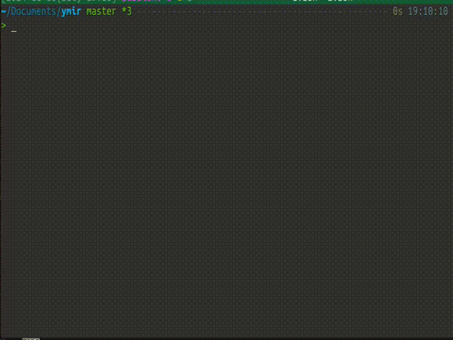

<h1 id="h1-index">Writing Hypervisor in Zig</h1>


<em>Ymir, the Type-1 Baremetal Hypervisor</em>

<br>

> [!NOTE]
> **This blog series has been translated to the following languages:**
>
> - [Japanese](/index.md)
> - [English (WIP)](/en/index.md)
>
> **You can switch the language by clicking the earth icon on the top right corner of the page.**
>
> Note that Japanese version is original and all other versions can be outdated.
> When you see Japanese sentences in translated versions, it means the translation is not yet available.
> Please request a translation at the GitHub repository, or contribute to the translation if you can.

<br>

**Writing Hypervisor in Zig** は [Zig](https://ziglang.org/) 言語を使いフルスクラッチで Type-1 Hypervisor を実装しようというブログシリーズです。
OS よりも低いレベルで動作するベアメタル Hypervisor を実装するにあたり、ブートローダ・カーネル・VMM の各コンポーネントをイチから組み立てていきます。

本シリーズでは **Ymir** という名前の Hypervisor を実装します。
Ymir は Intel 64 (x86-64) CPU で動作し、Intel VT-x によるハードウェア仮想化支援機能を活用します。
Ymir は以下の特徴を持ちます:

- **Type-1 Hypervisor**: OS に一切依存しません
- **Linux をブート可能**: Linux カーネルをブートするにに必要十分な機能を実装します
- **フルスクラッチ**: ライブラリなどの依存が一切ありません
- **Thin Hypervisor**: 必要な場合のみゲストに介入し、それ以外はパススルーします

実装や説明を簡単にするため、Ymir は以下のような制約を持ちます:

- SMP (Symmetric Multi-Processing) はサポートしません
- QEMU での開発を想定しており、実機での動作は確認していません
    - 実機で動かすには多少の修正が必要になるはずです
- APIC はサポートしません
- シングルゲストのみをサポートします

本シリーズは全部で 30 程度のチャプターから構成されており、
各チャプターはとあるテーマの概念的な説明と実装の両方を含んでいます。
各チャプターを読みながら実際にコードを書いていくことで、最終的に Linux をブートすることができる Hypervisor が完成します:



## 対象読者

本シリーズは以下のような読者を想定しています:

- OS に対するある程度の理解がある、または自分で調べる意欲がある
- x86-64 アーキテクチャにある程度の理解がある、またはマニュアルを読んで調べることができる
- Zig 言語に興味がある、使ったことがある、またはリファレンスを読んで調べる意欲がある
- フルスクラッチで低レイヤなコードを書きたい
- Intel VT-x をサポートする CPU を持っている

逆に、以下のような人には向いていません:

- マイナー言語なんて使いたくない
- 絶対に自分で言語や CPU のリファレンスを調べたくない
- 簡単のための機能削減や多少の厳密性の犠牲を許容できない
- Intel 64 の CPU を持っていない

## 進め方

本シリーズはチャプター1から順に読み進めていくことを想定しています。
各チャプターはそれまでのチャプターに対する依存を持っており、既に登場したコードは実装されたものとして扱います。

本シリーズは実際に手を動かしてコードを書いていくことが強く推奨されます。
リファレンス実装である Ymir は [Github で公開](https://github.com/smallkirby/ymir) されています。
各チャプターにおける最終的なコードは上記リポジトリの `whiz-*` というブランチに対応しています。
`whiz` は Writing Hypervisor in Zig の略です。
チャプター内で省略された箇所やスニペットでは分かりにくかった箇所は、対応するブランチを参照することで確認することができます。

なお、本シリーズで実装する `whiz-*` ブランチの Ymir は簡単のために
`master` ブランチの Ymir から一部機能が削減・簡略化されている可能性があります。
また、修正は全てのブランチには反映されず最も新しい `whiz-*` および `master` ブランチにのみ反映されることに注意してください。

## 記法について

コードのスニペットは以下のようなコードブロックで提示されます:

```zig
const x: u8 = 0xDEADBEEF;
```

ファイル名を持つコードブロックは、そのファイルに対して新たに追加されるコードを意味します。
このような場合 `...` は既存のコードを省略するのに使われます:

```ymir/main.zig
fn main() !void {
    ...
    const new_code = 0xDEADBEEF;
    ...
}
```

ファイル名に `.tmp.` が含まれるコードは、実験等のために一時的に追加するコードであることを意味します。
このようなコードはチャプターの終了時に削除されるべきです:

```ymir/main.tmp.zig
const tmp: u8 = 0xDEADBEEF;
```

Zig の `struct` や `enum` のフィールドは、本文中で `.field` のように表記します。
例として、以下のような構造体のフィールドは `.one` または `Some.one` のように表記します:

```zig
const Some = struct {
    one: u8,
    two: u16,
};
```

レジスタ等において、Nビット目からMビット目を表す場合には `Register[M:N]` のように表記します。
この際、Mビット目を含むことに注意してください。

## 改善・修正

以下のような場合には、筆者に対して更新をリクエストしてください:

- 説明に技術的な誤りがある
- 分かりにくい表現がある
- 誤字・脱字等を見つけた
- 提示されたコードが動かない、または分かりにくい
- 本シリーズでは扱っていない内容を新たに扱ってほしい

更新リクエストは [GitHub](https://github.com/smallkirby/writing-hypervisor-in-zig) の Issue や Pull Request で受け付けています。
PR を作る前に Issue を建てる必要はありません。
リクエストの大小や内容の正誤に関わらず修正依頼やリクエスト等を歓迎します。

## References

本シリーズにおける主な参考文献は [Intel® 64 and IA-32 Architectures Software Developer Manuals](https://www.intel.com/content/www/us/en/developer/articles/technical/intel-sdm.html) です。
以降は **SDM** と略して表記します。
SDM から抜粋した画像については、キャプションに *"SDM Vol.\<Volume\> \<Chapter\>.\<Section\>.\<Subsection\>"* と表記します。
SDM から抜粋した画像は全て [© Intel Corporation](https://www.intel.com/) に帰属します。

SDM 以外には、以下の情報を参考にしています:

- [BitVisor](https://www.bitvisor.org/)
- [ZystemOS/pluto: An x86 kernel written in Zig](https://github.com/ZystemOS/pluto)
- [AndreaOrru/zen : Experimental operating system written in Zig](https://github.com/AndreaOrru/zen)
- [nuta/resea: A microkernel-based hackable operating system.](https://github.com/nuta/resea)
- [ハイパーバイザの作り方](https://syuu1228.github.io/howto_implement_hypervisor/)
- [ゼロからの OS 自作入門](https://zero.osdev.jp/)
- [5 Days to Virtualization: A Series on Hypervisor Development - Reverse Engineering](https://revers.engineering/7-days-to-virtualization-a-series-on-hypervisor-development/)
- [Hypervisor From Scratch - Rayanfam Blog](https://rayanfam.com/topics/hypervisor-from-scratch-part-1/)
- [Writing OS in Rust](https://os.phil-opp.com)

その他局所的に参考にした情報については各ページに記載します。

## ライセンス

[ライセンス](./license.md) を参照してください。

## プライバシー

本ウェブサイトは Google Analytics を利用してアクセス解析をしています。
無効化するには、ブラウザの設定から本サイトのクッキーを無効化してください。

## Changelog

| Date | Log |
| --- | --- |
| 2024.11.17 | 公開 |
