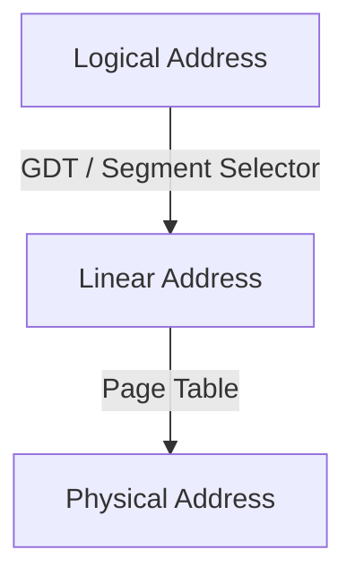
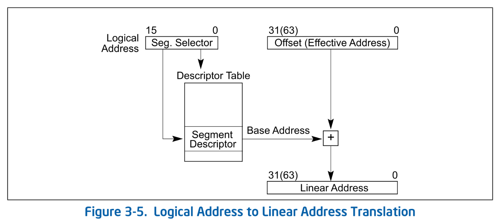
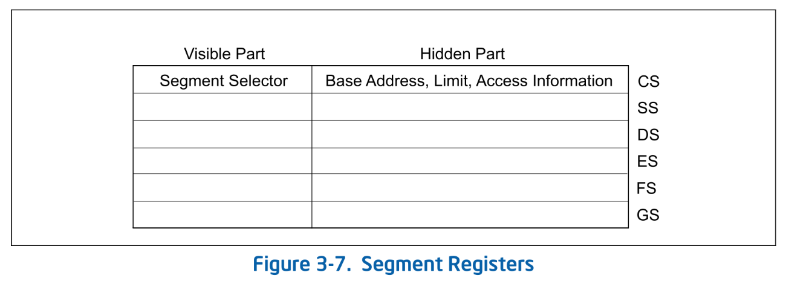
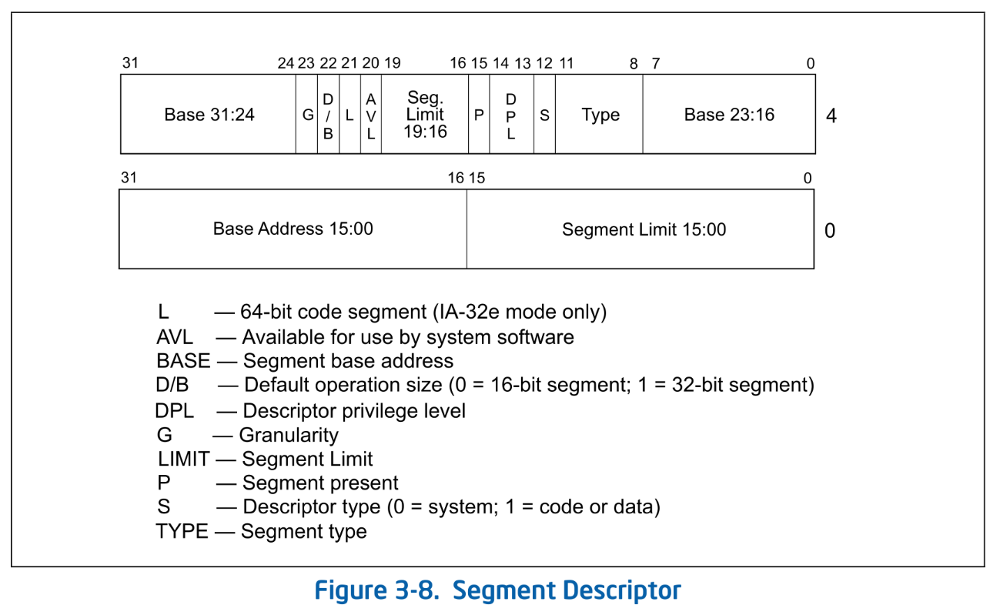

# GDT: Global Descriptor Table

このチャプターから数回にかけて、UEFI が用意してくれた構造を Ymir のものに置き換えていきます。
この置き換え作業は Ymir がメモリアロケータを実装するに当たり、UEFI の領域を解放するために必要なステップです。
その第1弾が GDT です。

> [!IMPORTANT]
> 本チャプターの最終コードは [`whiz-ymir-gdt`](https://github.com/smallkirby/ymir/tree/whiz-ymir-gdt) ブランチにあります。

## Table of Contents

<!-- toc -->

## GDT の概要

**GDT: Global Descriptor Table** は、セグメンテーションの設定をするテーブル構造です[^ldt]。
セグメンテーションは、メモリをいくつかの仮想的なブロックに分割する機能です。
x86-64 には3つのアドレスの種類があり、以下のように変換されます:



**Logical Address** はソフトウェアが直接扱うアドレスです。
**Linear Address** は Logical Address に対してセグメンテーションを適用したアドレスです。
**Physical Address** は Linear Address に対して
**MMU: Memory Management Unit** がページテーブルによる変換をしたアドレスです。

ページテーブルについては [Surtr の簡易ページテーブル](../bootloader/simple_pg.md) で既に実装済みです。
本チャプターでは Logical to Linear の変換をする GDT の設定をします。

## Linear Address と Segment Selector

Linear Address は Logical Address にセグメンテーションによる変換を施した 64bit のアドレスです[^phys-space]。
Logical to Linear 変換には GDT と **Segment Selector** が使われます。
GDT と Segment Selector の2つから、そのセグメントの *Base* / *Limit* / *Access Right* などを取得できます。


*Logical Address to Linear Address Translation. SDM Vol.3A 3.4*

変換は以下の手順で行われます:

1. **Segment Register** から Segment Selector を取得。
2. Segment Selector が指す GDT のエントリを取得。
3. 取得した GDT エントリから **Base** を取得し、Logical Address のオフセット部に加算し、64bit Linear Address を計算。

### Segment Register

x64 の Segment Register は **CS** / **SS** / **DS** / **ES** / **FS** / **GS** の6つがあります。
各レジスタは **Segment Selector** と **Hidden Part** から成ります:


*Segment Registers. SDM Vol.3A 3.4.3*

Segment Selector は、GDT のエントリを指すインデックスです。
このインデックスをもとにして GDT が取得され、そのエントリの *Base* から Linear Address が取得されます。
**Hidden Part は、selector が指す GDT のエントリの"一部"をキャッシュします**。
アドレス変換の際には Hidden Part に GDT の中身がキャッシュされているため、
CPU は GDT からエントリを取得する必要がなくなります[^hidden-cache]。

**プログラムから直接設定できるのは selector のみ** です。
プログラムが selector を設定すると、CPU が自動的に GDT からエントリを取得し、Hidden Part にキャッシュします。

> [!NOTE] セグメントとアクセスチェック
> Logical to Linear 変換の際には、アドレスの計算以外にも以下のチェックが行われます:
>
> - Logical Address のオフセット部が **Limit** を超えていないか
> - セグメントの **Access Right** が適切か

上記の 6 つのレジスタに加えて、**TSS (Task State Segment)** もあります。これは、後で VMX を正しく操作するためにも必要です。

### Global Descriptor Table

GDT は各セグメントの定義をするテーブルです。
Linear to Physical 変換における *Page Table* に相当する概念です。
GDT エントリは 64bit で以下の構造をしています:


*Segment Descriptor. SDM Vol.3A 3.4.5*

GDT エントリは各セグメントに対して以下の主な情報を定義します:

- **Base**: セグメントの開始 Linear Address
- **Limit**: セグメントのサイズ。*Granularity* によって単位が変わる
- **DPL (Descriptor Privilege Level)**: セグメントの特権レベル。CPL が DPL 以下でないとアクセスできない。

GDT 自体のアドレスは **GDTR: GDT Register** に格納されています。
GDT のサイズ、つまりエントリ数は可変であるため、GDT のサイズ情報も GDTR に格納されています。

### Privilege Level

CPU が持つ権限レベルは [Ring (Protection Ring)](https://en.wikipedia.org/wiki/Protection_ring) と呼ばれたりもします。
Ring は時折複数の異なる概念を指す場合もありますが、基本的には **CPL: Current Privilege Level** のことを指す場合が多いです。

CPL は CS レジスタの下位 2bit で表され、`0` - `3` の値を取ります。
Logical to Linear 変換の際には、CPL が変換に利用するセグメントの DPL 以下であるか(権限が強いか)どうかがチェックされます。
その他にも、CPL(Ring) は特権レジスタや特権命令の実行ができるかどうかの判断にも使われます。
例として [Control Register](https://wiki.osdev.org/CPU_Registers_x86-64#Control_Registers) には Ring-0 でないとアクセスできません。

> [!NOTE] IOPL
> x64 には CPL とは別に **IOPL: I/O Privilege Level** があります。
> IOPL は I/O 命令の実行に必要な CPL を定義します。
> CPL が CS レジスタに格納されているのに対し、IOPL は RFLAGS レジスタに格納されています。
> IOPL は Ring-0 の場合に限り POPF か IRET 命令のいずれかでのみ変更できます。

## 64bit モードのセグメンテーション

ここまでセグメントについて説明してきましたが、
**x64 ではセグメンテーションの機能のほとんどはハードウェア的に無効化されています**。
厳密には、Intel 64 アーキテクチャの [64bit mode (IA-32e mode の 64bit mode)](https://ja.wikipedia.org/wiki/X64) においてセグメンテーションがほぼ無効化されています。
*Base* は `0` として解釈され、*Limit* によるチェックは行われません。
よって、Logical to Linear 変換では実際にはアドレスの変換は行われず、フラットで巨大な1つのセグメントが使われているものとして扱われます[^virt]。

例外は **FS** と **GS** セグメントです。
この2つに対しては依然としてセグメントが設定ができ、どのように利用するかはソフトウェア依存です。
[glibc](https://www.gnu.org/software/libc/) では FS は **TLS: Thread Local Storage** を表現するのに使われます。
Linux Kernel では、GS は Per-CPU データを表現するのに使われます[^linux-fsgs]。

なお、FS/GS を使う場合にも実際に利用されるのは *Base* 部分のみです。
FS/GS の Hidden Part における *Base* 部分は、 **FSBASE** / **GSBASE** という MSR にマップされています。
FS/GS の Base の設定を変更するには Segment Selector (Segment Register) に書き込む従来の方法に加え、
FSBASE / GSBASE  MSR に *Base* を直接書き込むことも可能です。
ちなみに、MSR への書き込み ([WRMSR](https://www.felixcloutier.com/x86/wrmsr)) は特権命令であるため context switch を伴います。
そのため Ivy Bridge からは [FSGSBASE](https://www.intel.com/content/www/us/en/developer/articles/technical/software-security-guidance/best-practices/guidance-enabling-fsgsbase.html) という拡張機能が実装され、ユーザランドから直接 *FSBASE* / *GSBASE* にアクセスできるようになりました ([RDFSBASE / RDGSBASE](https://www.felixcloutier.com/x86/rdfsbase:rdgsbase))。

とどのつまり、Ymir においてはほとんどセグメントの設定をする必要はないということです。

> [!WARN] 64bit mode における権限チェック
> セグメンテーションが無効化されると書きましたが、これはアドレス変換が行われないという意味です。
> 64bit mode においてもセグメントへのアクセス権限チェックは行われます。
>
> 権限チェックは、CPL/DPL/RPL の3つの値をもとに行われます。
> この辺は少し複雑なため、気になる人は *SDM Vol.3A 5.5: PRIVILEGE LEVELS* を参照してください。

## Ymir のセグメンテーション

Ymir では2種類のセグメントしか設定しません。
CS とそれ以外の2つです。
Linux と異なり、GS も現在は使う予定がありません。
この2つのセグメントを GDT に設定していきましょう。

### 基本構造の定義

Figure 3-8 で示される GDT エントリを定義します:

```ymir/arch/x86/gdt.zig
pub const SegmentDescriptor = packed struct(u64) {
    /// Lower 16 bits of the segment limit.
    limit_low: u16,
    /// Lower 24 bits of the base address.
    base_low: u24,
    /// Segment is accessed.
    accessed: bool = true,
    /// Readable / Writable.
    rw: bool,
    /// Direction / Conforming.
    dc: bool,
    /// Executable.
    executable: bool,
    /// Descriptor type.
    desc_type: DescriptorType,
    /// Descriptor Privilege Level.
    dpl: u2,
    /// Segment present.
    present: bool = true,
    /// Upper 4 bits of the segment limit.
    limit_high: u4,
    /// Available for use by system software.
    avl: u1 = 0,
    /// 64-bit code segment.
    long: bool,
    /// Size flag.
    db: u1,
    /// Granularity.
    granularity: Granularity,
    /// Upper 8 bits of the base address.
    base_high: u8,
};

pub const DescriptorType = enum(u1) {
    system = 0,
    code_data = 1,
};

pub const Granularity = enum(u1) {
    byte = 0,
    kbyte = 1,
};
```

これまで説明していなかったフィールドについて以下の表で説明します:

| Field | Description |
| --- | --- |
| `accessed`, `rw`, `dc`, `executable` | Type field. セグメントに対するアクセスの設定[^type]。 `dc` は Code / Data Segment 種別。 |
| `desc_type` | Application Descriptor / System Descriptor[^sys] の区別 |
| `present` | セグメントがスワップアウトされていれば `false` |
| `avl` | 自由に使っていいビット |
| `db` | Type field によって意味が異なる。何らかデフォルトのサイズを決める。 |
| `long` | Code Segment が 64bit かどうか |

### NULL Descriptor

GDT の 0 番目のエントリは **NULL Descriptor** として使われます。
NULL descriptor は CPU が実際に利用することはありません。
NULL descriptor を指す Segment Selector は **NULL segment selector** と呼ばれます。
CS/SS を除く使わない Segment Selector には *NULL segment selector* を入れることができます。
ただし、NULL segment selector を使ってメモリアクセスをしようとすると *#GP: General Protection Fault* になります。

### エントリの作成

それではコードセグメント・データセグメントを初期化していきます:

```ymir/arch/x86/gdt.zig
const max_num_gdt = 0x10;

var gdt: [max_num_gdt]SegmentDescriptor align(16) = [_]SegmentDescriptor{
    SegmentDescriptor.newNull(),
} ** max_num_gdt;
```

GDT のエントリ数は可変であり自由に決めることができる[^num_gdt]ので、適当に 10 にしています。
この個数分だけ GDT エントリの配列を用意します。
`newNull()` は空のエントリを作成する関数です:

```ymir/arch/x86/gdt.zig
pub fn newNull() SegmentDescriptor {
    return @bitCast(@as(u64, 0));
}

pub fn new(
    rw: bool,
    dc: bool,
    executable: bool,
    base: u32,
    limit: u20,
    dpl: u2,
    granularity: Granularity,
) SegmentDescriptor {
    return SegmentDescriptor{
        .limit_low = @truncate(limit),
        .base_low = @truncate(base),
        .rw = rw,
        .dc = dc,
        .executable = executable,
        .desc_type = .code_data,
        .dpl = dpl,
        .present = true,
        .limit_high = @truncate(limit >> 16),
        .avl = 0,
        .long = executable,
        .db = @intFromBool(!executable),
        .granularity = granularity,
        .base_high = @truncate(base >> 24),
    };
}
```

Segment Descriptor エントリはフィールド数も多くて初期化がめんどうなので、 `new()` ヘルパー関数もついでに定義しています。

必要なエントリを初期化しましょう。
今回はコード・データセグメント用の2つを作成し、CS は前者を、DS/ES/FS/GS は後者を指すようにします:

```ymir/arch/x86/gdt.zig
pub const kernel_ds_index: u16 = 0x01;
pub const kernel_cs_index: u16 = 0x02;

pub fn init() void {
    gdt[kernel_cs_index] = SegmentDescriptor.new(
        true,
        false,
        true,
        0,
        std.math.maxInt(u20),
        0,
        .kbyte,
    );
    gdt[kernel_ds_index] = SegmentDescriptor.new(
        true,
        false,
        false,
        0,
        std.math.maxInt(u20),
        0,
        .kbyte,
    );
    ...
}
```

両者の違いは `executable` かどうかだけです。
`.rw` はデータセグメントでは `writable`、コードセグメントでは `readable` という意味になります。

GDT 自体の初期化が終わったため、GDT Register に GDT のアドレスを設定します:

```ymir/arch/x86/gdt.zig
const GdtRegister = packed struct {
    limit: u16,
    base: *[max_num_gdt]SegmentDescriptor,
};

var gdtr = GdtRegister{
    .limit = @sizeOf(@TypeOf(gdt)) - 1,
    .base = undefined,
};

pub fn init() void {
    ...
    gdtr.base = &gdt;
    am.lgdt(@intFromPtr(&gdtr));
    ...
}
```

GDTR は GDT のアドレスとサイズのみを持ちます。
アドレスは本来であれば物理アドレスを指定するべきですが、Ymir はまだ UEFI が提供してくれたストレートマップを利用しており、
仮想アドレスと物理アドレスが等しいです。
そのため、`&gdt` (仮想アドレス) をそのまま物理アドレスとして使っています。

> [!WARN] Zig の static initialization バグ
> 本当は `gdtr` の宣言時に `.base = &gdt` として初期化したかったのですが、
> 現在 Zig or LLVM にバグ[^zig-bug]があり、この初期化方法はエラーになってしまいます。
> そのため、仕方なく `init()` の中で `&gdt` を代入しています。

`am.lgdt()` は [LGDT](https://www.felixcloutier.com/x86/lgdt:lidt) 命令をするだけのアセンブリ関数です:

```ymir/arch/x86/asm.zig
pub inline fn lgdt(gdtr: u64) void {
    asm volatile (
        \\lgdt (%[gdtr])
        :
        : [gdtr] "r" (gdtr),
    );
}
```

### Segment Register のフラッシュ

GDT の初期化は終わりましたが、まだ新しいセグメントの設定は反映されません。
なぜならば、**セグメントの *Base* は Segment Register の Hidden Part にキャッシュされているから**です。
Segment Register の selector 部に新しく GDT のインデックスを設定し Hidden Part をフラッシュすることで、初めて新しいセグメント設定が使われるようになります:

```ymir/arch/x86/gdt.zig
fn loadKernelDs() void {
    asm volatile (
        \\mov %[kernel_ds], %di
        \\mov %%di, %%ds
        \\mov %%di, %%es
        \\mov %%di, %%fs
        \\mov %%di, %%gs
        \\mov %%di, %%ss
        :
        : [kernel_ds] "n" (@as(u16, @bitCast(SegmentSelector{
            .rpl = 0,
            .index = kernel_ds_index,
          }))),
        : "di",
    );
}
```

Segment Register には [MOV](https://www.felixcloutier.com/x86/mov) 命令を使って直接代入できます。
DI レジスタを使って代入しているため、DI レジスタを [clobber](https://gcc.gnu.org/onlinedocs/gcc/Extended-Asm.html#Clobbers-and-Scratch-Registers) しています。

ただし、CS レジスタに関しては直接 MOV はできません。
そのため、[Long Return](https://docs.oracle.com/cd/E19620-01/805-4693/instructionset-68/index.html) することで CS を設定します:

```ymir/arch/x86/gdt.zig
fn loadKernelCs() void {
    asm volatile (
        \\
        // Push CS
        \\mov %[kernel_cs], %%rax
        \\push %%rax
        // Push RIP
        \\leaq next(%%rip), %%rax
        \\pushq %%rax
        \\lretq
        \\next:
        \\
        :
        : [kernel_cs] "n" (@as(u16, @bitCast(SegmentSelector{
            .rpl = 0,
            .index = kernel_cs_index,
          }))),
    );
}
```

`lret` はスタックに積んだ CS/RIP を POP してレジスタにセットしてくれます。
RIP は変更させたくないため `lret` の直後のアドレスを PUSH することで、CS を設定する効果だけを得ています。

`SegmentSelector` の構造は次のとおりです:
```ymir/arch/x86/gdt.zig
pub const SegmentSelector = packed struct(u16) {
    /// Requested Privilege Level.
    rpl: u2,
    /// Table Indicator.
    ti: u1 = 0,
    /// Index.
    index: u13,
};
```

以上で GDT の更新が反映されるようになります。
`init()` から呼び出すようにしておきましょう:

```ymir/arch/x86/gdt.zig
pub fn init() void {
    ...
    loadKernelDs();
    loadKernelCs();
}
```

## まとめ

実装した GDT の初期化関数を `kernelMain()` から呼び出すようにします:

```ymir/main.zig
arch.gdt.init();
log.info("Initialized GDT.", .{});
```

実行すると、見た目は何も変わらず HLT ループまで到達すると思います。
そこで QEMU monitor を立ち上げ、レジスタをチェックしてみましょう:

```txt
QEMU 8.2.2 monitor - type 'help' for more information
(qemu) info registers

CPU#0
RAX=deadbeefcafebabe RBX=000000001fe91f78 RCX=00cf93000000ffff RDX=ffffffff801003f8
RSI=0000000000000030 RDI=000000000000000a RBP=000000001fe908a0 RSP=ffffffff80106f10
R8 =000000001fe8ff8c R9 =000000001f9ec018 R10=000000001fae6880 R11=0000000089f90beb
R12=000000001feaff40 R13=000000001fe93720 R14=ffffffff801003c0 R15=00000000ff000000
RIP=ffffffff80100331 RFL=00000046 [---Z-P-] CPL=0 II=0 A20=1 SMM=0 HLT=1
ES =0008 0000000000000000 ffffffff 00c09300 DPL=0 DS   [-WA]
CS =0010 0000000000000000 ffffffff 00a09b00 DPL=0 CS64 [-RA]
SS =0008 0000000000000000 ffffffff 00c09300 DPL=0 DS   [-WA]
DS =0008 0000000000000000 ffffffff 00c09300 DPL=0 DS   [-WA]
FS =0008 0000000000000000 ffffffff 00c09300 DPL=0 DS   [-WA]
GS =0008 0000000000000000 ffffffff 00c09300 DPL=0 DS   [-WA]
LDT=0000 0000000000000000 0000ffff 00008200 DPL=0 LDT
TR =0000 0000000000000000 0000ffff 00008b00 DPL=0 TSS64-busy
GDT=     ffffffff80108010 0000007f
IDT=     000000001f537018 00000fff
CR0=80010033 CR2=0000000000000000 CR3=000000001e4d6000 CR4=00000668
```

セグメントレジスタの一番左の 4nibble の数字が Segment Selector です。
Selector のうち下位 3bit は *RPL*/*TI* であり、それ以降が GDT index になっています。
CS では selector が `0x10`、つまり index が `0x02` になっています。
DS/ES/FS/GS は selector が `0x08`、つまり index が `0x01` になっています。
それぞれ `kernel_ds_index` / `kernel_cs_index` に設定した値になっていることが確認できます。
用意した GDT がちゃんと反映されていることが確認できました。

本チャプターでは、GDT の初期化を行いました。
x64 の 64bit モードではほとんどセグメンテーションは使われないため、2つのセグメントだけを設定しました。
もう UEFI が提供していた GDT は使われないため、その領域は Ymir が自由に使えるように成りました。
次のチャプターでは UEFI が提供する他の構造である IDT を Ymir のものに置き換えていきます。

[^ldt]: 同様にセグメントを設定する構造に **LDT: Local Descriptor Table** がありますが、Ymir では GDT のみを使います。
[^phys-space]: x64 (Intel64) における物理アドレス空間のサイズは実装依存です。
CPUID `0x80000008` で実際のサイズを取得できます。
最近の CPU だと 46bit の場合が多いと思います。
[^hidden-cache]: Page Table を使ったアドレス変換における、**TLB: Translation Lookaside Buffer** と似たような感じですね。
[^virt]: Logical to Linear 変換が行われないため、本シリーズでは Logical/Linear Address のことをまとめて仮想アドレスと呼びます。
[^linux-fsgs]: [A possible end to the FSGSBASE saga - LWN.net](https://lwn.net/Articles/821723/)
[^type]: この 4bit 分のフィールドは、*Descriptor Type* が *application (code / data)* か *system* かによって変わります。
本シリーズでは *system* セグメントを扱わないため、*application* 用のフィールドのみを定義します。
[^sys]: System Descriptor には、*LDT* / *TSS* / Call-gate / Interrupt-gate / Trap-gate / Task-gate descriptor があります。
[^num_gdt]: ただし、上限は IA-32e mode で \\(2^{13} = 8192\\) 個です。
[^zig-bug]: [error: LLVM ERROR: Unsupported expression in static initializer #17856](https://github.com/ziglang/zig/issues/17856)
