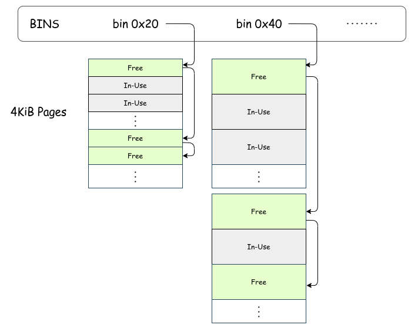

# General-Purpose Memomry Allocator

[Page Allocator](./page_allocator.md) のチャプターでは、ページ単位でメモリを確保するページアロケータを作成しました。
このアロケータは `Allocator` インタフェースを実装しているため、汎用的なメモリ確保に利用できます。
しかし、どんなに小さなサイズのメモリを要求する場合でもバックエンドがページアロケータである以上、
実際に確保されるメモリの最小サイズは 4KiB になってしまいます。
本チャプターでは、より効率的に小さなサイズのメモリを確保できる汎用的なアロケータを実装します。
これにより、ページアロケータよりも遥かに小さなメモリオーバヘッドでメモリを確保できるようになります。

> [!IMPORTANT]
>
> 本チャプターの最終コードは [`whiz-ymir-general_allocator`](https://github.com/smallkirby/ymir/tree/whiz-ymir-general_allocator) ブランチにあります。

## Table of Contents

<!-- toc -->

## Bin Allocator

今回実装する汎用アロケータは `BinAllocator` という名前です[^bin]。
他の広く使われているアロケータと同様に、 **bin** と呼ばれる固定サイズのメモリブロックを管理します。
Ymir の汎用アロケータの概略を以下に示します:


*Ymir BinAllocator Overview*

各 bin は固定サイズの領域 **chunk** の連結リストを保持します。
Chunck は 利用中 (*in-use*) か 割当て可能 (*free*) のどちらかの状態を持ちます。
Free な chunk は次の chunk へのポインタを持ち、全体としてリストを構成します。
アロケータは利用中の chunk は管理しません。

各 chunk は 4KiB ページを分割して作成されます。
よって、ページの中には同一サイズの chunk しか含まれません。
Bin のリストの中に割り当て可能な chunk がない場合、新しく 4KiB ページを作成し、それを固定サイズで分割して free な chunk を作成します。

このアロケータはページアロケータよりもオーバヘッドが小さくなります。
例として `0x10` サイズの領域を確保する場合、ページアロケータだと `4096 - 16 = 4080` bytes が無駄になってしまいます。
一方 BinAllocator では `0x20` の bin から確保することで、オーバヘッドは `32 - 16 = 16` bytes に抑えることができます。
もちろん bin のサイズをより細かくすることでオーバヘッドをさらに減らすこともできます。

## メタデータ

`BinAllocator` も `PageAllocator` と同様にファイル全体を構造体として扱います。
新たに `BinAllocator.zig` を作成し、必要な定数・変数を定義します:

<!-- i18n:skip -->
```ymir/mem/BinAllocator.zig
pub const vtable = Allocator.VTable{
    .alloc = allocate,
    .free = free,
    .resize = resize,
};

const bin_sizes = [_]usize{
    0x20, 0x40, 0x80, 0x100, 0x200, 0x400, 0x800,
};

comptime {
    if (bin_sizes[bin_sizes.len - 1] > 4096) {
        @compileError("The largest bin size exceeds a 4KiB page size");
    }
}
```

`BinAllocator` にも `Allocator` インタフェースを実装するため、`vtable`フィールドを作成します。
各関数の実装はのちほど行います。

Bin のサイズは7種類用意しました。
これよりも細かいサイズを用意しても良いですが、bin を細かくするほどメモリアクセスの空間局所性が悪化する場合もあり、単に細かくすればよいというものでもありません。
なお、本シリーズではページサイズを超える bin はサポートしていないため `comptime` でチェックしています。
ページサイズを超える確保要求が来た場合は、そのまま `PageAllocator` に処理を委譲してページ単位で確保することにします。

Free な chunk は **メタデータ** を持ちます。
このメタデータは bin を管理するために必要な情報を持ちますが、
**`BinAllocator` で必要な情報は次の free な chunk へのポインタだけ**です。
メタデータを表す構造体を定義します:

<!-- i18n:skip -->
```ymir/mem/BinAllocator.zig
/// Heads of the chunk lists.
list_heads: [bin_sizes.len]ChunkMetaPointer,

const ChunkMetaNode = packed struct {
    next: ChunkMetaPointer = null,
};
const ChunkMetaPointer = ?*ChunkMetaNode;
```

`ChunkMetaNode` は次の chunk へのポインタだけを持ちます。
もしも次の free chunk が存在しない場合には `null` を持ちます。
`list_heads` は、各 bin の先頭の chunk を指すポインタを保持します。
図における上部の四角で囲まれた部分が `list_heads` に相当する部分ですね。

## 初期化

`BinAllocator` は chunk 用のページ確保や、サポートする bin よりも大きいサイズの要求が来た場合のために、
バックエンドのアロケータとして `PageAllocator` を保持することにします。
`BinAllocator` を初期化する際には、`PageAllocator` を引数として受け取ります:

<!-- i18n:skip -->
```ymir/mem/BinAllocator.zig
page_allocator: Allocator,

pub fn init(self: *Self, page_allocator: Allocator) void {
    self.page_allocator = page_allocator;
    @memset(self.list_heads[0..self.list_heads.len], null);
}
```

初期化時には、各 bin のヘッドを `null` で初期化します。
これは全ての bin が空であることを意味します。
続いて、bin が空である場合に新しくページを確保し、chunk を作成する関数を実装します:

<!-- i18n:skip -->
```ymir/mem/BinAllocator.zig
fn initBinPage(self: *Self, bin_index: usize) ?void {
    const new_page = self.page_allocator.alloc(u8, 4096) catch return null;
    const bin_size = bin_sizes[bin_index];

    var i: usize = 4096 / bin_size - 1;
    while (true) : (i -= 1) {
        const chunk: *ChunkMetaNode = @ptrFromInt(@intFromPtr(new_page.ptr) + i * bin_size);
        push(&self.list_heads[bin_index], chunk);

        if (i == 0) break;
    }
}

fn push(list_head: *ChunkMetaPointer, node: *ChunkMetaNode) void {
    if (list_head.*) |next| {
        node.next = next;
        list_head.* = node;
    } else {
        list_head.* = node;
        node.next = null;
    }
}
```

ページの確保は `PageAllocator` に依頼します。
確保したページを `bin_size` の chunk に分割し、それぞれに対して `while` の中を実行します。
各 chunk は生成した直後は free であるため、`ChunkMetaNode` として解釈します。
それらの `ChunkMetaNode` を対応する bin リストに対して push すれば、新しい chunk がリストに追加されます。

## Bin からのメモリ確保・解放

メモリを確保する関数は bin のインデックスを受け取って、その bin から chunk を取り出します:

<!-- i18n:skip -->
```ymir/mem/BinAllocator.zig
fn allocFromBin(self: *Self, bin_index: usize) ?[*]u8 {
    if (self.list_heads[bin_index] == null) {
        initBinPage(self, bin_index) orelse return null;
    }
    return @ptrCast(pop(&self.list_heads[bin_index]));
}

fn pop(list_head: *ChunkMetaPointer) *ChunkMetaNode {
    if (list_head.*) |first| {
        list_head.* = first.next;
        return first;
    } else {
        @panic("BinAllocator: pop from empty list");
    }
}
```

もしも指定された bin のリストが空であった場合、先ほど実装した `initBinPage()` を呼び出して新しいページを確保します。
Bin に chunk があれば (または新しく chunk を作成した場合には)、その chunk をリストから pop して返します。
すごくシンプルです。

メモリの解放は確保時と逆の操作をします:

<!-- i18n:skip -->
```ymir/mem/BinAllocator.zig
fn freeToBin(self: *Self, bin_index: usize, ptr: [*]u8) void {
    const chunk: *ChunkMetaNode = @alignCast(@ptrCast(ptr));
    push(&self.list_heads[bin_index], chunk);
}
```

なお chunk を bin に返却したあと、もしもそのページ内の chunk が全て free になっている場合には、ページを解放することも考えられます。
本シリーズでは簡単のためにそのような処理は行いません。

## インタフェースの実装

Bin から chunk を取得したり返却する処理が実装できたため、これらを使って `Allocate` インタフェースに必要な関数を実装していきます:

### allocate

`PageAllocator` の場合と異なり、`BinAllocator` はページサイズ以下の領域を確保する可能性があります。
よって、 `BinAllocator` は要求されたアラインを考慮する必要があります。
要求されるアラインは、`allocate()`の第3引数に渡されます:

<!-- i18n:skip -->
```ymir/mem/BinAllocator.zig
fn allocate(ctx: *anyopaque, n: usize, log2_align: u8, _: usize) ?[*]u8 {
    const self: *Self = @alignCast(@ptrCast(ctx));

    const ptr_align = @as(usize, 1) << @as(Allocator.Log2Align, @intCast(log2_align));
    const bin_index = binIndex(@max(ptr_align, n));

    if (bin_index) |index| {
        return self.allocFromBin(index);
    } else {
        const ret = self.page_allocator.alloc(u8, n) catch return null;
        return @ptrCast(ret.ptr);
    }
}

fn binIndex(size: usize) ?usize {
    for (bin_sizes, 0..) |bin_size, i| {
        if (size <= bin_size) {
            return i;
        }
    }
    return null;
}
```

要求されるアライン `ptr_align` は、 \\(\text{ptr\_align} = 2^{\text{log2\_align}}\\) で計算されます。
**各 bin の chunk は bin のサイズごとにアラインされていることは保証されている**ため、
要求されるアラインが bin のサイズよりも小さい場合には、単にその bin から chunk を取得するだけでOKです。
要求されるアラインサイズが要求されるメモリサイズよりも大きいような場合には、アラインサイズを bin のサイズとして扱います。
Chunk を確保する bin が決まれば、先ほどの `allocFromBin()` を呼び出してメモリを確保します。
もしも適切な bin が見つからなかった場合には、ページアロケータに処理を委譲します。

### free

`free()` 関数は、確保されたメモリを解放する際に呼び出されます。
実装は `allocate()` と対称になります。
なお、`free()`には解放するメモリ領域のサイズが slice の形で渡されます。
よって、**解放されようとしているメモリがどの bin に属するか(サイズがいくらなのか)を保存しておく必要はありません**。
この特性により、glibc などのヒープ実装とは異なり利用中の chunk の先頭にメタデータを入れておく必要がなくなります:

<!-- i18n:skip -->
```ymir/mem/BinAllocator.zig
fn free(ctx: *anyopaque, slice: []u8, log2_align: u8, _: usize) void {
    const self: *Self = @alignCast(@ptrCast(ctx));

    const ptr_align = @as(usize, 1) << @as(Allocator.Log2Align, @intCast(log2_align));
    const bin_index = binIndex(@max(ptr_align, slice.len));

    if (bin_index) |index| {
        self.freeToBin(index, @ptrCast(slice.ptr));
    } else {
        self.page_allocator.free(slice);
    }
}
```

### resize

`PageAllocator` と同様に、`BinAllocator` はサイズ変更をサポートしないことにします:

<!-- i18n:skip -->
```ymir/mem/BinAllocator.zig
fn resize(_: *anyopaque, _: []u8, _: u8, _: usize, _: usize) bool {
    @panic("BinAllocator does not support resizing");
}
```

## まとめ

`BinAllocator` をインスタンス化して利用可能な状態にします:

<!-- i18n:skip -->
```ymir/mem/BinAllocator.zig
pub fn newUninit() Self {
    return Self{
        .page_allocator = undefined,
        .list_heads = undefined,
    };
}
```

<!-- i18n:skip -->
```ymir/mem.zig
pub const general_allocator = Allocator{
    .ptr = &bin_allocator_instance,
    .vtable = &BinAllocator.vtable,
};
const BinAllocator = @import("mem/BinAllocator.zig");
var bin_allocator_instance = BinAllocator.newUninit();

pub fn initGeneralAllocator() void {
    bin_allocator_instance.init(page_allocator);
}
```

`bin_allocator_instance` は `BinAllocator` のインスタンスです。
このインスタンス自体は他のファイルに対して露出させません。
このアロケータを使いたい場合には、必ず `Allocator` インタフェースを介してアクセスさせるようにします。

`kernelMain()` でアロケータを初期化します:

<!-- i18n:skip -->
```ymir/main.zig
ymir.mem.initGeneralAllocator();
log.info("Initialized general allocator.", .{});
```

最後に、作りたてほやほやのアロケータを使ってメモリを確保してみましょう:

<!-- i18n:skip -->
```ymir/main.zig
const p = try ymir.mem.general_allocator.alloc(u8, 0x4);
const q = try ymir.mem.general_allocator.alloc(u8, 0x4);
log.debug("p @ {X:0>16}", .{@intFromPtr(p.ptr)});
log.debug("q @ {X:0>16}", .{@intFromPtr(q.ptr)});
```

結果は以下のようになります:

<!-- i18n:skip -->
```txt
[INFO ] main    | Initialized general allocator.
[DEBUG] main    | p @ FFFF888000008000
[DEBUG] main    | q @ FFFF888000008020
```

`p` と `q` はそれぞれ `0x20` bytes のメモリ領域を指すポインタです。
`0x20` bytes の領域は 0x20-bin から確保されるため、ちょうど `p` と `q` が隣接していることが分かります。
ついでに、前チャプターでアドレスマップを再構築したため、仮想アドレスも Direct Map Region のものが使われていることが分かりますね。

[^bin]: 検索したところ、この名前は一般的ではないようです。
