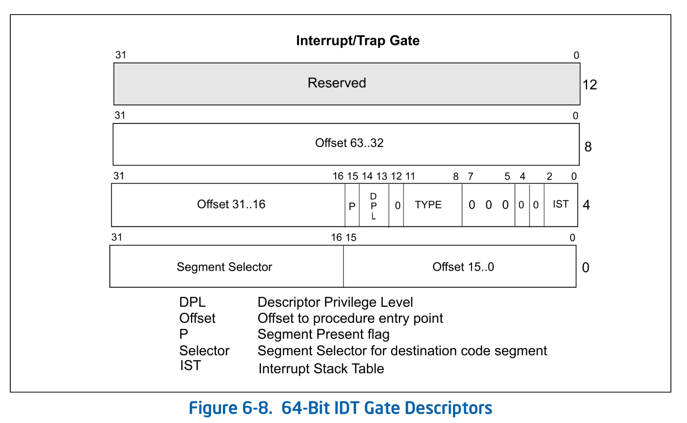
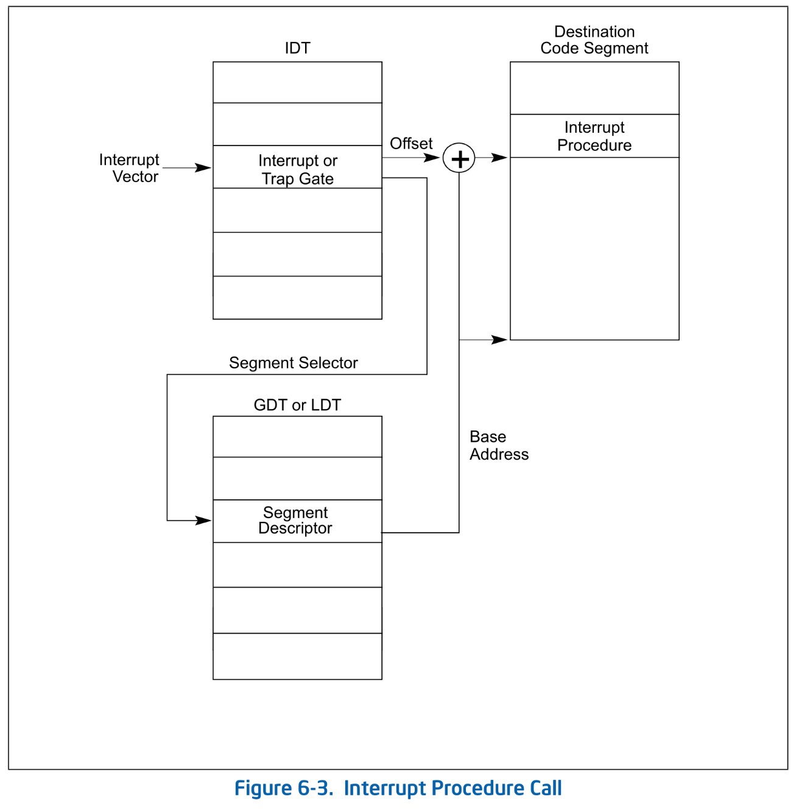
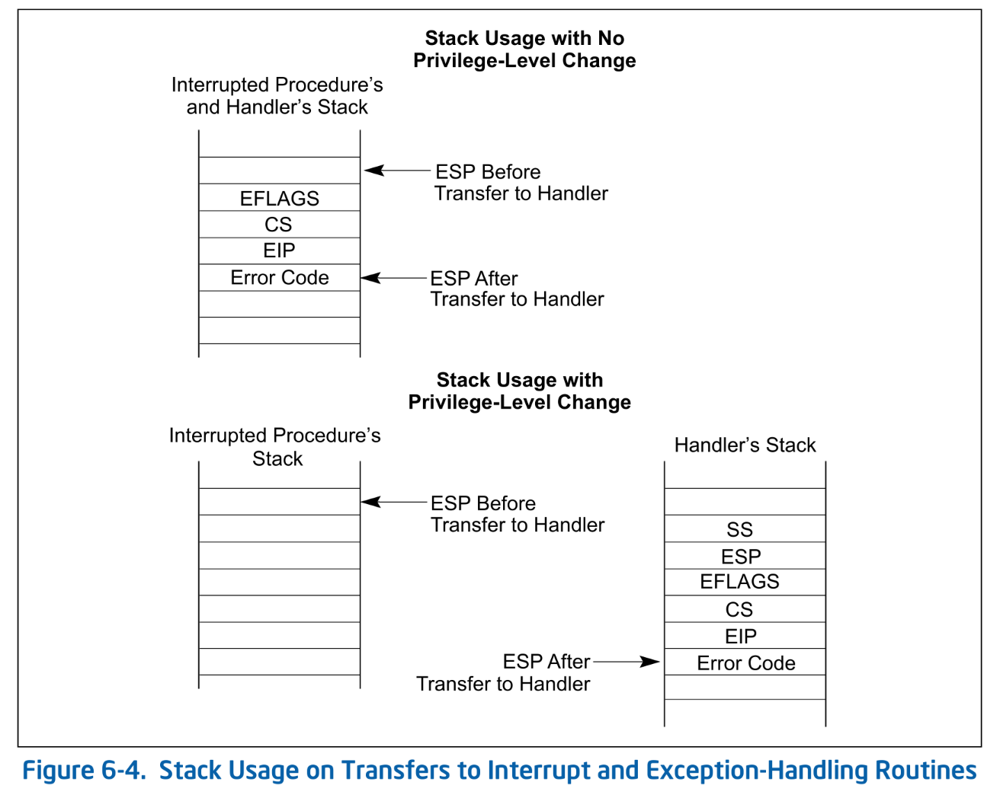

# 割り込みと例外

本チャプターは UEFI が用意してくれたものを Ymir が置き換えていくシリーズの第2弾です。
今回は割り込みと例外を扱います。
UEFI が Surtr に処理を渡した時点で、基本的な例外設定は UEFI がしてくれています。
どの例外ハンドラもアボートするだけのようですが。
Ymir ではこれを置き換えて、割り込みの適切な処理や例外時のエラー表示等をします。

なお、本チャプターは *SDM Vol.3A Chapter 6 INTERRUPT AND EXCEPTION HANDLING* に基づいています。
より詳細を知りたい人はあわせて参照してください。

> [!IMPORTANT]
>
> 本チャプターの最終コードは [`whiz-ymir-interrupt`](https://github.com/smallkirby/ymir/tree/whiz-ymir-interrupt) ブランチにあります。

## Table of Contents

<!-- toc -->

## 割り込みと例外の基礎

CPU は **割り込み (Interrupts)** と **例外 (Excetpions)**  という2つのイベント[^call]を受け取ることができます。
割り込みはハードウェアからの信号によって任意のタイミングで発生[^timing]するのに対し、
例外は CPU が instruction を実行するタイミングでエラーを検知して発生します。
なお、どちらもハンドラが呼び出されるのは Instruction Boundary に制限されるため、命令の途中で割り込みハンドラが呼び出されることはありません。

### 分類

**割り込み** は Interrupt Source によって以下の2つに分類されます:

| Name | Description |
|--------|-------------|
| **External Interrupts** | CPU 内部から発生する割り込み。 |
| **Software-generated Interrupts** | ソフトウェアから [INT](https://www.felixcloutier.com/x86/intn:into:int3:int1) 命令で発生。任意の番号の割り込みを発生可能。 |

**例外** も Interrupt Source によって3種類に分類されますが、そんなに使い分けることがないので省略します。
割り込みと同様に [INT](https://www.felixcloutier.com/x86/intn:into:int3:int1) 命令で任意の vector の例外を発生させることができます。
ただし、INT 命令による例外には **Error Code** がスタックに PUSH されないという制約があります。

例外には、例外を発生させたタスクの再開が可能かどうかに応じて以下の3つのクラスがあります:

| Name | Can Resume? | Return Address |
|---|---|---|
| **Faults** | Yes | Faulting instruction. |
| **Traps**| Yes | Next instruction. |
| **Aborts** | No | - |

例外は CPU が定義するものであるため、例外の種類はアーキテクチャに依存します。
x64 では以下のように例外が定義されています:

| Vector | Name | Class |
|---|---|---|
| 0 | #DE: Divide Error | Fault |
| 1 | #DB: Debug | Fault/Trap |
| 2 | NMI: Non-Maskable Interrupt | - |
| 3 | #BP: Breakpoint | Trap |
| 4 | #OF: Overflow | Trap |
| 5 | #BR: BOUND Range Exceeded | Fault |
| 6 | #UD: Invalid Opcode | Fault |
| 7 | #NM: Device Not Available | Fault |
| 8 | #DF: Double Fault | Abort |
| 9 | - | - |
| 10 | #TS: Invalid TSS | Fault |
| 11 | #NP: Segment Not Present | Fault |
| 12 | #SS: Stack-Segment Fault | Fault |
| 13 | #GP: General Protection | Fault |
| 14 | #PF: Page Fault | Fault |
| 15 | - | - |
| 16 | #MF: x87 FPU Floating-Point Error | Fault |
| 17 | #AC: Alignment Check | Fault |
| 18 | #MC: Machine Check | Abort |
| 19 | #XM: SIMD Floating-Point Exception | Fault |
| 20 | #VE: Virtualization Exception | Fault |
| 21 | #CP: Control Protection Exception | Fault |

割り込みと例外の vector は 0 から 255 までの 256 個です。
そのうちの 0 から 31 までが例外に割当てられているか予約されているため、割り込みとして使えるのは 32 から 255 までです。

### Interrupt Descriptor Table

**IDT: Interrupt Descriptor Table** は割り込みと例外のハンドラを保持するテーブルです。
GDT と同様に **Gate Descriptor** という 8byte のエントリから成る配列[^idt-size]です。
Gate Descriptor には *Task Gate* / *Interrupt Gate* / *Trap Gate* という3つの種類があります。
Task Gate は HW タスクスイッチに使われますが本シリーズでは使いません。
Interrupt Gate と Trap Gate の違いは、ハンドラ呼び出し時に割り込みを無効化する ( `RFLAGS.IF` をクリアする) かどうかです。
**本シリーズでは Interrupt Gate だけを使います**。

Gate Descriptor は以下の構造を持ちます:


*SDM Vol.3A 6.14.1 Figure 6-8. 64-Bit IDT Gate Descriptors*

*Offset* / *Segment Selector* / *DPL* 以外は固定値です。
**Segment Selector** は例外・割り込みハンドラが位置するセグメントを選択するためのセレクタです。
Segment Selector が指定するセグメント内のオフセットは **Offset** によって指定されます。

### ハンドラの呼び出し

割り込みが発生した場合、その vector に対応する Gate Descriptor が IDT から取得されます。
IDT には **Segment Selector** が入っており、ハンドラがあるセグメントを指定します。
FS/GS 等の Segment Selector と全く同じです。
セグメント内のハンドラのオフセットは *Offset* で指定されます。
つまり、Logical to Linear 変換と全く同じ方法でハンドラの物理アドレスが計算されます:


*SDM Vol.3A 6.12.1 Figure 6-3. Interrupt Procedure Call*

## Gate Descriptor の実装

まずは Gate Descriptor 構造体を定義します。
一応 `GateType` も定義しますが、本シリーズでは Interrupt Gate しか使いません:

<!-- i18n:skip -->
```ymir/arch/x86/idt.zig
/// Entry in the Interrupt Descriptor Table.
pub const GateDescriptor = packed struct(u128) {
    /// Lower 16 bits of the offset to the ISR.
    offset_low: u16,
    /// Segment Selector that must point to a valid code segment in the GDT.
    seg_selector: u16,
    /// Interrupt Stack Table. Not used.
    ist: u3 = 0,
    /// Reserved.
    _reserved1: u5 = 0,
    /// Gate Type.
    gate_type: GateType,
    /// Reserved.
    _reserved2: u1 = 0,
    /// Descriptor Privilege Level is the required CPL to call the ISR via the INT inst.
    /// Hardware interrupts ignore this field.
    dpl: u2,
    /// Present flag. Must be 1.
    present: bool = true,
    /// Middle 16 bits of the offset to the ISR.
    offset_middle: u16,
    /// Higher 32 bits of the offset to the ISR.
    offset_high: u32,
    /// Reserved.
    _reserved3: u32 = 0,

    pub fn offset(self: GateDescriptor) u64 {
        return @as(u64, self.offset_high) << 32 | @as(u64, self.offset_middle) << 16 | @as(u64, self.offset_low);
    }
};

pub const GateType = enum(u4) {
    Invalid = 0b0000,
    Interrupt64 = 0b1110,
    Trap64 = 0b1111,
};
```

続いて、IDT を定義します。
GDT と同様に `.data` セクションに確保される配列とします。
なお、GDT の [NULL Descriptor](./gdt.md#null-descriptor) とは異なり 0 番目の要素も実際に使うことができます:

<!-- i18n:skip -->
```ymir/arch/x86/idt.zig
pub const max_num_gates = 256;
var idt: [max_num_gates]GateDescriptor align(4096) = [_]GateDescriptor{std.mem.zeroes(GateDescriptor)} ** max_num_gates;
```

最後に、IDT にエントリを追加する関数を用意します:

<!-- i18n:skip -->
```ymir/arch/x86/idt.zig
pub const Isr = fn () callconv(.Naked) void;

pub fn setGate(
    index: usize,
    gate_type: GateType,
    offset: Isr,
) void {
    idt[index] = GateDescriptor{
        .offset_low = @truncate(@intFromPtr(&offset)),
        .seg_selector = gdt.kernel_cs_index << 3,
        .gate_type = gate_type,
        .offset_middle = @truncate(@as(u64, @intFromPtr(&offset)) >> 16),
        .offset_high = @truncate(@as(u64, @intFromPtr(&offset)) >> 32),
        .dpl = 0,
    };
}
```

`Isr` は後述する割り込みハンドラの関数型です。
ハンドラはコード領域に置かれるため、セグメントは CS を指定します
(下位 3bit は RPL/TI[^ti] なのでその分だけシフトします)。

## 空の IDT の初期化

一旦ちゃんとしたハンドラを設定する前に、空の IDT を初期化して使ってみましょう。
IDT の初期化関数を用意します:

<!-- i18n:skip -->
```ymir/arch/x86/idt.zig
const IdtRegister = packed struct {
    limit: u16,
    base: *[max_num_gates]GateDescriptor,
};

var idtr = IdtRegister{
    .limit = @sizeOf(@TypeOf(idt)) - 1,
    .base = undefined,
};

pub fn init() void {
    idtr.base = &idt;
    am.lidt(@intFromPtr(&idtr));
}
```

IDT 自体のアドレスは **IDTR: Interrupt Descriptor Table Register** にセットします。
GDT における GDTR に対応するレジスタです。
やはり GDT と同様に、Zig 0.13.0 時点のバグのせいで `.base = &idt` というような定義ができないため、
`init()` の中で IDT のアドレスをセットします。
`am.lidt()` は [LIDT](https://www.felixcloutier.com/x86/lgdt:lidt) を実行するためのアセンブリ関数です。

`kernelMain()` から呼び出して初期化します:

<!-- i18n:skip -->
```ymir/main.zig
arch.idt.init();
log.info("Initialized IDT.", .{});
```

これで空の IDT を設定できました。
実際に例外を起こしてみましょう。
Zig で定数値を使って `#DE: Devide Error` を引き起こすのは少し面倒なため、今回は `#GP: General Protection Fault` を引き起こしてみます:

<!-- i18n:skip -->
```ymir/main.zig
const ptr: *u64 = @ptrFromInt(0xDEAD_0000_0000_0000);
log.info("ptr.* = {d}", .{ptr.*});
```

`0xDEAD000000000000` というアドレスは、**Canonical Form** ではありません。
Canonical Form は仮想アドレスが満たすべきフォーマットのことで、 *Most Significant Implemented Bit* (おそらく最近のCPUだと 47-th bit) とそれより高位のビットが全て同じであることを要求します。
今回のアドレスは 47-th bit が `0` なのに対し、それより上位のビットが `0x00000000` ではないため `#GP` が発生します。

実行すると、おそらく QEMU が終了します。
これは **Triple Fault** が発生したためです。
まず、指定したアドレスから値を取得しようとして `#GP` が発生します。
CPU は `#GP` のベクタである 13 番目のエントリを IDT から取得します。
現在 IDT は全て 0 で埋めてあるため、*Segment Selector* が 0 (*NULL Segment Selector*) として解釈されます。
Null Segment Selector を使ったメモリアクセスは `#GP` を発生させようとしますが[^deref-null]、
2回連続の `#GP` なので `#DF: Double Fault` が発生します[^double-fault]。
ここでもやはりハンドラのアドレス解決時に `#GP` が発生し、最終的には Triple Fault が発生します。
Triple Fault はシステムをシャットダウンするため、QEMU が終了します。

なにはともあれ、UEFI の用意した IDT から Ymir の IDT に置き換えること自体には成功しているようです。

> [!NOTE]
>
> `main.zig` において、IDT と GDT の初期化をする関数呼び出しをコメントアウトした状態で `#GP` を発生させると、UEFI が用意してくれた IDT が使われます。
> このハンドラは、例外の種類とレジスタの状態をダンプしてくれるものです:
>
> ```txt
> !!!! X64 Exception Type - 0D(#GP - General Protection)  CPU Apic ID - 00000000 !!!!
> ExceptionData - 0000000000000000
> RIP  - FFFFFFFF801003DD, CS  - 0000000000000038, RFLAGS - 0000000000010002
> RAX  - DEAD000000000000, RCX - 0000000000000000, RDX - 00000000000003F8
> RBX  - 000000001FE91F78, RSP - FFFFFFFF80106EC0, RBP - 000000001FE908A0
> RSI  - 0000000000000030, RDI - 000000000000000A
> R8   - 000000001FE8FF8C, R9  - 000000001F9EC018, R10 - 000000001FAE6880
> R11  - 0000000089F90BEB, R12 - 000000001FEAFF40, R13 - 000000001FE93720
> R14  - FFFFFFFF801005E0, R15 - 00000000FF000000
> DS   - 0000000000000030, ES  - 0000000000000030, FS  - 0000000000000030
> GS   - 0000000000000030, SS  - 0000000000000030
> CR0  - 0000000080010033, CR2 - 0000000000000000, CR3 - 000000001E23A000
> CR4  - 0000000000000668, CR8 - 0000000000000000
> DR0  - 0000000000000000, DR1 - 0000000000000000, DR2 - 0000000000000000
> DR3  - 0000000000000000, DR6 - 00000000FFFF0FF0, DR7 - 0000000000000400
> GDTR - 000000001F9DC000 0000000000000047, LDTR - 0000000000000000
> IDTR - 000000001F537018 0000000000000FFF,   TR - 0000000000000000
> ```
>
> なお、IDT の初期化だけをコメントアウトするとやはり Triple Fault が発生します。
> GDT のコメントアウトも必要です。クイズとして理由を考えてみるのも良いかもしれません。

## 割り込みハンドラの共通部分

ここからは、作成した IDT にセットする割り込みハンドラを書いていきます。
割り込みハンドラは **ISR: Interrupt Service Routine** とも呼ばれます。
短くて書きやすいので以降は ISR と呼びます。

ISR には vector に関わらず共通でするべき処理があります。
レジスタの退避・復帰などです。
そのため、Ymir では共通の処理を呼び出した後に vector に対応する個別のハンドラを呼び出すような ISR を作成します。

以下では ISR の共通部分を実装していきましょう。
ISR の共通部分は以下のように生成します:

<!-- i18n:skip -->
```ymir/arch/x86/isr.zig
pub fn generateIsr(comptime vector: usize) idt.Isr {
    return struct {
        fn handler() callconv(.Naked) void {
            // Clear the interrupt flag.
            asm volatile (
                \\cli
            );
            // If the interrupt does not provide an error code, push a dummy one.
            if (vector != 8 and !(vector >= 10 and vector <= 14) and vector != 17) {
                asm volatile (
                    \\pushq $0
                );
            }
            // Push the vector.
            asm volatile (
                \\pushq %[vector]
                :
                : [vector] "n" (vector),
            );
            // Jump to the common ISR.
            asm volatile (
                \\jmp isrCommon
            );
        }
    }.handler;
}
```

`generateIsr()` は、割り込み vector を受取り、その vector に対応する ISR を生成します。
全 ISR に「共通」の処理ではありますが、**関数自体は vector の個数分だけ生成する**ということです。
これがなぜかというと、CPU は ISR の呼び出し時に vector をスタックやレジスタに保存してくれないからです。
全 ISR に対して1つの関数しか用意しない場合、現在処理されている割り込み vector を知る方法がありません。
これを避けるため、vector ごとに関数を生成します。

> [!NOTE]
>
> Zig では構造体を返す関数はとても簡単かつ自然に書くことができます。
> 一方で、関数を返す場合には `struct` のメンバ関数ポインタを返すという少し歪な方法を取る必要があります。
> もっと良い方法をご存知の方がいれば教えてください。

ISR では、まず [CLI](https://www.felixcloutier.com/x86/cli) 命令で割り込みを無効化します。
CPU は Interrupt Gate 経由で ISR にジャンプする時には *RFLAGS.IF* をクリアしますが、
Trap Gate 経由でジャンプするときにはクリアしません。
よって、Trap Gate 内で割り込みを禁止したい場合には明示的に CLI する必要があります[^cli]。

続いて、例外が **Error Code** を提供しない場合にはダミーのエラーコードを PUSH します。
一部の例外は Error Code によって例外の原因などを少し詳しく通知してくれます。
例えば、`#PF: Page Fault` はフォルトを起こしたアクセスが read/write のどちらなのか等を Error Code に含めます。
Error Code を提供するものとしないもののスタックの状態を同じにするため、
ISR では Error Code を提供しない例外にもダミーのエラーコードを PUSH します。
各例外の Error Code の有無や意味は *SDM Vol.3A 6.15 Exception and Interrupt Reference* を参照してください。

最後に、ISR の vectorによらない共通部分にジャンプする前に vector を PUSH します。
これによって、全割り込みで1つしか用意されていない関数の中でも vector を取得できます。

全割り込みで共通して使う部分は以下です:

<!-- i18n:skip -->
```ymir/arch/x86/isr.zig
export fn isrCommon() callconv(.Naked) void {
    // Save the general-purpose registers.
    asm volatile (
        \\pushq %%rax
        \\pushq %%rcx
        \\pushq %%rdx
        \\pushq %%rbx
        \\pushq %%rsp
        \\pushq %%rbp
        \\pushq %%rsi
        \\pushq %%rdi
        \\pushq %%r15
        \\pushq %%r14
        \\pushq %%r13
        \\pushq %%r12
        \\pushq %%r11
        \\pushq %%r10
        \\pushq %%r9
        \\pushq %%r8
    );

    // Push the context and call the handler.
    asm volatile (
        \\pushq %%rsp
        \\popq %%rdi
        // Align stack to 16 bytes.
        \\pushq %%rsp
        \\pushq (%%rsp)
        \\andq $-0x10, %%rsp
        // Call the dispatcher.
        \\call intrZigEntry
        // Restore the stack.
        \\movq 8(%%rsp), %%rsp
    );

    // Remove general-purpose registers, error code, and vector from the stack.
    asm volatile (
        \\popq %%r8
        \\popq %%r9
        \\popq %%r10
        \\popq %%r11
        \\popq %%r12
        \\popq %%r13
        \\popq %%r14
        \\popq %%r15
        \\popq %%rdi
        \\popq %%rsi
        \\popq %%rbp
        \\popq %%rsp
        \\popq %%rbx
        \\popq %%rdx
        \\popq %%rcx
        \\popq %%rax
        \\add   $0x10, %%rsp
        \\iretq
    );
}
```

まず最初に現在のレジスタの状態を保存します。
続いて、vector ごとの関数を呼び出すための関数である `intrZigEntry()` を呼び出します。
この際、引数には現在の RSP を渡すため、RSP を RDI にコピーしています[^rsp]。
各 vector ごとの引数を呼び出したあとは、保存していたレジスタを復元します。

最後に、[IRET](https://www.felixcloutier.com/x86/iret:iretd:iretq) 命令で割り込みから復帰します。
IRET はスタックの上から順に RIP / CS / RFLAGS を POP する命令です。
この3つをスタックに積んだ覚えがないと思ったあなた、正解です。
この3つは ISR に入る際に CPU が自動的に PUSH してくれるものです。
ISR を呼び出す直前に CPU はスタックに以下のものを積んでくれます:


*SDM Vol.3A 6.4 Figure 6-4. Stack Usage on Transfers to Interrupt and Exception-Handling Routines*

本シリーズでは Ymir はユーザランドを実装しないため、 `with No Privilege-Level Change` の場合のみを考えれば良いです。
たとえ Error Code が提供されない場合でも、ISR の共通部分でダミーの Error Code を PUSH していたため、
スタックは必ずこの図のとおりになります。
加えて、Ymir の ISR ではこれに vector も PUSH していました。
よって、IRET する前には vector と Error Code をスタックから取り除くために `add $0x10, %%rsp` を行っています。

> [!NOTE]
>
> x64 の命令の中には、スタックが 16byte にアラインされていることを要求する命令があります。
> その一例は [MOVAPS](https://www.felixcloutier.com/x86/movaps) 命令です。
> この命令はスタックが 16byte にアラインされていない場合に `#GP` を発生させます。
> ISR から `intrZigEntry()` を呼び出す際にはスタックを 16byte にアラインする操作を挟んでいます。

## vector 固有のハンドラ

ISR の共通部分が完成したので、各 vector に対応するハンドラを呼び出します。
先程の共通 ISR で呼び出していた `intrZigEntry()` は以下のように定義します:

<!-- i18n:skip -->
```ymir/arch/x86/isr.zig
const intr = @import("interrupt.zig");

pub const Context = packed struct {
    /// General purpose registers.
    registers: Registers,
    /// Interrupt Vector.
    vector: u64,
    /// Error Code.
    error_code: u64,

    // CPU status:
    rip: u64,
    cs: u64,
    rflags: u64,
};
const Registers = packed struct {
    r8: u64,
    r9: u64,
    r10: u64,
    r11: u64,
    r12: u64,
    r13: u64,
    r14: u64,
    r15: u64,
    rdi: u64,
    rsi: u64,
    rbp: u64,
    rsp: u64,
    rbx: u64,
    rdx: u64,
    rcx: u64,
    rax: u64,
};

export fn intrZigEntry(ctx: *Context) callconv(.C) void {
    intr.dispatch(ctx);
}
```

引数の `Context` は ISR が呼び出された直後のレジスタの状態です。
**`intrZigEntry()` を呼び出す直前のスタックが、そのまま `Context` の中身になります**。
先ほど `intrZigEntry()` に RSP の値を引数と渡していたのは、このためです。
vector 固有のハンドラ内では、これらの `Context` の情報を使うことができます。

`callconv(.C)` とすることで、第1引数が必ず RDI (今回は RSP の値) になるようにします。
これをしないと、Zig が最適化のためにどのレジスタ(またはスタック)を使って引数を渡すのかを変える可能性があります。
`intr.dispatch()` は以下のように vector 固有のハンドラを呼び出します:

<!-- i18n:skip -->
```ymir/arch/x86/interrupt.zig
pub const Handler = *const fn (*Context) void;
var handlers: [256]Handler = [_]Handler{unhandledHandler} ** 256;

pub fn dispatch(context: *Context) void {
    const vector = context.vector;
    handlers[vector](context);
}
```

`handlers` は vector ごとのハンドラを保持する配列です。
`dispatch()` は登録されたハンドラのうち、vector に対応するものを呼び出します。
仮にハンドラが登録されていなかった場合には、デフォルトの `unhandledHandler()` を呼び出すことにします:

<!-- i18n:skip -->
```ymir/arch/x86/interrupt.zig
fn unhandledHandler(context: *Context) void {
    @setCold(true);

    log.err("============ Oops! ===================", .{});
    log.err("Unhandled interrupt: {s} ({})", .{
        exceptionName(context.vector),
        context.vector,
    });
    log.err("Error Code: 0x{X}", .{context.error_code});
    log.err("RIP    : 0x{X:0>16}", .{context.rip});
    log.err("EFLAGS : 0x{X:0>16}", .{context.rflags});
    log.err("RAX    : 0x{X:0>16}", .{context.registers.rax});
    log.err("RBX    : 0x{X:0>16}", .{context.registers.rbx});
    log.err("RCX    : 0x{X:0>16}", .{context.registers.rcx});
    log.err("RDX    : 0x{X:0>16}", .{context.registers.rdx});
    log.err("RSI    : 0x{X:0>16}", .{context.registers.rsi});
    log.err("RDI    : 0x{X:0>16}", .{context.registers.rdi});
    log.err("RSP    : 0x{X:0>16}", .{context.registers.rsp});
    log.err("RBP    : 0x{X:0>16}", .{context.registers.rbp});
    log.err("R8     : 0x{X:0>16}", .{context.registers.r8});
    log.err("R9     : 0x{X:0>16}", .{context.registers.r9});
    log.err("R10    : 0x{X:0>16}", .{context.registers.r10});
    log.err("R11    : 0x{X:0>16}", .{context.registers.r11});
    log.err("R12    : 0x{X:0>16}", .{context.registers.r12});
    log.err("R13    : 0x{X:0>16}", .{context.registers.r13});
    log.err("R14    : 0x{X:0>16}", .{context.registers.r14});
    log.err("R15    : 0x{X:0>16}", .{context.registers.r15});
    log.err("CS     : 0x{X:0>4}", .{context.cs});

    ymir.endlessHalt();
}
```

このハンドラは、`Context` に保存された状態をダンプしたあと、無限 HLT ループするだけです。

## IDT にハンドラのセット

ISR の共通部分、およびそこから vector 固有のハンドラを呼び出す部分が完成しました。
残る処理は IDT に ISR をセットすることだけです。
全 IDT エントリに対して ISR をセットしましょう:

<!-- i18n:skip -->
```ymir/arch/x86/interrupt.zig
pub fn init() void {
    inline for (0..idt.max_num_gates) |i| {
        idt.setGate(
            i,
            .Interrupt64,
            isr.generateIsr(i),
        );
    }

    idt.init();

    am.sti();
}
```

`inline for` を使って、256 回だけ `idt.setGate()` を呼び出します。
`inline for` が必要なのは、`isr.generateIsr()` が関数を返すためコンパイル時に `for` が評価される必要があるためです。
`generateIsr(i)` を使って生成された ISR は、先ほど実装した `idt.setGate()` によって Interrupt Gate として IDT にセットされます。
最後に、[STI](https://www.felixcloutier.com/x86/sti) で `RFLAGS.IF` をセットして割り込みを有効化します。

## まとめ

本チャプターでは vector に関わらず共通な部分と vector 固有の部分に分けて ISR を実装しました。
全ての割り込みに対して ISR を生成し、IDT に登録しました。
登録された ISR は、各 vector ごとのハンドラを呼び出します。
現在はまだ vector ごとのハンドラをひとつも登録していないため、全ての割り込みが `unhandledHandler()` によって処理されます。
先ほどの `#GP` を発生させるコードをもう一度実行すると、以下のようになります:

<!-- i18n:skip -->
```txt
[INFO ] main    | Booting Ymir...
[INFO ] main    | Initialized GDT.
[INFO ] main    | Initialized IDT.
[ERROR] intr    | ============ Oops! ===================
[ERROR] intr    | Unhandled interrupt: #GP: General protection fault (13)
[ERROR] intr    | Error Code: 0x0
[ERROR] intr    | RIP    : 0xFFFFFFFF80104464
[ERROR] intr    | EFLAGS : 0x0000000000010202
[ERROR] intr    | RAX    : 0xDEADBEEF00000000
[ERROR] intr    | RBX    : 0x000000001FE91F78
[ERROR] intr    | RCX    : 0xFFFFFFFF80111812
[ERROR] intr    | RDX    : 0x00000000FFFF03F8
[ERROR] intr    | RSI    : 0x80108E0000104760
[ERROR] intr    | RDI    : 0x000000000000000A
[ERROR] intr    | RBP    : 0x000000001FE908A0
[ERROR] intr    | R8     : 0xFFFFFFFF801130E0
[ERROR] intr    | R9     : 0xFFFFFFFF80111080
[ERROR] intr    | R10    : 0x8010000000000000
[ERROR] intr    | R11    : 0x80108E0000105670
[ERROR] intr    | R12    : 0x000000001FEAFF40
[ERROR] intr    | R13    : 0x000000001FE93720
[ERROR] intr    | R14    : 0xFFFFFFFF80105680
[ERROR] intr    | R15    : 0x00000000FF000000
[ERROR] intr    | CS     : 0x0010
```

ちゃんとレジスタの状態がダンプされていますね。

なお、本シリーズでは **Ymir で例外が発生することは想定しません**。
のちのチャプターで扱いますが、カーネルは全ての物理アドレス空間を初期化時にマップするため、`#PF` も発生しません (Linuxと同じです)。
一方で割り込みはいくつか登録するため、その時になったら今回実装した vector ごとのハンドラを登録する仕組みが活躍することになります。

以上で UEFI が提供する IDT から独自の IDT に切り替えることができました。
UEFI に依存しているものは、残すところページテーブルだけです。
しかし、ページテーブルを切り替えるにはその過程の中でページアロケータが必要になります。
次チャプターではページアロケータを実装していきましょう。

[^call]: 本シリーズでは割り込みと例外を区別する必要がない場合にまとめて *割り込み* と呼びます。
[^timing]: 割り込み信号は任意のタイミングで CPU に通知される可能性があるものの、
実際に割り込みが CPU から報告されるのは instruction boundary であることが保証されます。
つまり、命令の実行途中で割り込みが発生することはありません。
例外に関しても同様です。
[^idt-size]: GDT が最大で \\(2^{13} = 8192\\) 個のエントリを持てるのに対し、割り込みは最大256個しかないため IDT も 256 個のエントリしか意味を持ちません。
[^ti]: *Segment Selector* の *TI* が `0` なら GDT が、`1` なら LDT が使われます。
[^deref-null]: SDM Vol.3A 5.4.1
[^double-fault]: 厳密には、Double Fault を発生させる例外の組み合わせは非常に限られています。
詳しくは SDM か [Double Faults - Writing an OS in Rust](https://os.phil-opp.com/double-fault-exceptions/#causes-of-double-faults) を参照してください。
[^cli]: ところで Ymir では Interrupt Gate しか扱わないため、やっぱりこの CLI は不要ですね...
[^rsp]: x64 では RSP に直接 MOV できません。
