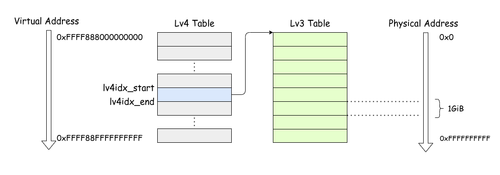
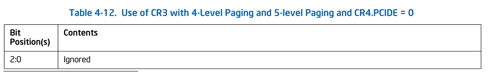
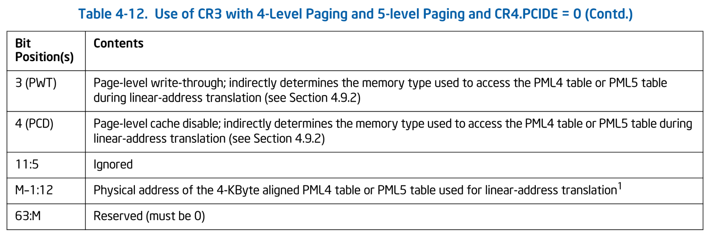

# ページング

本チャプターは UEFI が用意してくれたものを Ymir のものに置き換えていこうシリーズの最終弾です。
最後を飾るのはページテーブルです。
UEFI が用意したページテーブルは仮想アドレスをそのまま物理アドレスにするダイレクトマップ(ストレートマップ)でした。
Ymir が新しく用意するマッピングもダイレクトマップではありますが、仮想アドレスと物理アドレスが異なるようにオフセットを加算します。
本チャプターを終えると、UEFI が提供したものを全て破棄できる状態になります。

> [!IMPORTANT]
> 本チャプターの最終コードは [`whiz-ymir-paging`](https://github.com/smallkirby/ymir/tree/whiz-ymir-paging) ブランチにあります。

## Table of Contents

<!-- toc -->

## 仮想アドレスレイアウト

[カーネルのロード](../bootloader/load_kernel.md) でも扱いましたが、Ymir では以下の仮想アドレスレイアウトを採用します:

| Description | Virtual Address | Physical Address |
| --- | --- | --- |
| Direct Map Region | `0xFFFF888000000000` - `0xFFFF88FFFFFFFFFF` (512GiB) | `0x0` - `0xFFFFFFFFFF` |
| Kernel Base | `0xFFFFFFFF80000000` - | `0x0` - |
| Kernel Text | `0xFFFFFFFF80100000` - | `0x100000` - |

**Direct Map Region** は全物理アドレスをダイレクトマップします。
ダイレクトマップとはいっても、仮想アドレスと物理アドレスが等しくなるわけではありません。
仮想アドレスと物理アドレスの間には `0xFFFF888000000000` だけオフセットがあります。
この領域にはアロケータが利用するヒープも含まれます。

**Kernel Base** と **Kernel Text** はカーネルイメージをロードする領域です。
`ymir/linker.ld` によってカーネルイメージはこのアドレスにロードされるよう要求するようになっています。
この仮想アドレスは既に [カーネルのロード](../bootloader/load_kernel.md#仮想アドレスのマップ) の部分でマップ済みです。

各仮想アドレスがマップされる物理アドレスを見て分かるように、Direct Map Region と Kernel Base は重複しています。
同じ物理アドレスが複数の仮想アドレスからマップされること自体はごく普通のことです。
基本的にソフト側で扱うアドレスは仮想アドレスであるため、アドレスからどの領域かがわかりやすくなるように異なる仮想アドレスをマップしています。
`0xFFFFFFFF8010DEAD` というアドレスを見たらすぐに「Ymir のコード領域だな」とわかるので便利ですね。

もちろん、これ以外のレイアウトを採用することも容易にできます。
最も簡単なのは、全ての仮想アドレスを物理アドレスにオフセット無しで 1:1 にマップすることです。
本シリーズで実装する Ymir に関しては、そうした場合でもデメリットはありません。
お好きなレイアウトを採用してください。

## 再構築の流れ

ここからは、UEFI が提供してくれたページテーブルを「*古いページテーブル*」、Ymir が提供するページテーブルを「*新しいページテーブル*」と呼びます。
古いページテーブルを新しいものに置き換えるには、以下の手順を踏みます:

1. 新しい Lv4 ページテーブル用の領域を確保する
2. 1GiB ページを使って Direct Map Region をマップする
3. 古いページテーブルから Kernel Base Region のマップをクローンする
4. 新しいページテーブルをロードする

2 で Direct Map Region である `0xFFFF888000000000` からの 512GiB をマップします。
これは古いページテーブルの内容を参照すること無く行うことができます。
しかしながら、カーネルがどこにマップされたのかは古いページテーブルを見ないとわかりません[^kernel-map]。
よって、この領域は古いページテーブルを参照して内容をクローンする必要があります。

## 新しい Lv4 ページテーブルの確保

以前 Surtr で実装した `page.zig` は、ほとんどそのまま `ymir/arch/x86/page.zig` にコピーできます。
具体的には、各種定数や `EntryBase`構造体, `getTable()`, `getEntry()` 等の関数をコピーします。

ページテーブルは 8byte のエントリが 512 個並んだものです。
すなわち、サイズは 4KiB (1ページ) です。
ページテーブル1つにつき1ページを確保するため、1ページを確保するためのヘルパー関数を用意します:

```ymir/arch/x86/page.zig
fn allocatePage(allocator: Allocator) PageError![*]align(page_size_4k) u8 {
    return (allocator.alignedAlloc(
        u8,
        page_size_4k,
        page_size_4k,
    ) catch return PageError.OutOfMemory).ptr;
}
```

`Allocator` は [前チャプター](./page_allocator.md) で実装した `PageAllocator` をバックに持つアロケータです。
しかしながら、`PageAllocator` であることは意識せずに Zig 標準の `Allocator` として使うことができます。
確保するページは性質上 4KiB アラインが要求されるため、`alignedAlloc()` でアラインされた領域を確保します。

マッピングを再構築する関数は `reconstruct()` とします:

```ymir/arch/x86/page.zig
pub fn reconstruct(allocator: Allocator) PageError!void {
    const lv4tbl_ptr: [*]Lv4Entry = @ptrCast(try allocatePage(allocator));
    const lv4tbl = lv4tbl_ptr[0..num_table_entries]; // 256
    @memset(lv4tbl, std.mem.zeroes(Lv4Entry));
    ...
}
```

まず最初に新しい Lv4 ページテーブルを確保します。
`allocatePage()` が返す領域は [many-item pointer](https://ziglang.org/documentation/master/#Pointers) であるため、
テーブルあたりのエントリ数 256 でスライスを作っています。
作成したページテーブルはとりあえず全部ゼロ埋めしておきます。
ゼロ埋めすることでエントリの `present` フィールドが 0 になるため、何もマップしない状態になります。
念の為以下にページテーブルエントリの構造を再掲しておきます:


*Formats of CR3 and Paging-Structure Entries with 4-Level Paging. SDM Vol.3A 4.5.5*

## Direct Map Region

作成したまっさらなページテーブルに Direct Map Region をマップします:

```ymir/arch/x86/page.zig
const direct_map_base = ymir.direct_map_base;
const direct_map_size = ymir.direct_map_size;


pub fn reconstruct(allocator: Allocator) PageError!void {
    ...
    const lv4idx_start = (direct_map_base >> lv4_shift) & index_mask;
    const lv4idx_end = lv4idx_start + (direct_map_size >> lv4_shift);

    // Create the direct mapping using 1GiB pages.
    for (lv4tbl[lv4idx_start..lv4idx_end], 0..) |*lv4ent, i| {
        const lv3tbl: [*]Lv3Entry = @ptrCast(try allocatePage(allocator));
        for (0..num_table_entries) |lv3idx| {
            lv3tbl[lv3idx] = Lv3Entry.newMapPage(
                (i << lv4_shift) + (lv3idx << lv3_shift),
                true,
            );
        }
        lv4ent.* = Lv4Entry.newMapTable(lv3tbl, true);
    }
    ...
}
```

`direct_map_base` は `0xFFFF888000000000` です。
この仮想アドレスを解決するための Lv4 エントリのインデックスは、アドレスを `lv4_shift`(`39`) だけシフトすることで得られます。
`lv4idx_end` は 512GiB をマップするのに必要なだけのエントリ数を `lv4idx_start` に足したものです。
Lv3 テーブルにはエントリが 512 個あり、それぞれが 1GiB をマップできるため、必要な Lv3 テーブルは 1つです。

> [!NOTE] ページサイズ
> 今回は Direct Map Region を 1GiB ページでマップしました。
> 4KiB ページを使うと 1GiB をマップするのに \\( 2^{18} \\) 個のエントリが必要になります。
> 1エントリあたり 8byte なので、合計で \\( 2^{18} \times 8 = 2^{21} = 2\text{MiB} \\) になります。
> 今回は 512GiB をマップするため、4KiB ページを使うとテーブルエントリだけで 1GiB になってしまいます。
> できるだけ大きいページを使うことでページテーブルのエントリ数を減らすことができます。
> 今回 1GiB ページを使ったのもそのためです。

`for` ループでは、Lv4 エントリに対して Lv3 テーブルを確保し、そのエントリを作成しています。
今回 Lv3 テーブルは1つしか必要ないためこの `for` ループは1回しか実行されませんが、
direct map region を大きくしたいような場合にも対応できるようにしています。

この関数を図示すると以下のようになります:


*Direct Map Region*

## 古いページテーブルのクローン

続いて、UEFI が提供するページテーブルから Direct Map Region よりも高位にマップされている領域をクローンします。
この領域を使っているのはカーネルイメージだけです。

まずは Lv4 エントリを探索してクローンするべきエントリを探します:

```ymir/arch/x86/page.zig
pub fn reconstruct(allocator: Allocator) PageError!void {
    ...
    // Recursively clone tables for the kernel region.
    const old_lv4tbl = getLv4Table(am.readCr3());
    for (lv4idx_end..num_table_entries) |lv4idx| {
        if (old_lv4tbl[lv4idx].present) {
            const lv3tbl = getLv3Table(old_lv4tbl[lv4idx].address());
            const new_lv3tbl = try cloneLevel3Table(lv3tbl, allocator);
            lv4tbl[lv4idx] = Lv4Entry.newMapTable(new_lv3tbl.ptr, true);
        }
    }
    ...
}
```

現在利用中の Lv4 テーブルのアドレスは CR3 の値から取得できます。
既に実装した `getLv4Table()` でテーブルを取得した後、Direct Map Region 以降のエントリから有効 (`present`) なエントリを探します。
有効な Lv4 エントリは Lv3 ページテーブルを指していますが、この Lv3 ページテーブルも UEFI が提供するものであり新しく確保する必要があります。

Lv3 ページを確保したあとは、同様にしてテーブル内の有効なエントリが指すテーブルを再帰的にクローンしていきます:

```ymir/arch/x86/page.zig
fn cloneLevel3Table(lv3_table: []Lv3Entry, allocator: Allocator) PageError![]Lv3Entry {
    const new_lv3ptr: [*]Lv3Entry = @ptrCast(try allocatePage(allocator));
    const new_lv3tbl = new_lv3ptr[0..num_table_entries];
    @memcpy(new_lv3tbl, lv3_table);

    for (new_lv3tbl) |*lv3ent| {
        if (!lv3ent.present) continue;
        if (lv3ent.ps) continue;

        const lv2tbl = getLv2Table(lv3ent.address());
        const new_lv2tbl = try cloneLevel2Table(lv2tbl, allocator);
        lv3ent.phys = @truncate(virt2phys(new_lv2tbl.ptr) >> page_shift_4k);
    }

    return new_lv3tbl;
}

fn cloneLevel2Table(lv2_table: []Lv2Entry, allocator: Allocator) PageError![]Lv2Entry {
    const new_lv2ptr: [*]Lv2Entry = @ptrCast(try allocatePage(allocator));
    const new_lv2tbl = new_lv2ptr[0..num_table_entries];
    @memcpy(new_lv2tbl, lv2_table);

    for (new_lv2tbl) |*lv2ent| {
        if (!lv2ent.present) continue;
        if (lv2ent.ps) continue;

        const lv1tbl = getLv1Table(lv2ent.address());
        const new_lv1tbl = try cloneLevel1Table(lv1tbl, allocator);
        lv2ent.phys = @truncate(virt2phys(new_lv1tbl.ptr) >> page_shift_4k);
    }

    return new_lv2tbl;
}
```

Lv3 と Lv2 のクローンはほぼ同じです。
`getLvXTable()` 等と同様に内部実装を統一しても良かったのですが、どうせ2つしかない上に1度しか使われないためこれで十分です。

Lv3 と Lv2 ページエントリは Lv4 と異なり、次レベルのページテーブルを指している場合 (`ps == true`) の他に、
ページをマップしている場合 (`present == true`) があります。
ページをマップしている場合には新しく作成・コピーするべきものがないため `continue` でスキップしています。

Lv1 エントリはテーブルを指すことがなく必ず物理ページをマップしています。
よって、`cloneLevel1Table()` は単純にテーブルを新たに作成してコピーするだけです:

```ymir/arch/x86/page.zig
fn cloneLevel1Table(lv1_table: []Lv1Entry, allocator: Allocator) PageError![]Lv1Entry {
    const new_lv1ptr: [*]Lv1Entry = @ptrCast(try allocatePage(allocator));
    const new_lv1tbl = new_lv1ptr[0..num_table_entries];
    @memcpy(new_lv1tbl, lv1_table);

    return new_lv1tbl;
}
```

以上で新しい Lv4 テーブルに既存のカーネル用領域のマップが作成できました。

## 新しいテーブルのロード

最後に、新しいページテーブルをロードします。
Lv4 ページテーブルのアドレスは CR3 レジスタに書き込むことで変更できます。

```ymir/arch/x86/page.zig
    ...
    const cr3 = @intFromPtr(lv4tbl) & ~@as(u64, 0xFFF);
    am.loadCr3(cr3);
    ...
```

CR3 へ書き込みを行うと、TLB の前エントリがフラッシュされ古いエントリが無効になります。
以降は新しくセットしたページテーブルがアドレス解決に使われます。

なお、本来 CR3 は単にページテーブルの物理アドレスを保持する他にも別のフィールドを持ちます:


*Use of CR3 with 4-Level Paging and 5-level Paging and CR4.PCIDE = 0. SDM Vol.3A 4.5.2*

*Use of CR3 with 4-Level Paging and 5-level Paging and CR4.PCIDE = 0 (Contd.). SDM Vol.3A 4.5.2*

本シリーズの Ymir では [PCID: Process Context Identifiers](https://en.wikipedia.org/wiki/Translation_lookaside_buffer#PCID) は使わないため，この表のフォーマットに従います[^pcid]。
表中の `M` は物理アドレスのサイズであり、おそらく最近の Core シリーズでは `46` になるのではないかと思います。
3-th / 4-th bit は Lv4 テーブルにアクセスする際のキャッシュタイプを決定する要因の1つになります。
今回は特にこのあたりは気にせず、どちらも `0` としています。

## 仮想-物理アドレス変換

実装した関数を使ってメモリマップを再構築します:

```ymir/mem.zig
var mapping_reconstructed = false;

pub fn reconstructMapping(allocator: Allocator) !void {
    try arch.page.reconstruct(allocator);
    mapping_reconstructed = true;
    ...
}
```

ところで、[Page Allocator](./page_allocator#phys-virt-変換) のチャプターでは仮想アドレスと物理アドレスの変換をする関数を定義しました。
その時はまだ UEFI のページテーブルを使っていたため物理アドレスと仮想アドレスは等しいものとして扱いました。
しかし、`reconstruct()` を呼び出すことでページテーブルは新しいものに置き換わり、仮想-物理アドレスの変換も変わります。
例えば、`0x1000` という仮想アドレスはこれまでは `0x1000` という物理アドレスにマップされていましたが、
新しいページテーブルではもはやマップされていません。
テーブルを再構築したあとには変換の挙動を変更する必要があります:

```ymir/mem.zig
pub fn virt2phys(addr: u64) Phys {
    return if (!mapping_reconstructed) b: {
        // UEFI's page table.
        break :b addr;
    } else if (addr < ymir.kernel_base) b: {
        // Direct map region.
        break :b addr - ymir.direct_map_base;
    } else b: {
        // Kernel image mapping region.
        break :b addr - ymir.kernel_base;
    };
}

pub fn phys2virt(addr: u64) Virt {
    return if (!mapping_reconstructed) b: {
        // UEFI's page table.
        break :b value;
    } else b: {
        // Direct map region.
        break :b addr + ymir.direct_map_base;
    };
}
```

ページテーブルが再構築されたかどうかを `mapping_reconstructed` で管理し、その値に応じて変換ロジックを変更します。
仮想から物理への変換では、仮想アドレスが Direct Map Region とカーネルイメージ領域のどちらなのかを判定する必要があります。
一方で物理から仮想への変換の際には、全て Direct Map Region 用の仮想アドレスを返すことにします。
もちろんカーネルイメージ領域の物理アドレスは2つの仮想アドレスにマップされているため、カーネル領域の仮想アドレスとして返すことも可能ですが、ここではシンプルにしています。

さて、以上でページテーブルの再構築が完了しました。
`kernelMain()` から呼び出します:

```ymir/main.zig
log.info("Reconstructing memory mapping...", .{});
try mem.reconstructMapping(mem.page_allocator);
```

Ymir を実行し、HALT ループに入ったところで GDB をアタッチしてメモリマップを確認すると以下のようになります:

```txt
Virtual address start-end              Physical address start-end             Total size   Page size   Count  Flags
0xffff888000000000-0xffff890000000000  0x0000000000000000-0x0000008000000000  0x8000000000 0x40000000  512    [RWX KERN ACCESSED GLOBAL]
0xffffffff80100000-0xffffffff80517000  0x0000000000100000-0x0000000000517000  0x417000     0x1000      1047   [RWX KERN ACCESSED DIRTY GLOBAL]
```

Direct Map Region とカーネルイメージ領域がマップされていることが分かります。
マップの再構築完了です。

## Surtr のマッピング改良

> [!INFO] スキップ可能
> この部分はスキップして次に進むことが可能です。

新しいアドレスマップを見て気づいたことがあります。
せっかく `linker.ld` でセグメント構成を設定してあげたのに、カーネルイメージ領域が単一の RWX な領域になってしまっています。
これは、[カーネルのロード](../bootloader/load_kernel.md#セグメントの読み込み) で Surtr がセグメントの属性を無視してロードしたためです。
結果として全セグメントが同じ RWX 属性でマップされたため、ひと続きの領域として表示されてしまっています。
わざわざ作ったスタックガードページも全く意味がありませんね。

というわけで、Surtr のカーネルローダ部分が、セグメントの属性を考慮してロードするように修正します。
まずは Surtr に 4KiB ページの属性を変更する関数を定義します:

```surtr/arch/x86/page.zig
pub const PageAttribute = enum {
    read_only,
    read_write,
    executable,

    pub fn fromFlags(flags: u32) PageAttribute {
        return if (flags & elf.PF_X != 0) .executable else if (flags & elf.PF_W != 0) .read_write else .read_only;
    }
};

pub fn changeMap4k(virt: Virt, attr: PageAttribute) PageError!void {
    const rw = switch (attr) {
        .read_only, .executable => false,
        .read_write => true,
    };

    const lv4ent = getLv4Entry(virt, am.readCr3());
    if (!lv4ent.present) return PageError.NotPresent;
    const lv3ent = getLv3Entry(virt, lv4ent.address());
    if (!lv3ent.present) return PageError.NotPresent;
    const lv2ent = getLv2Entry(virt, lv3ent.address());
    if (!lv2ent.present) return PageError.NotPresent;
    const lv1ent = getLv1Entry(virt, lv2ent.address());
    if (!lv1ent.present) return PageError.NotPresent;

    lv1ent.rw = rw;
    am.flushTlbSingle(virt);
}
```

この関数は指定した仮想アドレスが 4KiB 物理ページにマップされていることを暗黙的に前提とします。
もしも途中で 1GiB や 2MiB のページがマップされていたとしても、それらはページテーブルをマップするものとして扱ってしまうためバグります。
ただし、Surtr はカーネルのロードで 4KiB だけを使うため、この関数の前提は満たされます。
途中で存在しない (`present == false`) ページエントリが見つかった場合には gracefull にエラーを返すようにしています。

続いて、カーネルのロード部分を修正します:

```surtr/boot.zig
// セグメントごとにカーネルをロードするところ
while (true) {
    const phdr = iter.next() ...;
    ...

    // Change memory protection.
    const page_start = phdr.p_vaddr & ~page_mask;
    const page_end = (phdr.p_vaddr + phdr.p_memsz + (page_size - 1)) & ~page_mask;
    const size = (page_end - page_start) / page_size;
    const attribute = arch.page.PageAttribute.fromFlags(phdr.p_flags);
    for (0..size) |i| {
        arch.page.changeMap4k(
            page_start + page_size * i,
            attribute,
        ) catch |err| {
            log.err("Failed to change memory protection: {?}", .{err});
            return .LoadError;
        };
    }
}
```

セグメントヘッダを順に読んでカーネルをロードする `while` ループの最後に、セグメントをロードしたページの属性を変更する処理を追加します。
なお、セグメントの属性の内 executable 属性は本シリーズで無視します。
サポートする場合には、`page.EntryBase` 構造体の最後に `xd` というフィールドを追加します。
このフィールドが `true` の場合、そのページは NX (non-executable) になります。
[オリジナルの Ymir](https://github.com/smallkirby/ymir) では NX ページをサポートしているため、気になるひとは参照してください。

以上で Ymir のセグメントを属性を考慮してロードできるようになりました。
現在のメモリマップは以下のようになっています:

```txt
Virtual address start-end              Physical address start-end             Total size   Page size   Count  Flags
0xffff888000000000-0xffff890000000000  0x0000000000000000-0x0000008000000000  0x8000000000 0x40000000  512    [RWX KERN ACCESSED GLOBAL]
0xffffffff80100000-0xffffffff8013a000  0x0000000000100000-0x000000000013a000  0x3a000      0x1000      58     [R-X KERN ACCESSED DIRTY GLOBAL]
0xffffffff8013a000-0xffffffff8013f000  0x000000000013a000-0x000000000013f000  0x5000       0x1000      5      [R-- KERN ACCESSED DIRTY GLOBAL]
0xffffffff8013f000-0xffffffff80542000  0x000000000013f000-0x0000000000542000  0x403000     0x1000      1027   [RW- KERN ACCESSED DIRTY GLOBAL]
0xffffffff80542000-0xffffffff80543000  0x0000000000542000-0x0000000000543000  0x1000       0x1000      1      [R-- KERN ACCESSED DIRTY GLOBAL]
0xffffffff80543000-0xffffffff80548000  0x0000000000543000-0x0000000000548000  0x5000       0x1000      5      [RW- KERN ACCESSED DIRTY GLOBAL]
0xffffffff80548000-0xffffffff8054a000  0x0000000000548000-0x000000000054a000  0x2000       0x1000      2      [R-- KERN ACCESSED DIRTY GLOBAL]
```

Direct Map Region はこれまでと同様一律に RWX な領域ですが、カーネル部分がセグメントの属性に従ってマップされていることが分かります。
これは `readelf` で読み取れるセグメント情報と一致しています:

```sh
> readelf --segment --sections ./zig-out/bin/ymir.elf

Section Headers:
  [Nr] Name              Type             Address           Offset
       Size              EntSize          Flags  Link  Info  Align
  [ 0]                   NULL             0000000000000000  00000000
       0000000000000000  0000000000000000           0     0     0
  [ 1] .text             PROGBITS         ffffffff80100000  00001000
       00000000000093fc  0000000000000000 AXl       0     0     16
  [ 2] .ltext.unlikely.  PROGBITS         ffffffff80109400  0000a400
       00000000000025a4  0000000000000000 AXl       0     0     16
  [ 3] .ltext.memcpy     PROGBITS         ffffffff8010b9b0  0000c9b0
       00000000000000d9  0000000000000000 AXl       0     0     16
  [ 4] .ltext.memset     PROGBITS         ffffffff8010ba90  0000ca90
       00000000000000ce  0000000000000000 AXl       0     0     16
  [ 5] .rodata           PROGBITS         ffffffff8010c000  0000d000
       00000000000000d0  0000000000000000   A       0     0     8
  [ 6] .rodata.cst16     PROGBITS         ffffffff8010c0d0  0000d0d0
       0000000000000060  0000000000000010  AM       0     0     16
  [ 7] .rodata.cst4      PROGBITS         ffffffff8010c130  0000d130
       0000000000000014  0000000000000004  AM       0     0     4
  [ 8] .rodata.str1.1    PROGBITS         ffffffff8010c144  0000d144
       00000000000002b5  0000000000000001 AMSl       0     0     1
  [ 9] .lrodata          PROGBITS         ffffffff8010c400  0000d400
       000000000000007b  0000000000000000  Al       0     0     8
  [10] .data             PROGBITS         ffffffff8010d000  0000e000
       0000000000400060  0000000000000000 WAl       0     0     16
  [11] .bss              NOBITS           ffffffff8050e000  0040f000
       0000000000002000  0000000000000000 WAl       0     0     4096
  [12] __stackguard[...] NOBITS           ffffffff80510000  0040f000
       0000000000001000  0000000000000000  WA       0     0     1
  [13] __stack           NOBITS           ffffffff80511000  0040f000
       0000000000005000  0000000000000000  WA       0     0     1
  [14] __stackguard[...] NOBITS           ffffffff80516000  0040f000
       0000000000001000  0000000000000000  WA       0     0     1
  [15] .debug_loc        PROGBITS         0000000000000000  0040f000
       0000000000072c0d  0000000000000000           0     0     1
  [16] .debug_abbrev     PROGBITS         0000000000000000  00481c0d
       000000000000087d  0000000000000000           0     0     1
  [17] .debug_info       PROGBITS         0000000000000000  0048248a
       00000000000359c9  0000000000000000           0     0     1
  [18] .debug_ranges     PROGBITS         0000000000000000  004b7e53
       000000000000f8c0  0000000000000000           0     0     1
  [19] .debug_str        PROGBITS         0000000000000000  004c7713
       000000000000d940  0000000000000001  MS       0     0     1
  [20] .debug_pubnames   PROGBITS         0000000000000000  004d5053
       0000000000005c03  0000000000000000           0     0     1
  [21] .debug_pubtypes   PROGBITS         0000000000000000  004dac56
       0000000000001103  0000000000000000           0     0     1
  [22] .debug_frame      PROGBITS         0000000000000000  004dbd60
       00000000000059c0  0000000000000000           0     0     8
  [23] .debug_line       PROGBITS         0000000000000000  004e1720
       000000000001663e  0000000000000000           0     0     1
  [24] .comment          PROGBITS         0000000000000000  004f7d5e
       0000000000000013  0000000000000001  MS       0     0     1
  [25] .symtab           SYMTAB           0000000000000000  004f7d78
       0000000000001e90  0000000000000018          27   316     8
  [26] .shstrtab         STRTAB           0000000000000000  004f9c08
       0000000000000142  0000000000000000           0     0     1
  [27] .strtab           STRTAB           0000000000000000  004f9d4a
       000000000000337e  0000000000000000           0     0     1

There are 7 program headers, starting at offset 64

Program Headers:
  Type           Offset             VirtAddr           PhysAddr
                 FileSiz            MemSiz              Flags  Align
  LOAD           0x0000000000001000 0xffffffff80100000 0x0000000000100000
                 0x000000000000bb5e 0x000000000000bb5e  R E    0x1000
  LOAD           0x000000000000d000 0xffffffff8010c000 0x000000000010c000
                 0x000000000000047b 0x000000000000047b  R      0x1000
  LOAD           0x000000000000e000 0xffffffff8010d000 0x000000000010d000
                 0x0000000000400060 0x0000000000400060  RW     0x1000
  LOAD           0x000000000040f000 0xffffffff8050e000 0x000000000050e000
                 0x0000000000000000 0x0000000000002000  RW     0x1000
  LOAD           0x000000000040f000 0xffffffff80510000 0x0000000000510000
                 0x0000000000000000 0x0000000000001000  R      0x1000
  LOAD           0x000000000040f000 0xffffffff80511000 0x0000000000511000
                 0x0000000000000000 0x0000000000005000  RW     0x1000
  LOAD           0x000000000040f000 0xffffffff80516000 0x0000000000516000
                 0x0000000000000000 0x0000000000001000  R      0x1000

 Section to Segment mapping:
  Segment Sections...
   00     .text .ltext.unlikely. .ltext.memcpy .ltext.memset
   01     .rodata .rodata.cst16 .rodata.cst4 .rodata.str1.1 .lrodata
   02     .data
   03     .bss
   04     __stackguard_upper
   05     __stack
   06     __stackguard_lower
```

## まとめ

本チャプターでは Ymir のメモリマップとして Direct Map Region とカーネルイメージ領域をマッピングしました。
これにより UEFI から提供されたページテーブルは不要になり、解放することができます。
また、前チャプターまでとあわせて UEFI が提供するデータ構造全てを置き換えることが完了しました。
もう UEFI メモリマップにおける `BootServiceData` 領域を `PageAllocator` から利用することが可能になります。
次のチャプターでは、Zig が提供する `@panic()` の実装をすることで、今後のデバッグを少しだけ楽にしていきます。

[^kernel-map]: 厳密には、「どこにロードされたのか」は Ymir 側で指定しているので分かります。
分からないのは、ロードされたイメージのサイズや、(セグメント等のページ属性を分けてロードした場合には)各セグメントのサイズやアドレス等です。
[^pcid]: [オリジナルの Ymir](https://github.com/smallkirby/ymir) では PCID を有効化しています。
