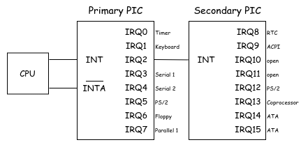
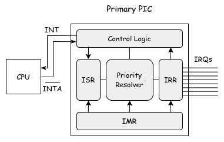

# PIC

本チャプターでは **PIC: Programmable Interrupt Controller** の初期化・設定をおこないます。
これにより、タイマーやキーボード等の外部デバイスから割り込みを受け取ることが可能になります。

## Table of Contents

<!-- toc -->

## Intel 8259 PIC

本シリーズで扱う PIC は **Intel 8259A** です。
最近の Intel CPU では 8259A 相当コントローラのが2つ搭載されているそうです。
それぞれ *Master PIC* と *Slave PIC* と呼ばれます。
本シリーズでは **Primary PIC** と **Secondary PIC** と呼びます。
それぞれが **Interrupt Requested Line (IRQ)** と呼ばれる入力線を8つずつ持ち、Secondary は Primary に対してカスケード接続されています。
なお、最近の CPU では 8259 PIC の代わりに **APIC: Advanced Programmable Interrupt Controller** が広く使われています。
PIC はチップとして搭載されることはほぼなくなったものの、8259A 相当の機能は southbridge が依然として提供してくれているようです。


*Functional Overview of 8259A PIC*

各PICの内部は以下の概念図のようになっています:


*Functional Overview of the Internal Structure of 8259A PIC*

### IRR

**IRR: Interrupt Request Register** は PIC が受け取った割り込み要求を保持するレジスタです。
IRR が何らかの割り込み要求を保持している場合、PIC は CPU に対して **INT** 信号を送信し割り込みを要求します。
IRR は常に CPU から read 可能です。

### ISR

**ISR: In-Service Register** は CPU によって処理が受け付けられた割り込み要求を保持するレジスタです。
CPU が割り込み要求を受理した場合、\\( \overline{INTA} \\) 信号を PIC に送ります[^inta]。
この信号を受け取ると、Priority Resolver は IRR の中から最も優先度の高い割り込み要求を選びます。
選んだ IRQ を ISR の対応するビットにセットし、IRR から対応するビットをクリアします。
優先度は IRQ0 が最も高く、IRQ7 が最も低いです。
なお ISR にビットがセットされると、それ以下の優先度の IRQ は自動的にマスクされます。
ISR は常に CPU から read 可能です。

### IMR

**IMR: Interrupt Mask Register** は PIC が受け取った割り込み要求をマスクするためのレジスタです。
IMR でセットされたビットに対応する IRR のビットは無視されます。

## Command Words

8259A PIC は **CW: Command Words** という命令[^cw]を CPU から受け付けます。
CW には **ICW: Initialization Command Words** と **OCW: Operation Command Words** の2つがあります。
ICW は PIC を初期化するためのコマンドであり、OCW は初期化後に PIC を操作するためのコマンドです。
どちらも 1byte のデータを PIC に送信することで実行されます。
以降は CW に送信する 1byte のうち、N-th bit を `D[N]` と表記します。

### ICW

ICW は PIC を初期化するためのコマンドです。
一度初期化シーケンスに入ると、続く CW は ICW として解釈されます。
以下の 4 つのコマンドシーケンスからなり、それぞれが設定項目を決定します。
一応(ほぼ)全ての設定項目を書いていますが、Ymir で利用するのはごく一部です。

#### ICW1

PIC を初期化モードにする。`D[4]` が `1` の場合、ICW1として解釈される。
以下の設定をする:

- ICW4 が必要かどうか
- シングルモードかカスケードモードか (PICが1つか2つか)
- レベルトリガかエッジトリガか

#### ICW2

ICW1 に続く CW は ICW2 として解釈される。
CPU に通知される割り込み番号と IRQ のオフセットを設定する。
ここに `0x20` を設定した場合、IRQ1 は割り込みベクタ `0x21` として処理される。

#### ICW3

ICW2 に続く CW は ICW3 として解釈される。
Primay PIC に対して送信する場合は、各 IRQ が Secondary にカスケードされているかどうかをビットマップで設定する。
Secondary PIC に対して送信する場合は、カスケードされている Primary PIC の *Cascade ID* を設定する。

#### ICW4

ICW3 に続く CW は ICW4 として解釈される。
以下の設定をする:

- モード: 8086/8088 モードか MCS-80/85 モードか
- EOI: Auto-EOI か Normal EOI か
- バッファリングモード
- ネストモード

### OCW

PIC の初期化後に PIC の状態を設定したりするコマンドを発行します。

#### OCW1

IMR を設定する。
IMR の各ビットは対応する IRQ をマスクする。

#### OCW2

以下のコマンドを実行する:

- EOI: 後述
- Rotate: 優先度回転する。低い優先度の IRQ から処理されるようにする。
- Set: 優先度の設定をする。

#### OCW3

基本的には IRR/ISR の値を読み出すために使われる。

## PIC の初期化

以上の知識を踏まえて、PIC を初期化していきます。
x64 では Primary PIC と Secondary PIC のそれぞれに対して Command Port と Data Port が用意されています[^port]。
各 I/O ポートは以下のとおりです:

```ymir/arch/x86/pic.zig
const primary_command_port: u16 = 0x20;
const primary_data_port: u16 = primary_command_port + 1;
const secondary_command_port: u16 = 0xA0;
const secondary_data_port: u16 = secondary_command_port + 1;
```

まずは ICW を定義します:

```ymir/arch/x86/pic.zig
const icw = enum { icw1, icw2, icw3, icw4 };
const Icw = union(icw) {
    icw1: Icw1,
    icw2: Icw2,
    icw3: Icw3,
    icw4: Icw4,

    const Icw1 = packed struct(u8) {
        /// ICW4 is needed.
        icw4: bool = true,
        /// Sigle or cascade mode.
        single: bool = false,
        /// CALL address interval 4 or 8.
        interval4: bool = false,
        /// Level triggered or edge triggered.
        level: bool = false,
        /// Initialization command.
        _icw1: u1 = 1,
        /// Unused in 8085 mode.
        _unused: u3 = 0,
    };
    const Icw2 = packed struct(u8) {
        /// Vector offset.
        offset: u8,
    };
    const Icw3 = packed struct(u8) {
        /// For primary PIC, IRQ that is cascaded.
        /// For secondary PIC, cascade identity.
        cascade_id: u8,
    };
    const Icw4 = packed struct(u8) {
        /// 8086/8088 mode or MCS-80/85 mode.
        mode_8086: bool = true,
        /// Auto EOI or normal EOI.
        auto_eoi: bool = false,
        /// Buffered mode.
        buf: u2 = 0,
        /// Special fully nested mode.
        full_nested: bool = false,
        /// ReservedZ.
        _reserved: u3 = 0,
    };
};
```

`Icw` は [Tagged Union](https://ziglang.org/documentation/master/#Tagged-union) です。
C の共用体のように、`union` は active なフィールドを常に1つ持ちます。
もしも active でないフィールドに対してアクセスした場合には、`Debug`ビルドならランタイムエラーに、それ以外なら UD になります。

同様に OCW も定義します:

```ymir/arch/x86/pic.zig
const ocw = enum { ocw1, ocw2, ocw3 };
const Ocw = union(ocw) {
    ocw1: Ocw1,
    ocw2: Ocw2,
    ocw3: Ocw3,

    const Ocw1 = packed struct(u8) {
        /// Interrupt mask.
        imr: u8,
    };
    const Ocw2 = packed struct(u8) {
        /// Target IRQ.
        level: u3 = 0,
        /// ReservedZ.
        _reserved: u2 = 0,
        /// EOI
        eoi: bool,
        /// If set, specific EOI.
        sl: bool,
        /// Rotate priority.
        rotate: bool = false,
    };
    const Ocw3 = packed struct(u8) {
        /// Target register to read.
        ris: Reg,
        /// Read register command.
        read: bool,
        /// Unused in Ymir.
        _unused1: u1 = 0,
        /// Reserved 01.
        _reserved1: u2 = 0b01,
        /// Unused in Ymir.
        _unused2: u2 = 0,
        /// ReservedZ.
        _reserved2: u1 = 0,

        const Reg = enum(u1) { irr = 0, isr = 1 };
    };
};
```

なお ICW でも OCW でも、ハードウェア的に固定値であるフィールドや Ymir で使わないフィールドはデフォルト値を設定しています。

続いて、これらの CW を PIC に対して発行するためのヘルパー関数を定義します:

```ymir/arch/x86/pic.zig
fn issue(cw: anytype, port: u16) void {
    const T = @TypeOf(cw);
    if (T != Icw and T != Ocw) {
        @compileError("Unsupported type for pic.issue()");
    }
    switch (cw) {
        inline else => |s| am.outb(@bitCast(s), port),
    }
    am.relax();
}

pub fn relax() void {
    asm volatile ("rep; nop");
}
```

`issue()` は `Icw` か `Ocw` のみを受け付けることを保証します。
`union` に対する `switch` は、active なフィールドに応じて処理を変更させることができます。
今回はどのフィールドに対しても同様に `@bitCast()` して [OUTB](https://www.felixcloutier.com/x86/out) 命令を実行したいです。
そのため、`inline else` によって無条件に `union` の中身のフィールドを取り出しています。

この関数を使うと、PIC の初期化関数は簡単に書けます:

```ymir/arch/x86/pic.zig
pub const primary_vector_offset: usize = 32;
pub const secondary_vector_offset: usize = primary_vector_offset + 8;

pub fn init() void {
    am.cli();
    defer am.sti();

    // Start initialization sequence.
    issue(Icw{ .icw1 = .{} }, primary_command_port);
    issue(Icw{ .icw1 = .{} }, secondary_command_port);

    // Set the vector offsets.
    issue(Icw{ .icw2 = .{ .offset = primary_vector_offset } }, primary_data_port);
    issue(Icw{ .icw2 = .{ .offset = secondary_vector_offset } }, secondary_data_port);

    // Tell primary PIC that there is a slave PIC at IRQ2.
    issue(Icw{ .icw3 = .{ .cascade_id = 0b100 } }, primary_data_port);
    // Tell secondary PIC its cascade identity.
    issue(Icw{ .icw3 = .{ .cascade_id = 2 } }, secondary_data_port);

    // Set the mode.
    issue(Icw{ .icw4 = .{} }, primary_data_port);
    issue(Icw{ .icw4 = .{} }, secondary_data_port);

    // Mask all IRQ lines.
    setImr(0xFF, primary_data_port);
    setImr(0xFF, secondary_data_port);
}

fn setImr(imr: u8, port: u16) void {
    issue(Ocw{ .ocw1 = .{ .imr = imr } }, port);
}
```

今のところ IRQ 用の割り込みハンドラを用意していないため、IRQ から割り込みが発生すると割り込みハンドラとして`unhandledHandler()` が呼び出されてしまいます。
これを避けるため、まず最初に割り込みを無効化しておきます。
無効化した割り込みは `init()` から戻るときに再び有効化したいです。
このような RAII パターンは、Zig では [defer](https://ziglang.org/documentation/master/#defer) を使うことで実現できます。

コマンドは先ほど定義した `Icw` のうちデフォルト値がセットされていないものを設定しながら使っています。
ICW1 では ICW4 が必要であることを示しています。
ICW2 では IRQ と割り込みベクタのオフセットを設定しています。これについては後述します。
ICW3 では Primary/Secondary PIC の接続関係を設定しています。
8259A では IRQ2 に Secondary PIC が接続されているため、Primary PIC には `0b100 == 4` を指定しています。
ICW4 では Normal EOI を指定しています。EOI についても後述します。

### Vector Offset

IRQ-N は、デフォルトで N 番目の割り込みベクタを発生させます。
Real Mode においてはこれで問題ないのですが、Protected Mode においてはベクタの `0` から `31` までは Intel が予約しています。
見事に衝突していますね。IBM さんやってしまいました。

仕方がないので、Linux を含むほとんどの OS は IRQ からの割り込みベクタを他のベクタに **リマップ** しています。
Ymir では、Primary PIC と Secondary PIC に対してそれぞれ `32` と `40` をオフセットとして設定しています。
これにより、IRQ-N は `32 + N` 番目の割り込みベクタを発生させるようになります。
このオフセットの指定は ICW2 によって行います。

### EOI

**EOI: End of Interrupt** は PIC に対してさらなる割り込みの送信を許可するための通知です。
EOI には以下の2つのモードがあり、ICW4 で設定することができます:

- **Automatic EOI**: PIC が CPU に対して割り込みを通知し、CPU から最後の \\( \overline{INTA} \\) 信号を受け取ると自動的に EOI を受理したものとします。
- **Normal EOI**: CPU が明示的に EOI コマンドを送信します。

Ymir では Normal EOI を採用します。
Normal EOI では、通知の種類が2つあります:

- **Specific EOI**: 特定の IRQ に対して EOI を送信します。
- **Non-Specific EOI**: IRQ 番号を指定せず、最も優先度の高い IRQ が自動的に選択されます。

Ymir では Specific EOI を採用します。
Specific EOI は OCW2 によって送信されます。
この際、3bit の `level` フィールドで IRQ 番号を指定します。
指定した IRQ は ISR からクリアされます。

処理中の割り込みが Secondary PIC に属する IRQ8~IRQ15 である場合、EOI は Primary PIC と Secondary PIC の両方に送信する必要はあります。
Primary PIC に対しては Secondary がカスケードされた IRQ2 に対して EOI を送信します。

## ヘルパーの実装

PIC の初期化はできました。
続いて、他のファイルから PIC を操作するためのヘルパー関数を実装します。

まずは IRQ に対応する `enum` を定義します:

```ymir/arch/x86/pic.zig
pub const IrqLine = enum(u8) {
    timer = 0,
    keyboard = 1,
    secondary = 2,
    serial2 = 3,
    serial1 = 4,
    parallel23 = 5,
    floppy = 6,
    parallel1 = 7,
    rtc = 8,
    acpi = 9,
    open1 = 10,
    open2 = 11,
    mouse = 12,
    cop = 13,
    primary_ata = 14,
    secondary_ata = 15,

    /// Return true if the IRQ belongs to the primary PIC.
    pub fn isPrimary(self: IrqLine) bool {
        return @intFromEnum(self) < 8;
    }

    /// Get the command port for this IRQ.
    pub inline fn commandPort(self: IrqLine) u16 {
        return if (self.isPrimary()) primary_command_port else secondary_command_port;
    }

    /// Get the data port for this IRQ.
    pub inline fn dataPort(self: IrqLine) u16 {
        return if (self.isPrimary()) primary_data_port else secondary_data_port;
    }

    /// Get the offset of the IRQ within the PIC.
    pub fn delta(self: IrqLine) u3 {
        return @intCast(if (self.isPrimary()) @intFromEnum(self) else (@intFromEnum(self) - 8));
    }
};
```

IRQ 番号を扱う際には、Primary と Secondary を合わせた連番 (`0`-`15`) ではなく、
各 PIC における連番 (`0`-`7`) として扱いたいことが多々あります。
`delta()` は、Primary に対してはそのままの値を返し、Secondary に対しては `8` を引いた値を返します。

`IrqLine` を指定して対応する IMR (マスク)を設定する関数を定義します:

```ymir/arch/x86/pic.zig
pub fn setMask(irq: IrqLine) void {
    const port = irq.dataPort();
    setImr(am.inb(port) | bits.tobit(u8, irq.delta()), port);
}

pub fn unsetMask(irq: IrqLine) void {
    const port = irq.dataPort();
    setImr(am.inb(port) & ~bits.tobit(u8, irq.delta()), port);
}
```

IMR は各 PIC がそれぞれ持っており、IRQ の `0-7` と `8-15` はそれぞれ分けて設定する必要があります。
先ほど用意したヘルパー関数を利用することで、Primary/Secondary 用のポート指定が簡単にできていますね。

最後に、指定した `IrqLine` に対して EOI を通知する関数を定義します:

```ymir/arch/x86/pic.zig
pub fn notifyEoi(irq: IrqLine) void {
    issue(
        Ocw{ .ocw2 = .{ .eoi = true, .sl = true, .level = irq.delta() } },
        irq.commandPort(),
    );
    if (!irq.isPrimary()) {
        issue(
            Ocw{ .ocw2 = .{ .eoi = true, .sl = true, .level = 2 } },
            primary_command_port,
        );
    }
}
```

前述したように Secondary に対する EOI は Primary/Secondary の両方に送信する必要があります。
よって、先ほど用意した `isPrimary()` を使って分岐しています。

## アウトロ

`kernelMain()` から PIC の初期化を実行しましょう (`arch.zig` において `pic.zig` を export するのを忘れずに):

```ymir/main.zig
arch.pic.init();
log.info("Initialized PIC.", .{});
```

これで PIC の初期化が完了しました。
まぁ、実行したところで前回までと何も変わりません。
なにせ、まだ全ての IRQ は IMR でマスクされています。
どんな IRQ も割り込みを発生させません。
今はまだ割り込みハンドラを用意していないため、これでOKです。
このままだと PIC が正しく設定されているかどうかもわからないため、次のチャプターではタイマー割り込みを有効化してみましょう。

## References

- [8259A PROGRAMMABLE INTERRUPT CONTROLLER (8259A/8259A-2) - Intel](https://pdos.csail.mit.edu/6.828/2014/readings/hardware/8259A.pdf)
- [8259 PIC - OSDev Wiki](https://wiki.osdev.org/8259_PIC)
- [パソコンのレガシィI/O活用大全 - 桑野 雅彦](https://www.cqpub.co.jp/column/books/2001a/34331pc_legacy/default.htm)

[^inta]: 実際には、CPU が割り込みを受理して \\( \overline{INTA} \\) 信号を送信し ISR がセットされたあと、CPU は追加で \\( \overline{INTA} \\) 信号を送信してきます。
これにより、PIC は処理対象にした割り込みのベクタ番号を **Data Bus Buffer** と呼ばれるバッファにセットします。
Auto-EOI が有効な場合、この時点で ISR がクリアされます。
[^cw]: Command Words は命令というよりレジスタと解釈してもいいかもしれません。
ただし通常の I/O mapped register とは異なり、同じI/Oポートに書き込んでも状況によってどの CW に書き込むかどうかが変わることに注意してください。
[^port]: Command Port 経由で送信すると \\( A_0 \\) が `0` に、Data Port 経由で送信すると `1` になるようです。
