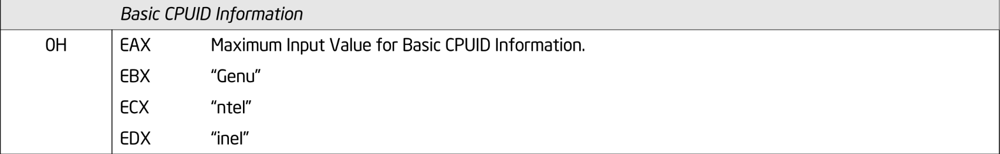
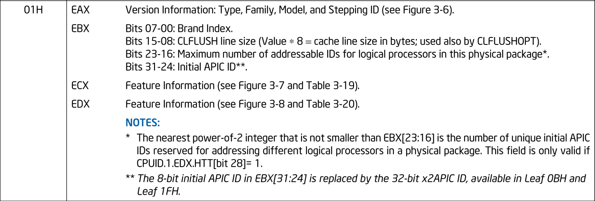
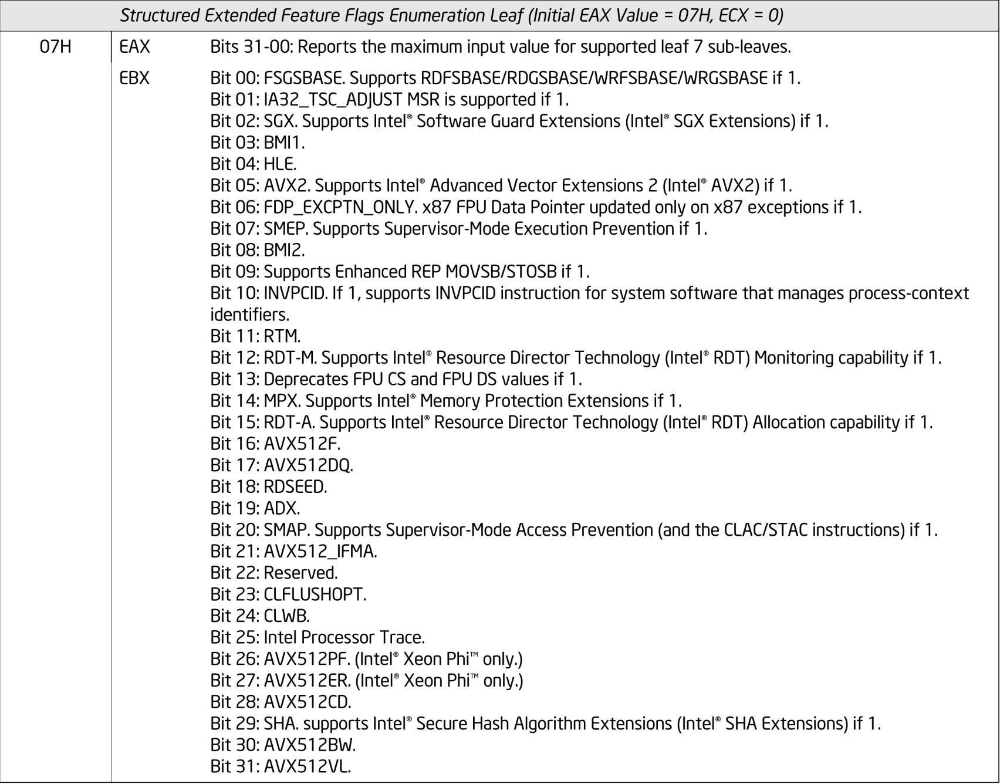
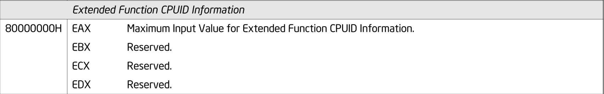

# CPUID の仮想化

前チャプターではゲスト Linux の起動処理を開始することに成功し、CPUID が原因で VM Exit するところまで確認しました。
本チャプターでは、ゲストの CPUID 命令に対して適切な値を見せることで CPUID を仮想化します。

> [!IMPORTANT]
>
> 本チャプターの最終コードは [`whiz-vmm-cpuid`](https://github.com/smallkirby/ymir/tree/whiz-vmm-cpuid) ブランチにあります。

## Table of Contents

<!-- toc -->

## VM Exit ハンドラ

ゲストが [CPUID](https://www.felixcloutier.com/x86/cpuid) 命令を実行しようとすると、無条件で VM Exit が発生します。
この際、VMCS **Basic VM-Exit Information** カテゴリの **Basic Reason** フィールドに `0x0A`(`.cpuid`) が設定されます。
VM Exit ハンドラである `handleExit()` において、CPUID を原因とする VM Exit に対してハンドラを呼び出すようにします:

<!-- i18n:skip -->
```ymir/arch/x86/vmx/vcpu.zig
const cpuid = @import("cpuid.zig");

fn handleExit(self: *Self, exit_info: vmx.ExitInfo) VmxError!void {
    switch (exit_info.basic_reason) {
        .cpuid => {
            try cpuid.handleCpuidExit(self);
            try self.stepNextInst();
        },
        ...
    }
    ...
}
```

`cpuid.handleCpuidExit()` は CPUID 命令に対する専用のハンドラであり、要求された CPUID Leaf に応じて適切な値をゲストレジスタに設定します。

`Vcpu.stepNextInst()` はゲストの RIP をインクリメントし、次の命令を指すようにします。
x64 は [CISC](https://en.wikipedia.org/wiki/Complex_instruction_set_computer) であり、命令の長さが固定ではなく可変になっています。
そのため、RIP をインクリメントするには現在 RIP が指している命令の長さを知る必要があります。
幸いなことに、VMCS VM-Exit Information には **Exit Instruction Length** フィールドが存在し、
VM Exit を発生させた命令の長さを取得することができます。
わざわざ自分で x64 命令セットのデコーダを書く必要がないのは非常に助かります。
`stepNextInst()` ではこのフィールドの値を読み取って、RIP に加算することで次の命令を指すようにします:

<!-- i18n:skip -->
```ymir/arch/x86/vmx/vcpu.zig
fn stepNextInst(_: *Self) VmxError!void {
    const rip = try vmread(vmcs.guest.rip);
    try vmwrite(vmcs.guest.rip, rip + try vmread(vmcs.ro.exit_inst_len));
}
```

## CPUID ハンドラ

`cpuid.handleCpuidExit()` は CPUID 命令に対するハンドラです。
その雛形は以下のようになります:

<!-- i18n:skip -->
```ymir/arch/x86/vmx/cpuid.zig
const cpuid = arch.cpuid;
const Leaf = cpuid.Leaf;

pub fn handleCpuidExit(vcpu: *Vcpu) VmxError!void {
    const regs = &vcpu.guest_regs;
    switch (Leaf.from(regs.rax)) {
        ...
    }
}
```

CPUID は RAX レジスタで **Leaf** を指定することができます。
Leaf によっては RCX レジスタで **Subleaf** を指定することができるものもあります。
Leaf と Subleaf の組み合わせによって取得したい情報を指定します。
`Leaf` enum は [VMX Root Operation のチャプター](./vmx_root.md#cpuid) で定義した `enum` であり、CPUID の Laaf と関連する操作を提供します。
`handleCpuidExit()` では、ゲストのレジスタから要求される CPUID Leaf を取得し、それに応じた処理を `switch` で行います。

CPUID の Leaf の数は非常に多いです。
また、CPU 世代によってサポートされる Leaf が異なり、今後も増えていきます。
よって、この `switch` で全ての Leaf をサポートすることはできません。
Ymir では、明示的にサポートする CPUID Leaf 以外は未サポートとということにします。
未サポートの Leaf に対する CPUID 命令は、RAX/RBX/RCX/RDX レジスタの全てに `0` をセットするという仕様になっています:

<!-- i18n:skip -->
```ymir/arch/x86/vmx/cpuid.zig
fn invalid(vcpu: *Vcpu) void {
    const gregs = &vcpu.guest_regs;
    setValue(&gregs.rax, 0);
    setValue(&gregs.rbx, 0);
    setValue(&gregs.rcx, 0);
    setValue(&gregs.rdx, 0);
}

inline fn setValue(reg: *u64, val: u64) void {
    @as(*u32, @ptrCast(reg)).* = @as(u32, @truncate(val));
}
```

`Leaf` enum はそもそも全 Leaf を定義してるわけではなく、*Non-Exhaustive Enum* として定義されていました:

<!-- i18n:skip -->
```ymir/arch/x86/cpuid.zig
pub const Leaf = enum(u32) {
    ...
    _,
    ...
};
```

Non-Exhaustive Enum は、`switch` において定義されていないフィールド(`_`)全てを `_ =>` で捕捉することができます[^non-exhaustive]。
ひとまず個別の `Leaf` の対応を書く前に、全てのフィールドに対して `invalid()` を呼び出すようにします:

<!-- i18n:skip -->
```ymir/arch/x86/vmx/cpuid.zig
switch (Leaf.from(regs.rax)) {
    _ => {
        log.warn("Unhandled CPUID: Leaf=0x{X:0>8}, Sub=0x{X:0>8}", .{ regs.rax, regs.rcx });
        invalid(vcpu);
    },
}
```

すべてのスイッチ プロングが実装されるまで、これはコンパイルされないことに注意してください。

## Leaf ごとの対応

Leaf ごとにゲストに見せたい値を定義していきます。
Ymir では必要最低限の Leaf のみをサポートします。
CPU がサポートする全ての Leaf の説明については、*SDM Vol.2A 3.3 CPUID - CPU Identification* を参照してください。

### 0x0: Basic CPUID Information


*Information Returned by CPUID Instruction: Leaf 0x0. SDM Vol.2A Table 3-17.*

Leaf `0x0` は CPU がサポートする最大の Leaf 番号と、**CPU Vendor ID** を返します。
サポートする最大の Leaf は、おそらく `0x20` になると思います。
ただし、CPUID は Extended Function と呼ばれる `0x8000_0000` 以降の Leaf もサポートしている場合があります。
Leaf `0x0` で返される値は Extended Function を除いた最大の Leaf 番号となります。

CPU Vendor ID は、CPU の製造元を示す 12byte の文字列です。
Intel CPU では `"GenuineIntel"` となっています。
Linux KVM はこの値を `"KVMKVMKVM"` としています。
KVM 上で動作するゲストはこの Vendor ID から KVM 上で動作していることを検知し、可能であれば paravirtualization を利用することができます。
Ymir では KVM にならい Vendor ID を `"YmirYmirYmir"` として返すことにします。
もちろん Ymir に対応したゲストOSなんてものは存在しないので、この値を見てもゲストは何もできませんけどね!:

<!-- i18n:skip -->
```ymir/arch/x86/vmx/cpuid.zig
    .maximum_input => {
        setValue(&regs.rax, 0x20); // Maximum input value for basic CPUID.
        setValue(&regs.rbx, 0x72_69_6D_59); // Ymir
        setValue(&regs.rcx, 0x72_69_6D_59); // Ymir
        setValue(&regs.rdx, 0x72_69_6D_59); // Ymir
    },
```

### 0x1: Feature Information


*Information Returned by CPUID Instruction: Leaf 0x1. SDM Vol.2A Table 3-17.*

Leaf `0x1` は CPU のバージョンとサポートする機能に関する情報を返します。
バージョン情報は、Vendor ID がゲストが知らない値である以上何の意味も持ちません。
ここではとりあえずホストの CPU が返すバージョン情報をそのまま返すことにします:

<!-- i18n:skip -->
```ymir/arch/x86/vmx/cpuid.zig
    .version_info => {
        const orig = Leaf.query(.version_info, null);
        setValue(&regs.rax, orig.eax); // Version information.
        setValue(&regs.rbx, orig.ebx); // Brand index / CLFLUSH line size / Addressable IDs / Initial APIC ID
        setValue(&regs.rcx, @as(u32, @bitCast(feature_info_ecx)));
        setValue(&regs.rdx, @as(u32, @bitCast(feature_info_edx)));
    },
```

ECX/EDX に格納される Feature Information は、CPU がサポートする機能をビットフィールドで表します。
Feature Information の定義は以下のようになっていますが、長いので折りたたみで表示しておきます。
気になる人は展開してみてください:

<details>
<summary>Feature Information の定義</summary>

<!-- i18n:skip -->
```ymir/arch/x86/cpuid.zig
pub const FeatureInfoEcx = packed struct(u32) {
    /// Streaming SIMD Extensions 3 (SSE3).
    sse3: bool = false,
    /// PCLMULQDQ.
    pclmulqdq: bool = false,
    /// 64-bit DS Area.
    dtes64: bool = false,
    /// MONITOR/MWAIT.
    monitor: bool = false,
    // CPL Qualified Debug Store.
    ds_cpl: bool = false,
    /// Virtual Machine Extensions.
    vmx: bool = false,
    /// Safer Mode Extensions.
    smx: bool = false,
    /// Enhanced Intel SpeedStep Technology.
    eist: bool = false,
    /// Thermal Monitor 2.
    tm2: bool = false,
    /// SSSE3 extensions.
    ssse3: bool = false,
    /// L1 context ID.
    cnxt_id: bool = false,
    /// IA32_DEBUG_INTERFACE.
    sdbg: bool = false,
    /// FMA extesions using YMM state.
    fma: bool = false,
    /// CMPXCHG16B available.
    cmpxchg16b: bool = false,
    /// xTPR update control.
    xtpr: bool = false,
    /// Perfmon and Debug Capability.
    pdcm: bool = false,
    /// Reserved.
    _reserved_0: bool = false,
    /// Process-context identifiers.
    pcid: bool = false,
    /// Ability to prevent data from memory mapped devices.
    dca: bool = false,
    /// SSE4.1 extensions.
    sse4_1: bool = false,
    /// SSE4.2 extensions.
    sse4_2: bool = false,
    /// x2APIC support.
    x2apic: bool = false,
    /// MOVBE instruction.
    movbe: bool = false,
    /// POPCNT instruction.
    popcnt: bool = false,
    /// Local APIC timer supports one-shot operation using TSC deadline.
    tsc_deadline: bool = false,
    /// AES instruction.
    aesni: bool = false,
    /// XSAVE/XRSTOR states.
    xsave: bool = false,
    /// OS has enabled XSETBV/XGETBV instructions to access XCR0.
    osxsave: bool = false,
    /// AVX.
    avx: bool = false,
    /// 16-bit floating-point conversion instructions.
    f16c: bool = false,
    /// RDRAND instruction.
    rdrand: bool = false,
    /// Not used.
    hypervisor: bool = false,
};

pub const FeatureInfoEdx = packed struct(u32) {
    /// x87 FPU.
    fpu: bool = false,
    /// Virtual 8086 mode enhancements.
    vme: bool = false,
    /// Debugging extensions.
    de: bool = false,
    /// Page Size Extension.
    pse: bool = false,
    /// Time Stamp Counter.
    tsc: bool = false,
    /// RDMSR and WRMSR instructions.
    msr: bool = false,
    /// Physical Address Extension.
    pae: bool = false,
    /// Machine Check Exception.
    mce: bool = false,
    /// CMPXCHG8B instruction.
    cx8: bool = false,
    /// APIC on-chip.
    apic: bool = false,
    /// Reserved.
    _reserved_0: bool = false,
    /// SYSENTER/SYSEXIT instructions.
    sep: bool = false,
    /// Memory Type Range Registers.
    mtrr: bool = false,
    /// Page Global Bit.
    pge: bool = false,
    /// Machine check architecture.
    mca: bool = false,
    /// Conditional move instructions.
    cmov: bool = false,
    /// Page attribute table.
    pat: bool = false,
    /// 36-bit Page Size Extension.
    pse36: bool = false,
    /// Processor serial number.
    psn: bool = false,
    /// CLFLUSH instruction.
    clfsh: bool = false,
    /// Reserved.
    _reserved_1: bool = false,
    /// Debug store.
    ds: bool = false,
    /// Thermal monitor and software controlled clock facilities.
    acpi: bool = false,
    /// Intel MMX Technology.
    mmx: bool = false,
    /// FXSAVE and FXRSTOR instructions.
    fxsr: bool = false,
    /// SSE extensions.
    sse: bool = false,
    /// SSE2 extensions.
    sse2: bool = false,
    /// Self snoop.
    ss: bool = false,
    /// Max APIC IDs reserved field.
    htt: bool = false,
    /// Thermal monitor.
    tm: bool = false,
    /// Reserved.
    _reserved_2: bool = false,
    /// Pending Break Enable.
    pbe: bool = false,
};
```

</details>

x64 は [`verify_cpu()` において必須の機能がサポートされているかどうかを確認](https://github.com/torvalds/linux/blob/de2f378f2b771b39594c04695feee86476743a69/arch/x86/include/asm/required-features.h#L76) し、
サポートされていない場合には初期化処理を中止してしまいます:

<!-- i18n:skip -->
```required-features.h
#define REQUIRED_MASK0	(NEED_FPU|NEED_PSE|NEED_MSR|NEED_PAE|\
			 NEED_CX8|NEED_PGE|NEED_FXSR|NEED_CMOV|\
			 NEED_XMM|NEED_XMM2)
```

Ymir ではこれらの必須機能を含む以下の機能をサポートすることにします:

- PCID
- FPU / SSE / SSE2
- Page Size Extension
- [RDMSR](https://www.felixcloutier.com/x86/rdmsr) / [WRMSR](https://www.felixcloutier.com/x86/wrmsr) 命令
- [SYSENTER](https://www.felixcloutier.com/x86/sysenter) / [SYSEXIT](https://www.felixcloutier.com/x86/sysexit) 命令
- ページテーブルにおける Global ビット
- [FXSAVE](https://www.felixcloutier.com/x86/fxsave) / [FXRSTOR](https://www.felixcloutier.com/x86/fxrstor) 命令

逆に以下の機能は明示的に無効化します:

- ACPI: Ymir では一切サポートしません

<!-- i18n:skip -->
```ymir/arch/x86/vmx/cpuid.zig
const feature_info_ecx = cpuid.FeatureInfoEcx{
    .pcid = true,
};
const feature_info_edx = cpuid.FeatureInfoEdx{
    .fpu = true,
    .vme = true,
    .de = true,
    .pse = true,
    .msr = true,
    .pae = true,
    .cx8 = true,
    .sep = true,
    .pge = true,
    .cmov = true,
    .pse36 = true,
    .acpi = false,
    .fxsr = true,
    .sse = true,
    .sse2 = true,
};
```

> [!WARN] Linux における PCID の無効化
> 最近の Intel Core CPU であれば、PCID はサポートされているはずです。
> しかしながら、Alder Lake (12th Gen) 以降の CPU では、INVLPG 命令でグローバルページがフラッシュされないというバグがあります。
> これに対処するため、Linux 6.4 移行のカーネルでは PCID を無効化するパッチ[^pcid-disable]が適用されています。
> お使いのカーネルおよびCPUがこれに該当する場合、上記の `pcid` を `false` にしてゲストでも PCID を無効化してください。

### 0x6: Thermal and Power Management

Ymir では Thermal and Power Management には一切対応しません:

<!-- i18n:skip -->
```ymir/arch/x86/vmx/cpuid.zig
    .thermal_power => invalid(vcpu),
```

### 0x7: Extended Feature Flags Enumeration


*Information Returned by CPUID Instruction: Leaf 0x7. SDM Vol.2A Table 3-17.*

Leaf `0x7` も Feature Information と同様に CPU の機能に関する情報を返します。
ただし、Leaf `0x7` には Subleaf が存在します。
サポートされる Subleaf の個数は、Subleaf 0 で RAX によって返される値によって決まります。
Ymir では Subleaf 0 のみをサポートしたかったのですが、サポートする Subleaf の最大値を `0` として指定した場合でも
Linux は Subleaf 1 以降の情報を取得しようとします。
そのため、Subleaf 1,2 に関しては呼び出しを許容するものの、 `invalid()` を返すことにします。
Subleaf 3 以降の呼び出しはエラーにします:

<!-- i18n:skip -->
```ymir/arch/x86/vmx/cpuid.zig
    .ext_feature => {
        switch (regs.rcx) {
            0 => {
                setValue(&regs.rax, 1); // Maximum input value for supported leaf 7 sub-leaves.
                setValue(&regs.rbx, @as(u32, @bitCast(ext_feature0_ebx)));
                setValue(&regs.rcx, 0); // Unimplemented.
                setValue(&regs.rdx, 0); // Unimplemented.
            },
            1, 2 => invalid(vcpu),
            else => {
                log.err("Unhandled CPUID: Leaf=0x{X:0>8}, Sub=0x{X:0>8}", .{ regs.rax, regs.rcx });
                vcpu.abort();
            },
        }
    },
```

EDX に格納される Feature Feature Flags は以下のようになっています。
やはり長いので折りたたみで表示しておきます:

<details>
<summary>Extended Feature Flags の定義</summary>

<!-- i18n:skip -->
```ymir/arch/x86/cpuid.zig
pub const ExtFeatureEbx0 = packed struct(u32) {
    fsgsbase: bool = false,
    tsc_adjust: bool = false,
    sgx: bool = false,
    bmi1: bool = false,
    hle: bool = false,
    avx2: bool = false,
    fdp: bool = false,
    smep: bool = false,
    bmi2: bool = false,
    erms: bool = false,
    invpcid: bool = false,
    rtm: bool = false,
    rdtm: bool = false,
    fpucsds: bool = false,
    mpx: bool = false,
    rdta: bool = false,
    avx512f: bool = false,
    avx512dq: bool = false,
    rdseed: bool = false,
    adx: bool = false,
    smap: bool = false,
    avx512ifma: bool = false,
    _reserved1: u1 = 0,
    clflushopt: bool = false,
    clwb: bool = false,
    pt: bool = false,
    avx512pf: bool = false,
    avx512er: bool = false,
    avx512cd: bool = false,
    sha: bool = false,
    avx512bw: bool = false,
    avx512vl: bool = false,
};
```

</details>

Ymir では以下の機能をサポートします:

- [RDFSBASE/RDGSBASE](https://www.felixcloutier.com/x86/rdfsbase:rdgsbase) / [WRFSBASE/WRGSBASE](https://www.felixcloutier.com/x86/wrfsbase:wrgsbase) 命令
- [SMEP](https://en.wikipedia.org/wiki/Control_register#SMEP)
- [SMAP](https://en.wikipedia.org/wiki/Supervisor_Mode_Access_Prevention)
- [INVPCID](https://www.felixcloutier.com/x86/invpcid)

<!-- i18n:skip -->
```ymir/arch/x86/vmx/cpuid.zig
const ext_feature0_ebx = cpuid.ExtFeatureEbx0{
    .fsgsbase = false,
    .smep = true,
    .invpcid = true,
    .smap = true,
};
```

### 0xD: Processor Extended State Enumeration

Leaf `0xD` は CPU の拡張機能に関する情報を返します。
この Leaf も Subleaf を持っています。
Subleaf 1 は [XSAVE](https://www.felixcloutier.com/x86/xsave) / [XRSTOR](https://www.felixcloutier.com/x86/xrstor) のサポートに関する情報を返します。
Ymir では Subleaf 1 のみ呼び出しを許可(実際には未実装)し、それ以外の呼び出しはエラーとします:

<!-- i18n:skip -->
```ymir/arch/x86/vmx/cpuid.zig
    .ext_enumeration => {
        switch (regs.rcx) {
            1 => invalid(vcpu),
            else => {
                log.err("Unhandled CPUID: Leaf=0x{X:0>8}, Sub=0x{X:0>8}", .{ regs.rax, regs.rcx });
                vcpu.abort();
            },
        }
    },
```

### 0x8000_0000: Extended Function Maximum Input


*Information Returned by CPUID Instruction: Leaf 0x8000_0000. SDM Vol.2A Table 3-17.*

Leaf `0x8000_0000` は CPU がサポートする最大の Extended Function Leaf 番号を返します。
Linux は [`verify_cpu()` においてこの値を取得し `0x8000_0001` 以上であることを要求する](https://github.com/torvalds/linux/blob/de2f378f2b771b39594c04695feee86476743a69/arch/x86/kernel/verify_cpu.S#L109) ため、
Ymir でもそこまでをサポートするようにします:

<!-- i18n:skip -->
```ymir/arch/x86/vmx/cpuid.zig
    .ext_func => {
        setValue(&regs.rax, 0x8000_0000 + 1); // Maximum input value for extended function CPUID.
        setValue(&regs.rbx, 0); // Reserved.
        setValue(&regs.rcx, 0); // Reserved.
        setValue(&regs.rdx, 0); // Reserved.
    },
```

### 0x8000_0001: Extended Function

Leaf `0x8000_0001` は syscall や Intel 64 などの拡張機能に関する情報を返します。
Ymir ではこの Leaf はホストの値をパススルーします:

<!-- i18n:skip -->
```ymir/arch/x86/vmx/cpuid.zig
    .ext_proc_signature => {
        const orig = Leaf.ext_proc_signature.query(null);
        setValue(&regs.rax, 0); // Extended processor signature and feature bits.
        setValue(&regs.rbx, 0); // Reserved.
        setValue(&regs.rcx, orig.ecx); // LAHF in 64-bit mode / LZCNT / PREFETCHW
        setValue(&regs.rdx, orig.edx); // SYSCALL / XD / 1GB large page / RDTSCP and IA32_TSC_AUX / Intel64
    },
```

## まとめ

以上で CPUID を原因とする VM Exit のハンドラは完成です。
結局のところ定義した CPUID Leaf はたったの7つだけです。
本シリーズでは、今後 Linux のブートが完了するまでの間これ以上の CPUID Leaf に対応する必要はありません。
この7つの Leaf の仮想化だけで Linux のブートをすることができます。

最後に、CPUID を仮想化した状態でゲストを実行してみましょう:

<!-- i18n:skip -->
```txt
[INFO ] main    | Entered VMX root operation.
[INFO ] vmx     | Guest memory region: 0x0000000000000000 - 0x0000000006400000
[INFO ] vmx     | Guest kernel code offset: 0x0000000000005000
[DEBUG] ept     | EPT Level4 Table @ FFFF88800000A000
[INFO ] vmx     | Guest memory is mapped: HVA=0xFFFF888000A00000 (size=0x6400000)
[INFO ] main    | Setup guest memory.
[INFO ] main    | Starting the virtual machine...
[ERROR] vcpu    | Unhandled VM-exit: reason=arch.x86.vmx.common.ExitReason.rdmsr
```

前回と違って CPUID による VM Exit ではなくなりました。
代わりに [RDMSR](https://www.felixcloutier.com/x86/rdmsr) による VM Exit が発生しています。
次チャプターでは RDMSR / WRMSR に対応するためのハンドラを実装します。
加えて、ゲストとホストの MSR を適切に保存・退避するように VMCS の設定をしていきます。

[^non-exhaustive]: Exhaustive Enum では `_` を使うことができない代わりに、明示的に捕捉したフィールド以外の全てのフィールドを `else` で捕捉することができます。
[^pcid-disable]: [https://git.kernel.org/pub/scm/linux/kernel/git/tip/tip.git/commit/?h=x86/urgent&id=ce0b15d11ad837fbacc5356941712218e38a0a83](https://git.kernel.org/pub/scm/linux/kernel/git/tip/tip.git/commit/?h=x86/urgent&id=ce0b15d11ad837fbacc5356941712218e38a0a83)
