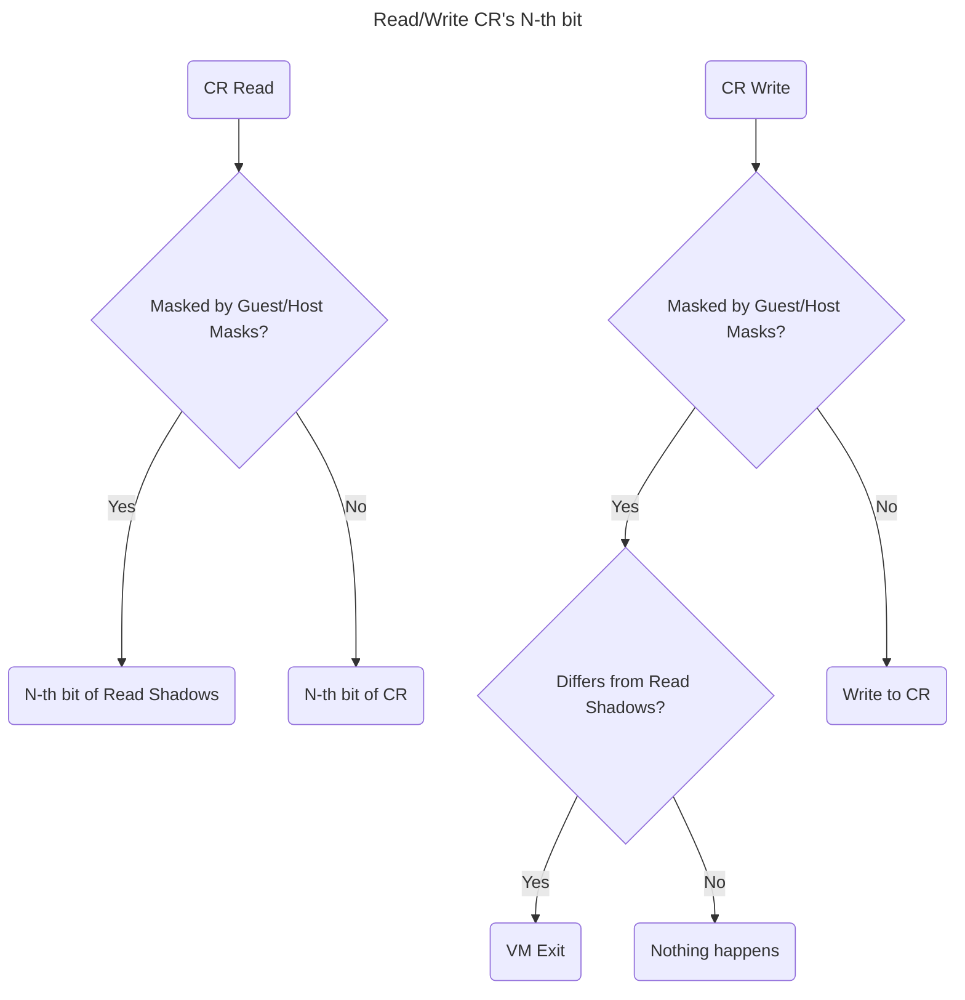
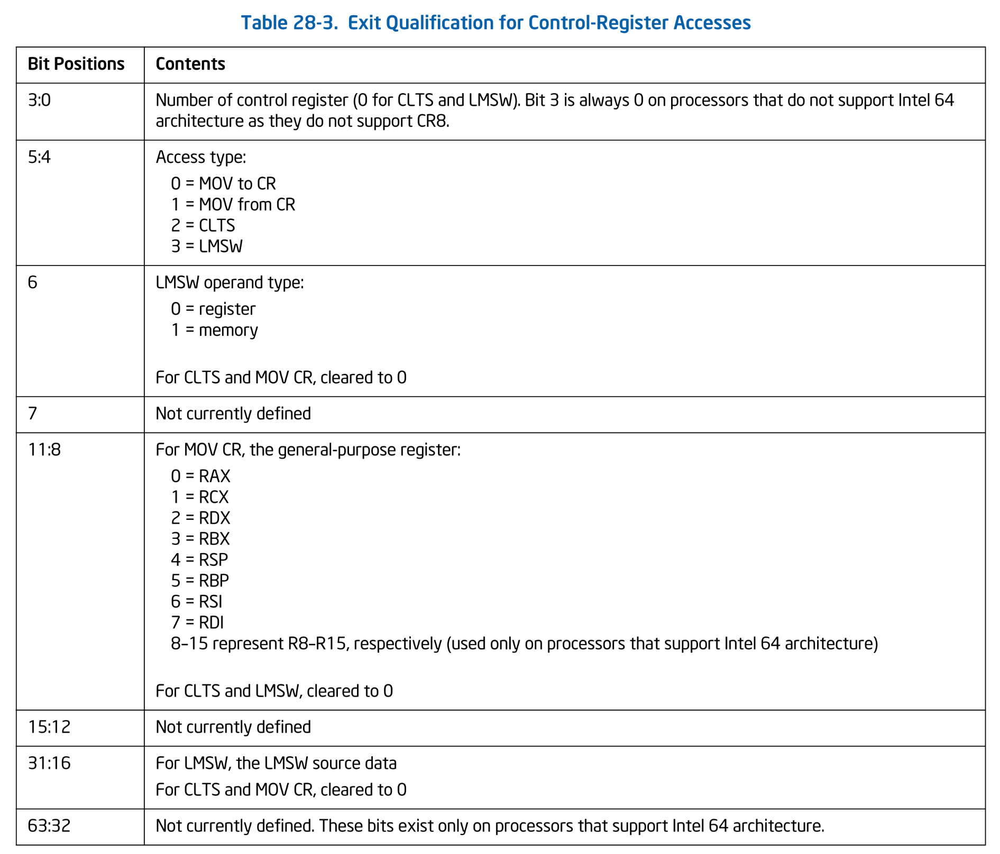

# Control Registers の仮想化

本チャプターでは Control Registers へのアクセスを仮想化します。
Control Registers は CPU の挙動を制御するための重要なレジスタであり、ゲストを動かす上で適切に扱う必要があります。
本チャプターでは CR からの読み込みと CR への書き込みの両方を仮想化し、他の VMCS フィールドとの整合性を保ちながらハンドリングしていきます。

> [!IMPORTANT]
>
> 本チャプターの最終コードは [`whiz-vmm-cr`](https://github.com/smallkirby/ymir/tree/whiz-vmm-cr) ブランチにあります。

## Table of Contents

<!-- toc -->

## CR Read Shadows / Masks

CR0 と CR4 に対するアクセスが VM Exit を発生させるかどうかは VMCS VM-Execution Controls の設定に依存します。
CR の特定のビットがゲストとホストのどちらの支配下にあるかどうかを決定するのが **Guest/Host Masks** です。
Guest/Host Masks は CR レジスタのサイズと同じサイズを持つビットフィールドであり、
Intel 64 アーキテクチャでは 64bit です。
Guest/Host Masks のあるビットが `1` であるとき、CR の対応するビットは **"ホストが所有"** します。
逆に Masks のビットが `0` であるとき、CR の対応するビットは **"ゲストが所有"** します。

ゲストが CR から read をするとき、そのビットがゲストが所有する場合には CR の値が直接 read されます。
同様に、ゲストが CR に write をするとき、そのビットがゲストが所有する場合には CR に直接値が書き込まれます。

ホストが所有するビットへのアクセスは、**Guest/Host Read Shadows** によって制御されます。
これも Intel 64 では 64bit のビットフィールドであり、CR の各ビットに対応します。
ゲストが CR から read をするとき、そのビットがホストが所有する場合には、Read Shadows の対応するビットが read されます。
ゲストが CR に write をするとき、**ホストが所有するビットに対して Read Shadows の対応するビットと異なる値を書き込もうとすると VM Exit が発生** します。

<!-- i18n:skip -->


Ymir では Guest/Host Masks のビットを全てセットします。
CR0 と CR4 のビットは全てホストが所有するということです:。

<!-- i18n:skip -->
```ymir/arch/x86/vmx/vcpu.zig
fn setupExecCtrls(vcpu: *Vcpu, allocator: Allocator) VmxError!void {
    ...
    try vmwrite(vmcs.ctrl.cr0_mask, std.math.maxInt(u64));
    try vmwrite(vmcs.ctrl.cr4_mask, std.math.maxInt(u64));
    ...
}
```

先ほどの図から分かるとおり、Masks がセットされているビットに対する read は Read Shadows の値が返されます。
今回は Masks の全てのビットをセットしているため、CR からの read は常に Read Shadows の値を返します。
よって、**Read Shadows は CR の実際の値に追従するようにする必要があります**。
追従するロジックはのちほど VM Exit ハンドラで書くとして、とりあえず初期状態には CR0 / CR4 の値をそのまま代入しておきます:

<!-- i18n:skip -->
```ymir/arch/x86/vmx/vcpu.zig
fn setupGuestState(vcpu: *Vcpu) VmxError!void {
    ...
    try vmwrite(vmcs.ctrl.cr0_read_shadow, cr0);
    try vmwrite(vmcs.ctrl.cr4_read_shadow, cr4);
    ...
}
```

## Exit Qualification

Host/Guest Masks が全てセットされているため、ゲストが Read Shadows と異なる値を CR0/CR4 に書き込もうとすると VM Exit が発生します。
この際、どのレジスタに対してどのような値を書き込もうとしたのかという追加情報が VMCS **Exit Qualification** に格納されます。
Exit Qualification は全ての VM Exit に対して提供されるわけではなく、CR Access を含む一部の VM Exit に対してのみ提供されます。
Qualification が提供される他の Exit Reasonには、I/O Access や EPT Violation などがあります。

Exit Qualification は 64bit のデータであり、その意味は Exit Reason によって異なります。
CR Access に対する Exit Qualification は以下のフォーマットを持ちます:


*Exit Qualification for Control-Register Accesses. SDM Vol.3C Table 28-3.*

Exit Qualification は CR Access 以外にも今後追加していく予定のため、`qual` 空間を用意してそこに追加していくことにします。
第1号として、CR Access 用の Exit Qualification を追加します:

<!-- i18n:skip -->
```ymir/arch/x86/vmx/common.zig
pub const qual = struct {
    pub const QualCr = packed struct(u64) {
        index: u4,
        access_type: AccessType,
        lmsw_type: LmswOperandType,
        _reserved1: u1,
        reg: Register,
        _reserved2: u4,
        lmsw_source: u16,
        _reserved3: u32,

        const AccessType = enum(u2) {
            mov_to = 0,
            mov_from = 1,
            clts = 2,
            lmsw = 3,
        };
        const LmswOperandType = enum(u1) {
            reg = 0,
            mem = 1,
        };
        const Register = enum(u4) {
            rax = 0,
            rcx = 1,
            rdx = 2,
            rbx = 3,
            rsp = 4,
            rbp = 5,
            rsi = 6,
            rdi = 7,
            r8 = 8,
            r9 = 9,
            r10 = 10,
            r11 = 11,
            r12 = 12,
            r13 = 13,
            r14 = 14,
            r15 = 15,
        };
    };
};
```

CR Access による VM Exit は [MOV](https://www.felixcloutier.com/x86/mov) (from/to) 命令以外にも2通りの方法で発生します:

- [CLTS](https://www.felixcloutier.com/x86/clts): CR0 の TS フラグをクリアする
- [LMSW](https://www.felixcloutier.com/x86/lmsw): CR0 の `[15:0]` にロードする

しかしながら、Linux ではブートまでにこれらの命令が使われることはありません。
よって、Ymir でもこの2つの命令による VM Exit は非サポートとします。
対応自体は簡単なため、興味がある人は実装してみてください。

Exit Qualification を取得するための関数も用意しておきましょう。
Exit Qualification は Exit Reason によってその中身が異なるため、どの型として取得するのかは呼び出し側で決定します:

<!-- i18n:skip -->
```ymir/arch/x86/vmx/vcpu.zig
fn getExitQual(T: anytype) VmxError!T {
    return @bitCast(@as(u64, try vmread(vmcs.ro.exit_qual)));
}
```

## MOV from CR ハンドラ

`handleExit()` に CR アクセス用のハンドラを追加します。
Exit Reason としては MOV to と MOV from のどちらかによらず1つしか用意されていません。
MOV to か from かは Exit Qualification を取得して判断する必要があります:

<!-- i18n:skip -->
```ymir/arch/x86/vmx/vcpu.zig
const qual = vmx.qual;
const cr = @import("cr.zig");

fn handleExit(self: *Self, exit_info: vmx.ExitInfo) VmxError!void {
    switch (exit_info.basic_reason) {
        .cr => {
            const q = try getExitQual(qual.QualCr);
            try cr.handleAccessCr(self, q);
            try self.stepNextInst();
        },
        ...
    }
}
```

CR Access を原因とする VM Exit が発生したら、先ほどの関数を使って Exit Qualification を取得し、専用のハンドラ `cr.handleAccessCr()` に渡します。
この関数は `cr.zig` に実装していくことにします:

<!-- i18n:skip -->
```ymir/arch/x86/vmx/cr.zig
const Vcpu = @import("vcpu.zig").Vcpu;
const vmx = @import("common.zig");
const VmxError = vmx.VmxError;
const log = @import("std").log.scoped(.cr);

pub fn handleAccessCr(vcpu: *Vcpu, qual: QualCr) VmxError!void {
    switch (qual.access_type) {
        .mov_to => ...
        .mov_from => ...
        else => {
            log.err("Unimplemented CR access: {?}", .{qual});
            vcpu.abort();
        },
    }
}
```

Exit Qualification の `.access_type` から MOV to なのか MOV from なのかを判断し、それぞれの処理を実装していきます。
どちらでもない、つまり CLTS や LMSW による VM Exit は非サポートとしているため、エラーログを出力してアボートします。

### MOV from CR0 / CR4

**CR0 と CR4 に対する read アクセスは、VM Exit を起こすことがありません**。
Masks を全てセットしているため、CR0 と CR4 への read は常に Read Shadows の値を返します。

### MOV from CR3

CR3 からの read は、実際の CR3 の値をそのままゲストに露出することにします。
CR の値をゲストにそのままパススルーするためのヘルパー関数を用意します:

<!-- i18n:skip -->
```ymir/arch/x86/vmx/cr.zig
const vmcs = @import("vmcs.zig");
const QualCr = vmx.qual.QualCr;

fn passthroughRead(vcpu: *Vcpu, qual: QualCr) VmxError!void {
    const value = switch (qual.index) {
        3 => try vmx.vmread(vmcs.guest.cr3),
        else => vcpu.abort(),
    };
    try setValue(vcpu, qual, value);
}
```

Exit Qualification の `.index` には read 対象の CR の番号が入っています。
CR Read で VM Exit を発生させるのは CR3 だけであるため、`.index` が `3` の場合だけをハンドルします。
CR3 は VMCS Guest-State に入っているため、その値を `setValue()` でゲストレジスタにセットすることにします。
`setValue()` は Exit Qualification で指定されるゲストのレジスタに対して値をセットするヘルパー関数です。
実装については以下の折りたたみを展開して確認してください:

<details>
<summary>setValue() と getValue() の実装</summary>

<!-- i18n:skip -->
```ymir/arch/x86/vmx/cr.zig
fn setValue(vcpu: *Vcpu, qual: QualCr, value: u64) VmxError!void {
    const gregs = &vcpu.guest_regs;
    switch (qual.reg) {
        .rax => gregs.rax = value,
        .rcx => gregs.rcx = value,
        .rdx => gregs.rdx = value,
        .rbx => gregs.rbx = value,
        .rbp => gregs.rbp = value,
        .rsi => gregs.rsi = value,
        .rdi => gregs.rdi = value,
        .r8 => gregs.r8 = value,
        .r9 => gregs.r9 = value,
        .r10 => gregs.r10 = value,
        .r11 => gregs.r11 = value,
        .r12 => gregs.r12 = value,
        .r13 => gregs.r13 = value,
        .r14 => gregs.r14 = value,
        .r15 => gregs.r15 = value,
        .rsp => try vmx.vmwrite(vmcs.guest.rsp, value),
    }
}

fn getValue(vcpu: *Vcpu, qual: QualCr) VmxError!u64 {
    const gregs = &vcpu.guest_regs;
    return switch (qual.reg) {
        .rax => gregs.rax,
        .rcx => gregs.rcx,
        .rdx => gregs.rdx,
        .rbx => gregs.rbx,
        .rbp => gregs.rbp,
        .rsi => gregs.rsi,
        .rdi => gregs.rdi,
        .r8 => gregs.r8,
        .r9 => gregs.r9,
        .r10 => gregs.r10,
        .r11 => gregs.r11,
        .r12 => gregs.r12,
        .r13 => gregs.r13,
        .r14 => gregs.r14,
        .r15 => gregs.r15,
        .rsp => try vmx.vmread(vmcs.guest.rsp),
    };
}
```

</details>

`handleAccessCr()` から read 用のハンドラを呼び出します:

<!-- i18n:skip -->
```ymir/arch/x86/vmx/cr.zig
switch (qual.access_type) {
    .mov_from => try passthroughRead(vcpu, qual),
    ...
}
```

## MOV to CR ハンドラ

### MOV to CR0 / CR4

#### パススルー

CR0 と CR4 に対する write は、「基本的に」そのまま CR に値を書き込みます。
「基本的に」と書いたのは、**CR0 と CR4 の特定のビットは VMX Operation において許される値が決まっている** ためです。
[VMX Root Operation のチャプター](./vmx_root.md#cr-レジスタの設定) でホストの CR0/CR4 の値を設定したことを覚えているでしょうか。
その際、`IA32_VMX_CR{0,4}_FIXED0` と `IA32_VMX_CR{0,4}_FIXED1` の値を使って CR0/CR4 の値を調整しました。
FIXED0 で `1` になっているビットは、常に `1` にする必要があります。
逆に FIXED1 で `0` になっているビットは、常に `0` にする必要があります。
これはゲストの CR においても同様です。
ゲストが CR0/CR4 に書き込む際には、これらの MSR の値を確認して書き込む値を調整する必要があります。
CR の値をパススルー + 調整するためのヘルパー関数を用意します:

<!-- i18n:skip -->
```ymir/arch/x86/vmx/cr.zig
fn passthroughWrite(vcpu: *Vcpu, qual: QualCr) VmxError!void {
    const value = try getValue(vcpu, qual);
    switch (qual.index) {
        0 => {
            try vmx.vmwrite(vmcs.guest.cr0, adjustCr0(value));
            try vmx.vmwrite(vmcs.ctrl.cr0_read_shadow, value);
        },
        4 => {
            try vmx.vmwrite(vmcs.guest.cr4, adjustCr4(value));
            try vmx.vmwrite(vmcs.ctrl.cr4_read_shadow, value);
        },
        else => vcpu.abort(),
    }
}
```

`adjustCr0()` と `adjustCr4()` はそれぞれ CR0 と CR4 の値を MSR の値に合わせて調整するヘルパー関数です。
実装は以前と同じなので、忘れた人は以下を展開して確認してください:

<details>
<summary>adjustCr0() と adjustCr4() の実装</summary>

<!-- i18n:skip -->
```ymir/arch/x86/vmx/cr.zig
const am = @import("../asm.zig");

fn adjustCr0(value: u64) u64 {
    var ret: u64 = @bitCast(value);
    const vmx_cr0_fixed0: u32 = @truncate(am.readMsr(.vmx_cr0_fixed0));
    const vmx_cr0_fixed1: u32 = @truncate(am.readMsr(.vmx_cr0_fixed1));

    ret |= vmx_cr0_fixed0;
    ret &= vmx_cr0_fixed1;

    return ret;
}

fn adjustCr4(value: u64) u64 {
    var ret: u64 = @bitCast(value);
    const vmx_cr4_fixed0: u32 = @truncate(am.readMsr(.vmx_cr4_fixed0));
    const vmx_cr4_fixed1: u32 = @truncate(am.readMsr(.vmx_cr4_fixed1));

    ret |= vmx_cr4_fixed0;
    ret &= vmx_cr4_fixed1;

    return ret;
}
```

</details>

Read Shadows に値を書き込んでいるのは、Read Shadows の値は常に実際の CR の値に追従して一致している必要があるためです。
Ymir では Guest/Host Masks が全てセットされているため、CR からの read はすなわち Read Shadows の値と同義です。
書き込まれた値がちゃんとゲストに見えるように、Read Shadows を更新してあげる必要があります。

#### IA-32e Mode

CR0/4 の更新にはもう1つ気をつけることがあります。
それは **IA-32e Mode** の有効状態です。
IA-32e モードは **Long Mode** (64bit mode) と **Compatible Mode** (32bit mode) の2つの状態を持ちます。
IA-32e モードは、VMX Operation "ではないとき" 以下の条件を全て満たす場合に有効になります
(実際にはこれらを順におこなう必要があります)[^ia32e]:

- `CR4.PAE` が `1`
- `IA32_EFER.LME` が `1`
- `CR0.PG` が `1`
- `IA32_EFER.LMA` が `1`

しかしながら、**VMX Non-Root Operation においてはゲストが IA-32e モードかどうかは VM Entry 時の VM-Entry Controls の設定 (`.ia32e_mode_guest`) によって決まります**
(VMX Non-Root Operation の最中に変更することはできます)。
逆に言うと、上に挙げたレジスタの設定は VM-Entry Controls の設定と一致している必要があります。
**両者の間に不整合がある場合、VM Entry は `Invalid Guest` として失敗してしまいます**。

CR0/4 への write の際には、CR0/CR4 の値をもとに IA-32e モードが有効かどうかを判断し、
EFER の値と VM-Entry Controls の設定を更新する必要があります:

<!-- i18n:skip -->
```ymir/arch/x86/vmx/cr.zig
fn updateIa32e(vcpu: *Vcpu) VmxError!void {
    const cr0: am.Cr0 = @bitCast(try vmx.vmread(vmcs.guest.cr0));
    const cr4: am.Cr4 = @bitCast(try vmx.vmread(vmcs.guest.cr4));
    const ia32e_enabled = cr0.pg and cr4.pae;

    vcpu.ia32e_enabled = ia32e_enabled;

    var entry_ctrl = try vmcs.EntryCtrl.store();
    entry_ctrl.ia32e_mode_guest = ia32e_enabled;
    try entry_ctrl.load();

    var efer: am.Efer = @bitCast(try vmx.vmread(vmcs.guest.efer));
    efer.lma = vcpu.ia32e_enabled;
    efer.lme = if (cr0.pg) efer.lma else efer.lme;
    try vmx.vmwrite(vmcs.guest.efer, efer);
}
```

`handleAccessCr()` において、値のパススルーと IA-32e モードの更新をおこないます:

<!-- i18n:skip -->
```ymir/arch/x86/vmx/cr.zig
switch (qual.access_type) {
    .mov_to => {
        switch (qual.index) {
            0, 4 => {
                try passthroughWrite(vcpu, qual);
                try updateIa32e(vcpu);
            },
            ...
        }
    },
    ...
}
```

忘れないで：

```ymir/arch/x86/vmx/vcpu.zig
pub const Vcpu = struct {
    ...
    ia32e_enabled: bool = false;
    ...
}
```

<details>
<summary>Eferの定義:</summary>

```ymir/arch/x86/asm.zig
/// IA32_EFER MSR.
pub const Efer = packed struct(u64) {
    /// System call extensions.
    sce: bool,
    /// ReservedZ.
    reserved1: u7 = 0,
    /// Long mode enable.
    lme: bool,
    ///
    ignored: bool,
    /// Long mode active.
    lma: bool,
    /// No execute enable.
    nxe: bool,
    /// Secure virtual machine enable.
    svme: bool,
    /// Long mode segment limit enable.
    lmsle: bool,
    /// Fast FXSAVE/FXRSTOR.
    ffxsr: bool,
    /// Translation cache extension.
    tce: bool,
    /// ReservedZ.
    reserved2: u48 = 0,
};
```

</details>

### MOV to CR3

CR3 への write も、「基本的には」そのままパススルーして実際の CR3 に値を書き込みます。
ここでの「基本的には」には2つの注意点があります:

#### PCID

**PCID: Processor Context ID** は CR3 に対して ID を割り当てることで TLB のエントリを区別する機能です。
PCID で区別された TLB エントリは、[INVPCID](https://www.felixcloutier.com/x86/invpcid)
によって特定の PCID を持つエントリだけをフラッシュすることができます。
Ymir では [CPUID によってゲストに見せる値](./cpuid.md#0x0-basic-cpuid-information) によってゲストに対して
PCID を使うことを許可しています。
PCID は `CR4.PCIDE` が `1` のときに有効になります。

PCID を有効化すると、CR3 の最上位ビット (63-th bit) が特別な意味を持ちます[^cr3sdm]。
PCID が無効な場合、MOV to CR3 は全ての TLB エントリをフラッシュします。
PCID が有効な場合、`CR3[63]` が `0` の時には新しい CR3 の PCID を持つ全ての TLB エントリをフラッシュします[^global]。
`CR3[63]` が `1` の場合には、いかなる TLB エントリもフラッシュしなくなります[^cr3-63]。

しかしながら、**VMX Operation ではゲストの `CR3[63]` は必ず `0` でなければいけません**。
そうでない場合には VM Entry が `Invalid Guest` として失敗してしまいます。
そもそも VMX Root Operation ではない場合にも、 `CR3[63]` が `1` であっても実際に CR3 に書き込まれる際は `0` として書き込まれます。
これと同様に、ゲストの `CR3[63]` は必ず `0` でなければいけないというわけだと思います。
というわけで、ゲストが書き込もうとした値の 63-th bit がセットされている場合にはクリアしてからセットしてあげる必要があります:

<!-- i18n:skip -->
```ymir/arch/x86/vmx/cr.zig
switch (qual.access_type) {
    .mov_to => {
        switch (qual.index) {
            3 => {
                const val = try getValue(vcpu, qual);
                try vmx.vmwrite(vmcs.guest.cr3, val & ~@as(u64, (1 << 63)));
                ...
            },
            ...
        }
    },
    ...
}
```

#### Combined Mappings

[EPT を導入した際](./ept.md#キャッシュされる情報) に、VMX Operation で TLB にキャッシュされる情報を3つ挙げたことを覚えているでしょうか？
念の為以下に EPT を有効化した場合に TLB にキャッシュされる情報を再掲します:

- **Linear Mappings**: GVA to GPA(=HPA) の変換結果。およびそれらの変換に利用されるページテーブルエントリ。
- **Guest-Physical Mappings**: GPA to HPA の変換結果。およびそれらの変換に利用される EPT エントリ。
- **Combined Mappings**: GVA to HPA の変換結果。およびそれらの変換に利用されるページテーブルと EPT エントリ。

各 Mappings はゲストのメモリアクセスが物理アドレスと仮想アドレスのどちらを利用しているかに応じて、以下のように利用されます:

- 仮想アドレスアクセス: VPID と PCID と EPTRTA でタグ付けされた Combined Mappings が利用される。
- 物理アドレスアクセス: EPTRTA でタグ付けされた Guest-Physical Mappings が利用される。

このうち、MOV to CR3 によって Linear Mappings はフラッシュされます。
しかしながら、**Guest-Physical Mappings と Combined Mappings はフラッシュされません**。
この2つはどちらも HPA へと変換するために利用される Mappings であり、ゲストの MOV to CR3 では無効化されないという論理なのでしょうか？
筆者も理由はよく分かりませんが、まぁフラッシュされないものは仕方がありません。
このまま放っておくと TLB にキャッシュされた古い Combined Mappingsを使って GVA/GPA to HPA 変換が行われてしまいます。
GVA to GPA 変換の結果が MOV to CR3 によって変わってしまったため、**GVA to HPA 変換に使われる Combined Mappings も無効化してあげる必要があります**[^guest-phys]。

この Mappings を無効化するにはいくつかの方法があります。
1つ目が [INVEPT](https://www.felixcloutier.com/x86/invept) 命令を使う方法です。
INVEPT は指定した EPTP に紐づく EPT エントリをフラッシュします。
ゲストの EPTP を指定することで、ゲストに紐づく全ての Mappings をフラッシュすることができます。
しかしながら、フラッシュする必要のない Guest-Physical Mappings もフラッシュされてしまうというデメリットがあります。
2つ目が [INVVPID](https://www.felixcloutier.com/x86/invvpid) 命令を使う方法です。
これは vCPU に紐づく VPID を指定することで、その VPID を持つ TLB エントリをフラッシュします。
INVVPID は INVEPT とは異なり、Combined Mappings だけをフラッシュし、Guest-Physical Mappings はフラッシュしません[^invvpid]。
今回は Combined Mappings だけをフラッシュしたいため、INVVPID を使うことにします。

INVVPID 命令には4つのタイプがあり、それぞれフラッシュする対象範囲が異なります。
今回は、指定した VPID に紐づく全ての Combined Mappings をフラッシュする Single Context タイプを使います:

<!-- i18n:skip -->
```ymir/arch/x86/asm.zig
const InvvpidType = enum(u64) {
    individual_address = 0,
    single_context = 1,
    all_context = 2,
    single_global = 3,
};

pub inline fn invvpid(comptime inv_type: InvvpidType, vpid: u16) void {
    const descriptor: packed struct(u128) {
        vpid: u16,
        _reserved: u48 = 0,
        linear_addr: u64 = 0,
    } align(128) = .{ .vpid = vpid };
    asm volatile (
        \\invvpid (%[descriptor]), %[inv_type]
        :
        : [inv_type] "r" (@intFromEnum(inv_type)),
          [descriptor] "r" (&descriptor),
        : "memory"
    );
}
```

MOV to CR3 の最後に、INVVPID を使って Combined Mappings をフラッシュします:

<!-- i18n:skip -->
```ymir/arch/x86/vmx/cr.zig
    .mov_to => {
        switch (qual.index) {
            3 => {
                ...
                am.invvpid(.single_context, vcpu.vpid);
            },
            ...
        }
    },

```

## INVPCID の有効化

以上で Control Registers へのアクセスに対するハンドリングが完了しました。
さて、Linux はどこまでブートするようになったでしょうか。
ゲストを実行してみましょう:

<!-- i18n:skip -->
```txt
[INFO ] main    | Starting the virtual machine...
No EFI environment detected.
early console in extract_kernel
input_data: 0x0000000002d582b9
input_len: 0x0000000000c702ff
output: 0x0000000001000000
output_len: 0x000000000297e75c
kernel_total_size: 0x0000000002630000
needed_size: 0x0000000002a00000
trampoline_32bit: 0x0000000000000000


KASLR disabled: 'nokaslr' on cmdline.


Decompressing Linux... Parsing ELF... No relocation needed... done.
Booting the kernel (entry_offset: 0x0000000000000000).
[WARN ] vmcpuid | Unhandled CPUID: Leaf=0x0000000F, Sub=0x00000000
[WARN ] vmcpuid | Unhandled CPUID: Leaf=0x0000000F, Sub=0x00000001
[WARN ] vmcpuid | Unhandled CPUID: Leaf=0x0000000F, Sub=0x00000001
[WARN ] vmcpuid | Unhandled CPUID: Leaf=0x0000000F, Sub=0x00000001
[WARN ] vmcpuid | Unhandled CPUID: Leaf=0x00000010, Sub=0x00000000
[WARN ] vmcpuid | Unhandled CPUID: Leaf=0x00000010, Sub=0x00000000
[WARN ] vmcpuid | Unhandled CPUID: Leaf=0x00000010, Sub=0x00000001
[WARN ] vmcpuid | Unhandled CPUID: Leaf=0x00000010, Sub=0x00000002
[WARN ] vmcpuid | Unhandled CPUID: Leaf=0x00000010, Sub=0x00000000
[WARN ] vmcpuid | Unhandled CPUID: Leaf=0x00000010, Sub=0x00000003
[WARN ] vmcpuid | Unhandled CPUID: Leaf=0x00000012, Sub=0x00000000
[WARN ] vmcpuid | Unhandled CPUID: Leaf=0x00000012, Sub=0x00000000
[WARN ] vmcpuid | Unhandled CPUID: Leaf=0x00000012, Sub=0x00000000
[    0.000000] Linux version 6.9.0 (smallkirby@bel) (gcc (Ubuntu 13.2.0-23ubuntu4) 13.2.0, GNU ld (GNU Binutils for Ubuntu) 2.42) #184 SMP PREEMPT_DYNAMIC Mon Nov 11 21:10:38 JST 2024
[    0.000000] Command line: console=ttyS0 earlyprintk=serial nokaslr
[    0.000000] CPU: vendor_id 'YmirYmirYmir' unknown, using generic init.
[    0.000000] CPU: Your system may be unstable.
[    0.000000] BIOS-provided physical RAM map:
[    0.000000] BIOS-e820: [mem 0x0000000000000000-0x00000000063fffff] usable
[    0.000000] printk: legacy bootconsole [earlyser0] enabled
[    0.000000] NX (Execute Disable) protection: active
[    0.000000] APIC: Static calls initialized
[    0.000000] DMI not present or invalid.
[    0.000000] last_pfn = 0x6400 max_arch_pfn = 0x400000000
[    0.000000] MTRRs disabled (not available)
[    0.000000] x86/PAT: PAT not supported by the CPU.
[    0.000000] x86/PAT: Configuration [0-7]: WB  WT  UC- UC  WB  WT  UC- UC
[    0.000000] Kernel does not support x2APIC, please recompile with CONFIG_X86_X2APIC.
[    0.000000] Disabling APIC, expect reduced performance and functionality.
[    0.000000] Using GB pages for direct mapping
PANIC: early exception 0x06 IP 10:ffffffff8107930e error 0 cr2 0xffff888003600000
[    0.000000] CPU: 0 PID: 0 Comm: swapper Not tainted 6.9.0 #184
[    0.000000] RIP: 0010:native_flush_tlb_global+0x3e/0xa0
```

Linux がブートし始めています！
やった〜。
`Linux version...` 以降のログは、展開されたカーネルのログです。
ブートログから分かることがいくつかありますね:

- `vendo_id` が `YmirYmirYmir` となっている。これは CPUID で指定した値。
- `Command line` に `BootParams` で指定した文字列がそのまま表示されている。
- `BIOS-e820` が表示されている。これは `BootParams` で指定した E820 マップ。
- `X86/PAT: PAT not supported by the CPU.` と表示されている。これも CPUID で指定したから。

今までのチャプターでやってきたことが正しく反映されているというのが一気に分かるログです。

さて、最後は `PANIC: early exception 0x06` で止まってしまいました。
この例外番号は `#UD: Invalid Opcode` です。
サポートされていない命令を実行した場合等に発生します。
この時点でカーネルは正式な割り込みハンドラを用意していないため、単にパニックしてしまうのだと考えられます。
表示された RIP は `addr2line` で確認すると、[__invpcid()](https://github.com/torvalds/linux/blob/2d5404caa8c7bb5c4e0435f94b28834ae5456623/arch/x86/include/asm/invpcid.h#L16) だということが分かります。

さて、VM Execution Controls カテゴリの **Secondary Processor-Based Execution Controls** には、
ゲストによる INVPCID 命令を許可するかどうかを決めるフィールドがあります。
無効化されている場合には、ゲストが INVPCID を実行すると `#UD: Invalid Opcode` が発生します。
このフィールドを有効化するのを、うっかり忘れていました。
`setupExecCtrls()` でこのフィールドを有効化してあげることで、この例外は発生しなくなります:

<!-- i18n:skip -->
```ymir/arch/x86/vmx/vcpu.zig
fn setupExecCtrls(vcpu: *Vcpu, _: Allocator) VmxError!void {
    ...
    ppb_exec_ctrl2.enable_invpcid = false;
    ...
}
```

## まとめ

本チャプターでは、Control Registers へのアクセスを仮想化しました。
CR0/CR4 の各ビットは Guest/Host Masks によって所有者が変わりますが、Ymir では全てホストが所有するように設定しました。
CR Access によって VM Exit が発生した場合には、実際の値を(微調整しつつ)パススルーすることでゲストに露出しました。
ただし、CR0/CR4 は IA-32e Mode について、CR3 は Combined Mappings について特別に対応する必要がありました。
ついでですが、ゲストによる INVPCID 命令の実行も許可しました。

INVPCID を有効化する前よりもさらにブートが進むはずです。
実行してみましょう。
以降は、Linux のブートログの先頭部分は省略することにします
(あんなに見えて嬉しかったログを省略するのは心惜しいですけどね、なにせ長いので):

<!-- i18n:skip -->
```txt
...
[    0.128997] NET: Registered PF_UNIX/PF_LOCAL protocol family
[    0.128997] RPC: Registered named UNIX socket transport module.
[    0.129997] RPC: Registered udp transport module.
[    0.129997] RPC: Registered tcp transport module.
[    0.129997] RPC: Registered tcp-with-tls transport module.
[    0.130997] RPC: Registered tcp NFSv4.1 backchannel transport module.
[    0.132997] pci_bus 0000:00: resource 4 [io  0x0000-0xffff]
[    0.132997] pci_bus 0000:00: resource 5 [mem 0x00000000-0xfffffffff]
[    0.133996] pci 0000:00:01.0: PIIX3: Enabling Passive Release
[    0.133996] pci 0000:00:00.0: Limiting direct PCI/PCI transfers
[    0.134996] PCI: CLS 0 bytes, default 64
[    0.136996] no MSR PMU driver.
[    0.136996] platform rtc_cmos: registered platform RTC device (no PNP device found)
[    0.146994] Initialise system trusted keyrings
[    0.146994] workingset: timestamp_bits=56 max_order=14 bucket_order=0
[    0.147994] NFS: Registering the id_resolver key type
[    0.147994] Key type id_resolver registered
[    0.147994] Key type id_legacy registered
[    0.148994] 9p: Installing v9fs 9p2000 file system support
[    0.153993] Key type asymmetric registered
[    0.154993] Asymmetric key parser 'x509' registered
[    0.154993] Block layer SCSI generic (bsg) driver version 0.4 loaded (major 251)
[    0.155993] io scheduler mq-deadline registered
[    0.155993] io scheduler kyber registered
[    0.155993] kworker/R-acpi_ (38) used greatest stack depth: 15744 bytes left
[    0.156993] Serial: 8250/16550 driver, 4 ports, IRQ sharing enabled
[    0.415954] serial8250: ttyS0 at I/O 0x3f8 (irq = 4, base_baud = 115200) is a 16550A
[    0.416953] Non-volatile memory driver v1.3
[    0.416953] Linux agpgart interface v0.103
[    0.417953] loop: module loaded
[    0.417953] scsi host0: ata_piix
[    0.418953] scsi host1: ata_piix
[    0.418953] ata1: PATA max MWDMA2 cmd 0x1f0 ctl 0x3f6 bmdma 0xc040 irq 14 lpm-pol 0
[    0.418953] ata2: PATA max MWDMA2 cmd 0x170 ctl 0x376 bmdma 0xc048 irq 15 lpm-pol 0
[    0.419953] e100: Intel(R) PRO/100 Network Driver
[    0.419953] e100: Copyright(c) 1999-2006 Intel Corporation
[    0.420953] e1000: Intel(R) PRO/1000 Network Driver
[    0.420953] e1000: Copyright (c) 1999-2006 Intel Corporation.
[ERROR] vcpu    | Unhandled VM-exit: reason=arch.x86.vmx.common.ExitReason.ept
[ERROR] vcpu    | === vCPU Information ===
[ERROR] vcpu    | [Guest State]
[ERROR] vcpu    | RIP: 0xFFFFFFFF819B8E1B
...
```

**めちゃくちゃ進みました**。
まだ仮想化していないシリアルまで勝手に触って初期化しています。勝手な野郎です。

最終的には EPT Violation で VM Exit しています。
EPT のチャプターで扱いましたが、Ymir では EPT Violation が発生しないようにゲストが利用可能な物理メモリの全てをゲストの起動前にマップしています。
それでも EPT Violation が発生しているということは、ゲストが触ってはいけないメモリに触っているということです。
これは、I/O の仮想化をしていないためです。
というわけで、次回は I/O の仮想化をしていきましょう。

[^ia32e]: *SDM Vol.3C 10.8.5. Initializing IA-32e Mode*
[^cr3sdm]: *SDM Vol.3A 4.10.4.1. Operations that Invalidate TLBs and Paging-Structure Caches*
[^global]: Global Page はフラッシュしません。
[^cr3-63]: 厳密には、いかなる TLB エントリもフラッシュ **"しない可能性があります"** 。
MOV to CR3 だけではなく、INVEPT / INVPCID / IVVPID もフラッシュ対象は必ずフラッシュしますが、
フラッシュ対象でないエントリはフラッシュされるかもしれないし、されないかもしれないということが SDM に明記されています。
[^guest-phys]: Guest-Physical Mappings は無効化する必要がありません。
この Mappings は物理アドレスアクセスで使われるものであり、ゲストのページングおよびCR3の値に関係しないため、MOV to CR3 で古くならないからです。
[^invvpid]: *SDM Vol.3C 29.4.3.3. Guidelines for Use of the INVVPID Instruction*
