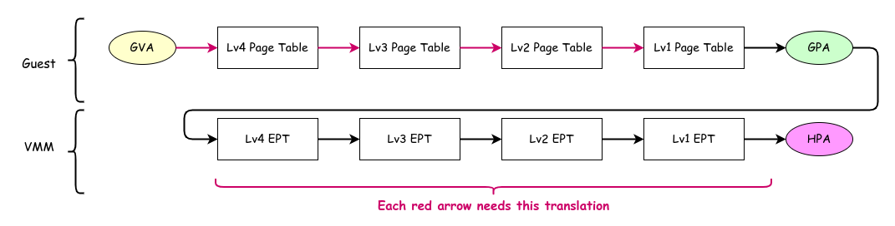
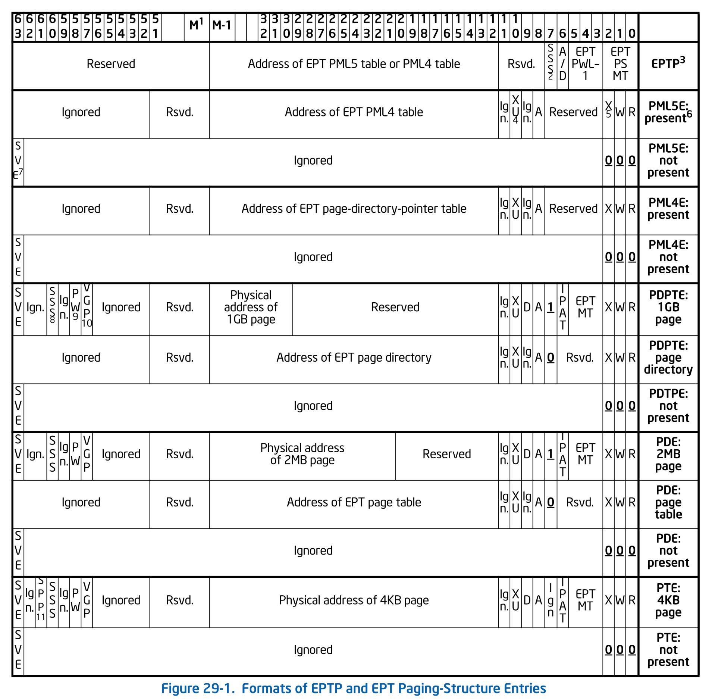

# EPT: Extended Page Table

本チャプターではゲスト物理アドレスとホスト物理アドレスを変換するための仕組みである EPT を扱います。
EPT を適切に設定することで、ゲストに対してホストと分離された物理アドレス空間を提供しつつ、物理アドレスへのアクセス全てをホストの管理下に置くことができるようになります。

## Table of Contents

<!-- toc -->

## EPT 概観

前チャプターまでのゲストはホストと物理アドレス空間を共有していました。
ゲストはホストが使うメモリも含めて任意の物理アドレスにアクセスすることができます。
ゲストが悪意あるソフトウェアであった場合、ホストのメモリから任意のデータを読み取ったり、ホストのデータを書き換えることで仮想化環境を破壊することさえできます。
これではセキュリティ的によろしくありません。
ゲストが触れる物理アドレス空間はホスト分離されているべきであり、分離した空間も VMM が管理できるようにするべきです。

以降は、ゲストの仮想アドレスを **GVA**・ゲストのホストアドレスを **GPA**・ホストの物理アドレスを **HPA** と表記します。

**EPT: Extended Page Table** は物理メモリの仮想化を支援する VT-x の機構です。
**EPT は通常の Page Table が HVA to HPA 変換をするのと同様に、GPA to HPA 変換をします**。
ゲストが GVA を使ってメモリアクセスをする際には、Page Table を使って GVA to GPA 変換をしたあと、
さらに GPA to HPA 変換をすることになります。


*Address Translation Using EPT*

ここで注意したいのが、ゲストが GVA to GPA 変換を行う際のページテーブルへのアクセスでも GPA to HPA 変換をする必要があるという点です。
ゲストの CR3 にはゲストの GVA to GPA 変換に必要な Lv4 Page Table の GPA が入っていますが、
このテーブルにアクセスする前にそのアドレスを HPA に変換する必要があります。
図において、上段(Guest)の赤色の参照がそれぞれアドレス解決のために下段(VMM)の4回分の参照をする必要があるというイメージです。
よって、ページテーブルを1段参照するためには4回の Host Page Table (Lv4~Lv1) へのアクセスが必要になります。
つまり**仮想化なしでは通常4回の参照でアクセスできるところ、EPT を使った場合には16回の参照が必要になります**。

もちろん実際には TLB のおかげでここまで多くの回数の参照が発生することはそんなに多くありません。
TLB は GVA to GPA 変換・GPA to HPA 変換[それぞれの結果をキャッシュしています](#キャッシュされる情報)。
もしも GVA to GPA 変換と GPA to HPA 変換の結果が TLB にキャッシュされていれば、1度もメモリアクセスすること無くアドレス変換ができるというのは非仮想化環境と同じです。
(厳密には、後述するように TLB には GVA to HPA 変換の結果も入っています。)

## EPT の構造

EPT による GPA to GVA 変換は、通常のページテーブルと同様に4段階か5段階を選択することができます。
本シリーズでは、ページテーブルと同様に4段階の EPT を採用します。

EPT の構造も通常のページテーブルエントリと同様(もしくは少し単純)になっています。
以下に EPT エントリを表す構造を示します。
ほとんど [ページテーブルのチャプター](../kernel/paging.md) で扱ったものと同じです:

```ymir/arch/x86/vmx/ept.zig
fn EntryBase(table_level: TableLevel) type {
    return packed struct(u64) {
        const Self = @This();
        const level = table_level;
        const LowerType = switch (level) {
            .lv4 => Lv3Entry,
            .lv3 => Lv2Entry,
            .lv2 => Lv1Entry,
            .lv1 => struct {},
        };

        /// Whether reads are allowed.
        read: bool = true,
        /// Whether writes are allowed.
        write: bool = true,
        /// If "mode-based execute control for EPT" is 0, execute access.
        /// If that field is 1, execute access for supervisor-mode linear address.
        exec_super: bool = true,
        /// EPT memory type.
        /// ReservedZ when the entry maps a page.
        type: MemoryType = .uncacheable,
        /// Ignore PAT memory type.
        ignore_pat: bool = false,
        /// If true, this entry maps an memory, Otherwise, this references a page table.
        map_memory: bool,
        /// If EPTP[6] is 1, accessed flag. Otherwise, ignored.
        accessed: bool = false,
        // If EPTP[6] is 1, dirty flag. Otherwise, ignored.
        dirty: bool = false,
        /// Execute access for user-mode linear address.
        exec_user: bool = true,
        /// Ignored
        _ignored2: u1 = 0,
        /// 4KB aligned physical address of the mapped page or page table.
        phys: u52,

        /// Return true if the entry is present.
        pub fn present(self: Self) bool {
            return self.read or self.write or self.exec_super;
        }

        /// Get the physical address of the page or page table that this entry references or maps.
        pub inline fn address(self: Self) Phys {
            return @as(u64, @intCast(self.phys)) << page_shift_4k;
        }

        /// Get a new page table entry that references a page table.
        pub fn newMapTable(table: []LowerType) Self {
            if (level == .lv1) @compileError("Lv1 EPT entry cannot reference a page table");
            return Self{
                .map_memory = false,
                .type = .uncacheable,
                .phys = @truncate(virt2phys(table.ptr) >> page_shift_4k),
            };
        }

        /// Get a new page table entry that maps a page.
        pub fn newMapPage(phys: Phys) Self {
            if (level == .lv4) @compileError("Lv4 EPT entry cannot map a page");
            return Self{
                .read = true,
                .write = true,
                .exec_super = true,
                .exec_user = true,
                .map_memory = true,
                .type = @enumFromInt(0),
                .phys = @truncate(virt2phys(phys) >> page_shift_4k),
            };
        }
    };
}

const Lv4Entry = EntryBase(.lv4);
const Lv3Entry = EntryBase(.lv3);
const Lv2Entry = EntryBase(.lv2);
const Lv1Entry = EntryBase(.lv1);

const MemoryType = enum(u3) {
    uncacheable = 0,
    write_back = 6,
};

const TableLevel = enum {
    lv4,
    lv3,
    lv2,
    lv1,
};
```

Lv4 ~ Lv1 のエントリはおおよそ同じ構造になっているため、本シリーズでは共通化した `struct` を利用します。
これもページテーブルの時と同様です。

ページテーブルとの違いとして、`present` ビットがなくなりました。
代わりに、RWX を表すビット3つのビット全てが `0` である場合に、その PTE は present ではないとみなされます。

## マップの作成

前述したように、EPT を有効化したアドレス変換はテーブルの参照回数が大きく増えるため非常に効率が悪くなります。
最も愚直な対策は、できるだけ大きい EPT ページを利用することです。
Ymir では 2MiB ページの EPT だけを利用することにします。
2MiB ページに属するアドレスの HPA to HVA 変換は、Lv2 エントリまでの参照で完了します。
GPA to HVA 変換が3回のメモリアクセスで完了することから、4段全て使った変換に比べてアクセス回数が 3/4 になります[^2mib]。

2MiB ページをマップする関数が以下です。
何回も言いますが、ページテーブルと本当に同じですね[^pg-ept]:

```ymir/arch/x86/vmx/ept.zig
fn map2m(gpa: Phys, hpa: Phys, lv4tbl: []Lv4Entry, allocator: Allocator) Error!void {
    const lv4index = (guest_phys >> lv4_shift) & index_mask;
    const lv4ent = &lv4tbl[lv4index];
    if (!lv4ent.present()) {
        const lv3tbl = try initTable(Lv3Entry, allocator);
        lv4ent.* = Lv4Entry.newMapTable(lv3tbl);
    }

    const lv3ent = getLv3Entry(guest_phys, lv4ent.address());
    if (!lv3ent.present()) {
        const lv2tbl = try initTable(Lv2Entry, allocator);
        lv3ent.* = Lv3Entry.newMapTable(lv2tbl);
    }
    if (lv3ent.map_memory) return error.AlreadyMapped;

    const lv2ent = getLv2Entry(guest_phys, lv3ent.address());
    if (lv2ent.present()) return error.AlreadyMapped;
    lv2ent.* = Lv2Entry{
        .map_memory = true,
        .phys = @truncate(host_phys >> page_shift_4k),
    };
}
```

`initTable()` は `Allocator` からページを確保し、512個分のエントリを non-present の状態で初期化します:

```ymir/arch/x86/vmx/ept.zig
fn initTable(T: type, allocator: Allocator) Error![]T {
    const tbl = try allocator.alloc(T, num_table_entries);
    for (0..tbl.len) |i| {
        tbl[i].read = false;
        tbl[i].write = false;
        tbl[i].exec_super = false;
        tbl[i].map_memory = false;
        tbl[i].type = @enumFromInt(0);
    }
    return tbl;
}
```

## EPTP

ページングでは CR3 レジスタが Lv4 テーブルのアドレス(+αの情報)を保持していました。
同様に、Lv4 EPT テーブルのアドレスは **EPTP: Extended Page Table Pointer** が保持します。
EPTP は以下のフォーマットを持っています。
ついでに各レベルの EPT のフォーマットも載せておきます:


*Formats of EPTP and EPT Paging Structure Entries. SDM Vol.3C 29.3.3 Figure 29-1.*

フォーマットに従って `Eptp` を定義します。
この構造体は `new()` で Lv4 テーブルのアドレスを受け取ります。
EPTP に格納する Lv4 テーブルのアドレスは、CR3 と同様に物理アドレス(HPA)であることに注意してください:

```ymir/arch/x86/vmx/ept.zig
pub const Eptp = packed struct(u64) {
    /// Memory type.
    type: MemoryType = .write_back,
    /// EPT page-walk length.
    level: PageLevel = .four,
    /// Enable dirty and accessed flags for EPT.
    enable_ad: bool = true,
    /// Enable enforcement of access rights for supervisor shadow-stack pages.
    enable_ar: bool = false,
    /// Reserved.
    _reserved1: u4 = 0,
    /// 4KB aligned address of the Level-4 EPT table.
    phys: u52,

    pub fn new(lv4tbl: []Lv4Entry) Eptp {
        return Eptp{
            .phys = @truncate(virt2phys(lv4tbl.ptr) >> page_shift_4k),
        };
    }

    /// Get the host virtual address of the Level-4 EPT table.
    pub fn getLv4(self: *Eptp) []Lv4Entry {
        const virt: [*]Lv4Entry = @ptrFromInt(phys2virt(@as(u64, @intCast(self.phys)) << page_shift_4k));
        return virt[0..num_table_entries];
    }

    const PageLevel = enum(u3) {
        four = 3,
        five = 4,
    };
};
```

## ゲスト物理アドレスのマップ

それでは EPT を使ってゲストに物理アドレスをマップしていきます。

EPT の運用には様々な方法があります。
よくある方法は、ページテーブルと同様に最初は必要なページだけをマップしておき、それ以外のページでフォルトが発生したら実際に物理メモリを割り当てるという方法です。
ゲストがマップされていない GPA にアクセスしようとすると、VM Exit が発生します。
これを契機にして VMM は必要な分だけ on-demand で物理メモリを割り当てることができます。
この方法のメリットは、ゲストが必要とする分だけ物理メモリを割り当てれば良いことです。
ゲストが本当にメモリをアクセスしない限りは、使用されていないメモリは他ゲストやホストが使うことができます。

本シリーズでは別のアプローチを採用します。
[ページテーブルのチャプター](../kernel/paging.md) では、ページテーブルを初期化する際に全ての利用可能な仮想アドレスを物理ページにマップしていました。
それによって、Ymir ではページフォルトが発生することがありません。
発生した場合にはすなわちバグを意味し、回復不可能とみなしてアボートします。
これは Linux カーネルでも同様です。
これにならい Ymir では、**ゲストが利用できる物理アドレスをゲストの起動前に全てマップしてしまいます**。
よって、EPT Violation が発生することはありません。
一度 EPT を初期化したらあとは二度と触らないという方針です。

本シリーズでは 100MiB を固定でゲストに割り当てることにします。
Ymir 自体は 512MiB のメモリを割り当てるように QEMU の起動オプションで設定していました。
ゲストに渡す 100MiB を差し引いても、Ymir は 412MiB のメモリを利用できます。
十分すぎるくらいです[^memsize]。

`Vm` 構造体にゲストのメモリを保持するためのメンバ `guest_mem` を追加し、ゲストメモリを初期化する関数を追加します:

```ymir/vmx.zig
const guest_memory_size = 100 * mem.mib;

pub const Vm = struct {
    guest_mem: []u8 = undefined,
    ...
    pub fn setupGuestMemory(
        self: *Self,
        allocator: Allocator,
        page_allocator: *PageAllocator,
    ) Error!void {
        // Allocate guest memory.
        self.guest_mem = page_allocator.allocPages(
            guest_memory_size / mem.page_size_4k,
            mem.page_size_2mb, // This alignment is required because EPT uses only 2MiB pages.
        ) orelse return Error.OutOfMemory;

        // Create simple EPT mapping.
        const eptp = try impl.mapGuest(self.guest_mem, allocator);
        try self.vcpu.setEptp(eptp, self.guest_mem.ptr);
        log.info("Guet memory is mapped: HVA=0x{X:0>16} (size=0x{X})", .{ @intFromPtr(self.guest_mem.ptr), self.guest_mem.len });
    }
};
```

メモリは**連続した 100MiB 領域を確保します**。
別に連続させる必然性はないのですが、EPT テーブルの設定が楽になるためこうしています。
また、2MiB ページだけを利用できるようにするため、確保する領域は 2MiB アラインされている必要があります。
1ページサイズ以上のアラインを要求するメモリ確保は `Allocator` インタフェースには実装されていません。
そのため、仕方がなく `PageAllocator` インスタンスを直接引数として受け取るようにしています。

メモリを確保したら、確保した領域の情報をもとに EPT を初期化するため `arch.vmx.mapGuest()` を呼び出します。
この関数は `arch.vmx.ept` を Ymir 全体に露出させないための単なるラッパー関数です:

```ymir/arch/x86/vmx.zig
pub fn mapGuest(host_pages: []u8, allocator: Allocator) VmxError!ept.Eptp {
    return ept.initEpt(
        0,
        mem.virt2phys(host_pages.ptr),
        host_pages.len,
        allocator,
    );
}
```

実体は `ept.initEpt()` です:

```ymir/arch/x86/vmx/ept.zig
pub fn initEpt(
    /// Guest physical address to map.
    guest_start: Phys,
    /// Host physical address to map.
    host_start: Phys,
    /// Size in bytes of the memory region to map.
    size: usize,
    /// Page allocator.
    allocator: Allocator,
) Error!Eptp {
    const lv4tbl = try initTable(Lv4Entry, allocator);
    log.debug("EPT Level4 Table @ {X:0>16}", .{@intFromPtr(lv4tbl.ptr)});

    for (0..size / page_size_2mb) |i| {
        try map2m(
            guest_start + page_size_2mb * i,
            host_start + page_size_2mb * i,
            lv4tbl,
            allocator,
        );
    }

    return Eptp.new(lv4tbl);
}
```

ゲストのメモリサイズから必要な 2MiB ページの個数を計算し、その回数だけ先ほど実装した `map2m()` を呼び出します。

これでゲスト物理メモリのマップが完成しました。
Lv4 EPT テーブルを指す EPTP を得られたので、これを VMCS Execution Control に設定します。
EPTP は vCPU ごとに保持するものであるため、ゲストメモリに関する情報もついでに `Vcpu` に持たせておきましょう:

```ymir/arch/x86/vmx/vcpu.zig
pub const Vcpu = struct {
    eptp: ept.Eptp = undefined,
    guest_base: Phys = undefined,
    ...
    pub fn setEptp(self: *Self, eptp: ept.Eptp, host_start: [*]u8) VmxError!void {
        self.eptp = eptp;
        self.guest_base = ymir.mem.virt2phys(host_start);
        try vmwrite(vmcs.ctrl.eptp, eptp);
    }
    ...
}
```

## EPT の有効化

EPTP はセットしただけでは有効になりません。
VMCS Execution Control カテゴリの **Secondary Processor-Based VM-Execution Control** のビットを立ててあげる必要があります。
このフィールドは Primary Processor-Based VM-Execution Control と同様に主に同期的イベントに関する vCPU の挙動を制御します。
まだこのフィールドは使ったことがなかったため、構造体を定義しておきます:

```ymir/arch/x86/vmx/vmcs.zig
pub const SecondaryProcExecCtrl = packed struct(u32) {
    const Self = @This();

    virtualize_apic_accesses: bool,
    ept: bool,
    descriptor_table: bool,
    rdtscp: bool,
    virtualize_x2apic_mode: bool,
    vpid: bool,
    wbinvd: bool,
    unrestricted_guest: bool,
    apic_register_virtualization: bool,
    virtual_interrupt_delivery: bool,
    pause_loop: bool,
    rdrand: bool,
    enable_invpcid: bool,
    enable_vmfunc: bool,
    vmcs_shadowing: bool,
    enable_encls: bool,
    rdseed: bool,
    enable_pml: bool,
    ept_violation: bool,
    conceal_vmx_from_pt: bool,
    enable_xsaves_xrstors: bool,
    pasid_translation: bool,
    mode_based_control_ept: bool,
    subpage_write_eptr: bool,
    pt_guest_pa: bool,
    tsc_scaling: bool,
    enable_user_wait_pause: bool,
    enable_pconfig: bool,
    enable_enclv: bool,
    _reserved1: u1,
    vmm_buslock_detect: bool,
    instruction_timeout: bool,

    pub fn load(self: Self) VmxError!void {
        const val: u32 = @bitCast(self);
        try vmx.vmwrite(ctrl.secondary_proc_exec_ctrl, val);
    }
    pub fn store() VmxError!Self {
        const val: u32 = @truncate(try vmx.vmread(ctrl.secondary_proc_exec_ctrl));
        return @bitCast(val);
    }
};
```

EPT を有効化するには `.ept` ビットをセットします。
他の Execution Control フィールドと同様に、Reserved Bits を `0` にするか `1` にするかは MSR に問い合わせる必要があります。
Secondary Processor-Based Control の場合は、`IA32_VMX_PROCBASED_CTLS2` MSR に問い合わせます:

```ymir/arch/x86/vmx/vcpu.zig
fn setupExecCtrls(vcpu: *Vcpu, allocator: Allocator) VmxError!void {
    ...
    var ppb_exec_ctrl2 = try vmcs.SecondaryProcExecCtrl.store();
    ppb_exec_ctrl2.ept = true;
    try adjustRegMandatoryBits(
        ppb_exec_ctrl2,
        am.readMsr(.vmx_procbased_ctls2),
    ).load();
}
```

## Unrestricted Guest

EPT が有効化できたことを確かめていきます。
このチャプターまでは、ゲストはホストとアドレス空間を共有したまま `blobGuest()` を実行していました。
EPT を有効化すると、ゲストとホストのアドレス空間が分離されるため、**ゲストはホストのアドレス空間に配置された `blobGuest()` を実行することができなくなります**。
今までどおりゲストの `blobGuest()` を実行しようとした場合、VMCS RIP に登録したアドレスは *GVA* として解釈されます。
これはゲストの CR3 に格納されたページテーブルによって *GPA* に変換され、さらに EPT によって *HPA* に変換されます。
この結果、RIP が指すのはもはや `blobGuest()` の HPA ではなくなってしまいます。

厳密に言うと、CR3に格納された物理アドレス自体が GPA として解釈され EPT によるさらなる変換を受けるため、
もはやページテーブルにアクセスすることができず、RIP を GVA to GPA 変換することすらできません。
これは、いかなるアドレスにもアクセスすることができないということを意味します。
1命令でも実行しようものならページテーブルが発生し、そのハンドラも実行できないのですぐさま Triple Fault であの世行きです。
これではゲストのプログラムを実行することができません。

そこで、本チャプターからはゲストを **Unrestricted Guest** として実行します。
今まで実行していたゲストは **Restricted Guest** でした。
**Restricted Guest は、ページングを無効化したり、リアルモードで動作することができません**。
対して、Unrestricted Guest はページングを無効化したりリアルモードで動作することができます。
Unrestricted Guest にした上でページングを無効化することで、ゲストの GVA to GPA 変換を無効化し、少なくともメモリアクセスはできるようにします。

大まかな方針として、ゲストを実行する前に、ホストからゲストのアドレスに直接 `blobGuest()` をコピーしておきます。
分かりやすく **ゲストメモリの先頭に `blobGuest()` をコピーした場合、VMCS RIP に `0` を設定することでゲストは `blobGuest()` を実行できる** ようになります。

まずは Unrestricted Guest を有効化します:

```ymir/arch/x86/vmx/vcpu.zig
fn setupExecCtrls(_: *Vcpu, _: Allocator) VmxError!void {
    ...
    ppb_exec_ctrl2.unrestricted_guest = true;
    ...
}
```

また、VM Entry 時に IA-32e モードを無効化します:

```ymir/arch/x86/vmx/vcpu.zig
fn setupEntryCtrls(_: *Vcpu) VmxError!void {
    entry_ctrl.ia32e_mode_guest = false;
}
```

続いて、Guest State の CR0 を操作してページングを無効化します:

```ymir/arch/x86/vmx/vcpu.zig
fn setupGuestState(_: *Vcpu) VmxError!void {
    var cr0 = std.mem.zeroes(am.Cr0);
    cr0.pe = true;  // Protected-mode
    cr0.pg = false; // Paging
    try vmwrite(vmcs.guest.cr0, cr0);
    ...
}
```

これでゲストが Unrestricted Guest + ページング無効になりました。
最後に、ゲストメモリに `blobGuest()` をコピーして VMCS RIP に `0` を設定します:

```ymir/arch/x86/vmx/vcpu.zig
pub fn loop(self: *Self) VmxError!void {
    const func: [*]const u8 = @ptrCast(&blobGuest);
    const guest_map: [*]u8 = @ptrFromInt(mem.phys2virt(self.guest_base));
    @memcpy(guest_map[0..0x20], func[0..0x20]);
    try vmwrite(vmcs.guest.rip, 0);
    ...
}
```

コピーするサイズの `0x20` は適当です。
現在 `blobGuest()` は HLT ループをするだけであるため、`hlt` + `jmp` の2命令だけで構成されているはずであり、こんなにバイト数は必要ありません。
まぁ[こんなんなんぼあってもいいですからね](https://youtu.be/3bAwLydEsZo)。

```objdump
ffffffff80115f20 <blobGuest>:
ffffffff80115f20:       eb 00                   jmp    ffffffff80115f22 <blobGuest+0x2>
ffffffff80115f22:       f4                      hlt
ffffffff80115f23:       eb fd                   jmp    ffffffff80115f22 <blobGuest+0x2>
```

さて、ゲストを実行してみましょう。
出力は以下のようになります:

```txt
[INFO ] main    | Entered VMX root operation.
[DEBUG] ept     | EPT Level4 Table @ FFFF88800000A000
[INFO ] vmx     | Guet memory is mapped: HVA=0xFFFF888000A00000 (size=0x6400000)
[INFO ] main    | Setup guest memory.
[INFO ] main    | Starting the virtual machine...
```

特にクラッシュもせず、VMX Exit も発生しません。
無事に HLT ループに入っているようです。
QEMU monitor で `info registers` を実行すると以下のようになります:

```txt
EAX=00000000 EBX=00000000 ECX=00000000 EDX=00000000
ESI=00000000 EDI=00000000 EBP=00000000 ESP=00000000
EIP=00000003 EFL=00000002 [-------] CPL=0 II=0 A20=1 SMM=0 HLT=1
ES =0000 00000000 ffffffff 00c09300 DPL=0 DS   [-WA]
CS =0010 00000000 ffffffff 00a09b00 DPL=0 CS64 [-RA]
SS =0000 00000000 ffffffff 00c09300 DPL=0 DS   [-WA]
DS =0000 00000000 ffffffff 00c09300 DPL=0 DS   [-WA]
FS =0000 00000000 ffffffff 00c09300 DPL=0 DS   [-WA]
GS =0000 00000000 ffffffff 00c09300 DPL=0 DS   [-WA]
LDT=0000 00dead00 00000000 00008200 DPL=0 LDT
TR =0000 00000000 00000000 00008b00 DPL=0 TSS32-busy
GDT=     00000000 00000000
IDT=     00000000 00000000
CR0=00000031 CR2=00000000 CR3=00001000 CR4=00002668
```

RIP が `0x3` になっています。
これは先ほどの `objdump` の結果によると `hlt` 命令です。
やはりちゃんと HLT ループに入ってますね。
おまけに、ゲストのマーカーとして設定していた `0xDEAD00` が LDT に設定されていることが分かります。
これで、EPT が有効化され GPA が HPA に変換されていることが確認できました。

## VPID

最後に EPT を使う上で重要な機能である VPID について軽く触れておきます。

EPT を使う上で問題になるのが TLB のフラッシュタイミングです。
EPT を利用するということはホストの仮想アドレス空間に加えてゲストの仮想アドレス空間も TLB にキャッシュされるということです。
一昔前のアーキテクチャでは TLB のキャッシュエントリがホストとゲストのどちらのアドレス空間に属しているかを区別することができませんでした。
このまま TLB を利用してしまうと、ホストにいるのにゲストのアドレス空間に属する TLB エントリを利用してしまう可能性があります。
その場合誤ったアドレス変換が発生し、プログラムがぶっ壊れてしまいます。
これを防ぐため、当時は VMX Non-root Operation と VMX Root Operation を遷移する際に全ての TLB エントリがフラッシュされました。

無駄な TLB フラッシュを避けるため、以降の CPU には **VPID: Virtual Processor Identifier** という機構が導入されました。
VPID は各 vCPU (及び論理コア) に割り当てられる 16bit の固有なIDで、VM間(+ホスト) の TLB における名前空間を分離します。
VPID を有効化することで VM 間またはVM-ホスト間で、誤ってキャッシュされた別のアドレス変換を利用することがなくなります。
これにより、**VMX Non-root Operation と VMX Root Operation 間で TLB をフラッシュする必要がなくなりました**。

ホストは自動的に VPID の `0` を割り当てられます。
各 vCPU には `1` 以上のユニークな VPID を明示的に割り当てる必要があります。
誤ってゲストの VPID として `0` を割り当てると、VM Entry が失敗します。
逆に異なるゲストに意図せず同じ VPID を割り当てると、それらのゲスト間で同じ TLB エントリが利用されるようになってしまいバグります。

### キャッシュされる情報

EPT と VPID を有効化したとき、 TLB にキャッシュされる情報には以下の3種類があります[^mappings]:

- **Linear Mappings**: GVA to GPA(=HPA) の変換結果。およびそれらの変換に利用されるページテーブルエントリ。
- **Guest-Physical Mappings**: GPA to HPA の変換結果。およびそれらの変換に利用される EPT エントリ。
- **Combined Mappings**: GVA to HPA の変換結果。およびそれらの変換に利用されるページテーブルと EPT エントリ。

各 mappings のキャッシュには、アドレスの変換結果の他にメモリタイプやアクセス権限といった情報も含まれます。
Combined Mappings の場合には、ページテーブルと EPT の両方を総合したメモリタイプ・アクセス権限がキャッシュされます。

ゲストがメモリアクセスをする場合、各 mappings は以下のように利用されます:

- EPT が無効なとき: VPID と PCID でタグ付けされた Linear Mappings が利用される。
- EPT が有効なとき:
  - 仮想アドレスアクセス: VPID と PCID と EPTRTA[^eptrta] でタグ付けされた Combined Mappings が利用される。
  - 物理アドレスアクセス: EPTRTA でタグ付けされた Guest-Physical Mappings が利用される。

これらのキャッシュを無効化する方法と無効化される mappings は以下のとおりです:

- VMX Operations に関係なく TLB をフラッシュする操作: Linear + Combined (tag: VPID)
  - [INVLPG](https://www.felixcloutier.com/x86/invlpg) や [INVPCID](https://www.felixcloutier.com/x86/invpcid) や CR3 のリロード(63-th bit がセットされていない場合) など
- EPT Violation: アドレス変換に使われた Guest-Physical (tag: EPTRTA) + Combined (tag: PCID + VPID + EPTRTA)
- VM Entry/Exit (VPIDが無効な場合): Linear(tag: VPID=0) + Combined (tag: VPID=0)
- [INVVPID](https://www.felixcloutier.com/x86/invvpid) / [INVEPT:](https://www.felixcloutier.com/x86/invept) 指定したキャッシュ

### VPID の有効化

Ymir では VMX Transition の度に TLB をフラッシュしなくても良いように、VPID を有効化します。
まずは VPID がサポートされているかを調べる必要があります。
これは `IA32_VMX_EPT_VPID_CAP_MSR`(`0x048C`) を調べることで分かります:

<details>
<summary>IA32_VMX_EPT_VPID_CAP_MSR MSR の構造</summary>

```ymir/arch/x86/asm.zig
pub const MsrVmxEptVpidCap = packed struct(u64) {
    ept_exec_only: bool,
    _reserved1: u5 = 0,
    ept_lv4: bool,
    ept_lv5: bool,
    ept_uc: bool,
    _reserved2: u5 = 0,
    ept_wb: bool,
    _reserved3: u1 = 0,
    ept_2m: bool,
    ept_1g: bool,
    _reserved4: u2 = 0,
    invept: bool,
    ept_dirty: bool,
    ept_advanced_exit: bool,
    shadow_stack: bool,
    _reserved5: u1 = 0,
    invept_single: bool,
    invept_all: bool,
    _reserved6: u5 = 0,
    invvpid: bool,
    _reserved7: u7 = 0,
    invvpid_individual: bool,
    invvpid_single: bool,
    invvpid_all: bool,
    invvpid_single_globals: bool,
    _reserved8: u4 = 0,
    hlat_prefix: u6,
    _reserved9: u10 = 0,
};
```

</details>

Ymir では、[INVVPID](https://www.felixcloutier.com/x86/invvpid) 命令の全てのオプションがサポートされている場合に VPID がサポートされていると判断します:

```ymir/arch/x86/vmx/vcpu.zig
fn isVpidSupported() bool {
    const cap: am.MsrVmxEptVpidCap = @bitCast(am.readMsr(.vmx_ept_vpid_cap));
    return cap.invvpid and cap.invvpid_single and cap.invvpid_all and cap.invvpid_individual and cap.invvpid_single_globals;
}
```

VPID を有効化するには Secondary Processor-Based VM-Execution Control の `vpid` ビットをせっとします。
また、その vCPU の VPID は VMCS Execution Control の専用フィールドに設定してあげます:

```ymir/arch/x86/vmx/vcpu.zig
fn setupExecCtrls(vcpu: *Vcpu, _: Allocator) VmxError!void {
    ...
    ppb_exec_ctrl2.vpid = isVpidSupported();
    ...
    if (isVpidSupported()) {
        try vmwrite(vmcs.ctrl.vpid, vcpu.vpid);
    }
}
```

本シリーズでは1コアしか扱わないため、`Vcpu` の `vpid` は固定で `1` に設定しています。
複数の vCPU を扱う場合には、各 vCPU にユニークな VPID を割り当てる必要があります。

## まとめ

本チャプターでは、EPT を有効化することでホストとゲストのアドレス空間を分離しました。
Ymir ではゲストの起動前にゲストのメモリを全て 2MiB ページでマップする方針を採用しました。
また、VPID を有効化することで VMX Transition における TLB フラッシュが発生しないようにしました。
実際にゲストを分離されたアドレス空間で実行し、HLT ループに入っていることを確認することができました。

次のチャプターでは用意したゲストメモリに Linux カーネルをロードし、Linux を起動するための準備をします。

## References

- [MMU Virtualization via Intel EPT: Technical Details - Reverse Entineering](https://revers.engineering/mmu-ept-technical-details/)
- [Hypervisor From Scratch – Part 8: How To Do Magic With Hypervisor! - Rayanfam Blog](https://rayanfam.com/topics/hypervisor-from-scratch-part-8/)
- [ちょっと詳しいEPT - おしぼり / Zenn](https://zenn.dev/oshibori/articles/e2e3693fe072ac)

[^2mib]: というのは建前で、本当は EPT の実装が簡単になるというのが理由だったりします。
[^pg-ept]: EPT とページテーブルの実装がかなり似通ったものになっているため、本当はある程度実装を共通化したほうが良いのかもしれません。
[^memsize]: ほとんど何もしない Ymir が 412MiB を持っているというのは十分すぎるを通り越して無駄なので、もっと多くをゲストに割り当てても大丈夫です。
[^mappings]: *SDM Vol.3C 29.4.1 Information That May Be Cached*
[^eptrta]: **EPT Root Table Address**. EPT の Lv4 テーブルのアドレスのこと。
