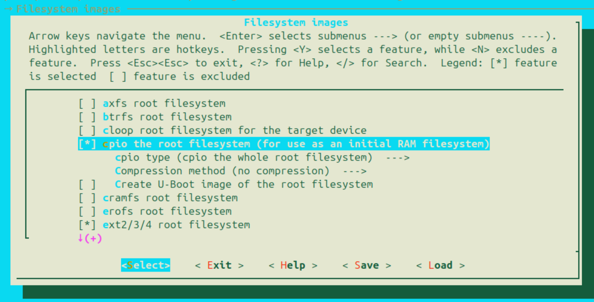

# initramfs

## Table of Contents

<!-- toc -->

## initramfs の作成

**initramfs** はメモリ上に展開される RAM FS の一種です。
ディレクトリとファイルが単純に [cpio](https://en.wikipedia.org/wiki/Cpio) 圧縮 (+ gzib) された簡単な構造をしています。
Linux はカーネル自体が initramfs を操作するための機能を持っており、他の FS をマウントしていない間の一時的な FS として利用することができます。
この initramfs からカーネルモジュールをロードし、そのモジュールを使って実際のルートファイルシステムをマウントすることができます。
Ymir では簡単のために initramfs をずっと使用し、他の FS は一切使用しません。

まずはゲストがロードするための initramfs を作成します。
initramfs を作成する方法は色々とありますが、ここでは [buildroot](https://buildroot.org/) を使用することにします。
buildroot は組み込み用 Linux をビルドするためのツールチェインですが、ここではファイルシステムを生成するためだけに使います。
[buildroot のダウンロードページ](https://buildroot.org/download.html) から適当なバージョンをダウンロードし、解凍します。
解凍したディレクトリで、`make menuconfig` でコンフィグを設定します。
今回は Linux カーネル自体はビルドする必要がないため、`BR2_LINUX_KERNEL` はオフにします。
その上で、以下のオプションを有効にして cpio 形式の initramfs を生成するようにします:


*cpio the root filesystem (for use as an initial RAM filesystem)*

`make` を実行し、ファイルシステムを生成します。
ファイルは `./output/images/rootfs.cpio` に出力されます。
cpio ファイルは、以下の手順で展開および圧縮することができます:

```bash
# 展開
mkdir x && cd x
cpio -idv 2>/dev/null <../x
# 圧縮
cd x
find . -print0 | cpio --owner root --null -o --format=newc > ../rootfs.cpio
```

Linux はカーネルのブート後に FS の `/init` を実行します。
`/init` は `/sbin/init` を PID 1 のプロセスとして呼び出し、`/sbin/init` は `/etc/init.d/rcS` を実行します。
`rcS` は `/etc/init.d/` に置いてある `S` で始まるスクリプトを順番にサブプロセスで実行します。

出力された initramfs を展開し、中から余計な起動スクリプトを消してあげます。

```bash
rm ./x/etc/init.d/S41dhcpcd
rm ./x/extracted/etc/init.d/S40network
```

また、以下の起動スクリプトを代わりに `S999whiz` として追加します:

```sh:etc/init.d/S999whiz
#!/bin/sh

mdev -s
mount -t proc none /proc
stty -opost
echo 0 >/proc/sys/kernel/kptr_restrict
echo 0 >/proc/sys/kernel/dmesg_restrict
chmod 666 /dev/ptmx

/bin/sh

umount /proc
poweroff -d 0 -f
```

最終的には以下のようなディレクトリ構造になります:

```bash
> tree ./x/etc/init.d
./x/etc/init.d
├── rcK
├── rcS
├── S01syslogd
├── S02klogd
├── S02sysctl
├── S20seedrng
└── S999whiz
```

以上の準備が終わったら、`rootfs.cpio` を gzip 圧縮して `rootfs.cpio.gz` にしてあげ、
Ymir カーネルが置いてある `zig-out/img` ディレクトリにコピーしておいてください:

```bash
> tree ./zig-out/img
./zig-out/img
├── bzImage
├── efi
│   └── boot
│       └── BOOTX64.EFI
├── rootfs.cpio.gz
└── ymir.elf
```

## Surtr による initramfs のロード

`bzImage` をメモリにロードした際と同様に、`rootfs.cpio.gz` をメモリにロードして Ymir に渡すのは Surtr の役割です。
`boot.zig` に `rootfs.cpio.gz` 用のメモリ領域の確保とロードを行うコードを追加します:

```surtr/boot.zig
const initrd = openFile(root_dir, "rootfs.cpio.gz") catch return .Aborted;
const initrd_info_buffer_size: usize = @sizeOf(uefi.FileInfo) + 0x100;
var initrd_info_actual_size = initrd_info_buffer_size;
var initrd_info_buffer: [initrd_info_buffer_size]u8 align(@alignOf(uefi.FileInfo)) = undefined;
status = initrd.getInfo(&uefi.FileInfo.guid, &initrd_info_actual_size, &initrd_info_buffer);
if (status != .Success) return status;

const initrd_info: *const uefi.FileInfo = @alignCast(@ptrCast(&initrd_info_buffer));
var initrd_size = initrd_info.file_size;
var initrd_start: u64 = undefined;
const initrd_size_pages = (initrd_size + (page_size - 1)) / page_size;
status = boot_service.allocatePages(.AllocateAnyPages, .LoaderData, initrd_size_pages, @ptrCast(&initrd_start));
if (status != .Success) return status;

status = initrd.read(&initrd_size, @ptrFromInt(initrd_start));
if (status != .Success) return status;
```

また、Surtr から Ymir に渡す情報である `GuestInfo` に initramfs をロードした場所に関する情報を追加します:

```surtr/defs.zig
pub const GuestInfo = extern struct {
    ...
    /// Physical address the initrd is loaded.
    initrd_addr: [*]u8,
    /// Size in bytes of the initrd.
    initrd_size: usize,
};
```

Surtr が Ymir に処理を移す際に initramfs の情報を埋めてあげます:

```surtr/boot.zig
const boot_info = defs.BootInfo{
    ...
    .guest_info = .{
        ...
        .initrd_addr = @ptrFromInt(initrd_start),
        .initrd_size = initrd_size,
    },
};
kernel_entry(boot_info);
```

以上で Surtr が initramfs をメモリにロードし、その情報を Ymir に渡すことができました。
Ymir 側で渡された情報を見ることができるか確認してみましょう。
`kernelMain()` に以下のコードを追加します。
Surtr から渡される initramfs のアドレスは物理アドレスであるため、 `phys2virt()` で仮想アドレスに変換する必要があることに注意してください:

```ymir/main.zig
const initrd = b: {
    const ptr: [*]u8 = @ptrFromInt(ymir.mem.phys2virt(guest_info.initrd_addr));
    break :b ptr[0..guest_info.initrd_size];
};
log.info("initrd: 0x{X:0>16} (size=0x{X})", .{ @intFromPtr(initrd.ptr), initrd.len });
```

## ゲストへの initramfs の渡し方

x86 Linux のブートプロトコルで利用される `BootParams` 内の `SetupHeader` には、initramfs の物理アドレスとサイズを指定するためのフィールドがあります。
ゲストメモリの適当なアドレスに initramfs をロードし、そのアドレスとサイズを `SetupHeader` に設定することで、
Linux カーネルが initramfs を認識し、マウントすることがでるようになります。
本シリーズでは initramfs は `0x0600_0000` にロードすることにします:

```ymir/linux.zig
pub const layout = struct {
    ...
    pub const initrd = 0x0600_0000;
};
```

`loadKernel()` で initramfs をロードします:

```ymir/vmx.zig
fn loadKernel(self: *Self, kernel: []u8, initrd: []u8) Error!void {
    ...
    // Load initrd
    bp.hdr.ramdisk_image = linux.layout.initrd;
    bp.hdr.ramdisk_size = @truncate(initrd.len);
    try loadImage(guest_mem, initrd, linux.layout.initrd);
    ...
}
```

## まとめ

本チャプターでは initramfs を作成し、Surtr にロードしてもらった後ゲストに渡しました。
ゲストを動かしてみましょう:

```txt
[    0.364946] Loading compiled-in X.509 certificates
[    0.364946] PM:   Magic number: 0:110:269243
[    0.364946] printk: legacy console [netcon0] enabled
[    0.364946] netconsole: network logging started
[    0.364946] cfg80211: Loading compiled-in X.509 certificates for regulatory database
[    0.364946] modprobe (41) used greatest stack depth: 13840 bytes left
[    0.364946] Loaded X.509 cert 'sforshee: 00b28ddf47aef9cea7'
[    0.364946] Loaded X.509 cert 'wens: 61c038651aabdcf94bd0ac7ff06c7248db18c600'
[    0.364946] platform regulatory.0: Direct firmware load for regulatory.db failed with error -2
[    0.364946] cfg80211: failed to load regulatory.db
[    0.364946] ALSA device list:
[    0.364946]   No soundcards found.

[    0.364946] Freeing unused kernel image (initmem) memory: 2704K
[    0.365946] Write protecting the kernel read-only data: 26624k
[    0.365946] Freeing unused kernel image (rodata/data gap) memory: 1488K
[    0.395946] x86/mm: Checked W+X mappings: passed, no W+X pages found.
[    0.395946] x86/mm: Checking user space page tables
[    0.423946] x86/mm: Checked W+X mappings: passed, no W+X pages found.
[    0.423946] Run /init as init process
[    0.423946] mount (44) used greatest stack depth: 13832 bytes left
[    0.424946] ln (53) used greatest stack depth: 13824 bytes left
Starting syslogd: OK
Starting klogd: OK
Running sysctl: OK
Saving 256 bits of non-creditable seed for next boot
/bin/sh: can't access tty; job control turned off
~ # ls
bin      init     linuxrc  opt      run      tmp
dev      lib      media    proc     sbin     usr
etc      lib64    mnt      root     sys      var
```

**ついに！Linux が！起動しました！**
シリアルによる入力も受け付けており、自由にシェルを操作することができます！
ここまで合計30チャプター近くもある長い道のりでしたが、いよいよゲストを動かすことができました。
おもちゃレベルではあるものの、これで "Hypervisor" と呼べるものができたのではないでしょうか。
次のチャプターでは、おまけとして VMCALL を実装してゲストから VMM の機能を呼び出す仕組みを実装し、本シリーズを締めくくろうと思います。
