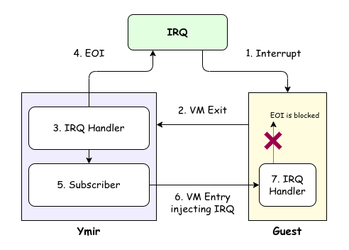
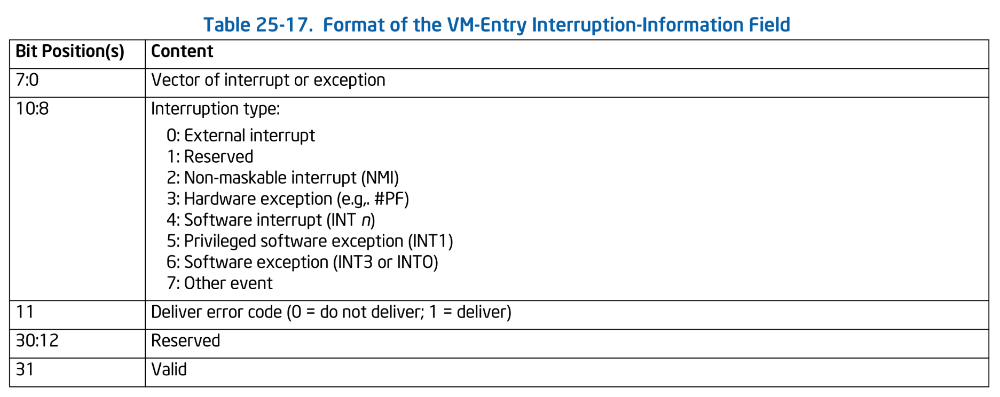

# 割り込みの注入

前チャプターでは EOI が適切に PIC に通知されないためにタイマー割り込みが発生せず、それが原因でゲストがフリーズしてしまいました。
本チャプターでは、ゲストとホストの間で適切に役割分担をして割り込みを共有する仕組みを構築します。
その過程で、ホストはゲストに対して VM Entry 時に割り込みを注入することになります。

> [!IMPORTANT]
> 本チャプターの最終コードは [`whiz-vmm-intr_injection`](https://github.com/smallkirby/ymir/tree/whiz-vmm-intr_injection) ブランチにあります。

## Table of Contents

<!-- toc -->

## 割り込みの共有

本チャプターで扱う内容は少し特殊です。
そのため、何がしたいのかという目的から先にまとめて説明することにします。

本シリーズでは **Ymir とゲストの両者が割り込みを受け取ることができるようにします**。
ゲストの実行中に割り込みが発生した場合、ゲストは VM Exit し、Ymir がまず最初に割り込みを受取りハンドラを呼び出します。
Ymir の割り込みハンドラは PIC がさらに割り込みを発生させることができるようにするため **EOI** を通知します。
しかし、EOI を通知してしまうと PIC が ISR をクリアしてしまうため、ゲストが割り込みに気がつくことができなくなってしまいます。
そこで、**ゲストへの割り込みの注入は Ymir が代わりに行います**。
Ymir から割り込みを受け取ったゲストは通常通り割り込みハンドラを呼び出し、PIC に EOI を通知しようとします。
ゲストが送信した EOI は [前チャプター](./io.md#pic) で仮想化した PIC が受け取りますが、
実際の PIC に通知すること無く捨てられます。
これにより余計に EOI を通知することなく Ymir とゲストの両方が割り込みを受け取ることができます。
ゲストへの割り込みの注入は VT-x の *VM-Exit Interruption-Information* と *VM-Entry Interruption-Information* というフィールドを使って実現します。

Ymir 自体の割り込みの仕組みは [割り込みのチャプター](../kernel/interrupt.md) で既に実装しました。
タイマー割り込みを受取り、割り込みハンドラが呼び出されることも既に確認済みです。
独立性を保つためにも、Ymir では仮想化のためにこれらの割り込みの仕組みに直接介入したくありません。
そこで、**任意の割り込みに対して subscribe できる仕組み** を用意します。
Ymir カーネル自体は割り込みを受取り通常通りの処理をしますが、加えて別途登録した VMM 用の subscriber が呼び出されるという仕組みです。
これにより、カーネル自体は VMM の機能を特に意識することなく割り込みを処理することができ、
VMM 側は任意の割り込みに対して透過的に介入することができるようになります。


*Overview of IRQ sharing betwenn Ymir and Guest OS.*

## 割り込みによる VM Exit

外部割り込み発生時に VM Exit を発生させるかどうかは VMCS の **Pin-Based VM-Execution Controls** によって制御されます。
今の所このフィールドは設定していないため、外部割り込みで VM Exit は発生せずゲストに直接割り込みが通知されます。
まずはこのフィールドを有効化することで、外部割り込みで VM Exit が発生するようにします:

```ymir/arch/x86/vmx/vcpu.zig
fn setupExecCtrls(vcpu: *Vcpu, _: Allocator) VmxError!void {
    ...
    var pin_exec_ctrl = try vmcs.PinExecCtrl.store();
    pin_exec_ctrl.external_interrupt = true;
    ...
}
```

ゲストを動かすと、かなり初期の方(カーネル本体が展開される前)で割り込みが発生することが分かります。
これは IRQ 0番のタイマー割り込みによるものです。
PIC のタイマー割り込みマスクは Ymir が既に外しているため、ゲストの実行中に割り込みが発生しています:

```txt
No EFI environment detected.
early console in extract_kernel
input_data: 0x0000000002d582b9
input_len: 0x0000000000c702ff
output: 0x0000000001000000
output_len: 0x000000000297e75c
kernel_total_size: 0x0000000002630000
needed_size: 0x0000000002a00000
trampoline_32bit: 0x0000000000000000


KASLR disabled: 'nokaslr' on cmdline.


Decompressing Linux... [ERROR] vcpu    | Unhandled VM-exit: reason=extintr
[ERROR] vcpu    | === vCPU Information ===
[ERROR] vcpu    | [Guest State]
[ERROR] vcpu    | RIP: 0x00000000039C9022
```

なお、I/O Bitmaps などとは異なり、割り込みはベクタごとに VM Exit させるかどうかを設定することはできません。

## Subscriber

続いて、Ymir カーネルの割り込みハンドラに対して任意の処理を挿入するための仕組みを用意します。
仕組み自体はとてもシンプルで、通常の割り込みハンドラの他に追加で呼び出したい関数を登録し、割り込みハンドラからそれらを呼び出すようにするだけです。
割り込みに対して subscribe する主体のことを **Subscriber** と呼ぶことにします。
Subscriber インタフェースは以下のように定義されます:

```ymir/arch/x86/interrupt.zig
pub const Subscriber = struct {
    /// Context of the subscriber.
    self: *anyopaque,
    /// Context of the interrupt.
    callback: Callback,

    pub const Callback = *const fn (*anyopaque, *Context) void;
};
```

`Subscriber` は挿入するハンドラとして `callback` を持っています。
`callback()` は通常の割り込みハンドラが受け取るコンテキスト情報を受け取ります。
このコンテキスト情報にはレジスタの情報や割り込みベクタなどが含まれていました。
また、`callback()` は Subscriber の実体である `self` を受け取ることができます。
[General Allocator](../kernel/general_allocator.md) で `Allocator` インスタンスを実装した際にも、
`allocate()` 関数は `self` を受け取っていたことを覚えているでしょうか。
この型を `callback()` の中で `Subscriber` 自身の値に変換することで、Subscriber は自分自身のコンテキスト情報を取得することができます。

Subscriber はグローバル変数で管理し、以下の関数で登録することができます:

```ymir/arch/x86/interrupt.zig
const max_subscribers = 10;
var subscribers: [max_subscribers]?Subscriber = [_]?Subscriber{null} ** max_subscribers;

pub fn subscribe(ctx: *anyopaque, callback: Subscriber.Callback) !void {
    for (subscribers, 0..) |sub, i| {
        if (sub == null) {
            subscribers[i] = Subscriber{
                .callback = callback,
                .self = ctx,
            };
            return;
        }
    }
    return error.SubscriberFull;
}
```

登録された Subscriber は割り込みハンドラから呼び出されます。
今回の目的としては IRQ 割り込み (`[0x30, 0x40)`) に対してのみ呼び出しても良いところですが、
本シリーズでは汎用的に全ての割り込みに対して subscriber が呼び出されるようにしています。
発生した割り込みが本当に興味のあるものかどうかを判断するのは、Subscriber の責任とします:

```ymir/arch/x86/interrupt.zig
pub fn dispatch(context: *Context) void {
    const vector = context.vector;
    // Notify subscribers.
    for (subscribers) |subscriber| {
        if (subscriber) |s| s.callback(s.self, context);
    }
    // Call the handler.
    handlers[vector](context);
}
```

以上で任意の割り込みに介入する仕組みができました。
試しに、適当な Subscriber を登録してみましょう。
Subscriber として適当な型 `A` と適当なハンドラ `blobSubscriber()` を用意します。
ハンドラの中では、`self` が正しく取得できていることを確認するためにログを出力してすぐに panic させます:

```ymir/main.tmp.zig
const A = struct { value: u64 };
var something: A = .{ .value = 0xDEAD };
try arch.intr.subscribe(&something, blobSubscriber);

fn blobSubscriber(p: *anyopaque, _: *arch.intr.Context) void {
    const self: *A = @alignCast(@ptrCast(p));
    log.debug("self: value = {X}", .{self.value});
    @panic("Subscriber is HERE!!!");
}
```

実行すると以下のようになります。

```txt
[DEBUG] main    | self: value = DEAD
[ERROR] panic   | Subscriber is HERE!!!
```

タイマー割り込みが発生し、ちゃんと Subscriber が呼び出されていることが分かります。
ここで使ったコードは実験用であり、以降は使わないため削除してOKです。

## Pending IRQs

ゲストの実行中に割り込みが発生した場合、VM Exit が発生しホストの割り込みハンドラが割り込みを処理します。
Subscriber は、割り込みが発生したらそれをゲストに注入するために割り込みの内容を記録しておく必要があります。
ゲストに注入されるのを待っている IRQ の一覧を保持するための変数を `Vcpu` に追加します:

```ymir/arch/x86/vmx/vcpu.zig
pub const Vcpu = struct {
    ...
    pending_irq: u16 = 0,
    ...
};
```

`.pending_irq` は、16 本ある IRQ に対応するビットマップです。
IRQ N が発生した場合、`.pending_irq` の対応するビットがセットされます。
また、ゲストへの注入が完了したらそのビットをクリアします。

ゲストへの割り込みの注入は必ずしも成功するとは限りません。
たとえばゲストが `RFLAGS.IF` をクリアしていた場合、割り込みを注入することはできません。
また、PIC の割り込みマスク(IMR)の対応するビットがセットされている場合にも、その IRQ はゲストに通知されるべきではありません。
よって、割り込みによって VM Exit が発生したとしても、
その割り込みは **直後の VM Entry でゲストに通知されるわけではない** ことに注意してください。
ゲストが `RFLAGS.IF` をセットしない間に発生した割り込みはどんどん `.pending_irq` に積まれていきます。
この挙動は仮想化していない場合と同様です。
非仮想化環境においても、`RFLAGS.IF` がクリアされている間に発生した IRQ は IRR に積まれていき、
`RFLAGS.IF` がセットされたタイミングで最も優先度の高いものから ISR にセットされ CPU に通知されます。

Subscriber は、割り込みが発生すると `.pending_irq` に対応するビットをセットします。
Ymir では IRQ 割り込みをベクタ `0x20` から `0x2F` の間にリマップしているため、
これらのベクタが発生した場合に限って IRQ ビットをセットしましょう:

```ymir/arch/x86/vmx/vcpu.zig
fn intrSubscriberCallback(self_: *anyopaque, ctx: *isr.Context) void {
    const self: *Self = @alignCast(@ptrCast(self_));
    const vector = ctx.vector;

    if (0x20 <= vector and vector < 0x20 + 16) {
        self.pending_irq |= bits.tobit(u16, vector - 0x20);
    }
}
```

この Subscriber は `loop()` の先頭で登録することにします。
一度だけ呼び出される場所であれば、他にどこで呼び出しても問題ありません:

```ymir/arch/x86/vmx/vcpu.zig
pub fn loop(self: *Self) VmxError!void {
    intr.subscribe(self, intrSubscriberCallback) catch return error.InterruptFull;
    ...
}
```

## IRQ Injection

IRQ をゲストに注入する関数を定義します。
前述したように、ゲストはいつでも割り込みを受け付けているわけではありません (もちろん NMI は除きます)。
割り込みを注入することができない条件は、以下のとおりです:

1. そもそも注入する割り込みがない
2. PIC が初期化されていない
3. `RFLAGS.IF` がクリアされている
4. PIC の IMR によって IRQ がマスクされている

まずは 1 から 3 ケースについてチェックしてあげます。
`injectExtIntr()` はゲストに割り込みを注入するための VMCS フィールドを設定する関数です。
注入する割り込みの設定に成功した場合は `true` を返します:

```ymir/arch/x86/vmx/vcpu.zig
fn injectExtIntr(self: *Self) VmxError!bool {
    const pending = self.pending_irq;

    // 1. No interrupts to inject.
    if (pending == 0) return false;
    // 2. PIC is not initialized.
    if (self.pic.primary_phase != .inited) return false;

    // 3. Guest is blocking interrupts.
    const eflags: am.FlagsRegister = @bitCast(try vmread(vmcs.guest.rflags));
    if (!eflags.ief) return false;

    ...

    return false;
}
```

上記のチェックに通過した場合、ゲストに割り込みを注入することができます。
ただし、一度に注入することができる割り込みはただ1つだけです。
よって、どの IRQ を注入するのかを選択する必要があります。
本来この IRQ 選択ロジックは PIC が担当し、IRQ の優先度が高いものから順に割り込みが通知されます。
基本的に IRQ 番号が小さいほど優先度が高いのですが、PIC では IRQ の優先度を変更することができるため、それらを考慮して IRQ が選択されます。
[PIC の仮想化のチャプター](./io.md) で実装した仮想 PIC は優先度回転をサポートしていないため、
Ymir では IRQ 番号が小さいものから順に割り込みを注入することにします。

IRQ 0 から 15 の順番で、注入対象かどうかを確認します:

1. `.pending_irq` に対応するビットがセットされている
2. IMR によって IRQ がマスクされていない

なお IRQ N が Secondary PIC に属している場合には、
**IRQ 2 と IRQ N の両方が IMR でマスクされていないことを確認する必要** があります。
以下で使っている `bits` は [ビット演算とテスト](../kernel/bit_and_test.md) で実装したライブラリです。
`.pending_irq` のようなビットマップを扱う際に大活躍します:

```ymir/arch/x86/vmx/vcpu.zig
fn injectExtIntr(self: *Self) VmxError!bool {
    ...
    const is_secondary_masked = bits.isset(self.pic.primary_mask, IrqLine.secondary);
    for (0..15) |i| {
        if (is_secondary_masked and i >= 8) break;

        const irq: IrqLine = @enumFromInt(i);
        const irq_bit = bits.tobit(u16, irq);
        // The IRQ is not pending.
        if (pending & irq_bit == 0) continue;

        // Check if the IRQ is masked.
        const is_masked = if (irq.isPrimary()) b: {
            break :b bits.isset(self.pic.primary_mask, irq.delta());
        } else b: {
            const is_irq_masked = bits.isset(self.pic.secondary_mask, irq.delta());
            break :b is_secondary_masked or is_irq_masked;
        };
        if (is_masked) continue;
        ...
    }
    ...
}
```

IRQ が注入可能である場合には、VMCS を設定して注入する割り込みを設定します。
ゲストへの割り込みの注入は VMCS の **VM-Entry Interruption-Information** という 32bit のフィールドを使います。
Interruption-Information は以下の構造を持ちます:


*Format of VM-Entry Interruption-Information. SDM Vol.3C Table 25-17.*

**Vector** はゲストに注入する割り込み・例外のベクタを表します。
**Type** は割り込みの種類を表します。
**Deliver Error Code** は Error Code を提供するかどうかを芦原します。
[割り込みのチャプター](../kernel/interrupt.md) で扱ったように、一部の例外はより詳しい情報を提供するため Error Code をスタックに積みます。
*Deliver Error Code* がセットされている場合、VMCS **VM-Entry exception Error Code** の値がゲストに提供されます。

Interruption-Information を以下のように定義します:

```ymir/arch/x86/vmx/common.zig
pub const EntryIntrInfo = packed struct(u32) {
    vector: u8,
    type: Type,
    ec_available: bool,
    _notused: u19 = 0,
    valid: bool,

    const Type = enum(u3) {
        external = 0,
        _unused1 = 1,
        nmi = 2,
        hw = 3,
        _unused2 = 4,
        priviledged_sw = 5,
        exception = 6,
        _unused3 = 7,
    };

    const Kind = enum {
        entry,
        exit,
    };
};
```

以下のように IRQ を注入します。
なお、注入するベクタは IRQ のリマップを考慮して計算する必要があります。
ゲストの IRQ がどのベクタにマップされているかは `Vcpu.pic` に記録されているため、IRQ の番号をこれに加算して注入するベクタを計算します:

```ymir/arch/x86/vmx/vcpu.zig
fn injectExtIntr(self: *Self) VmxError!bool {
    ...
    for (0..15) |i| {
        const intr_info = vmx.EntryIntrInfo{
            .vector = irq.delta() + if (irq.isPrimary()) self.pic.primary_base else self.pic.secondary_base,
            .type = .external,
            .ec_available = false,
            .valid = true,
        };
        try vmwrite(vmcs.ctrl.entry_intr_info, intr_info);

        // Clear the pending IRQ.
        self.pending_irq &= ~irq_bit;
        return true;
    }
    ...
}
```

割り込みの設定が完了したら、IRR に対応する `.pending_irq` はクリアしておきます。
ゲストが割り込みを処理可能であることは既に確認済みのため、VM Entry 直後にゲストの割り込みハンドラが呼び出されます。

## 割り込みの受け入れ

割り込みによる VM Exit のためのハンドラを定義し、そこから `injectExtIntr()` を呼び出します。
ここで大事なこととして、**ゲストを起動する直前から Ymir は原則として割り込み禁止モードで動作しています**。
これはゲストの実行中に VM Exit が発生してホストに処理が戻ってきても、このままではホストは割り込みに気がつくことができないということを意味します。
割り込みに気が付かないため当然 Subscriber が呼び出されることもありません。

そこで、割り込みで VM Exit が発生した場合には **一時的に Ymir で割り込みを許可して割り込みを受け入れてあげる** 必要があります。
`handleExit()` の `switch` に割り込み用の処理を追加します:

```ymir/arch/x86/vmx/vcpu.zig
.extintr => {
    // Consume the interrupt by Ymir.
    // At the same time, interrupt subscriber sets the pending IRQ.
    asm volatile (
        \\sti
        \\nop
        \\cli
    );
    // Give the external interrupt to guest.
    _ = try self.injectExtIntr();
},
```

[STI](https://www.felixcloutier.com/x86/sti) によって `RFLAGS.IF` をセットし割り込みを許可します。
なお、**実際には STI の次の instruction boundary まで割り込みは無効化されたまま** です。
割り込みが有効になるまで、1命令分の遅れが存在します。
これは、割り込みを禁止する関数において、 `sti; ret;` のように関数から返る直前で割り込みを許可できるようにするために設計されたようです。
この遅れを考慮して、STI の直後には NOP を置いておきます。
これにより、NOP の実行から次の STI の実行までの間に割り込みを受け入れることができる期間が確保されます。
この間にもし溜まっている割り込みがあれば CPU は割り込みハンドラを呼び出し、Subscriber が `.pending_irq` をセットします。
割り込みを受け入れたら [CLI](https://www.felixcloutier.com/x86/cli) で再び割り込みを禁止します。

## HLT

おまけで HLT 命令に対する VM Exit を実装します。
[HLT](https://www.felixcloutier.com/x86/hlt) は割り込みが発生するまで CPU を停止します。
ゲストが HLT を実行した際に VM Exit が発生するかどうかは VMCS の **Primary Processor-Based VM-Execution Controls** によって制御されます。
現在は設定していないため、HLT による VM Exit は発生しません。
しかし、これでは不都合が発生する可能性があります。
`.pending_irq` に割り込みが積まれている状態でゲストが HLT を実行し割り込みが来るのを期待していると仮定します。
このとき、期待されている割り込みは実際には発生したあとであり、ホストが注入するタイミングを伺っている最中です。
現在は割り込みによる VM Exit の場合にしか割り込みを注入しないため、割り込みが発生しない限りは HLT 後に VM Exit が発生することがなく、割り込みを注入することができません。

対策としてはいろいろな方法が考えられます。
1つ目は **VMX-Preemption Timer**[^preemp-timer] を設定するという方法です。
この値を VMCS にセットすると VMX Non-root Operation にいる間セットした値のカウントダウンがされます。
カウントが 0 になると VM Exit が発生します。
これによって割り込みなどの有無によらず定期的に VM Exit を発生させることができます。
2つ目は、`.pending_irq` に IRQ が積まれている間は 1 命令ごとに VM Exit を発生させるという方法です。
**Monitor Trap Flag**[^mtf] をセットすることで、(基本的に)1命令ごとに VM Exit が発生するようになります。
ステップ実行のような感じです。

Ymir では他の方法として、HLT 命令の際に `.pending_irq` に IRQ が積まれていれば割り込みを注入するという方針にします。
HLT が実行されたらホスト側で代わりに HLT をします。
その際、STI をして割り込み許可モードにしてから HLT を実行し、Subscribers によって `.pending_irq` がセットされるまで待ちます:

```ymir/arch/x86/vmx/vcpu.zig
    .hlt => {
        // Wait until the external interrupt is generated.
        while (!try self.injectExtIntr()) {
            asm volatile (
                \\sti
                \\hlt
                \\cli
            );
        }

        try vmwrite(vmcs.guest.activity_state, 0);
        try vmwrite(vmcs.guest.interruptibility_state, 0);
        try self.stepNextInst();
    },
```

最後に Primary Processor-Based VM-Execution Controls を設定して HLT による VM Exit を有効化します:

```ymir/arch/x86/vmx/vcpu.zig
fn setupExecCtrls(vcpu: *Vcpu, _: Allocator) VmxError!void {
    ...
    ppb_exec_ctrl.hlt = true;
    ...
}
```

## まとめ

本チャプターでは、Ymir とゲストの両方が割り込みを受け取るための仕組みを実装しました。
割り込みに対して Subscriber という形でゲストに注入する割り込みを記憶できるようにしました。
記憶された割り込みは、ゲストが割り込みを受け取る準備ができている場合に VM-Entry Interrupt-Information を設定することで注入されます。

さて、前チャプターでは `early exception` によってあまり起動が進みませんでしたが、今回の実装によってどこまで進むようになったでしょうか。
ゲストを動かして確かめてみましょう:

```txt
...
[    0.328952] sched_clock: Marking stable (328952424, 0)->(329000000, -47576)
[    0.328952] registered taskstats version 1
[    0.328952] Loading compiled-in X.509 certificates
[    0.329952] PM:   Magic number: 0:110:269243
[    0.329952] printk: legacy console [netcon0] enabled
[    0.329952] netconsole: network logging started
[    0.329952] cfg80211: Loading compiled-in X.509 certificates for regulatory database
[    0.329952] kworker/u4:1 (40) used greatest stack depth: 14480 bytes left
[    0.329952] Loaded X.509 cert 'sforshee: 00b28ddf47aef9cea7'
[    0.329952] Loaded X.509 cert 'wens: 61c038651aabdcf94bd0ac7ff06c7248db18c600'
[    0.329952] platform regulatory.0: Direct firmware load for regulatory.db failed with error -2
[    0.329952] cfg80211: failed to load regulatory.db
[    0.329952] ALSA device list:
[    0.329952]   No soundcards found.
[    0.329952] md: Waiting for all devices to be available before autodetect
[    0.329952] md: If you don't use raid, use raid=noautodetect
[    0.329952] md: Autodetecting RAID arrays.
[    0.329952] md: autorun ...
[    0.329952] md: ... autorun DONE.
[    0.329952] /dev/root: Can't open blockdev
[    0.329952] VFS: Cannot open root device "" or unknown-block(0,0): error -6
[    0.329952] Please append a correct "root=" boot option; here are the available partitions:
[    0.329952] List of all bdev filesystems:
[    0.329952]  ext3
[    0.329952]  ext2
[    0.329952]  ext4
[    0.329952]  vfat
[    0.329952]  msdos
[    0.329952]  iso9660
[    0.329952]
[    0.329952] Kernel panic - not syncing: VFS: Unable to mount root fs on unknown-block(0,0)
...
```

無事に `jiffies` ループを通過したようです。
そのまま初期化は進み、最後は嬉しいことに `/dev/root: Can't open blockdev` でアボートしています。
これは、ゲストがファイルシステムとして **initramfs** を読み込もうとしたものの、initramfs が見つからなかったというログです。
ついに FS をロードするところまで起動が完了しました。
あとは initramfs をメモリに読み込んで、FS 内のプログラムを起動して PID 1 のプロセスを起動するだけです。
いよいよ終わりが近づいてきました。
次回は initramfs のロードを実装します。

[^preemp-timer]: *SDM Vol.3C 26.5.1 VMX-Preemption Timer*
[^mtf]: *SDM Vol.3C 26.5.2 Monitor Trap Flag*
