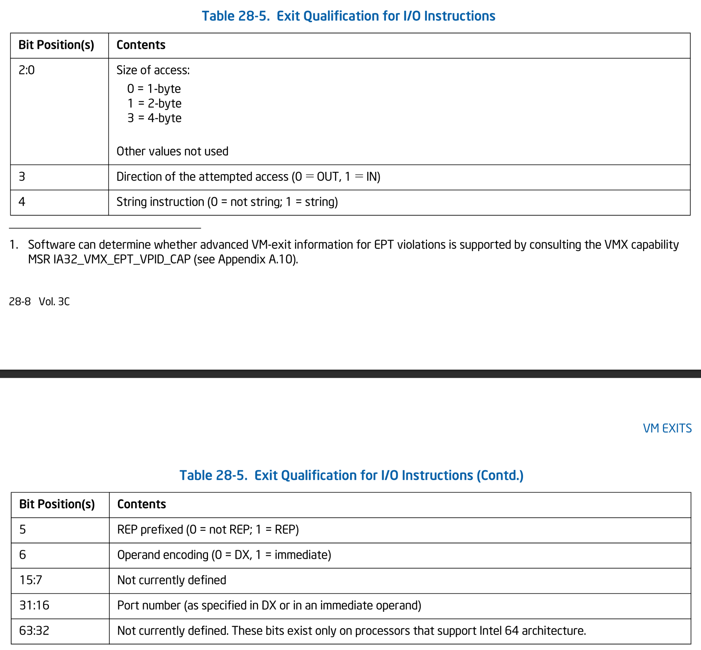

# I/O の仮想化

## Table of Contents

<!-- toc -->

## 雛形の作成

まずは I/O Access を起因とする VM Exit のハンドラの雛形を書いてあげます。
I/O Access を起因とする VM Exit は、CR Access と同様に **Exit Qualification** を提供します:


*Exit Qualification for I/O Instructions. SDM Vol.3C Table 28-5.*

Qualification には、アクセス帳・アクセス方向・ポート番号等の情報が格納されています。
I/O 用の Exit Qualification を表す構造体を定義します:

```ymir/arch/x86/vmx/common.zig
pub const qual = struct {
    pub const QualIo = packed struct(u64) {
        /// Size of access.
        size: Size,
        /// Direction of the attempted access.
        direction: Direction,
        /// String instruction.
        string: bool,
        /// Rep prefix.
        rep: bool,
        /// Operand encoding.
        operand_encoding: OperandEncoding,
        /// Not used.
        _reserved2: u9,
        /// Port number.
        port: u16,
        /// Not used.
        _reserved3: u32,

        const Size = enum(u3) {
            /// Byte.
            byte = 0,
            /// Word.
            word = 1,
            /// Dword.
            dword = 3,
        };

        const Direction = enum(u1) {
            out = 0,
            in = 1,
        };

        const OperandEncoding = enum(u1) {
            /// I/O instruction uses DX register as port number.
            dx = 0,
            /// I/O instruction uses immediate value as port number.
            imm = 1,
        };
    };
    ...
}
```

Ymir では [OUT](https://www.felixcloutier.com/x86/out) / [IN](https://www.felixcloutier.com/x86/in) 命令だけをサポートすることにします。
Qualification の `.string` で表現されるような [OUTS](https://www.felixcloutier.com/x86/outs:outsb:outsw:outsd) / [INS](https://www.felixcloutier.com/x86/ins:insb:insw:insd) はサポートしません。
ただし、これらの命令は OUT 元と IN 先がレジスタではなくメモリであるということを除いてとりわけ難しいことはないため、興味がある人は実装してみてください。

続いて、I/O Access のハンドラを定義します。
ハンドラはアクセスの方向ごとに定義し、各ハンドラではアクセスされたポート番号に応じて処理をします。
今のところはどのポートに対するハンドラも定義していないため、全ポートアクセスを `else` で捕捉し、アボートすることにします:

```ymir/arch/x86/vmx/io.zig
pub fn handleIo(vcpu: *Vcpu, qual: QualIo) VmxError!void {
    return switch (qual.direction) {
        .in => try handleIoIn(vcpu, qual),
        .out => try handleIoOut(vcpu, qual),
    };
}

fn handleIoIn(vcpu: *Vcpu, qual: QualIo) VmxError!void {
    const regs = &vcpu.guest_regs;
    switch (qual.port) {
        else => {
            log.err("Unhandled I/O-in port: 0x{X}", .{qual.port});
            vcpu.abort();
        },
    }
}

fn handleIoOut(vcpu: *Vcpu, qual: QualIo) VmxError!void {
    switch (qual.port) {
        else => {
            log.err("Unhandled I/O-out port: 0x{X}", .{qual.port});
            vcpu.abort();
        },
    }
}
```

VM Exit ハンドラである `Vcpu.handleExit()` では、Exit Reason が `.io` であった場合に Exit Qualification を取得します。
取得した Qualification を先ほどのハンドラに渡せば、雛形の完成です:

```ymir/arch/x86/vmx/vcpu.zig
    fn handleExit(self: *Self, exit_info: vmx.ExitInfo) VmxError!void {
        switch (exit_info.basic_reason) {
            .io => {
                const q = try getExitQual(qual.QualIo);
                try io.handleIo(self, q);
                try self.stepNextInst();
            },
            ...
        }
    }
```

I/O Access が VM Exit を発生させるようにするためには、VMCS Execution Controls カテゴリの Primary Processor-Based VM-Execution Controls にある `.unconditional_io` というフィールドを設定する必要があります:

```ymir/arch/x86/vmx/vmcs.zig
fn setupExecCtrls(vcpu: *Vcpu, _: Allocator) VmxError!void {
    ...
    ppb_exec_ctrl.unconditional_io = true;
    ...
}
```

これによって、全ての I/O Access が VM Exit を発生させるようになります。
ポート番号ごとに VM Exit が発生するかどうかを決定させるためには **I/O Bitmap** を利用することができます。
I/O Bitmap は各ビットがポート番号に対応しており、`1` にセットされているポートに対する I/O Access が VM Exit を発生させるようになります。
I/O Bitmap は Primary Processor-Based VM-Execution Controls にある `.use_io_bitmap` というフィールドで有効化することができます。
ただし、本シリーズでは先ほどの Unconditional I/O Exit を利用することにし、I/O Bitmap は使用しません。

## PCI (Unsupported)

Linux が起動してから最初にアクセスする I/O ポートは `0x0CF8` に位置する **PCI Configuration Address** です。
[PCI](https://wiki.osdev.org/PCI) は周辺デバイスとの通信に用いられる規格であり、
Configuration Address と `0x0CFC` に位置する **PCI Configuration Data** にアクセスすることで各 PCI デバイスを探索することができます。

各デバイスはそれぞれの **BAR: Base Address Register** と呼ばれる空間を持っており、
Linux は検出されたデバイスの BAR に対してアクセスすることでデバイスの情報を取得および設定します。
前回までは PCI を仮想化しておらずホストの PCI 空間をそのままゲストに露出していました。
ここでゲストが教えられた BAR アドレスは、EPT で設定したゲストの物理アドレス空間内に存在していません。
これにより、ゲストが BAR にアクセスしようとすると EPT Violation が発生してしまいます。
[前チャプターの最後](./cr.md#まとめ) で見た EPT Violation によるアボートはこれが原因だったというわけです。

残念ながら、Ymir では PCI の仮想化はサポートしません。
出力も入力もシリアルで十分であり、ブートしてシェルを動かす程度のことであれば PCI は必要ありません。
とはいえ、PCI を有効化できると外部ストレージや外付けキーボードも NIC も使えるようになり、とても楽しいです。
興味がある人はぜひ挑戦してみてください。

PCI の無効化は、単に RAX に `0` を返すだけで十分です。
Linux は PCI を使う前に Probing という処理をするのですが、常に RAX を `0` にすることで Probing が失敗するようになります。
Probing が失敗すると、以降 Linux は PCI を利用しなくなります:

```ymir/arch/x86/vmx/io.zig
fn handleIoIn(vcpu: *Vcpu, qual: QualIo) VmxError!void {
    switch (qual.port) {
        0x0CF8...0x0CFF => regs.rax = 0, // PCI. Unimplemented.
        0xC000...0xCFFF => {}, // Old PCI. Ignore.
        ...
    }
}

fn handleIoOut(vcpu: *Vcpu, qual: QualIo) VmxError!void {
    switch (qual.port) {
        0x0CF8...0x0CFF => {}, // PCI. Unimplemented.
        0xC000...0xCFFF => {}, // Old PCI. Ignore.
        ...
    }
}
```

## シリアル

なにはともあれシリアル出力。
地球が生まれた46億年前から変わらない普遍の真理です。
まずはシリアルを仮想化していきましょう。
これまでもゲストの Linux はシリアルを使ってログを出力していました。
シリアルは仮想化していなかったため、ゲストはホストのシリアルに対して直接アクセスをしていたということです。
正直このままでも問題はないといえばないです。
割り込み周りで良くないことが発生しそうな予感がしますが、おそらく動くことには動くと思います。
しかしながら、**せっかくなので** Ymir ではシリアルも仮想化してあげることにします。
特に強い理由はないですが、そもそも Type-1 Hypervisor をフルスクラッチで書くような人なんていうのは、
「せっかくなので」が一番の原動力になっているでしょうし、理由なく手間をかけたって良いでしょう。

シリアルの I/O ポートは以下のように割り振られています:

| Port Start | Description |
| ---- | ----------- |
| `0x02F8` - `0x3EF` | COM4 |
| `0x02F8` - `0x2FF` | COM2 |
| `0x03E8` - `0x3EF` | COM3 |
| `0x03F8` - `0x3FF` | COM1 |

Ymir では COM1 ポートだけをサポートすることにします。

[シリアル出力](../kernel/serial_output.md#シリアルの基本の定義) で扱ったように、
シリアルは8個の I/O ポートを12個のレジスタにマップしています。
そのうち、以下のレジスタを仮想化することにします。
なお、同列に書いてあるレジスタは同じポートにマップされているものの、DLAB の値やアクセス方向(RW)に応じて異なるレジスタにマップされるものたちです:

- **TX / (DLL)**: RX はパススルー / TX は Ymir が代わりに書き込み
- **IER / DLH**: 値を別途保持
- **MCR**: 値を別途保持
- **LCR**: 読み込みは常に `0` / 書き込みはブロック
- **SR**: 読み込みは常に `0` / 書き込みはブロック
- **FCR**: 書き込みをブロック

以下のレジスタは全てパススルーします:

- **RX**
- **IIR**
- **LSR**: Read-Only
- **MSR**: Read-Only

仮想化するレジスタの内、値を実際のシリアルレジスタとは別にソフトウェア的に保持する必要のある3レジスタのために、
これらの値を保持する構造体を定義し、`Vcpu` 構造体に持たせます:

```ymir/arch/x86/vmx/io.zig
pub const Serial = struct {
    /// Interrupt Enable Register.
    ier: u8 = 0,
    /// Modem Control Register.
    mcr: u8 = 0,

    pub fn new() Serial {
        return Serial{};
    }
};
```

まずは読み込みアクセスについて仮想化します。
読み込みで使われるレジスタは、RX / DLL / IER / DLH / IIR / LCR / MCR / LSR / MSR / SR です:

```ymir/arch/x86/vmx/io.zig
fn handleSerialIn(vcpu: *Vcpu, qual: QualIo) VmxError!void {
    const regs = &vcpu.guest_regs;
    switch (qual.port) {
        // Receive buffer.
        0x3F8 => regs.rax = am.inb(qual.port), // pass-through
        // Interrupt Enable Register (DLAB=1) / Divisor Latch High Register (DLAB=0).
        0x3F9 => regs.rax = vcpu.serial.ier,
        // Interrupt Identification Register.
        0x3FA => regs.rax = am.inb(qual.port), // pass-through
        // Line Control Register (MSB is DLAB).
        0x3FB => regs.rax = 0x00,
        // Modem Control Register.
        0x3FC => regs.rax = vcpu.serial.mcr,
        // Line Status Register.
        0x3FD => regs.rax = am.inb(qual.port), // pass-through
        // Modem Status Register.
        0x3FE => regs.rax = am.inb(qual.port), // pass-through
        // Scratch Register.
        0x3FF => regs.rax = 0, // 8250
        else => {
            log.err("Unsupported I/O-in to the first serial port: 0x{X}", .{qual.port});
            vcpu.abort();
        },
    }
}
```

各レジスタに対する対応は、先ほどリストで示したとおりです。
パススルーするレジスタは、IN 命令を使って実際のシリアルのレジスタから値を読み込み、そのままゲストに渡します。
別途値を保持しているレジスタの場合は、保持している値をゲストに渡します。

続いて書き込みに対するハンドラを定義します。
**書き込みでは TX への書き込みを除いてパススルーをしません**。
これにより、ゲストの出力がホストに影響することがなくなります。
書き込みで使われるレジスタは、TX / DLL / IER / DLH / FCR / LCR / MCR / SR です。
リストに挙げたレジスタの内、LSR と MSR は読み込み専用なので書き込みが発生することはありません。
よって分岐の数は少なくなります:

```ymir/arch/x86/vmx/io.zig
const sr = arch.serial;

fn handleSerialOut(vcpu: *Vcpu, qual: QualIo) VmxError!void {
    const regs = &vcpu.guest_regs;
    switch (qual.port) {
        // Transmit buffer.
        0x3F8 => sr.writeByte(@truncate(regs.rax), .com1),
        // Interrupt Enable Register.
        0x3F9 => vcpu.serial.ier = @truncate(regs.rax),
        // FIFO control registers.
        0x3FA => {}, // ignore
        // Line Control Register (MSB is DLAB).
        0x3FB => {}, // ignore
        // Modem Control Register.
        0x3FC => vcpu.serial.mcr = @truncate(regs.rax),
        // Scratch Register.
        0x3FF => {}, // ignore
        else => {
            log.err("Unsupported I/O-out to the first serial port: 0x{X}", .{qual.port});
            vcpu.abort();
        },
    }
}
```

TX への書き込みは、[シリアル出力のチャプター](../kernel/serial_output.md#シリアルコンソールによるログ出力)
で実装した `Serial.writeByte()` を使うことで、Ymir が代わりに行います。

> [!TIP] I/O Bitmap
> I/O Bitmap を設定することで、ポートごとに VM Exit を発生させるかどうかを決定させることができます。
> シリアルの仮想化ではアクセスが起こってもパススルーするレジスタがいくつかありました。
> そのようなレジスタのポートに対しては I/O Bitmap で VM Exit を発生させないようにすることで、
> VM Exit によるオーバーヘッドを抑えることができます。

実装したシリアルのハンドラを、先ほどの I/O ハンドラに追加します。
前述したように、サポートするのは COM1 ポートだけであり、それ以外の場合には単純に無視するようにしておきます:

```ymir/arch/x86/vmx/io.zig
fn handleIoIn(vcpu: *Vcpu, qual: QualIo) VmxError!void {
    const regs = &vcpu.guest_regs;
    switch (qual.port) {
        0x02E8...0x02EF => {}, // Fourth serial port. Ignore.
        0x02F8...0x02FF => {}, // Second serial port. Ignore.
        0x03E8...0x03EF => {}, // Third serial port. Ignore.
        0x03F8...0x03FF => try handleSerialIn(vcpu, qual),
        ...
    }
}

fn handleIoOut(vcpu: *Vcpu, qual: QualIo) VmxError!void {
    switch (qual.port) {
        0x02E8...0x02EF => {}, // Fourth serial port. Ignore.
        0x02F8...0x02FF => {}, // Second serial port. Ignore.
        0x03E8...0x03EF => {}, // Third serial port. Ignore.
        0x03F8...0x03FF => try handleSerialOut(vcpu, qual),
        ...
    }
}
```

ここまででゲストを動かすと、前チャプターほどではありませんがそれなりのところまで起動が進むと思います。
そして何より、前チャプターまでと同様にシリアルログが出力されます。
**見た目は一切変わりませんが、前回までとは異なりシリアルの出力が Ymir によって仮想化されています**。
ある程度進んだところで、今度は `Unhandled I/O-out port: 0x43` というエラーメッセージとともにアボートすることでしょう。
このポートは PIT のものです。
次はこいつを仮想化していきましょう。

## PIT

**PIT: Programmable Interval Timer** は周期的に割り込みを発生させるためのデバイスです。
IRQ 0 に接続されており、OS は PIT からの割り込みを受け取ることでスケジューリングに必要な時間等を計測することができます。

Ymir カーネルはスケジューラを持っていません。
他にもタイマーが必要なコンポーネントはありません。
したがって、PIT を使うことがありません。
そのため、PIT は仮想化せずにゲストにパススルーすることにします:

```ymir/arch/x86/vmx/io.zig
fn handlePitIn(vcpu: *Vcpu, qual: QualIo) VmxError!void {
    const regs = &vcpu.guest_regs;
    switch (qual.size) {
        .byte => regs.rax = @as(u64, am.inb(qual.port)),
        .word => regs.rax = @as(u64, am.inw(qual.port)),
        .dword => regs.rax = @as(u64, am.inl(qual.port)),
    }
}

fn handlePitOut(vcpu: *Vcpu, qual: QualIo) VmxError!void {
    switch (qual.size) {
        .byte => am.outb(@truncate(vcpu.guest_regs.rax), qual.port),
        .word => am.outw(@truncate(vcpu.guest_regs.rax), qual.port),
        .dword => am.outl(@truncate(vcpu.guest_regs.rax), qual.port),
    }
}
```

このへんは、前述した I/O Bitmap を使ってパススルーすることで、より簡単にかつ効率的に実装することができます。
興味がある人はぜひ本家 Ymir を参照しつつ実装してみてください。
今回は、唯一アクセスサイズによる分岐だけをおこないパススルーしています。
これらのハンドラを PIT へのアクセスで呼び出すようにします:

```ymir/arch/x86/vmx/io.zig
fn handleIoIn(vcpu: *Vcpu, qual: QualIo) VmxError!void {
    switch (qual.port) {
        0x0040...0x0047 => try handlePitIn(vcpu, qual),
        ...
    }
}
fn handleIoOut(vcpu: *Vcpu, qual: QualIo) VmxError!void {
    switch (qual.port) {
        0x0040...0x0047 => try handlePitOut(vcpu, qual),
        ...
    }
}
```

## PIC

大本命、PIC を仮想化していきます。
他の仮想化するコンポーネントと同様ですが、**「とりあえず動くこと」を目標に全ての機能を完全に実装することはしません**。
PIC は以下の I/O ポートを持ちます:

| Port | Description |
| ---- | ----------- |
| `0x20` | Primary PIC Command |
| `0x21` | Primary PIC Data |
| `0xA0` | Secondary PIC Command |
| `0xA1` | Secondary PIC Data |

[Ymir カーネルで PIC を初期化した際に扱った](../kernel/pic.md#command-words)ように、
PIC の初期化は **ICW** と呼ばれるコマンド群によって段階的に行われます。
復習しておくと、初期化は以下の流れで行われます:

- **ICW1**: 初期化開始。ICW1 だけコマンドポートに送信。
- **ICW2**: 割り込みベクタのオフセット。
- **ICW3**: Secondary PIC の設定。
- **ICW4**: モード設定

また、起動したあとは **OCW** と呼ばれるコマンド群によって割り込みの設定や EOI が行われます。

ホスト側では以下の情報を記憶することにします。
それ以外の設定については、Ymir が PIC に対して既に行っている設定をそのまま使うこととし、ゲストからの要求は無視します:

- 初期化フェーズ
- 割り込みマスク
- 割り込みベクタ

それぞれの情報は Primary と Secondary のそれぞれについて記憶する必要があります。
仮想化された PIC を表す構造体を定義し、`Vcpu` 構造体に持たせます:

```ymir/arch/x86/vmx/io.zig
pub const Pic = struct {
    /// Mask of the primary PIC.
    primary_mask: u8,
    /// Mask of the secondary PIC.
    secondary_mask: u8,
    /// Initialization phase of the primary PIC.
    primary_phase: InitPhase = .uninitialized,
    /// Initialization phase of the secondary PIC.
    secondary_phase: InitPhase = .uninitialized,
    /// Vector offset of the primary PIC.
    primary_base: u8 = 0,
    /// Vector offset of the secondary PIC.
    secondary_base: u8 = 0,

    const InitPhase = enum {
        uninitialized,  // ICW1 が送信される前
        phase1,         // ICW1 が送信された後
        phase2,         // ICW2 が送信された後
        phase3,         // ICW3 が送信された後
        inited,         // ICW4 が送信され初期化終了
    };

    pub fn new() Pic {
        return Pic{
            .primary_mask = 0xFF,
            .secondary_mask = 0xFF,
        };
    }
};
```

まずは PIC への IN 命令に対するハンドラを定義します。
読み込みはデータポートからのみ行われると想定します。
また、読み込みは PIC の初期化前・初期化後にのみ行われ、初期化の最中に行われることはないとします。
データポートから読み込まれる値は本来は直前の OWC の種類によって異なるのですが、
**本シリーズでは全て割り込みマスクを返すことにします**。
厳密には正しくない実装ですが、この実装でも Linux はとりあえず動くので簡単のためにこのようにしています。
余力がある人は直前の OWC の内容を保存し、その値をもとに適切な値を返すようにしてみてください:

```ymir/arch/x86/vmx/io.zig
fn handlePicIn(vcpu: *Vcpu, qual: QualIo) VmxError!void {
    const regs = &vcpu.guest_regs;
    const pic = &vcpu.pic;

    switch (qual.port) {
        // Primary PIC data.
        0x21 => switch (pic.primary_phase) {
            .uninitialized, .inited => regs.rax = pic.primary_mask,
            else => vcpu.abort(),
        },
        // Secondary PIC data.
        0xA1 => switch (pic.secondary_phase) {
            .uninitialized, .inited => regs.rax = pic.secondary_mask,
            else => vcpu.abort(),
        },
        else => vcpu.abort(),
    }
}
```

対象のポートに応じて Primary か Secondary かを分岐します。
読み込みは初期化前か初期化後にのみ行われることを想定しているため、初期化中に読み込みが行われた場合はアボートします。
あとは保存していた割り込みマスクを返すだけの簡単な実装です。

続いて OUT 命令に対するハンドラを定義します。

```ymir/arch/x86/vmx/io.zig
fn handlePicOut(vcpu: *Vcpu, qual: QualIo) VmxError!void {
    const regs = &vcpu.guest_regs;
    const pic = &vcpu.pic;
    const dx: u8 = @truncate(regs.rax);

    switch (qual.port) {
        // Primary PIC command.
        0x20 => switch (dx) {
            0x11 => pic.primary_phase = .phase1,
            // Specific-EOI.
            // It's Ymir's responsibility to send EOI, so guests are not allowed to send EOI.
            0x60...0x67 => {},
            else => vcpu.abort(),
        },
        // Primary PIC data.
        0x21 => switch (pic.primary_phase) {
            .uninitialized, .inited => pic.primary_mask = dx,
            .phase1 => {
                log.info("Primary PIC vector offset: 0x{X}", .{dx});
                pic.primary_base = dx;
                pic.primary_phase = .phase2;
            },
            .phase2 =>
                if (dx != (1 << 2)) vcpu.abort(),
                else pic.primary_phase = .phase3,
            .phase3 => pic.primary_phase = .inited,
        },

        // Secondary PIC command.
        0xA0 => switch (dx) {
            0x11 => pic.secondary_phase = .phase1,
            // Specific-EOI.
            // It's Ymir's responsibility to send EOI, so guests are not allowed to send EOI.
            0x60...0x67 => {},
            else => vcpu.abort(),
        },
        // Secondary PIC data.
        0xA1 => switch (pic.secondary_phase) {
            .uninitialized, .inited => pic.secondary_mask = dx,
            .phase1 => {
                log.info("Secondary PIC vector offset: 0x{X}", .{dx});
                pic.secondary_base = dx;
                pic.secondary_phase = .phase2;
            },
            .phase2 =>
                if (dx != 2) vcpu.abort(),
                else pic.secondary_phase = .phase3,
            .phase3 => pic.secondary_phase = .inited,
        },
        else => vcpu.abort(),
    }
}
```

まず、コマンドポートに対して書き込む値は2通りのみを想定します。
1つ目が `0x11` であり、これは ICW1 です。
初期化を開始するため、仮想 PIC に `.phase1` をセットします。
2つ目が `0x60` から `0x67` までの8つの値であり、この値は EOI を表します。
各値と `0x60` とのオフセットが EOI を送信する IRQ 番号に対応しています。
のちのチャプターで扱いますが、**本シリーズでは PIC に対して EOI を送信するのは Ymir の責任** とします。
ゲストが EOI を送信することは一切許可しません。
よって、EOI が送信された場合には単純に無視します。

データポートへの書き込みは、初期化フェーズに応じて処理を分岐します。
初期化前と初期化後の場合は全て割り込みマスク (**IMR**) への書き込みとみなし、仮想 PIC の `.{primary,secondary}_mask` に書き込みます。
このマスクの値は、のちほどゲストへ割り込みを注入する際に使います。
`.phase1` の書き込みは ICW2 であり、ベクタオフセットを設定します。
`.phase2` の書き込みは ICW3 であり、Secondary PIC の接続先を設定します。
Ymir では、Secondary PIC が Primary PIC の IRQ2 にカスケードされている状況のみを想定します。
`.phase3` の書き込みは ICW4 であり、モード設定をします。
モードは Ymir が PIC に直接設定した値をそのまま使いまわすため、ゲストからの要求は無視します。

## その他のポート

その他のポートについては、無視するかアボートするかのどちらかを選択します。
Linux が起動までにアクセスするポートへの I/O は無視することにし、それ以外はアボートすることにします。
Linux がアクセスするポートは、以下のとおりです:

| Ports | Description |
| ----- | ----------- |
| `[0x0060, 0x0064]` | PS/2 |
| `[0x0070, 0x0071]` | RTC |
| `[0x0080, 0x008F]` | DMA |
| `[0x03B0, 0x03DF]` | VGA |

最終的に、I/O Exit ハンドラは以下のようになります:

```ymir/arch/x86/vmx/io.zig
fn handleIoIn(vcpu: *Vcpu, qual: QualIo) VmxError!void {
    const regs = &vcpu.guest_regs;
    switch (qual.port) {
        0x0020...0x0021 => try handlePicIn(vcpu, qual),
        0x0040...0x0047 => try handlePitIn(vcpu, qual),
        0x0060...0x0064 => regs.rax = 0,                // PS/2. Unimplemented.
        0x0070...0x0071 => regs.rax = 0,                // RTC. Unimplemented.
        0x0080...0x008F => {},                          // DMA. Unimplemented.
        0x00A0...0x00A1 => try handlePicIn(vcpu, qual),
        0x02E8...0x02EF => {},                          // Fourth serial port. Ignore.
        0x02F8...0x02FF => {},                          // Second serial port. Ignore.
        0x03B0...0x03DF => regs.rax = 0,                // VGA. Uniimplemented.
        0x03E8...0x03EF => {},                          // Third serial port. Ignore.
        0x03F8...0x03FF => try handleSerialIn(vcpu, qual),
        0x0CF8...0x0CFF => regs.rax = 0,                // PCI. Unimplemented.
        0xC000...0xCFFF => {},                          // Old PCI. Ignore.
        else => vcpu.abort(),
    }
}

fn handleIoOut(vcpu: *Vcpu, qual: QualIo) VmxError!void {
    const regs = &vcpu.guest_regs;
    switch (qual.port) {
        0x0020...0x0021 => try handlePicOut(vcpu, qual),
        0x0040...0x0047 => try handlePitOut(vcpu, qual),
        0x0060...0x0064 => {},                          // PS/2. Unimplemented.
        0x0070...0x0071 => {},                          // RTC. Unimplemented.
        0x0080...0x008F => {},                          // DMA. Unimplemented.
        0x00A0...0x00A1 => try handlePicOut(vcpu, qual),
        0x02E8...0x02EF => {},                          // Fourth serial port. Ignore.
        0x02F8...0x02FF => {},                          // Second serial port. Ignore.
        0x03B0...0x03DF => {},                          // VGA. Uniimplemented.
        0x03F8...0x03FF => try handleSerialOut(vcpu, qual),
        0x03E8...0x03EF => {},                          // Third serial port. Ignore.
        0x0CF8...0x0CFF => {},                          // PCI. Unimplemented.
        0xC000...0xCFFF => {},                          // Old PCI. Ignore.
        else => vcpu.abort(),
    }
}
```

## まとめ

本チャプターでは、シリアルと PIC への I/O ポートアクセスを仮想化しました。
それ以外のポートについては、必要なもののみ無視するようにし、それ以外はアボートすることで対応しました。
シリアルと PIC の仮想化はとても完全といえるものではありませんが、ひとまず Linux を動かすには十分になっています。

それではここまでで一旦ゲストを動かしてみましょう:

```txt
...
[    0.000000] Dentry cache hash table entries: 16384 (order: 5, 131072 bytes, linear)
[    0.000000] Inode-cache hash table entries: 8192 (order: 4, 65536 bytes, linear)
[    0.000000] Fallback order for Node 0: 0
[    0.000000] Built 1 zonelists, mobility grouping on.  Total pages: 24944
[    0.000000] Policy zone: DMA32
[    0.000000] mem auto-init: stack:all(zero), heap alloc:off, heap free:off
[    0.000000] Memory: 59616K/102012K available (18432K kernel code, 2792K rwdata, 6704K rodata, 2704K init, 1292K bss, 42140K reserved, 0K cma-reserved)
[    0.000000] SLUB: HWalign=64, Order=0-3, MinObjects=0, CPUs=1, Nodes=1
[    0.000000] Kernel/User page tables isolation: enabled
Poking KASLR using i8254...
[    0.000000] Dynamic Preempt: voluntary
[    0.000000] rcu: Preemptible hierarchical RCU implementation.
[    0.000000] rcu:     RCU event tracing is enabled.
[    0.000000] rcu:     RCU restricting CPUs from NR_CPUS=64 to nr_cpu_ids=1.
[    0.000000]  Trampoline variant of Tasks RCU enabled.
[    0.000000] rcu: RCU calculated value of scheduler-enlistment delay is 100 jiffies.
[    0.000000] rcu: Adjusting geometry for rcu_fanout_leaf=16, nr_cpu_ids=1
[    0.000000] RCU Tasks: Setting shift to 0 and lim to 1 rcu_task_cb_adjust=1.
[    0.000000] NR_IRQS: 4352, nr_irqs: 32, preallocated irqs: 16
[INFO ] vmio    | Primary PIC vector offset: 0x30
[INFO ] vmio    | Secondary PIC vector offset: 0x38
[    0.000000] rcu: srcu_init: Setting srcu_struct sizes based on contention.
[    0.000000] Console: colour dummy device 80x25

[    0.000000] printk: legacy console [ttyS0] enabled
[    0.000000] printk: legacy console [ttyS0] enabled
[    0.000000] printk: legacy bootconsole [earlyser0] disabled
[    0.000000] printk: legacy bootconsole [earlyser0] disabled
[    0.000000] APIC disabled via kernel command line
[    0.000000] APIC: Keep in PIC mode(8259)
```

前チャプターと同様にログの前半部分は省略しています。
かなり起動が進んでいますね。
途中のログ出力から、Primary と Secondary の PIC のベクタオフセットがそれぞれ `0x30` と `0x38` に設定されていることがわかります。
Ymir と同じ値ですね。
まぁ Ymir 側が Linux と同じになるように設定したので当然ですが。

最後には、VM Exit するわけでもなくアボートするわけでもなく、**起動が停止してしまいます**。
この状態で QEMU monitor を開くか GDB をアタッチするかして RIP を調べてみると、`0xFFFFFFFF81002246` になっています。
`addr2line` で該当するソースコードを調べてみると、[calibrate_delay_converge()](https://github.com/torvalds/linux/blob/0a9b9d17f3a781dea03baca01c835deaa07f7cc3/init/calibrate.c#L197) という関数であることが分かります:

```init/calibrate.c
/* wait for "start of" clock tick */
ticks = jiffies;
while (ticks == jiffies)
    ; /* nothing */
/* Go .. */
ticks = jiffies;
```

この関数は `jiffies` が変化するまでひたすらに待ち続けます。
`jiffies` は [vmlinux.lds.S](https://github.com/torvalds/linux/blob/0a9b9d17f3a781dea03baca01c835deaa07f7cc3/arch/x86/kernel/vmlinux.lds.S#L44) において `jiffies_64` にエイリアスされています。
`jiffies_64` は [do_timer()](https://github.com/torvalds/linux/blob/0a9b9d17f3a781dea03baca01c835deaa07f7cc3/kernel/time/timekeeping.c#L2418-L2422) において加算されます。
この関数は [hpet_time_init()](https://github.com/torvalds/linux/blob/0a9b9d17f3a781dea03baca01c835deaa07f7cc3/arch/x86/kernel/time.c#L57) において IRQ 0 に対するハンドラとして登録されています。
以上のことより、IRQ 0 が割り込みを送信したら加算されるはずの `jiffies` がずっと変わらないために永遠に `while` から抜け出せずフリーズしているのだろうということが分かりますね。

なぜゲストにタイマー割り込みが送信されていないのでしょうか？
まず PIT はゲストに対してパススルーしているため、PIT の設定に問題はないはずです。
それから、VMCS の Primary Processor-Based VM-Execution Controls において `.external_interrupt` を設定していないため、
外部割り込みで VM Exit が発生することはなくゲストにそのまま通知されています。
みなさんもなぜタイマー割り込みが送信されていないのか考えてみてください。
まぁすぐに答えを言ってしまうんですが。
正解は、**今回仮想化した PIC において EOI を無視しているからです**。
[PIC のチャプター](../kernel/pic.md#eoi) で扱ったように、IRQ からの割り込み待ち一覧は **IRR** と呼ばれるレジスタに保存されます。
CPU が IRQ 割り込みを承認すると、**IRR** がクリアされる代わりに **ISR** に IRQ がセットされます。
この ISR に値がセットされている間、PIC はそれ以上割り込み信号を CPU に送信しなくなります。
ISR にセットされた IRQ は EOI を送信することでクリアされます。
この EOI を無視してしまうと、タイマーに限らず全ての割り込みが送信されなくなります。

以上がタイマー割り込みが発生せずに無限ループが発生する原因です。
なお、この問題は意図したものです。
Ymir では EOI を送信するのは Ymir の責任であるとします。
これにより、ゲストだけではなく Ymir も割り込みを受け取ることが可能になります
(まぁ Ymir は外部割り込みを受け取って何かをすることはないんですけどね...)。
次のチャプターでは割り込みを適切にホスト側で処理し、PIC への EOI の送信やゲストへの割り込みの注入をします。

## References

- [Serial Ports - OSDev Wiki](https://wiki.osdev.org/Serial_Ports)
- [Programmable Interval Timer - OSDev Wiki](https://wiki.osdev.org/Programmable_Interval_Timer)
