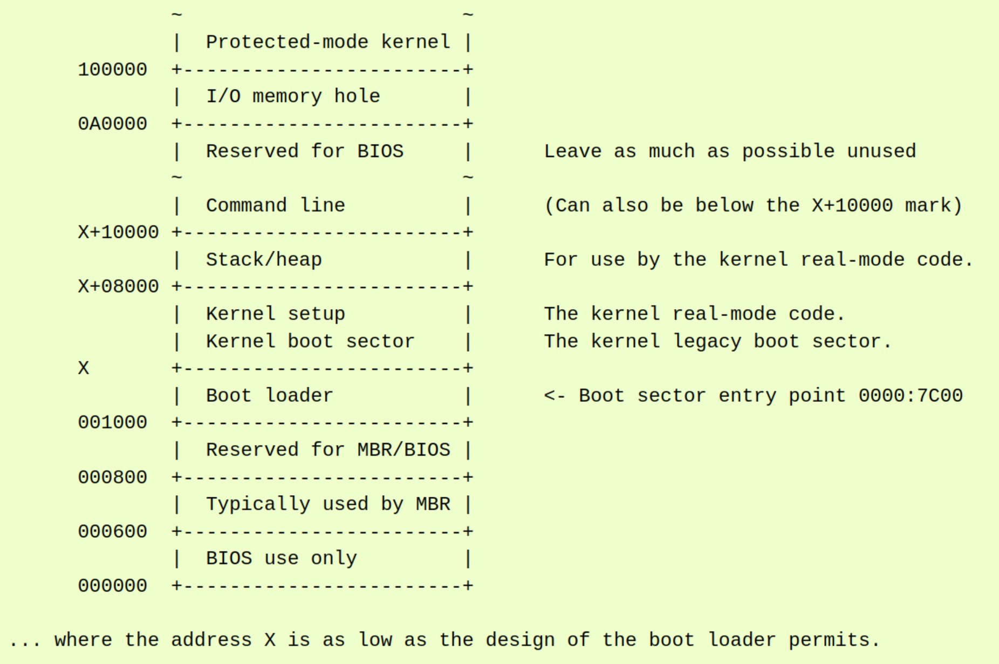
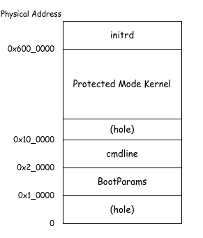

# Linux Boot Protocol

EPT を有効化しゲストを Unrestricted Guest にしたことで、ゲストをホストと異なるメモリ空間で実行することができるようになりました。
これで本シリーズの目標である Linux カーネルを起動する準備ができたことになります。
もちろんまだ Exit Handler を実装していないなど足りない部分は多々ありますが、それらは実際に Linux を動かそうとして発生したエラー・不具合をもとに随時追加していくことにしましょう。
本チャプターでは、Linux の x86 におけるブートプロトコルに従って Linux をロードし、処理をカーネルに渡すまでの流れを追っていきます。

## Table of Contents

<!-- toc -->

## Boot Process

Linux カーネルを起動する場合、通常は以下の手順を踏みます:

### 1. ブートローダへの遷移

Legacy BIOS がシステムの初期化をしたあと、[MBR: Master Boot Record](https://en.wikipedia.org/wiki/Master_boot_record) からブートローダをロードして制御を渡します[^mbr]。
UEFI の場合はブートローダが UEFI アプリとして起動されます。

BIOS/UEFI から直接実行されるブートローダとして有名なものには [GRUB2](https://docs.fedoraproject.org/en-US/quick-docs/grub2-bootloader/) や [coreboot](https://www.coreboot.org/) などがあります。
本シリーズではゲストにとってのブートローダの役割を Ymir が担うことにします。
そのため、ブートローダ自体をロードするという手順はスキップすることができます。

### 2. カーネルのロード

BIOS/UEFI からロードされたブートローダは、Linux が定義するブートプロトコルに従ってカーネルをロードします。
このプロトコルはアーキテクチャごとに定められています。
Ymir は x64 だけをサポートしているため、[x86 Boot Protocol](https://www.kernel.org/doc/html/v5.6/x86/boot.html) に従います。
x86 Boot Protocol v2.02 以降は以下のようなメモリレイアウトになります:


*x86 Linux Kernel Memory Layout. https://www.kernel.org/doc/html/v5.6/x86/boot.html*

x86 Boot Protocol において重要なデータ構造が **struct boot_params** です。
またの名を [Zero Page](https://docs.kernel.org/arch/x86/zero-page.html) とも呼びます。
この構造体は **bzImage** の先頭に配置されていて、BIOS/UEFI がシステムの情報および Linux のロードに必要な情報を渡すのに使われます。
ブートローダはこの構造体を適切な情報で埋めて、カーネルはこの構造体を使って初期化処理をすることになります。
厳密には、カーネルは `boot_params` の中の **Setup Headers** と呼ばれる構造体を使います。
これらの構造に関してはのちほど詳しく見ていくことにします。

### 3. カーネルの起動処理

ブートローダはカーネルをメモリにロードしたあと、カーネルのエントリポイントに制御を渡します。
x64 の場合にはエントリポイントは [startup_32()](https://github.com/torvalds/linux/blob/de2f378f2b771b39594c04695feee86476743a69/arch/x86/boot/compressed/head_64.S#L83) です。
ここに遷移する時点では、**Protected Mode + ページング無効の状態** にします。
`startup_32()` ではまずページングを有効化し、Long Mode への遷移が行われます。
その後、[startup_64()](https://github.com/torvalds/linux/blob/de2f378f2b771b39594c04695feee86476743a69/arch/x86/boot/compressed/head_64.S#L286) では圧縮されたカーネルイメージの展開処理が行われます。
展開が終わると、カーネルのエントリポイントである [startup_64()](https://github.com/torvalds/linux/blob/de2f378f2b771b39594c04695feee86476743a69/arch/x86/kernel/head_64.S#L38) に遷移します。
関数名が同じですが、前者は `kernel/compressed/head_64.S` のもので、後者は `kernel/head_64.S` のものです。
最終的には C の関数である [start_kernel()](https://github.com/torvalds/linux/blob/de2f378f2b771b39594c04695feee86476743a69/init/main.c#L903) に到達します。

本来であればこれらの処理はゲストの問題であり VMM が細かい流れを意識する必要はありません。
しかしながら、Ymir の開発中には問題の原因を特定するために Linux の処理の流れを辿りたい場合が多く出てくると思うため、
起動シーケンスを軽くでも抑えておくことはのちのち役立つかもしれません。

## Linux Kernel のビルド

Linux をロード・ブートするにはカーネルイメージがないと話になりません。
まずは Linux カーネルをビルドしましょう。
Linux のソースコードは [git://git.kernel.org](git://git.kernel.org/pub/scm/linux/kernel/git/stable/linux.git) からクローンすることができます。
以下のコマンドでリポジトリをクローンしてきてください:

```bash
git clone git://git.kernel.org/pub/scm/linux/kernel/git/stable/linux.git
cd linux
```

カーネルのコンフィグは `make menuconfig` で interactive に設定することができます。
デバッグ用に調整するには、不必要な機能を無効化し、できるだけサイズが小さくなるように設定することが本来は望ましいです。
ただし、本シリーズでは汎用性を考慮してデフォルトの設定でビルドすることにします。
このへんは好みに合わせて設定してください:

```bash
make defconfig
make -j$(nproc)
```

ビルドが終わると `/vmlinux` と `/arch/x86/boot/bzImage` というファイルが生成されます。
`vmxlinux` はカーネル本体を含む実行可能な ELF ファイルであり、`bzImage` は `vmlinux` を [zlib](https://www.zlib.net/) や [LZMA](https://en.wikipedia.org/wiki/Lempel%E2%80%93Ziv%E2%80%93Markov_chain_algorithm) を使って圧縮したものです[^compress]。
実際にカーネルイメージとして利用するのは `bzImage` の方ですが、GDB に読み込ませてデバッグする場合には圧縮されておらずシンボル情報もついている `vmlinux` を使います。

Ymir の開発中は Linux の方にログを仕込んでデバッグしたい場合が多々出てきます。
その際には `compile_commands.json` があるとコードエディタの機能が使いやすくなるため、以下のコマンドで生成しておきます。
`compile_commands.json` のエディタへの読み込ませ方は、お使いのエディタのドキュメントを参照してください[^compile_commands]:

```bash
python3 ./scripts/clang-tools/gen_compile_commands.py
```

最後に、ビルドしたカーネルイメージを Ymir のディレクトリにコピーします。
`bzImage` は Ymir カーネルと同様に FAT ファイルシステムのルートディレクトリに配置することにします:

```bash
cp ./arch/x86/boot/bzImage <Ymir Directory>/zig-out/img/bzImage
```

## `bzImage` の読み込み

まずは `bzImage` を FAT ファイルシステムからメモリ上に読み込みます。
単なるファイルとして読み込むだけなので、特にレイアウト等を意識する必要はありません。
FAT ファイルシステムを利用するには UEFI Boot Services の [Simple File System Protocol](https://uefi.org/specs/UEFI/2.10/13_Protocols_Media_Access.html#simple-file-system-protocol) を使います。

Boot Services は一旦 Ymir が起動してしまうと利用できなくなるため、これらの処理は Surtr の中で行います。
ちょうど [カーネルのパース](../bootloader/parse_kernel.md) でしたのと同様に、まずはファイルを開いてファイルサイズを取得します:

```surtr/boot.zig
const guest = openFile(root_dir, "bzImage") catch return .Aborted;

const guest_info_buffer_size: usize = @sizeOf(uefi.FileInfo) + 0x100;
var guest_info_actual_size = guest_info_buffer_size;
var guest_info_buffer: [guest_info_buffer_size]u8 align(@alignOf(uefi.FileInfo)) = undefined;

status = guest.getInfo(&uefi.FileInfo.guid, &guest_info_actual_size, &guest_info_buffer);
if (status != .Success) return status;
const guest_info: *const uefi.FileInfo = @alignCast(@ptrCast(&guest_info_buffer));
```

続いて必要なファイルサイズ分だけページを確保します。
この際、メモリタイプには `.LoaderData` を指定します。
[Page Allocator](../kernel/page_allocator.md) で実装したように、Ymir のページアロケータは UEFI から渡されたメモリマップの内、
`.ConventionalMemory` / `.BootServiceCode` タイプのメモリを Ymir が利用可能なメモリとして扱います。
今読み込もうとしているファイルデータは、ページアロケータの初期化後もゲストメモリにロードするまでは破棄したくないため、
ページアロケータが利用しない `.LoaderDAta` に配置することにします:

```surtr/boot.zig
var guest_start: u64 align(page_size) = undefined;
const guest_size_pages = (guest_info.file_size + (page_size - 1)) / page_size;
status = boot_service.allocatePages(.AllocateAnyPages, .LoaderData, guest_size_pages, @ptrCast(&guest_start));
if (status != .Success) return status;
var guest_size = guest_info.file_size;
```

最後に、確保したページに `bzImage` を読み込みます:

```surtr/boot.zig
status = guest.read(&guest_size, @ptrFromInt(guest_start));
if (status != .Success) return status;
log.info("Loaded guest kernel image @ 0x{X:0>16} ~ 0x{X:0>16}", .{ guest_start, guest_start + guest_size });
```

これで `bzImage` をメモリ上に読み込むことができました。
カーネルイメージをどこにロードしたのかを Ymir に伝えるために、Surtr と Ymir の間で共有されるデータである `BootInfo` に情報を追加します:

```surtr/defs.zig
pub const BootInfo = extern struct {
    ...
    guest_info: GuestInfo,
};

pub const GuestInfo = extern struct {
    /// Physical address the guest image is loaded.
    guest_image: [*]u8,
    /// Size in bytes of the guest image.
    guest_size: usize,
};
```

Ymir に渡す引数に、`GuestInfo` を追加します:

```surtr/boot.zig
const boot_info = defs.BootInfo{
    ...
    .guest_info = .{
        .guest_image = @ptrFromInt(guest_start),
        .guest_size = guest_size,
    },
};
```

以上で `bzImage` をメモリに読み込んで Ymir に渡すことができました。
なお、`BootInfo.guest_image` が指す `bzImage` のアドレスは物理アドレスであることに注意してください。
Ymir がメモリマップを再構築したあとはこのアドレスを使って直接アクセスすることができなくなります。
`ymir.mem.phys2virt()` を使って仮想アドレスに変換してからアクセスするようにしてください。

## Boot Parameters

### 構造体の定義

Linux に渡す `struct boot_params` を `BootParams` として定義します。
全てのフィールドを使うわけではないため、使わないフィールドは `_` で始まる名前をつけて無視しています:

```ymir/linux.zig
pub const BootParams = extern struct {
    /// Maximum number of entries in the E820 map.
    const e820max = 128;

    _screen_info: [0x40]u8 align(1),
    _apm_bios_info: [0x14]u8 align(1),
    _pad2: [4]u8 align(1),
    tboot_addr: u64 align(1),
    ist_info: [0x10]u8 align(1),
    _pad3: [0x10]u8 align(1),
    hd0_info: [0x10]u8 align(1),
    hd1_info: [0x10]u8 align(1),
    _sys_desc_table: [0x10]u8 align(1),
    _olpc_ofw_header: [0x10]u8 align(1),
    _pad4: [0x80]u8 align(1),
    _edid_info: [0x80]u8 align(1),
    _efi_info: [0x20]u8 align(1),
    alt_mem_k: u32 align(1),
    scratch: u32 align(1),
    /// Number of entries in the E820 map.
    e820_entries: u8 align(1),
    eddbuf_entries: u8 align(1),
    edd_mbr_sig_buf_entries: u8 align(1),
    kbd_status: u8 align(1),
    _pad6: [5]u8 align(1),
    /// Setup header.
    hdr: SetupHeader,
    _pad7: [0x290 - SetupHeader.header_offset - @sizeOf(SetupHeader)]u8 align(1),
    _edd_mbr_sig_buffer: [0x10]u32 align(1),
    /// System memory map that can be retrieved by INT 15, E820h.
    e820_map: [e820max]E820Entry align(1),
    _unimplemented: [0x330]u8 align(1),

    /// Instantiate a boot params from bzImage.
    pub fn from(bytes: []u8) @This() {
        return std.mem.bytesToValue(
            @This(),
            bytes[0..@sizeOf(@This())],
        );
    }
};
```

重要なフィールドは Setup Headers である `.hdr` と E820 マップである `.e820_map` です。
E820 マップについては[のちほど扱います](#e820-マップ)。
`BootParams` は `bzImage` の先頭に圧縮されていない状態で配置されています。
`from()` メソッドは `bzImage` のバイナリデータから `BootParams` を取り出します。

`BootParams` のうち、ブートローダ(Ymir)が設定してあげる必要のある主なフィールドが **Setup Headers** です。
Setup Headers を以下に定義します:

```ymir/linux.zig
pub const SetupHeader = extern struct {
    /// RO. The number of setup sectors.
    setup_sects: u8 align(1),
    root_flags: u16 align(1),
    syssize: u32 align(1),
    ram_size: u16 align(1),
    vid_mode: u16 align(1),
    root_dev: u16 align(1),
    boot_flag: u16 align(1),
    jump: u16 align(1),
    header: u32 align(1),
    /// RO. Boot protocol version supported.
    version: u16 align(1),
    realmode_swtch: u32 align(1),
    start_sys_seg: u16 align(1),
    kernel_version: u16 align(1),
    /// M. The type of loader. Specify 0xFF if no ID is assigned.
    type_of_loader: u8 align(1),
    /// M. Bitmask.
    loadflags: LoadflagBitfield align(1),
    setup_move_size: u16 align(1),
    code32_start: u32 align(1),
    /// M. The 32-bit linear address of initial ramdisk or ramfs.
    /// Specify 0 if there is no ramdisk or ramfs.
    ramdisk_image: u32 align(1),
    /// M. The size of the initial ramdisk or ramfs.
    ramdisk_size: u32 align(1),
    bootsect_kludge: u32 align(1),
    /// W. Offset of the end of the setup/heap minus 0x200.
    heap_end_ptr: u16 align(1),
    /// W(opt). Extension of the loader ID.
    ext_loader_ver: u8 align(1),
    ext_loader_type: u8 align(1),
    /// W. The 32-bit linear address of the kernel command line.
    cmd_line_ptr: u32 align(1),
    /// R. Higest address that can be used for initrd.
    initrd_addr_max: u32 align(1),
    kernel_alignment: u32 align(1),
    relocatable_kernel: u8 align(1),
    min_alignment: u8 align(1),
    xloadflags: u16 align(1),
    /// R. Maximum size of the cmdline.
    cmdline_size: u32 align(1),
    hardware_subarch: u32 align(1),
    hardware_subarch_data: u64 align(1),
    payload_offset: u32 align(1),
    payload_length: u32 align(1),
    setup_data: u64 align(1),
    pref_address: u64 align(1),
    init_size: u32 align(1),
    handover_offset: u32 align(1),
    kernel_info_offset: u32 align(1),

    /// Bitfield for loadflags.
    const LoadflagBitfield = packed struct(u8) {
        /// If true, the protected-mode code is loaded at 0x100000.
        loaded_high: bool = false,
        /// If true, KASLR enabled.
        kaslr_flag: bool = false,
        /// Unused.
        _unused: u3 = 0,
        /// If false, print early messages.
        quiet_flag: bool = false,
        /// If false, reload the segment registers in the 32bit entry point.
        keep_segments: bool = false,
        /// Set true to indicate that the value entered in the `heap_end_ptr` is valid.
        can_use_heap: bool = false,

        /// Convert to u8.
        pub fn to_u8(self: @This()) u8 {
            return @bitCast(self);
        }
    };

    /// The offset where the header starts in the bzImage.
    pub const header_offset = 0x1F1;

    /// Instantiate a header from bzImage.
    pub fn from(bytes: []u8) @This() {
        var hdr = std.mem.bytesToValue(
            @This(),
            bytes[header_offset .. header_offset + @sizeOf(@This())],
        );
        if (hdr.setup_sects == 0) {
            hdr.setup_sects = 4;
        }

        return hdr;
    }

    /// Get the offset of the protected-mode kernel code.
    /// Real-mode code consists of the boot sector (1 sector == 512 bytes)
    /// plus the setup code (`setup_sects` sectors).
    pub fn getProtectedCodeOffset(self: @This()) usize {
        return (@as(usize, self.setup_sects) + 1) * 512;
    }
};
```

これまたたくさんフィールドがありますが、Ymir で使うのはごく一部です。
全てのフィールドの意味については[ドキュメント](https://www.kernel.org/doc/html/v5.6/x86/boot.html#the-real-mode-kernel-header)を参照してください。
`from()` は `bzImage` のバイナリイメージから `SetupHeader` を取り出します。
Setup Headers は `bzImage` の先頭から `0x1F1` バイトのオフセットに固定で配置されています。
`.setup_sects` は Setup Code のサイズを 512byte セクタ単位で表しています。
この値が例えば `4` であれば、Setup Code のサイズは \\( 4 \times 512 = 2048 \\) byte となります。
なお、この値が `0` の場合には実際の値が `4` であるものとして扱うという仕様になっています。

`getProtectedCodeOffset()` はカーネルの Protected Mode Code が配置されているオフセットを返します。
カーネルの Realmode Code はブートセクタ (1セクタ) と Setup Code (`setup_sects` セクタ) から成ります。
Protected Mode のコードは Realmode Code の直後に配置されるため、`bzImage` の先頭から `1 + setup_sects` セクタの位置に Realmode Code が配置されていることになります。
このオフセットは後でカーネルをロードする際に使います。

### E820 Map

**E820** は BIOS が提供するメモリマップです。
`BootParams` に渡すことでカーネルがメモリのレイアウトを伝えることができます。
その名前は Real Mode で AX レジスタに `0xE820` をセットした状態で `INT 15h` 命令を実行して得られることに由来します。
`BootParams` は最大で128個の E820 を持つことができます。
ブートローダは有効な E820 エントリの数を `.e820_entries` にセットして渡します。

E820 エントリは以下のように定義します。
`addr` / `size` で指定されるメモリ領域に対して、`type` でその種類を示しています:

```ymir/linux.zig
pub const E820Entry = extern struct {
    addr: u64 align(1),
    size: u64 align(1),
    type: Type align(1),

    pub const Type = enum(u32) {
        /// RAM.
        ram = 1,
        /// Reserved.
        reserved = 2,
        /// ACPI reclaimable memory.
        acpi = 3,
        /// ACPI NVS memory.
        nvs = 4,
        /// Unusable memory region.
        unusable = 5,
    };
};
```

`BootParams` に E820 エントリを追加するためのメソッドを用意します:

```ymir/linux.zig
    pub fn addE820entry(
        self: *@This(),
        addr: u64,
        size: u64,
        type_: E820Entry.Type,
    ) void {
        self.e820_map[self.e820_entries].addr = addr;
        self.e820_map[self.e820_entries].size = size;
        self.e820_map[self.e820_entries].type = type_;
        self.e820_entries += 1;
    }
```

### メモリレイアウト

Ymir では以下の物理メモリレイアウトでカーネルをロードします:


*Memory Layout for Guest Linux*

`initrd` は本チャプターでは扱いませんが、カーネルに渡すファイルシステムのイメージを配置します。
`cmdline` にはカーネルに渡すコマンドラインオプションを配置します。
`BootParams` には先ほど定義した `BootParams` 構造体を配置します。
カーネルはこの構造体を使って初期化処理をします。

`initrd` と `cmdline` のアドレスは `BootParams` 内のフィールドで指定します。
`Protected Mode Kernel` のアドレスは VMCS RIP に設定します。
`BootParams` のアドレスはゲストに処理を渡す際に RSI レジスタに設定すると仕様で決まっています。

`linux.zig` にメモリレイアウトを定義します:

```ymir/linux.zig
pub const layout = struct {
    /// Where the kernel boot parameters are loaded, known as "zero page".
    /// Must be initialized by zeros.
    pub const bootparam = 0x0001_0000;
    /// Where the kernel cmdline is located.
    pub const cmdline = 0x0002_0000;
    /// Where the protected-mode kernel code is loaded
    pub const kernel_base = 0x0010_0000;
    /// Where the initrd is loaded.
    pub const initrd = 0x0600_0000;
};
```

### カーネルのロード

以上の情報を適切に設定する関数を `Vm` に追加します:

```ymir/vmx.zig
fn loadKernel(self: *Self, kernel: []u8) Error!void {
    const guest_mem = self.guest_mem;

    var bp = BootParams.from(kernel);
    bp.e820_entries = 0;

    // Setup necessary fields
    bp.hdr.type_of_loader = 0xFF;
    bp.hdr.ext_loader_ver = 0;
    bp.hdr.loadflags.loaded_high = true; // load kernel at 0x10_0000
    bp.hdr.loadflags.can_use_heap = true; // use memory 0..BOOTPARAM as heap
    bp.hdr.heap_end_ptr = linux.layout.bootparam - 0x200;
    bp.hdr.loadflags.keep_segments = true; // we set CS/DS/SS/ES to flag segments with a base of 0.
    bp.hdr.cmd_line_ptr = linux.layout.cmdline;
    bp.hdr.vid_mode = 0xFFFF; // VGA (normal)

    // Setup E820 map
    bp.addE820entry(0, linux.layout.kernel_base, .ram);
    bp.addE820entry(
        linux.layout.kernel_base,
        guest_mem.len - linux.layout.kernel_base,
        .ram,
    );
    ...
}
```

この関数は Surtr がメモリに読み込んだ `bzImage` のデータを受け取ります。
最初に設定している Setup Headers のフィールドは以下の意味を持ちます:

| Field | Description |
| --- | --- |
| `type_of_loader` | ブートローダの種類。Ymir には当然割り振られていないため `0xFF`(undefined) を指定する。 |
| `ext_loader_ver` | ブートローダのバージョン。未使用。 |
| `loaded_high` | Protected Mode Code を `0x100000` に配置する。`false` なら `0x10000` にロード。 |
| `can_use_heap` | `heap_end_ptr` で指定するヒープが利用できることを示す。`false` ならいくつかの機能が無効化される。 |
| `heap_end_ptr` | Real-mode のヒープ・スタックの終端アドレス (の Real-mode Code からのオフセット)。`-0x200` することが決められている。おそらく使われない。 |
| `keep_segments` | 32bit エントリポイントでセグメントレジスタをリロードするかどうか。`false` ならリロードされる。 |
| `cmd_line_ptr` | カーネルコマンドラインのアドレス。 |
| `vid_mode` | ビデオモード。`0xFFFF` は VGA(normal) を意味する。 |

続いて、E820 マップを設定します。
今回は Protected Mode Kernel までとそれ以降の2つのメモリ領域だけを設定しています。
2つの領域は隣接しているため1つにまとめて指定してもおそらく問題ありませんが、ここでは E820 マップが適切に渡せていることを検証しやすいようになんとなく分けています。

続いてコマンドラインを設定します。
コマンドラインは Setup Headers の `cmd_line_ptr` で指定されたアドレスに配置します。
Ymir ではデバッグしやすいように `console=ttyS0 earlyprintk=serial nokaslr` というコマンドラインを設定します。
これにより、KASLR が無効化され、ログはシリアルに対して出力されるようになります。
シリアル出力は QEMU によって `stdout` にリダイレクトされるため、QEMU の標準出力に Linux のログが出力されるようになります:

```ymir/vmx.zig
    const cmdline_max_size = if (bp.hdr.cmdline_size < 256) bp.hdr.cmdline_size else 256;
    const cmdline = guest_mem[linux.layout.cmdline .. linux.layout.cmdline + cmdline_max_size];
    const cmdline_val = "console=ttyS0 earlyprintk=serial nokaslr";
    @memset(cmdline, 0);
    @memcpy(cmdline[0..cmdline_val.len], cmdline_val);
```

続いて、設定した `BootParams` やカーネルの Protected-Mode Code をゲストメモリにロードします。
ゲストメモリにデータを配置するヘルパー関数を用意します:

```ymir/vmx.zig
fn loadImage(memory: []u8, image: []u8, addr: usize) !void {
    if (memory.len < addr + image.len) {
        return Error.OutOfMemory;
    }
    @memcpy(memory[addr .. addr + image.len], image);
}
```

これを利用して、`BootParams` をロードします:

```ymir/vmx.zig
    try loadImage(guest_mem, std.mem.asBytes(&bp), linux.layout.bootparam);
```

最後にカーネルをロードします。
`bzImage` におけるカーネルコードのオフセットは、先ほど実装した `SetupHeader.getProtectedCodeOffset()` で取得できます。
ロードするコードのサイズは `bzImage` 全体のサイズから Protected-Mode Code のオフセットを引いたものです:

```ymir/vmx.zig
    const code_offset = bp.hdr.getProtectedCodeOffset();
    const code_size = kernel.len - code_offset;
    try loadImage(
        guest_mem,
        kernel[code_offset .. code_offset + code_size],
        linux.layout.kernel_base,
    );
```

以上で `BootParams` の設定およびカーネルイメージのロードは完了です。
これらの関数を `Vm.setupGuestMemory()` から呼び出すように変更しましょう:

```ymir/vmx.zig.diff
         ) orelse return Error.OutOfMemory;

+        // Load kernel
+        try self.loadKernel(guest_image);
+
         // Create simple EPT mapping.
         const eptp = try impl.mapGuest(self.guest_mem, allocator);
```

また、`kernelMain()` で Surtr から渡されたカーネルイメージを `setupGuestMemory()` に渡すように変更します。
Surtr から渡されるカーネルイメージのアドレスは物理アドレスであるため、仮想アドレスに変換する必要があることに注意してください:

```ymir/main.zig
const guest_kernel = b: {
    const ptr: [*]u8 = @ptrFromInt(ymir.mem.phys2virt(guest_info.guest_image));
    break :b ptr[0..guest_info.guest_size];
};
try vm.setupGuestMemory(
    guest_kernel,
    mem.general_allocator,
    &mem.page_allocator_instance,
);
```

## VMCS の設定

Linux カーネルをゲストにロードすることができたため、VMCS を設定して Linux に制御を渡せるようにします。
まずはブートプロトコルに従って RIP と RSI を設定します。
RIP は Protected Mode Kernel のエントリポイントである `0x100000` に設定します。
RSI には `BootParams` のアドレスを設定します:

```ymir/arch/x86/vmx/vcpu.zig
fn setupGuestState(vcpu: *Vcpu) VmxError!void {
    ...
    try vmwrite(vmcs.guest.rip, linux.layout.kernel_base);
    vcpu.guest_regs.rsi = linux.layout.bootparam;
}
```

続いて、ゲストの CS を少し修正します。
カーネルに処理を渡した段階で、カーネルは Protected Mode であることが要求されます。
よって、CS は 64bit Code ではなく 32bit Code に設定する必要があります。
また、`BootParams.hdr.loadflags.keep_segments` を `true` に設定したため全てのセグメントセレクタを `0` に設定する必要があります:

```ymir/arch/x86/vmx/vcpu.zig
fn setupGuestState(vcpu: *Vcpu) VmxError!void {
    ...
    const cs_right = vmx.SegmentRights{
        .rw = true,
        .dc = false,
        .executable = true,
        .desc_type = .code_data,
        .dpl = 0,
        .granularity = .kbyte,
        .long = false,
        .db = 1,
    };
    ...
    try vmwrite(vmcs.guest.cs_sel, 0);
    ...
}
```

続いて EFER を設定します。
EFER には Long Mode に関する設定フィールドがあります。
Long Mode は無効化しておきたいため、全て `0` に設定します:

```ymir/arch/x86/vmx/vcpu.zig
fn setupGuestState(vcpu: *Vcpu) VmxError!void {
    ...
    try vmwrite(vmcs.guest.efer, 0);
    ...
}
```

以上で VMCS の設定は完了です。
前チャプターまで使っていた `blobGuest()` はもう使うことがないため削除してしまって問題ありません。

さあ、いよいよゲストとして Linux を起動してみましょう:

```txt
[INFO ] main    | Entered VMX root operation.
[INFO ] vmx     | Guest memory region: 0x0000000000000000 - 0x0000000006400000
[INFO ] vmx     | Guest kernel code offset: 0x0000000000005000
[DEBUG] ept     | EPT Level4 Table @ FFFF88800000A000
[INFO ] vmx     | Guet memory is mapped: HVA=0xFFFF888000A00000 (size=0x6400000)
[INFO ] main    | Setup guest memory.
[INFO ] main    | Starting the virtual machine...
[ERROR] vcpu    | Unhandled VM-exit: reason=arch.x86.vmx.common.ExitReason.cpuid
```

CPUID が原因で VM Exit すれば成功です。
これは `startup_32()` から呼ばれる [verify_cpu()](https://github.com/torvalds/linux/blob/de2f378f2b771b39594c04695feee86476743a69/arch/x86/kernel/verify_cpu.S#L34) で [CPUID](https://www.felixcloutier.com/x86/cpuid) が実行されるためです。
まだ CPUID のための Exit ハンドラを書いていないため、このエラーが出ています。
なにはともあれカーネルに処理が渡り、CPUID が実行されるまではゲストが実行されたことが分かります。
ゲストとして Linux を動かし始めることができました。

なお、GDB でゲストが動いていることを確認することもできます。
Ymir の起動後ゲストが起動するまでに、GDB から `target remote :1234` で接続してください。
その後、hardware breakpoint を `0x100000` に設定してください。
そのまま `continue` すると breakpoint で止まるはずです:

```gdb
$rax   : 0x0000000000000000
$rbx   : 0x0000000000000000
$rcx   : 0x0000000000000000
$rdx   : 0x0000000000000000
$rsp   : 0x0000000000000000
$rbp   : 0x0000000000000000
$rsi   : 0x0000000000010000 <exception_stacks+0x4000>  ->  0x0000000000000000 <fixed_percpu_data>
$rdi   : 0x0000000000000000
$rip   : 0x0000000000100000  ->  0xffff80567000b848
$r8    : 0x0000000000000000
$r9    : 0x0000000000000000
$r10   : 0x0000000000000000
$r11   : 0x0000000000000000
$r12   : 0x0000000000000000
$r13   : 0x0000000000000000
$r14   : 0x0000000000000000
$r15   : 0x0000000000000000
$eflags: 0x2 [ident align vx86 resume nested overflow direction interrupt trap sign zero adjust parity carry] [Ring=0]
$cs: 0x00 $ss: 0x00 $ds: 0x00 $es: 0x00 $fs: 0x00 $gs: 0x00
---------------------------------------------------------------------------------------------------------------------------------------------------------------------------------------------------------------------------------------------- code:x86:64 ----
    0xffffd 11ff               <NO_SYMBOL>   adc    edi, edi
    0xfffff 90                 <NO_SYMBOL>   nop
 -> 0x100000 48b800705680ff..   <NO_SYMBOL>   movabs rax, 0xffffffff80567000
    0x10000a 4883e810           <NO_SYMBOL>   sub    rax, 0x10
    0x10000e 488945f8           <NO_SYMBOL>   mov    QWORD PTR [rbp - 0x8], rax
    0x100012 0f92c0             <NO_SYMBOL>   setb   al
    0x100015 7202               <NO_SYMBOL>   jb     0x100019
    0x100017 eb27               <NO_SYMBOL>   jmp    0x100040
---------------------------------------------------------------------------------------------------------------------------------------------------------------------------------------------------------------------------------------------------- stack ----
[!] Cannot access memory at address 0x0
-------------------------------------------------------------------------------------------------------------------------------------------------------------------------------------------------------------------------------------------------- threads ----
[Thread Id:1] stopped 0x100000 <NO_SYMBOL> in unknown_frame, reason: BREAKPOINT
---------------------------------------------------------------------------------------------------------------------------------------------------------------------------------------------------------------------------------------------------- trace ----
[#0] 0x0000000000100000 <NO_SYMBOL>
[#1] 0x0000000000000000 <fixed_percpu_data>
```

なお、表示されている命令は間違っていることに注意してください。
これは GDB が命令を Long Mode 用として解釈しているからだと思われます。
実際には 32bit Protected Mode で動作しているため、このような表示になっています。
この状態で `si` を実行すると、RIP は `0x10000a` ではなく `0x100001` に進みます (最初の命令が実際は1byteの [CLD](https://www.felixcloutier.com/x86/cld) のため)。
仮想化されたゲストを GDB デバッグする際には、この他にも色々と誤った表示や不便があるため、注意が必要です。

## まとめ

本チャプターでは、Surtr と Ymir が協力して Linux カーネルイメージである `bzImage` を読み込みました。
読み込んだデータは EPT でゲストにマップされたメモリ上にロードしました。
また、x86 Boot Protocol で要求されたとおりに `BootParams` を設定し、コマンドラインも設定しました。
最後に VMCS を設定し、Unrestricted Guest モードで Linux の起動処理を開始することに成功しました。

起動処理を開始したカーネルは CPUID で停止しました。
CPUID 命令は CPU がサポートする機能を調べるための命令であり、ゲストの vCPU がサポートする機能はホストが自由に設定することができます。
見せたいものだけ見せるようにできるということです。
次のチャプターでは CPUID を原因とする VM Exit をハンドリングして、Linux の起動シーケンスがさらに進むようにします。

## References

- [The Linux/x86 Boot Protocol - The Linux Kernel](https://www.kernel.org/doc/html/v5.6/x86/boot.html)
- [Booting process of Linux - Wikipedia](https://en.wikipedia.org/wiki/Booting_process_of_Linux)

[^mbr]: MBR は 512 バイトしかないため、通常 MBR からロードされた最初のブートローダはよりサイズの大きいブートローダをロードするためだけに使われます。
このとき、MBR に入っているブートローダを *First Stage Bootloader* と呼び、続いてロードされるブートローダを *Second Stage Bootloader* と呼んだりします。
UEFI の場合にはサイズ制限がないため、直接ブートローダ全体をロードすることができます。
[^compress]: `bzImage` の圧縮アルゴリズムは config で変更可能です。
[^compile_commands]: [Frequently asked questions - Visual Studio Code](https://code.visualstudio.com/docs/cpp/faq-cpp#_how-do-i-get-intellisense-to-work-correctly)
