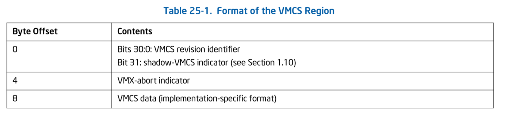
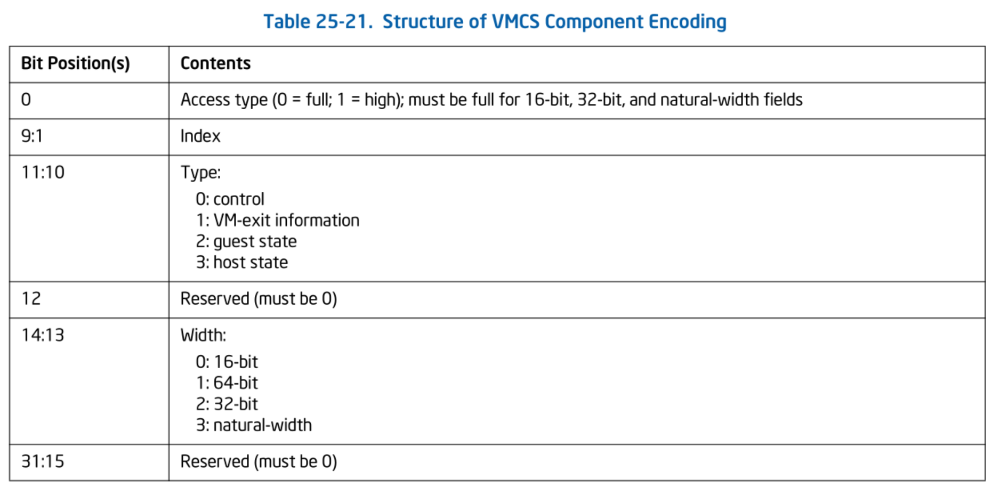

# VMCS の基礎

本チャプターでは、VMX における最も重要なデータ構造である VMCS について概観します。
なお、VMCS が制御する項目は膨大であるため、本チャプターおよび本シリーズではすべての項目を扱うわけではありません。
Ymir が Linux をブートするために必要な項目についてのみ触れることとします。

> [!IMPORTANT]
> 本チャプターの最終コードは [`whiz-vmm-vmcs`](https://github.com/smallkirby/ymir/tree/whiz-vmm-vmcs) ブランチにあります。

## Table of Contents

<!-- toc -->

## VMCS 概略

**VMCS: Virtual-Machine Control Data Structures** は VMX Non-root Operation における vCPU の挙動や VM Exit と VM Entry 時の挙動に関する設定を司るデータ構造です。

VMCS は以下の6つのカテゴリに分類されます:

| Category | Description |
| --- | --- |
| **Guest-State** | ゲストのプロセッサの状態を保持する。VM Entry でロードされ VM Exit で保存される。 |
| **Host-State** | ホストのプロセッサの状態を保持する。VM Exit でロードされる。|
| **VM-Execution Control** | VMX Non-root Operation の挙動を制御する。 |
| **VM-Exit Control** | VM Exit 時の挙動を制御する。 |
| **VM-Entry Control** | VM Entry 時の挙動を制御する。 |
| **VM-Exit Information** | VM Exit 時の情報を保持する。 |

### Guest-State

このカテゴリはゲストのプロセッサの状態を保持します。
VM Entry 時にこれらの状態が自動的にロードされることで、ゲストは VM Exit の直前の状態から実行を再開することができます。
保存・復帰されるプロセッサの状態には以下が含まれます:

- Control Registers
- RSP, RIP, RFLAGS
- Segment Registers の一部フィールド
- 一部の MSR

なお、RAX, RBX, ... 等の汎用レジスタは VMCS には保存されません。
これらのレジスタは VMM がソフトウェア的に保存およびロードしてあげる必要があります。

また、保存される MSR もごく一部です。
MSR へアクセスする [RDMSR](https://www.felixcloutier.com/x86/rdmsr) / [WRMSR](https://www.felixcloutier.com/x86/wrmsr) 命令は、特権命令として指定することができます。
この場合、ゲストが RDMSR/WRMSR すると VM Exit が発生し、VMM が実際に読み込み・書き込みする値を制御することができます。

### Host-State

このカテゴリは VMM のプロセッサの状態を保持します。
これらの値は VM Exit 時にロードされ、VMM は VM Entry する直前の状態から実行を再開することができます。
復帰されるプロセッサの状態には以下が含まれます:

- Control Registers
- RSP, RIP
- Segment Selector
- FS / GS / TR / GDTR / IDTR の Base
- 一部の MSR

**Host-State は Guest-State の場合と異なり、VM Entry の際に自動的に保存されることがありません**。
そのため、VM Entry する前に VMM はソフトウェア的にこれらの値を適切に設定する必要があります。
VM-Exit 時には、これらの値が自動的にロードされます。

### VM-Execution Control

このカテゴリは VMX Non-root Operation におけるプロセッサの挙動を制御します。
設定項目は6カテゴリの中でおそらく最も多いです。
そのため、ここでは代表的なフィールドのみを概観し、必要になった際に都度説明することにします。
このカテゴリは以下のフィールドを含みます:

- **Pin-Based VM-Execution Controls**: 割り込み・例外等の非同期イベントを制御する
- **Processor-Based VM-Execution Controls**: 主に特定の命令で発生するイベントを制御する
  - "特別な命令" とは [RDTSCP](https://www.felixcloutier.com/x86/rdtscp), [HLT](https://www.felixcloutier.com/x86/hlt), [INVLPG](https://www.felixcloutier.com/x86/invlpg), MOV to CR などのこと
- **Exception Bitmap**: どの例外で VM Exit するかを制御する
- **I/O-Bitmap**: どの I/O ポートアクセスで VM Exit するかを制御する
- **MSR-Bitmap**: どの MSR アクセスで VM Exit するかを制御する
- **EPTP: Extended-Page-Table Pointer**: EPT の Lv4 テーブルを指すポインタ。EPT については別のチャプターで詳しく扱う

### VM-Exit Control

このカテゴリは VM Exit 時の挙動を制御します。
制御する項目は以下を含みます:

- Debug Rgister を保存するかどうか
- VM Exit 直後のプロセッサのモードが 64bit モードかどうか
- **MSR Area**: VM Exit 時にロードするホストの MSR 一覧

他のカテゴリに比べて項目数が少なく、Ymir でもそこまで使う機能は多くないです。
VMCS における癒やし枠です。

### VM-Entry Control

このカテゴリは VM Entry 時の挙動を制御します。
制御する項目は以下を含みます:

- Debug Rgister を保存するかどうか
- VM Entry 直後のプロセッサのモードが IA-32e モードかどうか
- **MSR Area**: VM Entry 時にロードするホストの MSR 一覧
- **Event Injection**: VM Entry 時に任意の割り込みをゲストに対して注入できる

こちらも VM-Exit Control と同様に癒やし枠です。

### VM-Exit Information

このカテゴリは VM Exit 時の情報を保持します。
このカテゴリは唯一 read-only です。
保持する情報には以下が含まれます:

- **Basic VM-Exit Information**: VM Exit の原因
  - I/O アクセス / CPUID / MSR アクセス / EPT Violation などの大まかな理由が分かる
- **VM-Instruction Error Field**: VMX 拡張命令でエラーコードが利用できる場合に、ここにエラーコードが入る
  - **VM Exit は全く関係ない**

Read-only であることからも分かるように、このカテゴリは特に VMM が設定する必要はありません。

## VMCS Region

VMCS を設定するための雛形を `Vcpu` に追加しておきます:

```ymir/arch/x86/vmx/vcpu.zig
pub const Vcpu = struct {
    ...
    vmcs_region: *VmcsRegion = undefined,
    ...

    pub fn setupVmcs(self: *Self, allocator: Allocator) VmxError!void {
        ...

        // Initialize VMCS fields.
        try setupExecCtrls(self, allocator);
        try setupExitCtrls(self);
        try setupEntryCtrls(self);
        try setupHostState(self);
        try setupGuestState(self);
    }
}

fn setupExecCtrls(vcpu: *Vcpu, allocator: Allocator) VmxError!void {}
fn setupExitCtrls(vcpu: *Vcpu) VmxError!void {}
fn setupEntryCtrls(vcpu: *Vcpu) VmxError!void {}
fn setupHostState(vcpu: *Vcpu) VmxError!void {}
fn setupGuestState(vcpu: *Vcpu) VmxError!void {}
```

VMCS は **VMCS Region** と呼ばれる領域に設定します。
これは [VMXON Region](./vmx_root.md#vmxon) と似たような構造を持っています:


*Format of the VMCS Region. SDM Vol.3C 25.2 Table 25-1.*

**VMCS Revision Identifier** は VMXON Region に設定した値と同じであり、
VMCS のバージョン番号を表します。
この値は `IA32_VMX_BASIC` MSR から取得することができます。
VMX-Abort Indicator は本シリーズでは使いません。
その後からは VMCS の設定項目が続きます。
各フィールドのレイアウトについては完全に実装依存であり、VMM側で知る必要/知る方法はありません。
「レイアウトが分からないデータ構造にどのように書き込むのか」については、のちほど説明します。

VMCS Region を定義します:

```ymir/arch/x86/vmx/vcpu.zig
const VmcsRegion = packed struct {
    vmcs_revision_id: u31,
    zero: u1 = 0,
    abort_indicator: u32,

    pub fn new(page_allocator: Allocator) VmxError!*align(mem.page_size) VmcsRegion {
        const size = am.readMsrVmxBasic().vmxon_region_size;
        const page = try page_allocator.alloc(u8, size);
        if (@intFromPtr(page.ptr) % mem.page_size != 0) {
            return error.OutOfMemory;
        }
        @memset(page, 0);
        return @alignCast(@ptrCast(page.ptr));
    }
};
```

続いて確保した VMCS Region をセットしていきます。
VMCS は以下の遷移図で表される状態を持っています:


*State of VMCS X. SDM Vol.3C 25.1 Figure 25-1.*

*Active* / *Inactive* は VMCS の状態を表します。
Active な VMCS の内、論理コアは最大で1つの **Current** VMCS を持つことができます。
Current VMCS が設定されている場合、論理コアはその VMCS を参照して挙動が決定されます。
*Clear* / *Launched* はその VMCS が利用されたかどうかを表します。
その VMCS を Current とするコアが [VMLAUNCH](https://www.felixcloutier.com/x86/vmlaunch:vmresume) 命令で VM Entry すると、VMCS は Launched 状態になります。
一度 Launched になった VMCS は再度 Clear することができません。
Launched 状態の VMCS を使って VM Entry するためには [VMRESUME](https://www.felixcloutier.com/x86/vmlaunch:vmresume) 命令を使います。
VMCS が Clear と Launched のどちらなのかを直接的に知る方法はありません[^launched]。
そのため、この状態はソフトウェア的に記憶する必要があります。

VMCS Region を設定するというのは、VMCS の状態を *Active + Current + Clear* にすることを意味します。
これには以下の2命令を使います:

- [VMCLEAR](https://www.felixcloutier.com/x86/vmclear) 命令: 状態を *Inactive + Not Current + Clear* にする
- [VMPTRLD](https://www.felixcloutier.com/x86/vmptrld) 命令: 状態を *Active + Current + Clear* にする

```ymir/arch/x86/vmx/vcpu.zig
fn resetVmcs(vmcs_region: *VmcsRegion) VmxError!void {
    try am.vmclear(mem.virt2phys(vmcs_region));
    try am.vmptrld(mem.virt2phys(vmcs_region));
}
```

```ymir/arch/x86/asm.zig
pub inline fn vmclear(vmcs_region: mem.Phys) VmxError!void {
    var rflags: u64 = undefined;
    asm volatile (
        \\vmclear (%[vmcs_phys])
        \\pushf
        \\popq %[rflags]
        : [rflags] "=r" (rflags),
        : [vmcs_phys] "r" (&vmcs_region),
        : "cc", "memory"
    );
    try vmxerr(rflags);
}

pub inline fn vmptrld(vmcs_region: mem.Phys) VmxError!void {
    var rflags: u64 = undefined;
    asm volatile (
        \\vmptrld (%[vmcs_phys])
        \\pushf
        \\popq %[rflags]
        : [rflags] "=r" (rflags),
        : [vmcs_phys] "r" (&vmcs_region),
        : "cc", "memory"
    );
    try vmxerr(rflags);
}
```

どちらも、引数として VMCS Region の物理アドレスをとります。
`vmxerr()` は前チャプターで実装した VMX 拡張命令のエラーハンドリングをする関数です。

以上を踏まえて、VMCS Region の確保・初期化は以下のようになります:

```ymir/arch/x86/vmx/vcpu.zig
pub fn setupVmcs(self: *Self, allocator: Allocator) VmxError!void {
    const vmcs_region = try VmcsRegion.new(allocator);
    vmcs_region.vmcs_revision_id = getVmcsRevisionId();
    self.vmcs_region = vmcs_region;
    try resetVmcs(self.vmcs_region);
    ...
}
```

`Vm.init` から `setupVmcs` を呼び出すことを忘れないでください:

```ymir/vmx.zig
pub fn init(self: *Self, allocator: Allocator) VmxError!void {
    ...
    try self.vcpu.setupVmcs(allocator);
}
```

## フィールドアクセス

### VMCS-field Encoding

VMCS のフィールドレイアウトは実装依存です。
もしかしたら即値が入っているのではなく圧縮・暗号化された値が入っている可能性すらあります。
それすらも VMM は意識する必要がなく、知る方法もありません。

レイアウトの分からない VMCS フィールドに対する読み込みや書き込みには、VMX 拡張命令である [VMREAD](https://www.felixcloutier.com/x86/vmread) / [VMWRITE](https://www.felixcloutier.com/x86/vmwrite) を使います。
これらの命令は読み書き対象の VMCS のフィールドを **VMCS-field Encoding** というエンコードされた 32bit の値で指定します。

というわけで、VMCS のフィールドにアクセスするためには各フィールドに対する encoding を定義してあげる必要があります。
32bit の encoding は以下の構成をしています:


*Structure of VMCS Component Encoding. SDM Vol.3C 25.11.2 Table 25-21.*

**Width** は VMCS フィールドのサイズです。
各 VMCS フィールドは *16-bit* / *32-bit* / *64-bit* / *Natural Width* という4つのサイズを持ちます。

**Access Type** はフィールドに対するアクセス幅です。
4つあるフィールドの *Width* のうち、64-bit フィールドに限って 32bit アクセスすることができます。
この場合には Access Type に `1:high` を指定します。
それ以外の場合には `0:full` を指定します。

**Index** は各フィールドに割り当てられた番号です。
この値は *Access Type* / *Type* / *Width* が同じフィールドの中でユニークに割り振られています。
逆に言うと、異なる *Type* 等を持つフィールドは同じ *Index* を持っている場合があります。

**Type** はフィールドのカテゴリです。
6つあるカテゴリの内、VM-Execution Control / VM-Entry Control / VM-Entry Control はまとめて *control* というタイプになっています。

各フィールドに対する Encoding の内容は *SDM Appendix B FIELD ENCODING IN VMCS* に記載されています。
そのリストをもとに各フィールドの encoding を計算するヘルパー関数を定義します[^encoding]:

```ymir/arch/x86/vmx/common.zig
fn encode(
    comptime field_type: FieldType,
    comptime index: u9,
    comptime access_type: AccessType,
    comptime width: Width,
) u32 {
    return @bitCast(ComponentEncoding{
        .access_type = access_type,
        .index = index,
        .field_type = field_type,
        .width = width,
    });
}

/// Encodes a VMCS field for the guest state area.
fn eg(
    comptime index: u9,
    comptime access_type: AccessType,
    comptime width: Width,
) u32 { return encode(.guest_state, index, access_type, width); }
/// Encodes a VMCS field for the host state area.
fn eh(
    comptime index: u9,
    comptime access_type: AccessType,
    comptime width: Width,
) u32 { return encode(.host_state, index, access_type, width); }
/// Encodes a VMCS field for the control area.
fn ec(
    comptime index: u9,
    comptime access_type: AccessType,
    comptime width: Width,
) u32 { return encode(.control, index, access_type, width); }
/// Encodes a VMCS field for the read-only area.
fn er(
    comptime index: u9,
    comptime access_type: AccessType,
    comptime width: Width,
) u32 { return encode(.vmexit, index, access_type, width); }

const AccessType = enum(u1) {
    full = 0,
    high = 1,
};
const Width = enum(u2) {
    word = 0,
    qword = 1,
    dword = 2,
    natural = 3,
};
const FieldType = enum(u2) {
    control = 0,
    vmexit = 1,
    guest_state = 2,
    host_state = 3,
};
const ComponentEncoding = packed struct(u32) {
    access_type: AccessType,
    index: u9,
    field_type: FieldType,
    _reserved1: u1 = 0,
    width: Width,
    _reserved2: u17 = 0,
};
```

`eg()` / `eh()` / `ec()` / `er()` はそれぞれの *Type* に対する encoding を計算する関数です。
これらのヘルパー関数を使うと、フィールドの encoding を定義することができます。
しかし、フィールドの数はとても多いです。
200 個ほどあります。
そのため、ここで定義部分のスニペットを載せることはしないでおきます。
全フィールドの encoding 定義は [Ymir のリポジトリを参照](https://github.com/smallkirby/ymir/blob/master/ymir/arch/x86/vmx/common.zig#TODO) してください。

<details>
<summary>(GitHub にアクセスできないという稀有な人のために Guest-State タイプの encoding 定義だけ抜粋しておきます)</summary>

```ymir/arch/x86/vmx/common.zig
pub const guest = enum(u32) {
    // Natural-width fields.
    cr0 = eg(0, .full, .natural),
    cr3 = eg(1, .full, .natural),
    cr4 = eg(2, .full, .natural),
    es_base = eg(3, .full, .natural),
    cs_base = eg(4, .full, .natural),
    ss_base = eg(5, .full, .natural),
    ds_base = eg(6, .full, .natural),
    fs_base = eg(7, .full, .natural),
    gs_base = eg(8, .full, .natural),
    ldtr_base = eg(9, .full, .natural),
    tr_base = eg(10, .full, .natural),
    gdtr_base = eg(11, .full, .natural),
    idtr_base = eg(12, .full, .natural),
    dr7 = eg(13, .full, .natural),
    rsp = eg(14, .full, .natural),
    rip = eg(15, .full, .natural),
    rflags = eg(16, .full, .natural),
    pending_debug_exceptions = eg(17, .full, .natural),
    sysenter_esp = eg(18, .full, .natural),
    sysenter_eip = eg(19, .full, .natural),
    s_cet = eg(20, .full, .natural),
    ssp = eg(21, .full, .natural),
    intr_ssp_table_addr = eg(22, .full, .natural),
    // 16-bit fields.
    es_sel = eg(0, .full, .word),
    cs_sel = eg(1, .full, .word),
    ss_sel = eg(2, .full, .word),
    ds_sel = eg(3, .full, .word),
    fs_sel = eg(4, .full, .word),
    gs_sel = eg(5, .full, .word),
    ldtr_sel = eg(6, .full, .word),
    tr_sel = eg(7, .full, .word),
    intr_status = eg(8, .full, .word),
    pml_index = eg(9, .full, .word),
    uinv = eg(10, .full, .word),
    // 32-bit fields.
    es_limit = eg(0, .full, .dword),
    cs_limit = eg(1, .full, .dword),
    ss_limit = eg(2, .full, .dword),
    ds_limit = eg(3, .full, .dword),
    fs_limit = eg(4, .full, .dword),
    gs_limit = eg(5, .full, .dword),
    ldtr_limit = eg(6, .full, .dword),
    tr_limit = eg(7, .full, .dword),
    gdtr_limit = eg(8, .full, .dword),
    idtr_limit = eg(9, .full, .dword),
    es_rights = eg(10, .full, .dword),
    cs_rights = eg(11, .full, .dword),
    ss_rights = eg(12, .full, .dword),
    ds_rights = eg(13, .full, .dword),
    fs_rights = eg(14, .full, .dword),
    gs_rights = eg(15, .full, .dword),
    ldtr_rights = eg(16, .full, .dword),
    tr_rights = eg(17, .full, .dword),
    interruptibility_state = eg(18, .full, .dword),
    activity_state = eg(19, .full, .dword),
    smbase = eg(20, .full, .dword),
    sysenter_cs = eg(21, .full, .dword),
    preemp_timer = eg(22, .full, .dword),
    // 64-bit fields.
    vmcs_link_pointer = eg(0, .full, .qword),
    dbgctl = eg(1, .full, .qword),
    pat = eg(2, .full, .qword),
    efer = eg(3, .full, .qword),
    perf_global_ctrl = eg(4, .full, .qword),
    pdpte0 = eg(5, .full, .qword),
    pdpte1 = eg(6, .full, .qword),
    pdpte2 = eg(7, .full, .qword),
    pdpte3 = eg(8, .full, .qword),
    bndcfgs = eg(9, .full, .qword),
    rtit_ctl = eg(10, .full, .qword),
    lbr_ctl = eg(11, .full, .qword),
    pkrs = eg(12, .full, .qword),
};
```

地獄コードですね。

</details>

### VMREAD / VMWRITE

VMCS encoding が定義できたため、VMCS フィールドにアクセスするための関数を定義します。
まずは [VMREAD](https://www.felixcloutier.com/x86/vmread) です。
引数として encoding を受取り、読み取ったフィールドの値を返します。
本来であればフィールドの *Width* に応じて適切な型を返すべきですが、面倒なので全て一律 64bit としています。
また、VMREAD 自体が VMX 拡張命令であるため RFLAGS を使ったエラーハンドリングをしています:

```ymir/arch/x86/vmx/common.zig
pub fn vmread(field: anytype) VmxError!u64 {
    var rflags: u64 = undefined;
    const ret = asm volatile (
        \\vmread %[field], %[ret]
        \\pushf
        \\popq %[rflags]
        : [ret] "={rax}" (-> u64),
          [rflags] "=r" (rflags),
        : [field] "r" (@as(u64, @intFromEnum(field))),
    );
    try vmxtry(rflags);
    return ret;
}
```

続いて [VMWRITE](https://www.felixcloutier.com/x86/vmwrite) です。
VMWRITE は引数として encoding と書き込む値を受け取りますが、書き込む値は `anytype` としています。
これは、VMWRITE に対して `packed struct (u64)` のような Packed Struct を渡したい場面が多く、その都度 `@bitCast()` を呼ぶ手間を省くためです:

```ymir/arch/x86/vmx/common.zig
pub fn vmwrite(field: anytype, value: anytype) VmxError!void {
    const value_int = switch (@typeInfo(@TypeOf(value))) {
        .Int, .ComptimeInt => @as(u64, value),
        .Struct => switch (@sizeOf(@TypeOf(value))) {
            1 => @as(u8, @bitCast(value)),
            2 => @as(u16, @bitCast(value)),
            4 => @as(u32, @bitCast(value)),
            8 => @as(u64, @bitCast(value)),
            else => @compileError("Unsupported structure size for vmwrite"),
        },
        .Pointer => @as(u64, @intFromPtr(value)),
        else => @compileError("Unsupported type for vmwrite"),
    };

    const rflags = asm volatile (
        \\vmwrite %[value], %[field]
        \\pushf
        \\popq %[rflags]
        : [rflags] "=r" (-> u64),
        : [field] "r" (@as(u64, @intFromEnum(field))),
          [value] "r" (@as(u64, value_int)),
    );
    try vmxtry(rflags);
}
```

## VMX Instruction Error

さて、VMCS encoding を定義したり、VMCS をセットすることはできましたが、その中身はまだ空っぽです。
でも VMCS をセットすることができたのは嬉しいです。
こういう小さいことで喜んでいないと、世の中やっていけないですよね。
小さな幸せでとりあえず大騒ぎするのはおすすめです。
[嬉しい！楽しい！](https://www.uta-net.com/song/838/)
というわけで、**嬉しいので一旦このまま VMLAUNCH してしまいましょう**。
どうせ失敗するだろうけど、こちとら VMCS をセットしたので。
どんな文句を言われるのか見てやりましょう:

```ymir/arch/x86/vmx/vcpu.tmp.zig
...
pub fn setupVmcs(self: *Self, allocator: Allocator) VmxError!void {
    ...
    try resetVmcs(self.vmcs_region);
    asm volatile("vmlaunch");
```

このまま実行すると...。
何も言われません。

これは [前チャプター](./vmx_root.md#vmx-instruction-error) で扱ったように、
**VMX 拡張命令である VMLAUNCH は失敗した場合に例外ではなく独自の方法でエラーを返す**ためです。
単に VMLAUNCH を呼ぶのではなく、このエラーをチェックしてあげましょう:

```ymir/arch/x86/vmx/vcpu.tmp.zig
const rflags = asm volatile (
    \\vmlaunch
    \\pushf
    \\popq %[rflags]
    : [rflags] "=r" (-> u64),
);
vmx.vmxtry(rflags) catch |err| {
    log.err("VMLAUNCH: {?}", .{err});
};
```

出力は以下のようになります:

```txt
[ERROR] vcpu    | VMLAUNCH: error.VmxStatusAvailable
```

これは `RFLAGS.ZF` がセットされており、**エラーコードを利用可能であることを示しています**。
エラーコードは VMCS の **VM-Exit Information** 内の **VM-Instruction Error Field** に格納されています。
エラーコードに対応する `enum` と、VM-Instruction Error Field からエラーコードを取得するヘルパー関数を作ります。
エラー番号の一覧と説明は *SDM Vol.3C 31.4 VM INSTRUCTION ERROR NUMBERS* を参照してください:

```ymir/arch/x86/vmx/common.zig
pub const InstructionError = enum(u32) {
    error_not_available = 0,
    vmcall_in_vmxroot = 1,
    vmclear_invalid_phys = 2,
    vmclear_vmxonptr = 3,
    vmlaunch_nonclear_vmcs = 4,
    vmresume_nonlaunched_vmcs = 5,
    vmresume_after_vmxoff = 6,
    vmentry_invalid_ctrl = 7,
    vmentry_invalid_host_state = 8,
    vmptrld_invalid_phys = 9,
    vmptrld_vmxonp = 10,
    vmptrld_incorrect_rev = 11,
    vmrw_unsupported_component = 12,
    vmw_ro_component = 13,
    vmxon_in_vmxroot = 15,
    vmentry_invalid_exec_ctrl = 16,
    vmentry_nonlaunched_exec_ctrl = 17,
    vmentry_exec_vmcsptr = 18,
    vmcall_nonclear_vmcs = 19,
    vmcall_invalid_exitctl = 20,
    vmcall_incorrect_msgrev = 22,
    vmxoff_dualmonitor = 23,
    vmcall_invalid_smm = 24,
    vmentry_invalid_execctrl = 25,
    vmentry_events_blocked = 26,
    invalid_invept = 28,

    /// Get an instruction error number from VMCS.
    pub fn load() VmxError!InstructionError {
        return @enumFromInt(@as(u32, @truncate(try vmread(vmcs.ro.vminstruction_error))));
    }
};
```

`load()` が VMCS からエラーコードを取得する関数です。
VMREAD の初めての出番ですね。かわいい。

さて、VMLAUNCH 後にエラーコードを取得してみましょう:

```ymir/arch/x86/vmx/vcpu.tmp.zig
vmx.vmxtry(rflags) catch |err| {
    log.err("VMLAUNCH: {?}", .{err});
    log.err("VM-instruction error number: {s}", .{@tagName(try vmx.InstructionError.load())});
};
```

出力は以下のようになります:

```txt
[ERROR] vcpu    | VMLAUNCH: error.VmxStatusAvailable
[ERROR] vcpu    | VM-instruction error number: vmentry_invalid_ctrl
```

**エラー番号7番 VM entry with invalid control fields**　です。
このエラーは開発中に少なく見積もっても8000億回は見ることでしょう。
これは、VMCS の VM-Entry Control に不正な値が設定されていることを示しています。
VMLAUNCH や VMRESUME は、VM Entry する前に VMCS の各カテゴリの中身がしっかり設定されているかをチェックします。
もしも1つでも不正な値が設定されている場合には VM Entry に失敗します[^vmentry]。
しかも**具体的にどこがおかしいのかは一切教えてくれません**。
検査項目自体は100以上ある[^check]ため、どこがおかしいのかを特定するのは非常に大変です。
筆者は[チェック項目を1つずつコードに書き起こし](https://github.com/smallkirby/ymir/blob/master/ymir/arch/x86/vmx/dbg.zig)、デバッグビルドのときだけ実行するようにしました。
皆さんはそもそもエラーが発生しないようにコーディングしてあげてください。
まぁそれでもこのエラーは出ると思いますが。
そのときには、ちゃんと苦しんでください。

## まとめ

本チャプターでは VMCS の6つのカテゴリについてそれぞれの役割を大まかに説明しました。
VMCS のレイアウトは実装依存であり、フィールドにアクセスするためには encoding を指定する必要があることを確認し、
encoding の定義と VMREAD/VMWIRE のヘルパー関数を定義しました。
また、VMCS が持つ状態について確認し、VMCS を現在の論理コアにセットしました。
まだ VMCS はまっさらな状態ですが、試しに VMLAUNCH してみてエラーが発生することを確認しました。
その過程で実際に VMCS からフィールドを読み出すことにも成功しました。

最後にはエラーについて不穏な説明をしましたが、次チャプター以降は実際に VMCS に値をセットしていきます。
ひとまずは VMX Non-root Operation に遷移し、適当な1命令を実行できるようにすることを目的にしましょう。

[^launched]: VMLAUNCH 命令を実行してみてエラーが発生したら Launched であると判断することはできます。
[^encoding]: これらの関数呼び出しは全て `comptime` です。ランタイムオーバーヘッドはありません。
[^vmentry]: この理由で VM Entry が失敗する場合、VM Entry 自体が実行されないため VM Exit ではなく単なる命令の失敗として扱われます。
[^check]: *SDM Vol.3C CHAPTER 27. VMENTRIES*
