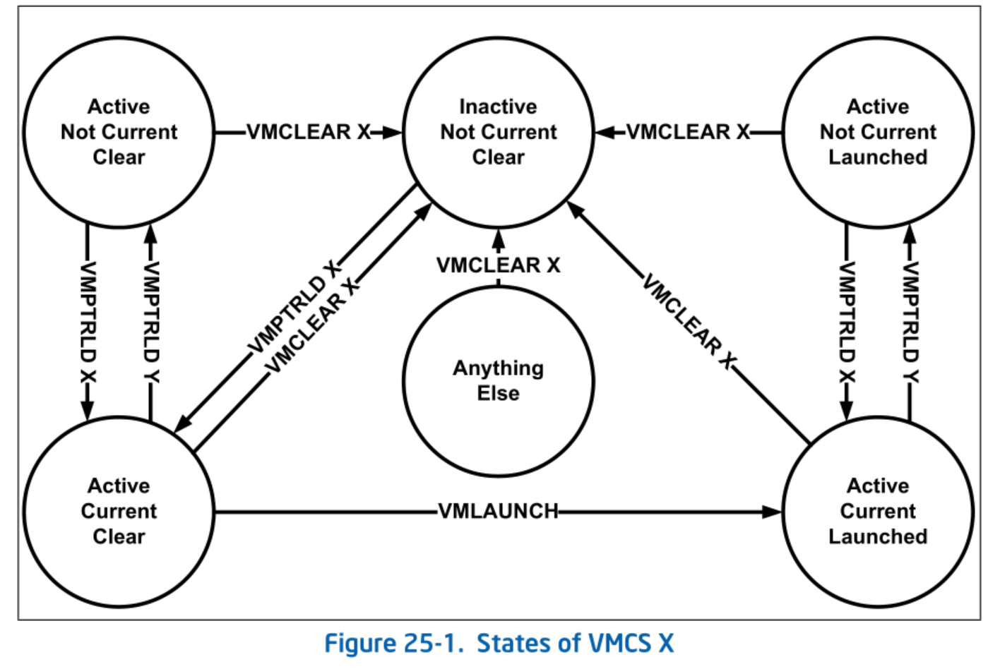
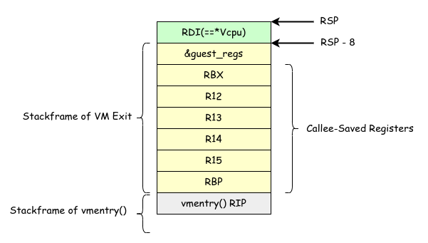

# VM Entry / VM Exit ハンドラ

前チャプターでは VMCS を設定し VMLAUNCH でゲストを実行することに成功しました。
しかし、VM Entry 前や VM Exit 後の状態の保存・復元処理はほとんどしていませんでした。
本チャプターでは、VM Entry と VM Exit の処理を実装し、適切に状態の保存・復元と VM Exit のハンドリングを行います。

## Table of Contents

<!-- toc -->

## ゲストの状態保持

ゲストの状態は `Vcpu` が保持します。
ひとまずここではゲストの汎用レジスタを記憶することにしましょう。
保持するべき汎用レジスタの一覧を定義します:

```ymir/arch/x86/vmx/common.zig
pub const GuestRegisters = extern struct {
    rax: u64,
    rcx: u64,
    rdx: u64,
    rbx: u64,
    rbp: u64,
    rsi: u64,
    rdi: u64,
    r8: u64,
    r9: u64,
    r10: u64,
    r11: u64,
    r12: u64,
    r13: u64,
    r14: u64,
    r15: u64,
    // Align to 16 bytes, otherwise movaps would cause #GP.
    xmm0: u128 align(16),
    xmm1: u128 align(16),
    xmm2: u128 align(16),
    xmm3: u128 align(16),
    xmm4: u128 align(16),
    xmm5: u128 align(16),
    xmm6: u128 align(16),
    xmm7: u128 align(16),
};
```

整数型の汎用レジスタと8つの XMM レジスタを保持します。
本来であれば浮動小数点レジスタは AVX や AVX-512 などシステムがサポートするレジスタ全てを保存するべきです。
しかしながら、それらの保存には [XSAVE](https://www.felixcloutier.com/x86/xsave) 命令を適切に使う必要があります。
めんどうなので、Ymir ではゲストに対して SSE よりもモダンな浮動小数点レジスタをサポートしないことにしています[^avx]。

`Vcpu` 構造体にゲストの情報を保持する変数を持たせます:

```ymir/arch/x86/vmx/vcpu.zig
pub const Vcpu = struct {
    ...
    guest_regs: vmx.GuestRegisters = undefined,
    ...
};
```

## VMLAUNCH と VMRESUME

VM Entry を実行する命令には [VMLAUNCH](https://www.felixcloutier.com/x86/vmlaunch:vmresume) と [VMRESUME](https://www.felixcloutier.com/x86/vmlaunch:vmresume) の2つがあります。
この2つは現在の VMCS の状態に応じて使い分けます。
[VMCSの基礎 のチャプター](./vmcs.md) で述べたように、VMCS は以下に示す状態遷移図のような状態を持ちます:


*State of VMCS X. SDM Vol.3C 25.1 Figure 25-1.*

今回注目するのは *Clear* / *Launched* の状態です。
VMCS はいずれかの CPU の *Current* VMCS に設定された状態で VMLAUNCH が実行されると、状態が *Launched* になります。
*Launched* になった VMCS を使って再度 VM Entry をするには VMRESUME を使います。
言い換えると、**一度目の VM Entry には VMLAUNCH を使い、2回目以降は VMRESUME を使います**。
VMLAUNCH と VMRESUME を使い間違えると、VMX Instruction Error が発生します。

VMCS の状態を取得する方法はありません。
そのため、VMM 側でこれらの状態を記録しておく必要があります。
`Vcpu` に VMCS の状態を保持する変数を追加します:

```ymir/arch/x86/vmx/vcpu.zig
pub const Vcpu = struct {
    ...
    /// The first VM-entry has been done.
    launch_done: bool = false,
    ...
};
```

## エラーハンドリング

まずは VM Entry の非アセンブリ部分を実装します。
VM Entry には、以下の2種類の失敗があります:

- **VM Entry 自体が失敗する** (VMX Instruction Error)
  - 他の VMX 拡張命令が失敗した場合と同様に VMX Instruction Error を返します。
  - `loop()` 関数内の `VMLAUNCH`/`VMRESUME` 命令の直後から実行が再開されます。
- **VM Entry 自体は成功するが、すぐに VMEXIT する**
  - `VMLAUNCH`/`VMRESUME` 自体は成功したが VM Entry に失敗するケースです。
  - VM Exit が発生し、VMCS Host-State に設定した RIP に実行が移ります。

まず扱うのは前者のケースです:

```ymir/arch/x86/vmx/vcpu.zig
pub fn loop(self: *Self) VmxError!void {
    while (true) {
        // Enter VMX non-root operation.
        self.vmentry() catch |err| {
            log.err("VM-entry failed: {?}", .{err});
            if (err == VmxError.VmxStatusAvailable) {
                const inst_err = try vmx.InstructionError.load();
                log.err("VM Instruction error: {?}", .{inst_err});
            }
            self.abort();
        };
        ...
    }
}
```

`self.vmentry()` は後述するアセンブリの `VMENTRY` を実行する関数です。
返り値として `VmxError!void` を返すため、もしもエラーを返した場合には `catch` で補足します。
VMX 拡張命令にはさらに2通りのエラーが存在します:

- `VmxStatusUnavailable`: エラーコードがないエラー
- `VmxStatusAvailable`: エラーコードがあるエラー

エラーコードが利用できる場合には、VMCS から VMX Instruction Error を取得し表示します。
VMCS の設定が適切にされていれば VMX 拡張命令は失敗することがありません。
そのため、Ymir では VM Entry 時のエラーは復帰不可能とみなし、`self.abort()` でアボートします:

```ymir/arch/x86/vmx/vcpu.zig
    pub fn abort(self: *Self) noreturn {
        @setCold(true);
        self.dump() catch log.err("Failed to dump VM information.", .{});
        ymir.endlessHalt();
    }

    pub fn dump(self: *Self) VmxError!void {
        try self.printGuestState();
    }

    fn printGuestState(self: *Self) VmxError!void {
        log.err("=== vCPU Information ===", .{});
        log.err("[Guest State]", .{});
        log.err("RIP: 0x{X:0>16}", .{try vmread(vmcs.guest.rip)});
        log.err("RSP: 0x{X:0>16}", .{try vmread(vmcs.guest.rsp)});
        log.err("RAX: 0x{X:0>16}", .{self.guest_regs.rax});
        log.err("RBX: 0x{X:0>16}", .{self.guest_regs.rbx});
        log.err("RCX: 0x{X:0>16}", .{self.guest_regs.rcx});
        log.err("RDX: 0x{X:0>16}", .{self.guest_regs.rdx});
        log.err("RSI: 0x{X:0>16}", .{self.guest_regs.rsi});
        log.err("RDI: 0x{X:0>16}", .{self.guest_regs.rdi});
        log.err("RBP: 0x{X:0>16}", .{self.guest_regs.rbp});
        log.err("R8 : 0x{X:0>16}", .{self.guest_regs.r8});
        log.err("R9 : 0x{X:0>16}", .{self.guest_regs.r9});
        log.err("R10: 0x{X:0>16}", .{self.guest_regs.r10});
        log.err("R11: 0x{X:0>16}", .{self.guest_regs.r11});
        log.err("R12: 0x{X:0>16}", .{self.guest_regs.r12});
        log.err("R13: 0x{X:0>16}", .{self.guest_regs.r13});
        log.err("R14: 0x{X:0>16}", .{self.guest_regs.r14});
        log.err("R15: 0x{X:0>16}", .{self.guest_regs.r15});
        log.err("CR0: 0x{X:0>16}", .{try vmread(vmcs.guest.cr0)});
        log.err("CR3: 0x{X:0>16}", .{try vmread(vmcs.guest.cr3)});
        log.err("CR4: 0x{X:0>16}", .{try vmread(vmcs.guest.cr4)});
        log.err("EFER:0x{X:0>16}", .{try vmread(vmcs.guest.efer)});
        log.err(
            "CS : 0x{X:0>4} 0x{X:0>16} 0x{X:0>8}",
            .{
                try vmread(vmcs.guest.cs_sel),
                try vmread(vmcs.guest.cs_base),
                try vmread(vmcs.guest.cs_limit),
            },
        );
    }
```

`dump()` と `abort()` はそれぞれ別々に呼び出したいときがあるため、分けて実装しています
(デバッグ用にゲストの状態をダンプして処理は継続したい場合など)。
アボート時はゲストの状態を出力し、無限 HLT ループに入ります。

## VM Entry

### 呼び出し部分

さきほど出てきた `vmentry()` はアセンブリの VMLAUNCH/VMRESUME をラップする関数です:

```ymir/arch/x86/vmx/vcpu.zig
fn vmentry(self: *Self) VmxError!void {
    const success = asm volatile (
        \\mov %[self], %%rdi
        \\call asmVmEntry
        : [ret] "={ax}" (-> u8),
        : [self] "r" (self),
        : "rax", "rcx", "rdx", "rsi", "rdi", "r8", "r9", "r10", "r11"
    ) == 0;

    if (!self.launch_done and success) {
        self.launch_done = true;
    }

    if (!success) {
        const inst_err = try vmread(vmcs.ro.vminstruction_error);
        return if (inst_err != 0) VmxError.VmxStatusAvailable else VmxError.VmxStatusUnavailable;
    }
}
```

純粋なアセンブリ部分はさらに `asmVmEntry()` に分離しています。
この関数は引数として `*Vcpu` をとります。
`asmVmEntry()` の詳細は後述しますが、この引数はホストの状態の保存・ゲストの状態の復元などに使われます。

VM Entry / Exit の実装方法にはいくつかの方法があります。
単純に考えると一度 VM Entry してしまえば、次に VMM に処理が移る際には VM Exit ハンドラに飛ぶことになります。
VM Entry を呼び出した関数 (`vmentry()`) に戻ってくることはありません。
しかし、**Ymir ではコントロールフローが分かりやすくなるように「VM Entry があたかも通常の関数呼び出しであるかのように」実装します**。
処理の流れとしては、 `vmentry()` → Guest → VM Exit Handler → `vmentry()` となります。
実現方法については VM Entry / VM Exit ハンドラの実装の際に説明します。

さて、VM Entry (`asmVmEntry()`) が通常の関数呼び出しのように帰ってくることが分かりました。
この関数は VM Entry に成功した場合は `0` を、失敗した場合は `1` を返します。
VM Entry に成功し、それが初めての VM Entry である場合には `launch_done` を `true` にします。
これによって、2回目以降は `asmVmEntry()` で VMRESUME を実行するように分岐します。
VM Entry に失敗した場合には、VMX Instruction Error があるかどうかを確認し、適切なエラーを返します。

### ホストの状態保存

`vmentry()` から呼び出される `asmVmEntry()` を実装していきましょう。
`vmentry()` が Zig 関数 (Error Union を返すことができる / calling convention はZigコンパイラ依存) であったのに対し、
この関数は完全に生のアセンブリとして書きたいため `.Naked` calling convention を使います。

まずは x64 における callee-saved レジスタたちを保存します[^callee-saved]。
本当は RSP も callee-saved ですが、RSP はのちほど別の方法で保存します:

```ymir/arch/x86/vmx/asm.zig
export fn asmVmEntry() callconv(.Naked) u8 {
    // Save callee saved registers.
    asm volatile (
        \\push %%rbp
        \\push %%r15
        \\push %%r14
        \\push %%r13
        \\push %%r12
        \\push %%rbx
    );
    ...
}
```

続いて、引数としてとった `*Vcpu` のうち、`.guest_regs` フィールドのアドレスを RBX 経由でスタックに積みます。
`asmVmEntry()` は `.Naked` calling convention であり引数を取ることができないため、
`vmentry()` では CALL 前に明示的に RDI に引数を入れていました。
`Vcpu` 内の `.guest_regs` のオフセットは `@offsetOf()` と `std.fmt.comptimePrint()` を使って計算しています。
`comptimePrint()` はコンパイル時に評価される文字列を生成できるため、`asm volatile()` の引数として指定することができます。
このようにオフセットを計算することで、**`.guest_regs` のオフセットが変わったとしてもコードを修正する必要がなくなります**:

```ymir/arch/x86/vmx/asm.zig
    // Save a pointer to guest registers
    asm volatile (std.fmt.comptimePrint(
            \\lea {d}(%%rdi), %%rbx
            \\push %%rbx
        ,
            .{@offsetOf(Vcpu, "guest_regs")},
        ));
```

次に、残る callee-saved レジスタである RSP を保存します。
RSP は VMCS Host-State に保存する必要があるという意味で特別です。
VMWRITE をアセンブリから呼び出すのは面倒なため、ここでは C calling convention の関数を実装します:

```ymir/arch/x86/vmx/vcpu.zig
export fn setHostStack(rsp: u64) callconv(.C) void {
    vmwrite(vmcs.host.rsp, rsp) catch {};
}
```

これを `asmVmEntry()` から CALL します:

```ymir/arch/x86/vmx/asm.zig
    // Set host stack
    asm volatile (
        \\push %%rdi
        \\lea 8(%%rsp), %%rdi
        \\call setHostStack
        \\pop %%rdi
    );
```

`setHostStack()` を呼び出す直前のスタックの状態は下図のようになっています。
**VM Exit は、図の黄色の部分をスタックに持つ状態でスタートさせます**。
よって、VMCS Host-State に保存する RSP も黄色の部分を指すようにします。
RSP は直接 MOV することができないため、[PUSH](https://www.felixcloutier.com/x86/push) と [LEA](https://www.felixcloutier.com/x86/lea) で間接的に設定します。
PUSH を挟むため、`setHostStack()` に渡す引数には `+8(RSP)` を指定しています。


*Stack Layout Before VM Entry & After VM Exit*

スタックを VMCS にセットしたら、PUSH しておいた RDI を POP して戻します。
この時点で RDI は依然として `*Vcpu` を持っています。
引数 `*Vcpu` の中でもう1つ使いたいフィールドが `.launch_done` です。
この値によって VMLAUNCH と VMRESUME のどちらを使うかを決定します。
今のうちにこの値を取得しておきましょう。
結果は RDI に入れます。
`.launch_done` が `true` であれば `RFLAGS.ZF` が `1` になります:

```ymir/arch/x86/vmx/asm.zig
    // Determine VMLAUNCH or VMRESUME.
    asm volatile (std.fmt.comptimePrint(
            \\testb $1, {d}(%%rdi)
        ,
            .{@offsetOf(Vcpu, "launch_done")},
        ));
```

### ゲストの状態復元

以上でホストの状態をスタックに保存することができました。
残すはゲストの状態の復元です。
`.guest_regs` からゲストのレジスタを取り出し順にセットしていきます。
RAX に `&.guest_regs` を入れるため、RAX だけは最後にセットします:

```ymir/arch/x86/vmx/asm.zig
    // Restore guest registers.
    asm volatile (std.fmt.comptimePrint(
            \\mov %%rdi, %%rax
            \\mov {[rcx]}(%%rax), %%rcx
            \\mov {[rdx]}(%%rax), %%rdx
            \\mov {[rbx]}(%%rax), %%rbx
            \\mov {[rsi]}(%%rax), %%rsi
            \\mov {[rdi]}(%%rax), %%rdi
            \\mov {[rbp]}(%%rax), %%rbp
            \\mov {[r8]}(%%rax), %%r8
            \\mov {[r9]}(%%rax), %%r9
            \\mov {[r10]}(%%rax), %%r10
            \\mov {[r11]}(%%rax), %%r11
            \\mov {[r12]}(%%rax), %%r12
            \\mov {[r13]}(%%rax), %%r13
            \\mov {[r14]}(%%rax), %%r14
            \\mov {[r15]}(%%rax), %%r15
            \\movaps {[xmm0]}(%%rax), %%xmm0
            \\movaps {[xmm1]}(%%rax), %%xmm1
            \\movaps {[xmm2]}(%%rax), %%xmm2
            \\movaps {[xmm3]}(%%rax), %%xmm3
            \\movaps {[xmm4]}(%%rax), %%xmm4
            \\movaps {[xmm5]}(%%rax), %%xmm5
            \\movaps {[xmm6]}(%%rax), %%xmm6
            \\movaps {[xmm7]}(%%rax), %%xmm7
            \\mov {[rax]}(%%rax), %%rax
        , .{
            .rax = @offsetOf(vmx.GuestRegisters, "rax"),
            .rcx = @offsetOf(vmx.GuestRegisters, "rcx"),
            .rdx = @offsetOf(vmx.GuestRegisters, "rdx"),
            .rbx = @offsetOf(vmx.GuestRegisters, "rbx"),
            .rsi = @offsetOf(vmx.GuestRegisters, "rsi"),
            .rdi = @offsetOf(vmx.GuestRegisters, "rdi"),
            .rbp = @offsetOf(vmx.GuestRegisters, "rbp"),
            .r8 = @offsetOf(vmx.GuestRegisters, "r8"),
            .r9 = @offsetOf(vmx.GuestRegisters, "r9"),
            .r10 = @offsetOf(vmx.GuestRegisters, "r10"),
            .r11 = @offsetOf(vmx.GuestRegisters, "r11"),
            .r12 = @offsetOf(vmx.GuestRegisters, "r12"),
            .r13 = @offsetOf(vmx.GuestRegisters, "r13"),
            .r14 = @offsetOf(vmx.GuestRegisters, "r14"),
            .r15 = @offsetOf(vmx.GuestRegisters, "r15"),
            .xmm0 = @offsetOf(vmx.GuestRegisters, "xmm0"),
            .xmm1 = @offsetOf(vmx.GuestRegisters, "xmm1"),
            .xmm2 = @offsetOf(vmx.GuestRegisters, "xmm2"),
            .xmm3 = @offsetOf(vmx.GuestRegisters, "xmm3"),
            .xmm4 = @offsetOf(vmx.GuestRegisters, "xmm4"),
            .xmm5 = @offsetOf(vmx.GuestRegisters, "xmm5"),
            .xmm6 = @offsetOf(vmx.GuestRegisters, "xmm6"),
            .xmm7 = @offsetOf(vmx.GuestRegisters, "xmm7"),
        }));
```

ホストの保存とゲストの復元ができたため、いよいよ VM Entry を実行します。
この時点で `RFLAGS.ZF` には VMLAUNCH と VMRESUME のどちらを実行するべきかが格納されています。
その値に応じて適切な方を呼び出しましょう:

```ymir/arch/x86/vmx/asm.zig
    // VMLAUNCH or VMRESUME.
    asm volatile (
        \\jz .L_vmlaunch
        \\vmresume
        \\.L_vmlaunch:
        \\vmlaunch
    );
```

VM Entry が成功すれば処理はゲストに移るため、このあとの命令が実行されることはありません。
VMX 拡張命令が失敗した場合には続く命令が実行されます。
そのため、続けてエラーハンドリングを書きます:

```ymir/arch/x86/vmx/asm.zig
    // Set return value to 1.
    asm volatile (
        \\mov $1, %%al
    );
    // Restore callee saved registers.
    asm volatile (
        \\add $0x8, %%rsp
        \\pop %%rbx
        \\pop %%r12
        \\pop %%r13
        \\pop %%r14
        \\pop %%r15
    );
    // Return to caller of asmVmEntry()
    asm volatile (
        \\ret
    );
```

`asmVmEntry()` は成功時に`0`・失敗時に`1`を返すというオレオレ calling convention にしているため、ここでは`1`をセットします。
先ほどの図で示したとおり、この時点でスタックには　`&.guest_regs` と callee-saved レジスタが積まれています。
前者は単に POP して捨てて、後者はレジスタに復元してあげます。

## VM Exit

ゲストが何らかの要因で VM Exit すると、VMCS Host-State に設定した RIP に処理が移ります。
Ymir では `asmVmExit()` をセットするため、この関数にホストへの復帰処理を実装します。
VM Exit した時点ではスタックは先ほどの図のようになっています。
最も上には `&.guest_regs` が積んであります。
ゲストの状態を保存するために使うため、まずはこれを取り出しましょう:

```ymir/arch/x86/vmx/asm.zig
pub fn asmVmExit() callconv(.Naked) void {
    // Disable IRQ.
    asm volatile (
        \\cli
    );
    // Save guest RAX, get &guest_regs
    asm volatile (
        \\push %%rax
        \\movq 8(%%rsp), %%rax
    );
    ...
}
```

RAX はスクラッチレジスタとして使います。
ゲストの RAX を失うわけにはいかないため、`&.guest_regs` を取り出す前に RAX をスタックに PUSH しています。

続いてゲストのレジスタを `guest_regs` に保存します:

```ymir/arch/x86/vmx/asm.zig
    // Save guest registers.
    asm volatile (std.fmt.comptimePrint(
            \\
            // Save pushed RAX.
            \\pop {[rax]}(%%rax)
            // Discard pushed &guest_regs.
            \\add $0x8, %%rsp
            // Save guest registers.
            \\mov %%rcx, {[rcx]}(%%rax)
            \\mov %%rdx, {[rdx]}(%%rax)
            \\mov %%rbx, {[rbx]}(%%rax)
            \\mov %%rsi, {[rsi]}(%%rax)
            \\mov %%rdi, {[rdi]}(%%rax)
            \\mov %%rbp, {[rbp]}(%%rax)
            \\mov %%r8, {[r8]}(%%rax)
            \\mov %%r9, {[r9]}(%%rax)
            \\mov %%r10, {[r10]}(%%rax)
            \\mov %%r11, {[r11]}(%%rax)
            \\mov %%r12, {[r12]}(%%rax)
            \\mov %%r13, {[r13]}(%%rax)
            \\mov %%r14, {[r14]}(%%rax)
            \\mov %%r15, {[r15]}(%%rax)
            \\movaps %%xmm0, {[xmm0]}(%%rax)
            \\movaps %%xmm1, {[xmm1]}(%%rax)
            \\movaps %%xmm2, {[xmm2]}(%%rax)
            \\movaps %%xmm3, {[xmm3]}(%%rax)
            \\movaps %%xmm4, {[xmm4]}(%%rax)
            \\movaps %%xmm5, {[xmm5]}(%%rax)
            \\movaps %%xmm6, {[xmm6]}(%%rax)
            \\movaps %%xmm7, {[xmm7]}(%%rax)
        ,
            .{
                .rax = @offsetOf(vmx.GuestRegisters, "rax"),
                .rcx = @offsetOf(vmx.GuestRegisters, "rcx"),
                .rdx = @offsetOf(vmx.GuestRegisters, "rdx"),
                .rbx = @offsetOf(vmx.GuestRegisters, "rbx"),
                .rsi = @offsetOf(vmx.GuestRegisters, "rsi"),
                .rdi = @offsetOf(vmx.GuestRegisters, "rdi"),
                .rbp = @offsetOf(vmx.GuestRegisters, "rbp"),
                .r8 = @offsetOf(vmx.GuestRegisters, "r8"),
                .r9 = @offsetOf(vmx.GuestRegisters, "r9"),
                .r10 = @offsetOf(vmx.GuestRegisters, "r10"),
                .r11 = @offsetOf(vmx.GuestRegisters, "r11"),
                .r12 = @offsetOf(vmx.GuestRegisters, "r12"),
                .r13 = @offsetOf(vmx.GuestRegisters, "r13"),
                .r14 = @offsetOf(vmx.GuestRegisters, "r14"),
                .r15 = @offsetOf(vmx.GuestRegisters, "r15"),
                .xmm0 = @offsetOf(vmx.GuestRegisters, "xmm0"),
                .xmm1 = @offsetOf(vmx.GuestRegisters, "xmm1"),
                .xmm2 = @offsetOf(vmx.GuestRegisters, "xmm2"),
                .xmm3 = @offsetOf(vmx.GuestRegisters, "xmm3"),
                .xmm4 = @offsetOf(vmx.GuestRegisters, "xmm4"),
                .xmm5 = @offsetOf(vmx.GuestRegisters, "xmm5"),
                .xmm6 = @offsetOf(vmx.GuestRegisters, "xmm6"),
                .xmm7 = @offsetOf(vmx.GuestRegisters, "xmm7"),
            },
        ));
```

ゲストの状態を保存したら、スタックに積んでいたゲストの callee-saved レジスタを復元します。

```ymir/arch/x86/vmx/asm.zig
    // Restore callee saved registers.
    asm volatile (
        \\pop %%rbx
        \\pop %%r12
        \\pop %%r13
        \\pop %%r14
        \\pop %%r15
        \\pop %%rbp
    );
```

この時点でスタックの最も上には `vmentry()` が CALL の際に積んだ RIP があります。
よって、ここで RET すると `vmentry()` に復帰することができます。
呼び出し側は、あたかも `asmVmEntry()` を関数呼び出したかのように処理を続行することができます:

```ymir/arch/x86/vmx/asm.zig
    // Return to caller of asmVmEntry()
    asm volatile (
        \\mov $0, %%rax
        \\ret
    );
```

## Exit Handler

以上で VM Entry / VM Exit を経て `vmentry()` → `loop()` に復帰することができました。
このあとは、VM Exit した要因に応じて適切な処理をしてあげます。
VM Exit のハンドラ関数を定義します:

```ymir/arch/x86/vmx/vcpu.zig
fn handleExit(self: *Self, exit_info: vmx.ExitInfo) VmxError!void {
    switch (exit_info.basic_reason) {
        .hlt => {
            try self.stepNextInst();
            log.debug("HLT", .{});
        },
        else => {
            log.err("Unhandled VM-exit: reason={?}", .{exit_info.basic_reason});
            self.abort();
        },
    }
}
```

引数には `ExitInfo` 構造体を受け取ります。
この中には VM Exit した大まかな要因が記録されているため、この要因に応じて `switch` します。
現在はとりあえず HLT による VM Exit 用の処理だけを用意し、HLT が起こったことだけをログ出力するだけにしておきます。

`ExitInfo` は VMCS VM-Exit Information カテゴリの Basic VM-Exit Information フィールドから取得することができます:

```ymir/arch/x86/vmx/vcpu.zig
pub fn loop(self: *Self) VmxError!void {
    while (true) {
        ...
        try self.handleExit(try vmx.ExitInfo.load());
    }
}
```

Exit ハンドラを呼び出したあとは、`while` ループの先頭に戻り再び VM Entry をします。
ひたすらにこの繰り返しです。

## まとめ

それでは、実装した VM Entry / VM Exit を用いてゲストを実行してみましょう。
VMCS Execution Controls の Primary Processor-based Controls における `.hlt` は `true` に設定して、HLT 命令で VM Exit するようにしておいてください。
この状態でゲストを実行すると、以下のような出力になります:

```txt
[INFO ] main    | Entered VMX root operation.
[INFO ] main    | Starting the virtual machine...
[DEBUG] vcpu    | HLT
[DEBUG] vcpu    | HLT
[DEBUG] vcpu    | HLT
[DEBUG] vcpu    | HLT
[DEBUG] vcpu    | HLT
[DEBUG] vcpu    | HLT
[DEBUG] vcpu    | HLT
...
```

ひたすらに `HLT` が出力されます。
これは VM Entry / VM Exit ループが正常に動作していることを示しています。
また、ホストが VM Exit ハンドラにおいて出力をしたり再度 VM Entry をするためには、ホストの状態が正しく保存・復元されていることが必要です。
つまり、今回はそれらも意図したとおりに動いているということが分かります。

ゲストの状態が正しく保存・復元されているかどうかが気になる人は、`loop()` の `while` に入る前に `guest_regs.rax = 0xDEADBEEF` のようにゲストレジスタの値をいじってみてください。
HLT で VM Exit しないように設定しゲストを実行すると、ゲストの HLT ループで止まってくれます。
その状態で QEMU monitor でレジスタの状態を確認すると、RAX が `0xDEADBEEF` になっているはずです。

本チャプターでは VM Entry / VM Exit の処理を適切に実装することで、何回も VM Entry を繰り返すことができるようになりました。
前チャプターでは単発の VMLAUNCH をして終わりだったことを考えると、大きな進歩と言えるでしょう。
アセンブリを直書きすることが多いチャプターでしたが、これ以降はほとんどアセンブリは出てきません。
その点については安心してください。

## References

- [https://zenn.dev/tanakmura/articles/80391e3284c6bb](https://zenn.dev/tanakmura/articles/80391e3284c6bb)

[^avx]: 「サポートしない」というのは利用した場合に未定義動作になるという意味ではなく、システムとしてこれらの機能を利用できなくするという意味です。
これらの機能が利用可能かどうかは CPUID 命令や XCR0 レジスタで確認するのですが、Ymir はゲストに対するこれらの値を任意に操作できます。
[^callee-saved]: Callee-saved なレジスタを保存しているのに `vmentry()` 内で caller-saved なレジスタ達を [clobber](https://gcc.gnu.org/onlinedocs/gcc/Extended-Asm.html#Clobbers-and-Scratch-Registers) していることを不審に思ったかもしれません。
インラインアセンブリで CALL しても、コンパイラはその前後で caller-saved なレジスタを保存・復元するようなコードを出力してくれません。
そのため、CALL の前後で手動で caller-saved なレジスタを保存・復元するアセンブリを書くか、今回のように clobber してしまう必要があります。
