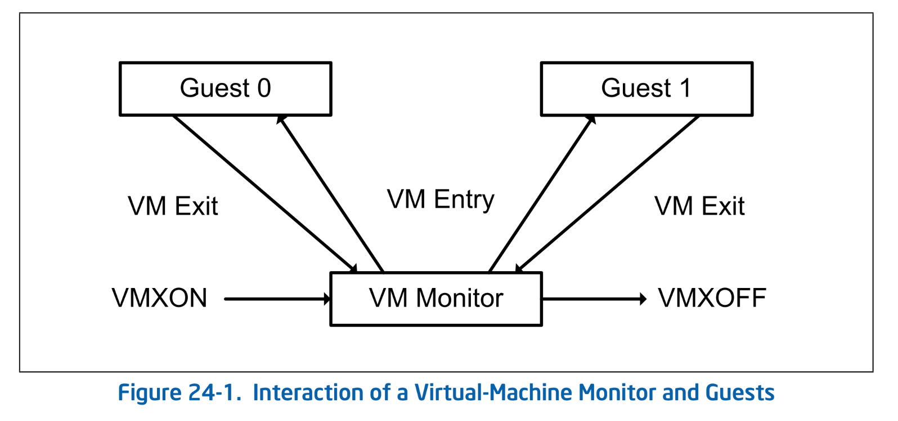

# VT-x の基礎と VMX Root Operation

長かった Ymir Kernel の実装も一段落し、いよいよ VMM 部分の実装に入っていきます。
本チャプターは VT-x の基礎的な概念の説明から始まり、VMX Root Operation という VMM 用のモードに遷移するところまでを目的にします。

> [!IMPORTANT]
> 本チャプターの最終コードは [`whiz-vmm-vmx_root`](https://github.com/smallkirby/ymir/tree/whiz-vmm-vmx_root) ブランチにあります。

## Table of Contents

<!-- toc -->

## VMM 概観

まずは Hypervisor における基礎的な概念や用語を確認します。
以降は、Ymir のようにベアメタルで動作し CPU や外部リソースに対する完全な制御権を持つソフトを **VMM: Virtual-Machine Monitor** (hypervisor) と呼びます。
VMM の上で動作し、CPU 上で直接動作するものの VMM によってリソースへのアクセス権など仮想化されるソフトを **ゲスト** と呼びます。

仮想化を支援する Intel CPU では、**VMX Operation** というモードに入ることができます。
このモードでは仮想化を支援する命令が追加されたり、CPU の挙動が変更されたりします。
VMX Operation には **VMX Root Operation** と **VMX Non-root Operation** の2つのモードがあります。
VMM は VMX Root Operation で動作します。
このモードは VMX Operation ではない場合とほぼ同じですが、新たに VMX に関連する命令が追加されています。
ゲストは VMX Non-root Operation で動作します。
このモードでは一部の特権命令が制限され、それらの命令を実行すると処理が VMM に移されます。
このような、VMX Non-root から VMX Root へのモード遷移を **VM Exit** と呼び、
逆に VMX Root から VMX Non-root へのモード遷移を **VM Entry** と呼びます。
両者をまとめて **VMX Transition** と呼ぶことがあります。
特権命令が VM Exit を引き起こすことで、VMM はゲストの挙動に介入し、リソースを仮想化できます。


*Interaction of a Virtual-Machine Monitor and Guests. SDM Vol.3C 24.4 Figure 24-1.*

Ymir Kernel は [VMXON](https://www.felixcloutier.com/x86/vmxon) 命令によって VMX Root Operation に遷移します。
逆に VMX Root Operation から通常のモードに遷移する際には [VMXOFF](https://www.felixcloutier.com/x86/vmxoff) 命令を使用します。
VMX Operation に遷移した CPU は新たに拡張命令である **VMX Instructions** を利用できるようになります。
その1つである [VMLAUNCH](https://www.felixcloutier.com/x86/vmlaunch:vmresume) や [VMRESUME](https://www.felixcloutier.com/x86/vmlaunch:vmresume) 命令を使用して VM Entry を行います。
ゲスト(VMX Non-Root Operation) に遷移したあとは、基本的には通常通り CPU 上で直接ゲストの命令が実行できます。
ソフトウェアによる命令のエミュレーションが必要ないため、VT-x によるハードウェアレベルでの仮想化はソフトウェア仮想化よりも高速になります。
ゲストが特権命令を実行したり特定の条件を満たした場合[^condition]には VM Exit が発生し、Root Operation への遷移が発生します。
VMM は VM Exit の発生原因をもとにして適切な処理をし、再度 VM Entry でゲストに制御を戻します。

なお、VMX Operation は Ring とは別の概念です。
ゲストが Ring-0 で動作している場合でも VMX Non-root Operation で動作している限りは VMM による支配を受けることになります。

## VMX サポートの確認

まずは CPU が VT-x をサポートしているかどうかを確認する必要があります。
これには以下の段階を踏みます:

1. [CPUID](https://www.felixcloutier.com/x86/cpuid) 命令で Vendor ID を確認する
    - 同じ x64 アーキテクチャでもベンダが異なれば提供する仮想化支援機構が異なる
    - Vendor ID が `GenuineIntel` であることを確認する[^genuine]
2. [CPUID](https://www.felixcloutier.com/x86/cpuid) 命令で VMX がサポートされているかを確認する
3. [CPUID](https://www.felixcloutier.com/x86/cpuid) 命令で [SMX Operation](https://www.intel.co.jp/content/www/jp/ja/content-details/315168/intel-trusted-execution-technology-intel-txt-software-development-guide.html) でなくとも VMXON できることを確認する
    - **SMX: Safer Mode Extension** は、Intel® Trusted Execution Technology で提供されるモード。Ymir では使わないため SMX の外でも VMXON できる必要がある

VMX Operation に入る前にこれらの条件が満たされているかを順に確認していきます。
以降、VMX に関連する操作は `ymir/vmx.zig` をルートとして実装していきます:

```ymir/vmx.zig
const VmError = error{
    /// Memory allocation failed.
    OutOfMemory,
    /// The system does not support virtualization.
    SystemNotSupported,
    /// Unknown error.
    UnknownError,
};

pub const Vm = struct {
    const Self = @This();

    pub fn new() VmError!Self {
        // 1. Check CPU vendor.
        TODO
        // 2&3. Check if VMX is supported.
        TODO

        return Self{};
    }
};
```

### CPUID

VMX 関連の操作に入る前に、まずは [CPUID](https://www.felixcloutier.com/x86/cpuid) をする関数を実装します。
CPUID はプロセッサの機能を取得するための命令であり、ベンダや世代やモデルに固有な情報を得るために使用します。

EAX で取得したい情報を指定します。一部の場合は追加で ECX も使って取得する情報を指定します。
このとき、EAX のことを **Leaf**, ECX のことを **Subleaf** と呼びます。
本シリーズでは、Leaf が `N` で Subleaf が `M` の CPUID を `CPUID[N:M]` と表記します。
返り値には EAX, EBX, ECX, EDX の4つのレジスタが使われます。
どのレジスタにどのような情報が入るかは、指定した Leaf/Subleaf に依存します。
CPUID の Leaf/Subleaf 一覧については *[SDM Vol.2A](https://cdrdv2-public.intel.com/812383/253666-sdm-vol-2a.pdf) Chapter 3.3 Table 3-8* を参照してください。

```ymir/arch/x86/cpuid.zig
pub const Leaf = enum(u32) {
    maximum_input = 0x0,
    vers_and_feat_info = 0x1,
    ext_feature = 0x7,
    ext_enumeration = 0xD,
    ext_func = 0x80000000,
    ext_proc_signature = 0x80000001,
    _,

    /// Convert u64 to Leaf.
    pub fn from(rax: u64) Leaf {
        return @enumFromInt(rax);
    }
    /// Issues CPUID instruction to query the leaf and sub-leaf.
    pub fn query(self: Leaf, subleaf: ?u32) CpuidRegisters {
        return cpuid(@intFromEnum(self), subleaf orelse 0);
    }
};

const CpuidRegisters = struct {
    eax: u32,
    ebx: u32,
    ecx: u32,
    edx: u32,
};

pub const FeatureInfoEcx = packed struct(u32) {
    /// ...
    _other_fields1: u5,
    /// Virtual Machine Extensions.
    vmx: bool = false,
    /// ...
    _other_fields2: u26,
};
```

`Leaf` enum は、すべての Leaf を列挙しているわけではありません。
というか、CPUID は無限に拡張されていくためすべてを列挙するのは不可能ですし意味がありません。
ここでは使う分だけを列挙し、残りは `_` として無視しています。
このような `_` を持つ `enum` は [Non-exhaustive Enum](https://ziglang.org/documentation/master/#Non-exhaustive-enum) と呼びます。
Non-exhaustive Enum への `switch` は必ず non-exhaustive switch になります。

`Leaf` は以下のように使います:

```zig
const result = Leaf.query(.ext_feature, 0x1);
// OR
const result = Leaf.ext_feature.query(0x1);
```

もしも Subleaf を指定する必要があれば `query()` の引数として渡します。
Subleaf が不要な場合は `null` を渡すことができます。

> [!TIP] Zig のメソッド
> Zig における static ではない構造体のメソッドは、`fn hoge(self: Self)` のように定義します。
> これを呼び出す際には、以下の2通りの方法があります:
>
> ```zig
> const result = some_struct.hoge();
> const result = SomeStruct.hoge(some_struct);
> ```
>
> 前者は単なる後者のシンタックスシュガーです。
> C++ の `this` と同じですね。

`cpuid()` は CPUID 命令の実体となるアセンブリ関数です。
この関数は外部には直接露出せず、`Leaf` を介して利用させます:

```ymir/arch/x86/cpuid.zig
fn cpuid(leaf: u32, subleaf: u32) CpuidRegisters {
    var eax: u32 = undefined;
    var ebx: u32 = undefined;
    var ecx: u32 = undefined;
    var edx: u32 = undefined;

    asm volatile (
        \\mov %[leaf], %%eax
        \\mov %[subleaf], %%ecx
        \\cpuid
        \\mov %%eax, %[eax]
        \\mov %%ebx, %[ebx]
        \\mov %%ecx, %[ecx]
        \\mov %%edx, %[edx]
        : [eax] "=r" (eax),
          [ebx] "=r" (ebx),
          [ecx] "=r" (ecx),
          [edx] "=r" (edx),
        : [leaf] "r" (leaf),
          [subleaf] "r" (subleaf),
        : "rax", "rbx", "rcx", "rdx"
    );

    return .{
        .eax = eax,
        .ebx = ebx,
        .ecx = ecx,
        .edx = edx,
    };
}
```

### MSR

CPUID と同様にアーキテクチャの機能を取得および操作するために使用するのが **MSR: Model Specific Register** です。
MSR は通常のレジスタとは異なり、アクセスには特権が必要となります[^msr]。
MSR も CPUID と同様にどんどん追加され続けるため、すべてを列挙することはしません。
必要なものだけを列挙して定義します。
以下で定義しているものは Ymir で利用する MSR の全てではありません。
必要になった時に新たに追加していきます:

```ymir/arch/x86/asm.zig
pub const Msr = enum(u32) {
    /// IA32_FEATURE_CONTROL MSR.
    feature_control = 0x003A,

    /// IA32_VMX_BASIC MSR.
    vmx_basic = 0x0480,

    _,
};

pub const MsrFeatureControl = packed struct(u64) {
    /// Lock bit.
    lock: bool,
    /// VMX in SMX (Safer Mode Extensions) operation.
    vmx_in_smx: bool,
    /// VMX outside SMX operation.
    vmx_outside_smx: bool,
    /// ...
    _other_fields: u61,
};
```

MSR へのアクセスには [RDMSR](https://www.felixcloutier.com/x86/rdmsr) と [WRMSR](https://www.felixcloutier.com/x86/wrmsr) 命令を使います。
MSR の指定には ECX を使います。
返り値は EDX と EAX をこの順に連結した値となります:

```ymir/arch/x86/asm.zig
pub fn readMsr(msr: Msr) u64 {
    var eax: u32 = undefined;
    var edx: u32 = undefined;
    asm volatile (
        \\rdmsr
        : [eax] "={eax}" (eax),
          [edx] "={edx}" (edx),
        : [msr] "{ecx}" (@intFromEnum(msr)),
    );

    return bits.concat(u64, edx, eax);
}

pub fn writeMsr(msr: Msr, value: u64) void {
    asm volatile (
        \\wrmsr
        :
        : [msr] "{ecx}" (@intFromEnum(msr)),
          [eax] "{eax}" (@as(u32, @truncate(value))),
          [edx] "{edx}" (@as(u32, @truncate(value >> 32))),
    );
}
```

### Vendor ID の確認

手順1の Vendor ID String は `CPUID[0]` (`.maximum_input`) で取得できます:

```ymir/arch/x86/arch.zig
pub fn getCpuVendorId() [12]u8 {
    var ret: [12]u8 = undefined;
    const regs = cpuid.Leaf.query(.maximum_input, null);

    for ([_]u32{ regs.ebx, regs.edx, regs.ecx }, 0..) |reg, i| {
        for (0..4) |j| {
            const b: usize = (reg >> @truncate(j * 8));
            ret[i * 4 + j] = @as(u8, @truncate(b));
        }
    }
    return ret;
}
```

`Vm.new()` で Vendor ID を取得し、`GenuineIntel` であることを確認します:

```ymir/vmx.zig
const vendor = arch.getCpuVendorId();
if (!std.mem.eql(u8, vendor[0..], "GenuineIntel")) {
    log.err("Unsupported CPU vendor: {s}", .{vendor});
    return VmError.SystemNotSupported;
}
```

### VMX サポートを確認

手順 2/3 は同じ関数内 `isVmxSupported()` で確認します。
まず手順2の VMX がサポートされているかどうかは `CPUID[1]` で確認します。
手順3では VMXON が SMX Operation の外でも実行可能かを確認します。
これは MSR の `IA32_FEATURE_CONTROL` の値をチェックすることで確かめられます:

```ymir/arch/x86/arch.zig
pub fn isVmxSupported() bool {
    // Check CPUID if VMX is supported.
    const regs = cpuid.Leaf.query(.vers_and_feat_info, null);
    const ecx: cpuid.FeatureInfoEcx = @bitCast(regs.ecx);
    if (!ecx.vmx) return false;

    // Check VMXON is allowed outside SMX.
    var msr_fctl: am.MsrFeatureControl = @bitCast(am.readMsr(.feature_control));
    if (!msr_fctl.vmx_outside_smx) {
        // Enable VMX outside SMX.
        if (msr_fctl.lock) @panic("IA32_FEATURE_CONTROL is locked while VMX outside SMX is disabled");
        msr_fctl.vmx_outside_smx = true;
        msr_fctl.lock = true;
        am.writeMsr(.feature_control, @bitCast(msr_fctl));
    }
    msr_fctl = @bitCast(am.readMsr(.feature_control));
    if (!msr_fctl.vmx_outside_smx) return false;

    return true;
}
```

*VMXON Outside SMX* が無効化されていた場合、MSR を操作して有効化します。
このとき、`IA32_FEATURE_CONTROL[0]` の **Lock Bit** がクリアされていることを確認します。
Lock Bit がセットされている場合、この MSR には一切の書き込みができません。
Lock Bit はシステムがリセットされるまでクリアされることがないため、もしもこのビットがセットされている場合には諦めるしかありません。
逆に、Lock Bit がクリアされたままだと VMXON が失敗するため、必要の値の変更後、この関数内でロックしておきます。

そもそも Lock Bit は BIOS がシステムでサポートする機能を設定・固定化するためのものです。
一度 BIOS から設定されたあとは OS 側で変更できない場合がほとんどです。
もしも VMX Outside SMX が無効化されていた場合には、お使いのホストBIOSの設定を見直してみてください。

`Vm.new()` の中でこれらの関数を呼び出します:

```ymir/vmx.zig
if (!arch.isVmxSupported()) {
    log.err("Virtualization is not supported.", .{});
    return VmError.SystemNotSupported;
}
```

以上で VMX がサポートされているかどうかを確認する処理が完成しました。
`kernelMain()` から呼び出して、VMX がサポートされていることを確認しましょう:

```ymir/main.zig
const vm = try vmx.Vm.new();
_ = vm;
```

## vCPU

VMX Operation に入るということは、現在の CPU の状態を変更することであり、各CPUに対して行う操作です。
本シリーズの Ymir では1コアのみをサポートするためとりわけ意識する必要があることではないのですが、
それでも CPU に固有ということを意識するためにも `Vcpu` という構造体を作っておきます:

```ymir/arch/x86/vmx/vcpu.zig
pub const Vcpu = struct {
    const Self = @This();

    /// ID of the logical processor.
    id: usize = 0,
    /// VPID of the virtual machine.
    vpid: u16,

    pub fn new(vpid: u16) Self {
        return Self{ .vpid = vpid };
    }
};
```

**VPID: Virtual-Processor Identifier** は vCPU に対するユニークなID(16bit)です。
PCID のように、TLB のエントリを識別する等に使われます。
`id` は論理コアのIDです[^core]。
本シリーズの Ymir は1コアのみをサポートするため `id` は `0` で固定していますが、SMP をサポートするようにする場合にはこの値をコアごとに変更します。

`Vm` 構造体には `Vcpu` をもたせておきましょう。
ここでも、CPU に強く依存する VMX コードは `arch/x86/vmx` 以下に配置することにします。
もしも AMD-V をサポートしたくなったような場合には `switch` で分岐することができます:

```ymir/vmx.zig
const impl = switch (builtin.target.cpu.arch) {
    .x86_64 => @import("arch/x86/vmx.zig"),
    else => @compileError("Unsupported architecture."),
};

pub const Vm = struct {
    vcpu: impl.Vcpu,

    pub fn new() VmError!Self {
        ...
        const vcpu = impl.Vcpu.new(0);
        return Self{ .vcpu = vcpu };
    }
};
```

## VMX Operation への遷移

VMX がサポートされていることが確認できたため、VMX Operation へ遷移しましょう。
VMX Operation に移行するためには、CR レジスタの設定と VMXON 命令の実行が必要になります。

### CR レジスタの設定

VMX Operation に入るためには CR0, CR4 レジスタを適切に設定する必要があります。
また、一度 VMX Operation に入ると CR0, CR4 の一部の値は固定化され、値を変更しようとすると `#GP: General Protection Fault` になります。

CR0 の値は `IA32_VMX_CR0_FIXED0` と `IA32_VMX_CR0_FIXED1` の2つの MSR で規定されます。
前者の N-th bit が `1` の場合、`CR0[N]` は `1` である必要があります。
後者の N-th bit が `0` の場合、`CR0[N]` は `0` である必要があります。
CR4 も同様で `IA32_VMX_CR4_FIXED0` と `IA32_VMX_CR4_FIXED1` の2つの MSR をもとに値を指定します。
各 MSR のインデックスは以下のとおりです:

| MSR | Address |
| --- | ------- |
| IA32_VMX_CR0_FIXED0 | 0x486 |
| IA32_VMX_CR0_FIXED1 | 0x487 |
| IA32_VMX_CR4_FIXED0 | 0x488 |
| IA32_VMX_CR4_FIXED1 | 0x489 |

なお、各レジスタは下位 32bit のみが有効です。上位 32bit は無視します:

```ymir/arch/x86/vmx/vcpu.zig
fn adjustControlRegisters() void {
    const vmx_cr0_fixed0: u32 = @truncate(am.readMsr(.vmx_cr0_fixed0));
    const vmx_cr0_fixed1: u32 = @truncate(am.readMsr(.vmx_cr0_fixed1));
    const vmx_cr4_fixed0: u32 = @truncate(am.readMsr(.vmx_cr4_fixed0));
    const vmx_cr4_fixed1: u32 = @truncate(am.readMsr(.vmx_cr4_fixed1));

    var cr0: u64 = @bitCast(am.readCr0());
    cr0 |= vmx_cr0_fixed0; // Mandatory 1
    cr0 &= vmx_cr0_fixed1; // Mandatory 0
    var cr4: u64 = @bitCast(am.readCr4());
    cr4 |= vmx_cr4_fixed0; // Mandatory 1
    cr4 &= vmx_cr4_fixed1; // Mandatory 0;

    am.loadCr0(cr0);
    am.loadCr4(cr4);
}
```

一応どのビットが強制的に 0/1 になるかを検証してみたところ、筆者の環境では以下のようになりました:

| MSR | Bits | Description |
| --- | ---- | ----------- |
| IA32_VMX_CR0_FIXED0 | `10000000000000000000000000100001` | PE, NE, PG |
| IA32_VMX_CR0_FIXED1 | `11111111111111111111111111111111` | (None) |
| IA32_VMX_CR4_FIXED0 | `00000000000000000010000000000000` | VMX |
| IA32_VMX_CR4_FIXED1 | `00000000011101110010111111111111` | LA57, SMXE, Reserved, PKS |

強制的に有効化されるのはページング関係 + VMX だけでした。
強制的に無効化されるのは SMX や PKS など Ymir では使わない拡張機能だけでした。
よって、このマスクを適用することに問題はありません。

`readCr4` と `loadCr4` は `readCr0` と `loadCr0` と似ていますが、`@bitCast` を使用して構造体としてアクセスする点が異なります。

```ymir/arch/x86/asm.zig
pub const Cr4 = packed struct(u64) {
    /// Other fields, see repository for details.
    _other_fields1: u13,
    /// Virtual machine extensions enable. (Used further down.)
    vmxe: bool,
    /// More fields, see repository for details.
    _other_fields2: u40,
};

pub inline fn readCr4() Cr4 {
    var cr4: u64 = undefined;
    asm volatile (
        \\mov %%cr4, %[cr4]
        : [cr4] "=r" (cr4),
    );
    return @bitCast(cr4);
}

pub inline fn loadCr4(cr4: anytype) void {
    asm volatile (
        \\mov %[cr4], %%cr4
        :
        : [cr4] "r" (@as(u64, @bitCast(cr4))),
    );
}
```

### VMXON

VMX Operation に遷移するには [VMXON](https://www.felixcloutier.com/x86/vmxon) 命令を使います。
この命令は引数に **VMXON Region** と呼ばれる領域の物理アドレスをとります。
VMXON Region は CPU が VMX Operation 中に使う(かもしれない)領域です。
一部を除いた内部構造やその使われ方は実装依存であり、システム開発者が気にする必要はありません。
もしかしたら使われてすらいないのかもしれませんが、それすら気にする必要はありません。

VMXON Region はページアラインされている必要があります。
必要なサイズは実装依存であり、`IA32_VMX_BASIC` MSR (`0x0480`) を調べることで取得できます:

```ymir/arch/x86/asm.zig
pub fn readMsrVmxBasic() MsrVmxBasic {
    const val = readMsr(.vmx_basic);
    return @bitCast(val);
}

pub const MsrVmxBasic = packed struct(u64) {
    vmcs_revision_id: u31,
    _zero: u1 = 0,
    vmxon_region_size: u16,
    _reserved1: u7,
    true_control: bool,
    _reserved2: u8,
};
```

VMXON Region を確保する際には取得したサイズを用いてページアラインされた領域を確保します。
この領域は 4KiB アラインされていることが要求されます:

```ymir/arch/x86/vmx/vcpu.zig
const VmxonRegion = packed struct {
    vmcs_revision_id: u31,
    zero: u1 = 0,

    pub fn new(page_allocator: Allocator) VmxError!*align(mem.page_size) VmxonRegion {
        const size = am.readMsrVmxBasic().vmxon_region_size;
        const page = page_allocator.alloc(u8, size) catch return VmxError.OutOfMemory;
        if (@intFromPtr(page.ptr) % mem.page_size != 0) {
            return error.OutOfMemory;
        }
        @memset(page, 0);
        return @alignCast(@ptrCast(page.ptr));
    }
};
```

VMXON Region で唯一設定する必要のあるフィールドが **VMCS Revision Identifier** です。
**VMCS** というのは ゲスト/VMM の状態を設定する構造であり VMX における最も重要なものではありますが、
ここで説明するには紙面が足りなさすぎるので [次のチャプター](./vmcs.md) に回します。
ここでは、VMCS という構造体のバージョン番号を VMXON Region にも設定する必要があると考えれば十分です。
この ID は、VMXON Region のサイズと同様に `IA32_VMX_BASIC` から取得します[^vmx_basic]:

```ymir/arch/x86/vmx/vcpu.zig
inline fn getVmcsRevisionId() u31 {
    return am.readMsrVmxBasic().vmcs_revision_id;
}
```

それでは VMXON を実行する関数を定義します。
VMXON Region を確保したあと、VMCS Revision ID を取得しセットします。
VMXON 命令に渡すのは物理アドレスであるため、VMXON Region の仮想アドレスを変換してから `am.vmxon()` に渡します:

```ymir/arch/x86/vmx/vcpu.zig
fn vmxon(allocator: Allocator) VmxError!*VmxonRegion {
    const vmxon_region = try VmxonRegion.new(allocator);
    vmxon_region.vmcs_revision_id = getVmcsRevisionId();
    const vmxon_phys = mem.virt2phys(vmxon_region);

    try am.vmxon(vmxon_phys);

    return vmxon_region;
}
```

`am.vmxon()` はアセンブリ関数です:

```ymir/arch/x86/asm.zig
const vmx = @import("vmx/common.zig");
const vmxerr = vmx.vmxtry;

pub inline fn vmxon(vmxon_region: mem.Phys) VmxError!void {
    var rflags: u64 = undefined;
    asm volatile (
        \\vmxon (%[vmxon_phys])
        \\pushf
        \\popq %[rflags]
        : [rflags] "=r" (rflags),
        : [vmxon_phys] "r" (&vmxon_region),
        : "cc", "memory"
    );
    try vmxerr(rflags);
}
```

### VMX Instruction Error

VMXON を含む VMX 拡張命令は、特殊な calling convention を持っています。
返り値は RFLAGS レジスタに格納されます。
`CF` と `ZF` がどちらも `0` であるとき、VMX 拡張命令の成功を表します。
失敗した場合には、エラー番号が利用可能かどうかに応じて `CF` か `ZF` がセットされます。

エラー番号が有効な場合の失敗は **VMfailValid** と呼ばれ、`ZF` が `1` になります。
エラー番号の一覧については *SDM Vol.3C 31.4 VM INSTRUCTION ERROR NUMBERS* を参照してください。
VMfailValid は、現在の論理コアが有効な VMCS を持っている場合にしか発生しません。
現在はまだ VMCS を設定していないため、このエラーは発生しません。

エラー番号が利用不可能な失敗は **VMfailInvalid** と呼ばれ、`CF` が `1` になります。
有効な VMCS を設定する前にエラーが発生した場合にはこちらのエラーが発生します。

VMX 拡張命令のエラーを処理するための関数を定義します:

```ymir/arch/x86/vmx/common.zig
pub const VmxError = error{
    VmxStatusUnavailable,
    VmxStatusAvailable,
    OutOfMemory,
};

pub fn vmxtry(rflags: u64) VmxError!void {
    const flags: arch.am.FlagsRegister = @bitCast(rflags);
    return
        if (flags.cf) VmxError.VmxStatusUnavailable
        else if (flags.zf) VmxError.VmxStatusAvailable;
}
```

この関数を使うと先ほどの `am.vmxon()` のように、VMX 拡張命令を呼び出す関数の末尾で `try vmxtry()` とすることでエラー処理ができます。

EFLAGS レジスタは次のように定義されます。
```ymir/arch/x86/asm.zig
pub const FlagsRegister = packed struct(u64) {
    /// Carry flag.
    cf: bool,
    /// Five other fields, see repository for details.
    _other_fields1: u5,
    /// Zero flag.
    zf: bool,
    /// More fields, see repository for details.
    _other_fields2: u57,
};
```

## VMX Root Operation に遷移できたことの確認

最後に、VMX 自体を有効化します。
VMX の有効化は `CR4[13]` に `1` をセットすることで行います。
VMX を有効化したら、VMXON で VMX Root Operation に遷移します:

```ymir/arch/x86/vmx/vcpu.zig
vmxon_region: *VmxonRegion = undefined,
...
pub fn virtualize(self: *Self, allocator: Allocator) VmxError!void {
    // Adjust control registers.
    adjustControlRegisters();

    // Set VMXE bit in CR4.
    var cr4 = am.readCr4();
    cr4.vmxe = true;
    am.loadCr4(cr4);

    // Enter VMX root operation.
    self.vmxon_region = try vmxon(allocator);
}
```

`Vm` からこの関数を呼び出します:

```ymir/vmx.zig
pub const Error = VmError || impl.VmxError;

pub fn init(self: *Self, allocator: Allocator) Error!void {
    try self.vcpu.virtualize(allocator);
    log.info("vCPU #{X} was created.", .{self.vcpu.id});
}
```

実行して最後まで処理が確認できたことを確認してみてください。
とはいっても、**VMX Root Operation に遷移したということを直接的に確認する方法はありません**。
とりわけ、VMX Non-root Operation にいる間に自身が VMX Operation にいるということを知る方法はありまえん。
これはセキュリティ的にゲストが自分が仮想化されていることを知ることがよろしくないためです。

しかしながら、VMX Root Operation にいる間は間接的に確認する方法があります。
VMX 拡張命令の一部には、VMX Operation にいるときにしか実行できないものがあります。
VMX Non-root Operation に遷移するための [VMLAUNCH](https://www.felixcloutier.com/x86/vmlaunch:vmresume) がその一例です。
VMX Root Operation 以外で VMLAUNCH を実行すると `#UD: Invalid Opcode` 例外が発生します。
よって、この命令を実行して例外が発生しなければ VMX Root Operation に遷移できているということがわかります[^vmlaunch]:

```ymir/main.zig
asm volatile("vmlaunch");
```

実行して、例外が発生しないことを確認してください。
また、`vm.init()` を呼び出す前にこの命令を実行して例外が発生することも確認してください。

## まとめ

本チャプターでは VMX Root Operation に遷移しました。
今のところ、変わったことといえば VMX 拡張命令が使えるようになったことくらいです。
しかしながら、CPU の状態が切り替わったことには変わりありません。
わくわくしますね。
次回は、VMX の最も重要な設定項目であり、VMX の全てであると言っても過言ではない **VMCS** を扱います。

[^condition]: VM Exit が発生する要因についてはのちのチャプターで詳しく扱います。
例として、例外の発生・特定のメモリへのアクセス・あらかじめ VMM が設定した時間の経過等があります。
[^genuine]: ごくごく僅かな個体は `GenuineIotel` という Vendor ID を返すことが[あるらしい](https://x.com/InstLatX64/status/1101230794364862464)です。
製造ミスでしょうか？
[^msr]: Ring-0 以外でアクセスした場合には `#GP(0)` が発生します。
[^core]: 本シリーズでは仮想コアを **vCPU**、通常のCPUコアを **論理コア** または単純にCPUコアと呼びます。
[^vmx_basic]: `IA32_VMX_BASIC` に入っている値は VMXON Region のサイズというよりも、VMCS のサイズです。
[^vmlaunch]: VMLAUNCH 命令自体は VMXON に成功した今の段階でも実は失敗しています。
しかしながら、例外を投げるのではなく前述した VMX Instruction Error という形でエラーを返しています。
今回は VMLAUNCH に対するエラーハンドリングをしていないため、例外さえ投げられなければ最後まで処理が実行されます。
